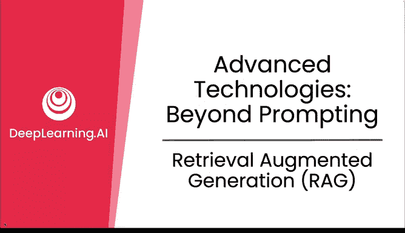
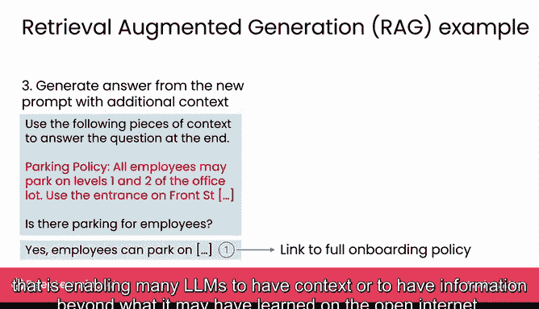
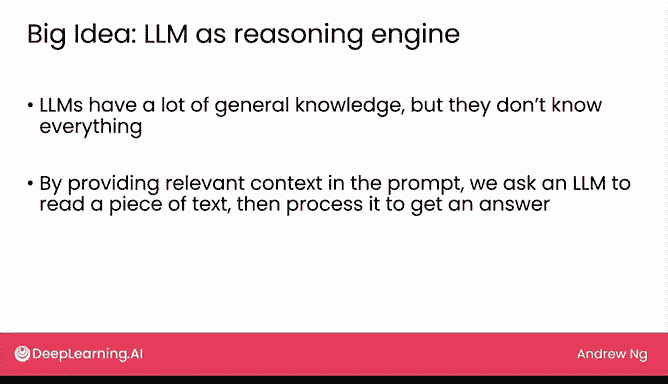

# 15：检索增强生成 (RAG)

在本节课中，我们将要学习一种名为“检索增强生成”的技术，它能显著扩展大型语言模型的能力，使其能够利用模型训练数据之外的知识来回答问题。

## 概述

我们已经看到，通过提示词与大语言模型互动可以取得不错的效果。但有一种名为“检索增强生成”的技术，可以通过为模型提供互联网或其他开放数据源之外的知识，极大地扩展大语言模型的能力。让我们来详细了解一下。

## RAG 的工作原理

如果你向一个通用聊天系统提问，例如“员工有停车位吗？”，它可能会回答“我需要更多关于您工作场所的具体信息”，因为它不了解你公司的具体政策。而检索增强生成技术可以为大语言模型提供额外信息，使其能够根据你公司的具体政策来回答问题。

RAG 技术包含三个核心步骤。

以下是 RAG 的三个步骤：

1.  **检索**：针对问题“员工有停车位吗？”，系统首先会在一系列可能包含答案的文档中进行检索。例如，如果你的公司有关于员工福利、休假政策、设施和薪资流程的不同文档，RAG 系统的第一步就是让计算机找出哪些文档与这个问题最相关。停车问题很可能与团队工作所在建筑的设施相关，因此系统应能筛选出设施文档作为最相关的内容。
2.  **增强提示**：第二步是将检索到的文档或文本整合到一个更新后的提示词中。我们可以这样构建提示词：“请使用以下上下文信息来回答结尾的问题。”然后，我们将从设施文档中提取的、包含停车政策的相关文本（例如“员工可停放在1层和2层”）放入提示词。在实践中，由于大语言模型对输入长度有限制，我们通常不会将整篇长文档放入提示词，而是只提取与问题最相关的部分。
3.  **生成答案**：最后，我们在提示词末尾加上原始问题：“员工有停车位吗？”。这个过程之所以称为“检索增强生成”，是因为我们通过检索相关上下文信息来增强提示词，从而生成答案。构建好这个丰富的提示词后，最后一步就是用它来提示大语言模型，模型有望给出一个经过思考的答案，告诉我们可以在哪里停车。

在一些应用中使用 RAG 时，我们还会在展示给用户的输出中添加指向原始源文档的链接。这样，用户如果愿意，可以返回去阅读原始文档，自行核对答案。

## RAG 的应用实例

检索增强生成是一项重要的技术，它使得许多大语言模型能够拥有开放互联网之外的信息或上下文。

以下是基于 RAG 的一些应用实例：

*   **与 PDF 文件对话**：目前有许多公司提供软件，让你可以与 PDF 文件聊天。例如，如果你在阅读一份白皮书，但没有时间仔细阅读全文，却想基于白皮书内容提问。现在有很多类似“ChatPDF”、“AskYourPDF”这样的应用，它们允许你上传 PDF 文件并提问，然后利用 RAG 技术为你生成答案。
*   **基于网站内容问答**：越来越多的 RAG 应用能够基于网站文章回答问题。例如，Coursera 就利用 RAG 技术，尝试基于其网站本身的内容来回答问题。Snapchat 也有一个聊天机器人，使用 Snap 的文本内容来回答你可能对其产品提出的问题。营销自动化公司 HubSpot 是另一个例子，它有一个聊天机器人，允许你提出问题，并尝试基于公司网站本身的内容为你生成答案。
*   **新型网络搜索**：RAG 也催生了新的网络搜索形式。微软必应具备聊天功能，谷歌也有生成式 AI 功能，可以根据你的查询生成文本。初创公司 You.com（由我的一位前博士生 Richard Socher 创立）就是一个以类聊天界面为核心构建的网络搜索引擎。

因此，RAG 技术目前被用于许多应用中，并且令人兴奋的是，它似乎正在改变甚至网络搜索的方式。

## 核心理念：将 LLM 视为推理引擎

在结束本视频前，我想分享一个重要的理念：将大语言模型视为一个**推理引擎**，而不是一个知识库。

大语言模型可能阅读了大量互联网文本，因此很容易认为它们知道很多事情。它们确实知道一些，但并非无所不知。通过 RAG 方法，我们在提示词中提供相关上下文，并要求大语言模型阅读这段文本，然后进行处理以得出答案。换句话说，我们不是依赖它记忆事实来获取答案，而是将其用作处理信息的推理引擎，而不是信息的来源。

我发现，将大语言模型视为推理引擎而非存储和检索信息的方式，可以扩展我们构思和认为大语言模型能够处理的应用范围。诚然，大语言模型技术尚处早期，表现并非总是完美。但如果大语言模型不仅仅是一个为你存储大量信息的数据库，而是能够处理和推理信息，我认为这是思考大语言模型未来发展方向的一个令人兴奋的思路。

尽管我主要是在构建软件应用的背景下讨论 RAG，但这个理念在你使用网页用户界面时也同样有用。有时，我会将一段文本复制到大语言模型的在线网页 UI 的提示词中，并指示它使用该上下文为我生成答案，这同样也是 RAG 的一种应用。

## 总结

本节课中，我们一起学习了检索增强生成技术。RAG 通过检索外部知识并整合到提示词中，极大地增强了大语言模型回答特定领域问题的能力。我们了解了它的三个步骤：检索、增强提示和生成答案，并看到了它在与文档对话、企业知识问答和新型搜索等场景中的应用。最重要的是，我们建立了一个核心理念：将大语言模型主要视为一个**推理引擎**，而不仅仅是知识库，这能帮助我们更好地利用这项技术。在下一个视频中，我们将讨论另一种扩展大语言模型能力的技术：微调。