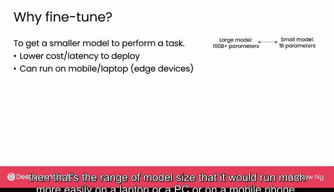

# 16：微调

## 概述

在本节课中，我们将要学习一种名为“微调”的技术。这是一种为大型语言模型提供额外信息、使其输出符合特定风格或掌握特定领域知识的方法。我们将探讨微调的原理、适用场景以及它与检索增强生成的区别。

## 什么是微调？

上一节我们介绍了RAG技术，它通过修改提示词来为模型提供额外信息。本节中我们来看看另一种技术——微调。

微调是另一种为大型语言模型提供更多信息的方法。特别是当你的上下文信息量过大，无法全部放入模型的输入长度或输入上下文窗口时，微调提供了一种让模型吸收这些信息的途径。此外，微调也被证明在让模型以特定给定风格输出文本方面非常有用。但微调的实际实现比RAG要复杂一些。

让我们来看一个例子。假设你有一个按照我们之前描述的方式训练的语言模型，它学习了互联网上的句子，例如“我最喜欢的食物是百吉饼配奶油奶酪”。它可能从数千亿甚至数万亿单词中学会了预测下一个单词。这样的模型将学会生成听起来像互联网上内容的文本。这种在大量数据上训练大型语言模型的过程通常被称为**预训练**。

现在，假设我想修改这个语言模型，使其对所有事物都保持一种极其积极和乐观的态度。我们可以使用一种名为**微调**的技术，让模型进行一些额外的学习，从而改变其输出。在这个例子中，就是使其输出变得更加积极和乐观。

## 微调如何工作？

以下是微调的基本步骤：

1.  **准备数据**：首先，我们需要准备一组体现积极乐观态度的句子或文本，例如“多么美妙的巧克力蛋糕！”或“这部小说令人激动不已”。
2.  **创建训练数据**：基于这些文本，你可以创建额外的训练数据。例如，给定“多么美妙的巧克力”，模型会尝试预测下一个词是“蛋糕”。给定“多么美妙的巧克力蛋糕”，模型会尝试预测下一个词是“！”。
3.  **进行微调**：事实证明，如果你取一个已经在数千亿单词上预训练好的语言模型，然后仅在额外的、相对少量的数据（例如1万个单词，如果你有更多数据，也可以是10万甚至100万个单词）上进行微调，这种相对适度的数据量就能显著改变你的语言模型的输出，使其呈现出这种积极乐观的态度。

## 微调的应用场景

也许让模型变得极其积极乐观并不是一个非常有用的应用，但微调在许多实际应用中都有用武之地。

### 1. 难以用提示词定义的任务

微调有用的一类应用场景是当任务不容易用提示词定义时。

*   **客户服务摘要**：例如，如果你想使用语言模型来总结客户服务通话记录。一个通用的语言模型可能会这样总结通话：“客户向客服代表反映了显示器的问题。”但如果你运营一个客户呼叫中心，你可能希望它生成关于对话具体内容的摘要，例如：“通话内容是关于客户542报告的MK4127 KX型号产品损坏问题。”如果你创建一份数据，其中包含可能只有几百个人类专家撰写的摘要示例，并让一个从互联网数千亿单词中学习过的大型语言模型（因此它已经学到了很多互联网上的通用知识）在此基础上，对这几百份精心手写的、特定风格的摘要进行微调，那么这将改变语言模型按照你想要的风格撰写摘要的能力。而这种特定的摘要风格实际上很难用文本提示词来定义。也许你可以尝试用提示词定义，但微调将是一种更精确地告诉语言模型你想要什么摘要的方式。
*   **模仿特定风格**：另一个任务难以用提示词定义的例子是，如果你想模仿特定的写作或说话风格。例如，与我共同开发这门课程的Tommy Nelson尝试了一个有趣的项目：让一个语言模型听起来像我。但事实证明，大多数人的说话方式并不容易用提示词描述。我的意思是，你如何给别人清晰的指令，让他听起来像我？所以，如果你提示一个通用语言模型，要求它模仿我说话，你可能会得到这样的文本，我认为这听起来不太像我。但如果你获取大量我实际说话的转录文本，并通过学习我的真实用词来微调一个语言模型，使其真正听起来像我，那么要求它写一些像我风格的东西时，就会产生这样的文本，这听起来更像我的说话方式。由于模仿特定的写作或说话风格很难通过提示词实现（因为用文字指令描述特定人的风格很困难），微调被证明是让语言模型以特定风格说话更有效的方法。如果你正在构建一个虚拟角色，比如卡通角色，微调也可以是一种让语言模型以特定风格说话的方式。

### 2. 让模型掌握特定领域的知识

微调的第二大类应用是帮助模型掌握一个**知识体系**。

*   **医疗记录**：例如，如果你想让一个语言模型能够阅读和处理医疗笔记。医生为病人写的医疗笔记可能看起来像这样，这根本不是正常的英语：“P（病人）主诉SOB（呼吸急促）。DE（劳力性呼吸困难）...” 治疗建议是“立即联系初级保健医生，必要时进行胸部X光检查和吸氧治疗。”但这真的不是正常的英语。如果你取一个在正常英语上训练的语言模型，它可能不太擅长处理这样的文本。因此，如果你在一个医疗记录集合上微调语言模型，那么该模型就能更好地吸收关于医疗笔记听起来是什么样的知识体系，然后你可以在此基础上构建其他应用程序，以更好地理解医疗记录。
*   **法律文件**：法律文件是由律师为律师撰写的，对于非律师来说很难理解：“授予被许可人许可...第2A3节...非独占性权利...在此后15天内...” 我不知道你们怎么样，我在日常讲话中不会使用“hereof”这个词。但这就是法律文件的样子。如果你希望你的语言模型掌握关于如何阅读和理解法律文件的知识体系，那么对一个语言模型进行法律文件的微调将有助于它获得该知识体系。
*   **金融文件**：同样地，在大量金融文件上微调语言模型将有助于它更好地掌握关于金融的知识体系，并使其在处理类似文档的应用程序中表现更好。

### 3. 让小模型完成大模型的任务

最后，微调语言模型的另一个原因是让一个较小的模型去执行一个原本可能需要较大模型才能完成的任务。

我们将在本周晚些时候讨论选择较大模型与较小模型的一些利弊。对于一些需要大量知识或复杂推理的语言模型应用，你可能会使用一个相对较大的模型，比如拥有超过1000亿参数的模型。但如果我们使用这样的模型，它可能具有相对较高的延迟，意味着在你给出提示后，可能需要等待一段时间才能得到回复。如果你在自己的计算机上部署它，成本可能会相当高。尽管我们在之前的视频中提到这些模型并不那么昂贵，但你可能希望它更便宜。这是因为一个1000亿参数的模型可能需要专门的计算机，如GPU服务器或其他非常快速的计算机来运行。你可能很难在普通的笔记本电脑或PC上运行如此大的模型，今天在智能手机上肯定不行。

但如果你能让你的应用程序在一个小得多的模型上运行，比如10亿参数的模型，那么这个尺寸范围的模型将更容易在笔记本电脑、PC或移动电话上运行。例如，如果你想要的是将餐厅评论分类为积极或消极情感，这是一个足够简单的任务，你可能不需要1000亿或2000亿参数的模型来运行，也许一个10亿参数的模型就足够了，甚至可能更小。

但是，这些较小的模型没有那么聪明，或者不如真正的大型模型那么好。这就是为什么如果你取一个小模型，然后在像这里显示的数据集上进行微调（不仅仅是三个例子，如果你有足够的数据，可能是几百个甚至几千个例子），那么你可以让一个小模型，比如10亿参数的模型，在这样的任务上表现得非常好。

## 总结

本节课中我们一起学习了微调技术。微调为你提供了除RAG之外的另一种技术，以帮助提高语言模型的能力。

你可能会在以下情况使用它：
*   任务难以用提示词指定，例如，如果你希望以某种风格输出文本。
*   你希望语言模型掌握一个知识体系，例如关于医疗笔记的知识。
*   你希望获得一个更小、运行成本更低的语言模型来完成原本可能需要较大语言模型才能完成的任务。

事实证明，RAG和微调的实现成本都相对较低。RAG只是修改你的提示词。而微调，你可能真的只需要几十美元或几百美元就可以开始，具体取决于你想要微调多少数据。

还有另一种技术——**预训练你自己的模型**——结果证明非常昂贵。如今，除了规模较大的公司（通常是科技公司）外，几乎没有人尝试这样做。但为了内容的完整性，让我们在下一个视频中看看预训练涉及什么。