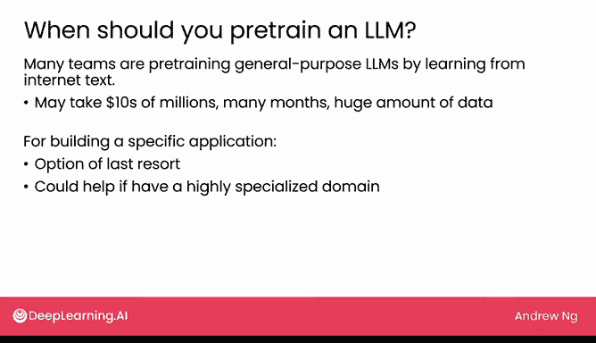

# 17：大语言模型预训练 🏗️

在本节课中，我们将探讨大语言模型预训练的核心概念、适用场景以及对于大多数开发者的实际建议。

## 概述

我们之前使用的许多大语言模型都经过了预先训练，或者说，是由某些公司（通常是大型科技公司）进行了预训练。本节将深入分析何时应该预训练自己的模型，并解释为什么这通常不是大多数团队的首选方案。

## 预训练的成本与挑战

许多团队通过从互联网文本中学习，预训练了通用的大语言模型。然而，训练这些超大规模语言模型的努力，可能需要数千万美元的成本、一个庞大的专职工程团队、数月时间以及海量数据。

以下是预训练的主要挑战：
*   **成本高昂**：可能花费数千万美元。
*   **团队要求高**：需要一个大型的专职工程团队。
*   **耗时漫长**：通常需要数月时间。
*   **数据需求巨大**：需要海量的训练数据。

## 开源模型的贡献与选择

许多团队已经开源了此类模型，这对AI社区来说是极好的贡献。如果你有资源预训练模型甚至将其开源，这无疑是对AI领域的重要贡献。但对于构建特定应用而言，考虑到从头开始预训练模型的时间和费用，我通常将其视为最后的选择。

## 何时考虑自行预训练

在拥有高度专业化的领域和大量数据时，自行预训练可能有所帮助。例如，彭博社是一家提供软件和围绕金融服务的媒体文章的公司。得益于其能访问海量的金融文本数据，它训练了 **Bloomberg GPT**，这是彭博社为金融应用定制构建的大语言模型。

彭博社报告称，与主要从互联网数据学习的通用大语言模型相比，该模型在处理金融文本的许多实际应用上表现要好得多。

## 对大多数开发者的实用建议

除非你拥有海量资源和海量数据，否则更实际的做法是从他人已预训练的模型开始。例如，选择一个从大量互联网数据中学习过的、且已被他人开源的通用大语言模型，然后**在你的数据上对其进行微调**。这通常能以经济得多的方式，获得相当不错的性能。

我衷心感谢那些投入大量资源在互联网文本数据上预训练大语言模型并将其开源的团队。事实上，这为我们提供了许多可供选择的不同模型。

## 总结

本节课我们一起学习了预训练大语言模型的巨大成本与挑战，了解了在特定领域（如金融）拥有专有数据时自行预训练的价值。对于绝大多数应用开发者而言，更经济高效的路径是：**选择一个合适的开源预训练模型，然后针对自己的特定任务和数据对其进行微调**。

在下一节中，我们将探讨如何从众多可用的大语言模型中，思考并选择适合你需求的模型尺寸和类型。