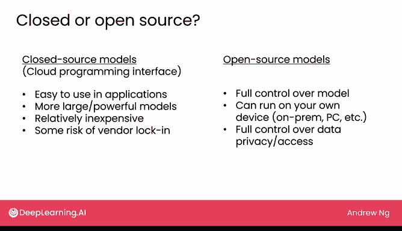

# 18：模型选择指南 🧠

在本节课中，我们将学习如何为你的生成式AI应用选择合适的语言模型。面对众多不同规模、不同类型的模型，做出明智的选择是项目成功的关键。

## 模型规模与能力评估

上一节我们介绍了项目生命周期和技术，本节中我们来看看如何根据任务需求选择模型。一种评估语言模型能力的方法是观察其模型规模。

*   **约10亿参数模型**：这类模型通常擅长模式匹配，并具备一些基础的世界知识。例如，如果你只想对餐厅评论进行情感分类，一个10亿参数的模型可能就足以完成这类基于基础食物词汇知识的模式匹配任务。
*   **约100亿参数模型**：随着参数增加，模型的世界知识更加丰富，能掌握更多冷门事实。同时，它们遵循基本指令的能力也更强。如果你想构建一个订餐聊天机器人，一个100亿参数的模型可能表现不错，尤其是当你通过微调让它更好地遵循特定指令时。
*   **超过1000亿参数的大型模型**：这些模型通常拥有非常丰富的世界知识，涵盖物理、哲学、历史、科学等多个领域。它们在复杂推理方面也表现更佳。因此，对于订餐聊天机器人，你可能不需要它了解那么多历史和哲学知识。不过，如果某些大型模型的部署成本足够低，即使用于订餐机器人也未尝不可。但我会更倾向于将这些大型模型用于需要深度知识或复杂推理的任务，例如，寻找一个能帮助我进行头脑风暴、梳理想法的合作伙伴。

然而，正如我之前提到的，使用语言模型的开发过程通常是高度经验性的，这意味着需要大量实验。很难提前准确预知某个特定模型的性能。虽然我在此分享了一些通用准则，但在实践中，尝试几种不同的模型并进行测试是值得的。根据测试结果，选择对你的应用实际效果最好的模型。

## 开源与闭源模型的选择

另一个你需要做的决定是使用闭源模型还是开源模型。

以下是闭源模型的特点：
*   **访问方式**：通常通过云端编程接口访问。
*   **集成便利性**：许多闭源模型很容易集成到应用中，只需编写几行代码即可。
*   **性能与成本**：目前许多最大、最强大的模型仅通过云端API以闭源形式提供。运行成本相对较低，因为托管这些模型的大公司通常会投入大量工作以低成本提供API服务。
*   **潜在风险**：使用闭源模型存在一定的供应商锁定风险。虽然目前从一个语言模型切换到另一个的成本不算很高，但重新测试所有功能以确保其在另一个模型上正常工作，仍会产生一些成本。

相比之下，开源模型提供了不同的优势。以下是开源模型的特点：
*   **完全控制**：你对模型拥有完全的控制权，无需担心提供模型的公司会停用或淘汰你所依赖的模型版本。
*   **本地部署**：你通常可以在自己的设备上运行这些模型，无论是在本地服务器、个人电脑、笔记本电脑还是移动设备上。这为数据隐私和访问控制提供了保障。
*   **隐私保护**：使用开源模型可以构建完全掌控数据隐私和访问权限的应用。例如，在处理电子健康记录的项目中，由于患者隐私要求，我们不能将记录上传至云端提供商。因此，我的团队使用了开源模型并在我们自己的计算机上运行，以确保患者数据的隐私安全。

## 课程总结与展望

本节课中，我们一起学习了如何为生成式AI应用选择合适的语言模型。我们探讨了根据模型规模（如10亿、100亿、1000亿参数）评估其能力的方法，以及选择闭源模型与开源模型各自的优缺点。

本课程本周的内容到此结束。我们讨论了使用生成式AI构建软件应用、生成式AI项目的生命周期，以及RAG和微调等能让你构建更强大应用的技术。最后在本视频中，我们探讨了如何选择合适的模型作为构建基础。

此后的课程还包含几个可选视频：一个视频将更深入地探讨使语言模型不仅能预测互联网上的下一个词，还能安全地遵循你指令的技术；另一个可选视频则讨论一些前沿技术，这些技术能让语言模型自动决定做什么，并在过程中使用工具。如果你有兴趣，欢迎观看这些视频。

在下周也是本课程的最后一讲中，我们将探讨语言模型技术如何影响商业和社会。例如，你如何为你所在的公司识别有价值的应用场景？我们还将系统地分析为何某些工作受生成式AI的影响更大或更小，以及从事这些工作的个人和雇佣他们的企业，应如何应对生成式AI给工作带来的变革。期待下周与你再见。