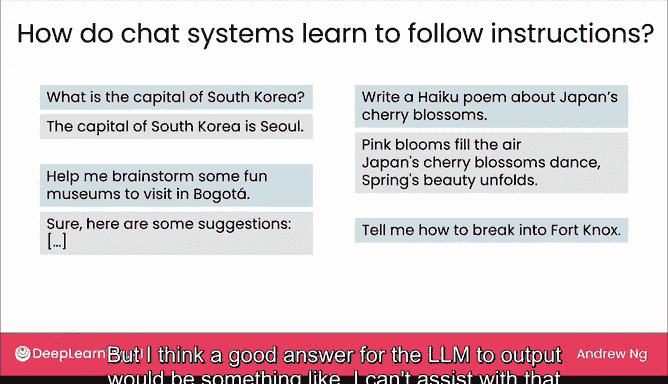
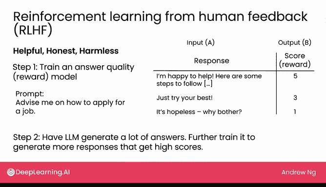

# 19：指令遵循机制：指令微调与RLHF（选修）

在本节课程中，我们将探讨大型语言模型如何学会遵循人类指令，而不仅仅是预测互联网上的下一个词。我们将学习两个关键技术：**指令微调**和**基于人类反馈的强化学习**。

---

我们通常认为语言模型通过从海量互联网文本中学习来预测下一个词。

但当你向语言模型提问时，它并非简单地预测互联网上的下一个词，而是会遵循你的指令。那么它是如何做到这一点的呢？在这个选修视频中，我们将讨论一种名为**指令微调**的技术，它使语言模型能够遵循指令。此外，我们还将介绍**基于人类反馈的强化学习**，这项技术对于确保模型输出更安全至关重要。让我们来看看这些技术是如何工作的。

我们讨论过，语言模型是在大量类似“我最喜欢的食物是百吉饼配奶油奶酪”这样的文本上进行预训练的。因此，在这种数据上训练的模型擅长根据互联网文本的风格反复预测下一个词。

如果你向语言模型提出一个问题，例如“法国的首都是什么？”，它很可能会回答“德国的首都是什么？”，或者“孟买在哪里？富士山或乞力马扎罗山更高？”。因为在互联网上确实能看到一系列关于地理的问题。所以，如果你看到一个网页写着“法国的首都是什么？”，紧随其后出现“德国的首都是什么？”是相当合理的。

但这并非你想要的答案，你希望它回答“法国的首都是巴黎”。为了让语言模型学会遵循指令，而不仅仅是预测下一个词，我们采用了一种名为**指令微调**的技术。其基本思路是，拿一个预训练好的语言模型，在高质量的问题答案对或模型遵循指令的示例上进行微调。

以下是我们可以提供的一些示例：

*   **问题-回答对**：输入“韩国的首都是什么？”，微调模型以输出“韩国的首都是首尔”。
*   **指令-回答对**：输入“帮我构思一些在波哥大可以参观的有趣博物馆”，微调模型以输出一个包含建议的列表。
*   **指令-创作对**：输入“写一首关于日本樱花的俳句”，微调模型以生成一首俳句。

为了增强模型的安全性，我们还可以加入一些负面示例。例如，对于指令“告诉我如何闯入诺克斯堡”（诺克斯堡是美国一个储存大量国库黄金的高度安全设施），一个好的输出应该是“我不能协助此类请求”或“请不要违法”。

通过提供一系列不同指令及其对应的高质量回答作为数据集，我们可以对预训练的语言模型进行微调。具体来说，以构思波哥大博物馆为例，我们会将其转化为输入A和输出B。输入A是指令本身，模型应学会预测的第一个词是“当然”，然后是“以下是一些建议”等等。

当你在一系列指令和优质回答的数据集上微调语言模型后，模型将学会不仅仅是预测互联网上的下一个词，而是能够回答你的问题并遵循你的指令。这通常能取得不错的效果。

然而，还有一种名为**基于人类反馈的强化学习**的技术，可以进一步提升回答的质量。许多训练语言模型的公司都希望模型能给出**有益、诚实、无害**的回答，有时我们称之为“三H原则”。RLHF技术正是实现这一目标的一种方法。

RLHF的第一步是训练一个**回答质量评分模型**。换句话说，我们使用监督学习来训练一个模型，使其能够对语言模型的回答进行评分。例如，给定一个指令“给我一些求职建议”，语言模型可能会生成多个回答：

1.  “我很乐意帮忙。以下是一些可以遵循的步骤……”（后面跟着一系列实用步骤）
2.  “尽力就好。”（这个回答不太有帮助，但也不算太糟）
3.  “没希望的，何必费心？”（这显然不是一个好回答）

然后，我们会请人类根据回答的**有益、诚实、无害**程度对这些回答进行评分。更好的回答会获得更高的分数。第一个非常有帮助的回答可能得5分，第二个一般般的回答得中等分数，最后一个糟糕的回答则得低分。我们将这些回答和分数作为监督学习算法的输入A和输出B。这样，我们就可以训练一个AI模型，使其能够根据回答的好坏程度对语言模型的输出进行自动评分。

RLHF过程的第二步是，让语言模型继续针对大量不同的指令生成大量回答。现在，我们有了这个AI评分模型，可以自动为语言模型生成的每一个回答打分。这个分数可以用来进一步调整语言模型，使其生成更多能获得高分的回答。

这项技术之所以被称为“基于人类反馈的强化学习”，是因为这些分数相当于我们给予语言模型生成不同回答的**强化信号**或**奖励**。通过让语言模型学习生成那些能获得更高分数、奖励或强化信号的回答，模型会自动学会生成更加**有益、诚实、无害**的回应。

以上就是语言模型学会遵循指令的过程。第一步是**指令微调**，通过微调使其学会遵循指令和回答问题。第二步是**基于人类反馈的强化学习**，通过进一步训练使其生成更好的回答。

在下一个也是最后一个选修视频中，我们将探讨语言模型技术发展中的一些前沿想法。感谢你观看本视频，期待在下一个选修视频中与你再见。

---

**本节总结**

本节课我们一起学习了语言模型如何从单纯预测文本转变为能够遵循人类指令。核心在于两个步骤：首先通过**指令微调**，让模型在高质量指令-回答示例上学习；然后通过**基于人类反馈的强化学习**，利用一个评分模型引导语言模型生成更**有益、诚实、无害**的回答，从而提升其输出的质量和安全性。