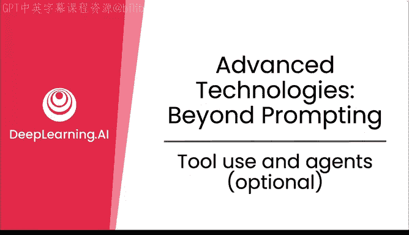
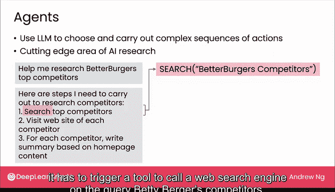

# 20：工具使用与智能体（选修）🔧



在本节课中，我们将探讨大型语言模型如何通过使用外部工具来扩展其能力，并初步了解一个前沿的研究方向——AI智能体。我们将看到，通过调用工具，模型可以执行具体操作（如下单）或进行精确计算（如金融运算）。最后，我们会讨论智能体如何尝试自主规划一系列复杂行动。

## 工具使用：从下单到计算

上一节我们介绍了模型的基本交互方式。本节中我们来看看模型如何通过输出特定文本来触发外部工具，从而完成实际任务。

### 行动类工具：以点餐机器人为例

在之前点餐聊天机器人的例子中，当用户说“我要一个汉堡”时，机器人回复“订单已在路上”。为了实现这一点，模型在后台实际输出的内容远不止这一句回复。

一个经过微调的模型可能会输出如下文本：
```
order burger for user 9876 to send to this address
```
以及给用户看的消息：
```
the user message is to say, okay is on its way.
```

**核心机制**是：模型生成的 `order burger for user...` 这段文本，会被系统解释为一个指令，触发一个软件应用程序，该程序进而向餐厅订餐系统发送请求，将汉堡配送到指定地址的用户手中。最终，只有最后一行“订单已在路上”会显示给用户。

由于下错订单可能代价高昂，一个更好的用户界面设计是：在最终确认前，弹出一个验证对话框，让用户确认订单细节无误，然后再进行扣款和配送。对于任何涉及安全或关键任务的操作，让用户进行确认是一个好主意，因为模型的输出并非完全可靠。

### 推理类工具：以金融计算为例

除了执行行动，工具也可以辅助模型进行精确推理。例如，如果你提问：“我在一个年利率5%的银行账户里存入100美元，8年后我会得到多少钱？”

模型可能会生成一个听起来合理的答案，但数字 `$147.4` 实际上并不正确。事实证明，经过预测下一个词或指令微调的模型，并不擅长精确的数学计算。

就像你我可能会使用计算器一样，你也可以给模型提供一个“计算器工具”来帮助它获得正确答案。

以下是模型可以输出的指令文本示例：
```
calculator 100 * (1.05 ** 8)
```

**核心机制**是：这段输出会被解释为调用外部计算器程序的命令，计算出正确结果（`$147.74`），然后将该数字插回文本中，给用户正确的金额。

通过赋予模型在输出中调用工具的能力，我们可以显著扩展其推理或执行行动的能力。如今，工具使用已成为许多LLM应用的重要组成部分。当然，应用设计者必须谨慎确保工具不会被以造成伤害或不可逆损害的方式触发。

## 迈向智能体：自主规划行动序列

超越了触发单一工具，AI研究人员正在探索一个更实验性的领域——智能体。智能体旨在探索模型是否能够自主选择和执行复杂的行动序列。

目前，智能体研究非常活跃，但这属于AI研究的前沿领域，技术尚未成熟，尚不能依赖其处理大多数重要应用。但我想与您分享AI社区的许多兴奋点。

如果你向一个基于LLM构建的智能体提问：“帮我研究一下Bburg公司的顶级竞争对手”，那么智能体可能会将LLM作为一个推理引擎，来规划完成此任务所需的步骤。

这个推理引擎（LLM）可能会决定它需要执行以下步骤：
1.  搜索顶级竞争对手的列表。
2.  访问每个竞争对手的网站。
3.  最后，根据主页内容为每个竞争对手撰写摘要。



然后，通过多次调用这个推理引擎，它可能会规划出具体的行动序列：
*   首先，触发一个工具，调用网络搜索引擎查询“Bburg's competitors”。
*   接着，访问一些顶级竞争对手的网站以下载其主页。
*   最后，再次调用LLM来总结在互联网上找到的网站文本。

虽然已经有一些不错的智能体演示，但这项技术尚未真正准备好投入实际生产应用。也许在未来，随着研究人员的不断改进，它会变得更加有用。如果LLM作为一个推理引擎，能够安全、负责任地帮助决定采取一系列步骤来协助用户完成任务，那将是一个令人兴奋的未来。

## 课程总结

本节课中我们一起学习了大型语言模型如何使用工具来执行具体行动和进行精确计算，从而弥补其自身能力的不足。我们还初步探讨了前沿的AI智能体概念，它尝试让模型自主规划复杂的行动序列。虽然工具使用已是成熟实践，但智能体技术仍处于早期研究阶段。理解这些概念有助于我们更全面地认识当前生成式AI的能力边界与发展方向。