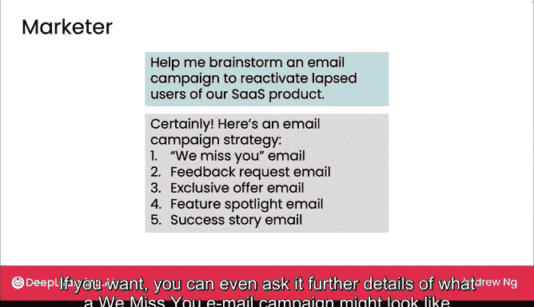
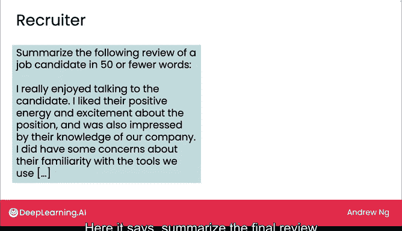
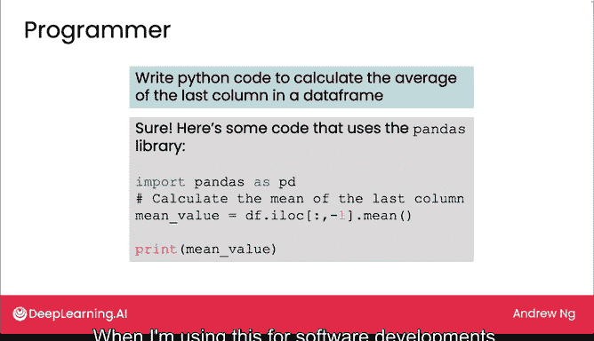

# 21：网页界面大语言模型日常使用

## 概述 📋

在本节课中，我们将要学习生成式AI在商业中的角色及其对社会（例如就业）的影响。我们将首先探讨不同岗位的人员如何通过网页用户界面在日常工作中使用生成式AI。之后，我们将介绍一个系统性的分析框架，用于识别在业务中利用生成式AI增强或自动化任务的机会，并判断何时构建或购买基于大语言模型的软件应用能创造价值。

## 大语言模型作为日常助手 ✍️

正如之前所见，大语言模型可以成为一个相当不错的写作助手或文案编辑。

如果你要求它重写一段文字，使其适合专业的商业报告，它通常能做得很好。我自己也经常为此目的使用它，尽管在我自己的写作中正式使用前，我会仔细检查它的输出。

## 跨岗位的广泛应用 💼

因为生成式AI是一项通用技术，我看到许多不同岗位的人都在使用它。

以下是几个具体的应用示例：

**市场营销人员**用它来帮助头脑风暴创意。例如，如果你提问：“帮我策划一个重新激活流失用户的电子邮件营销活动”，它可能会提出类似下图的创意。你甚至可以进一步询问“我们想念你”主题邮件活动的具体细节。

**招聘人员**使用大语言模型来总结评价。例如，输入指令：“用50个或更少的词总结对一位求职者的最终评价”。它通常能做得不错，尽管我再次建议在使用和完全依赖它之前，仔细检查总结内容。

**程序员或软件工程师**也发现大语言模型有时有助于编写某些类型代码的初稿。例如，要求生成“计算某技术指标的Python代码”，大语言模型可能会生成一段正确的代码。但同样，它实际上也经常生成有错误的代码。因此，当我在软件开发中使用它时，我通常最终需要修复它，但它有助于让程序员开始一项任务。

## 核心概念与使用建议 🔑

上一节我们介绍了大语言模型在不同岗位的具体应用，本节中我们来看看使用时的核心注意事项。

大语言模型的核心能力之一是**文本总结**，其过程可以抽象为：
`原始文本 -> 大语言模型处理 -> 简洁摘要`

然而，对于**代码生成**，虽然大语言模型能提供初稿，但必须进行人工审查和调试。一个典型的流程是：
1.  用户提出编码需求。
2.  大语言模型生成代码草案。
3.  程序员检查、测试并修复代码中的错误。

因此，许多人发现大语言模型在日常工作中很有用。我经常把它当作一个“思维伙伴”来帮助我理清思路。我希望你也能在日常工作中发现它的用处。

## 识别组织内的机会 🎯

当你审视整个组织时，使用生成式AI技术，甚至尝试构建或购买基于大语言模型的软件应用，最有价值的机会在哪里？

在下一个视频中，我们将开始探讨一个分析框架，通过审视组织完成的**工作**和**任务**，来尝试识别这样的机会。让我们在下一个视频中一起看看。