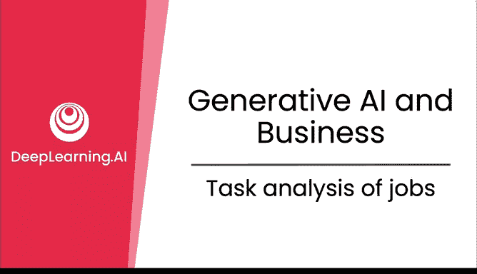
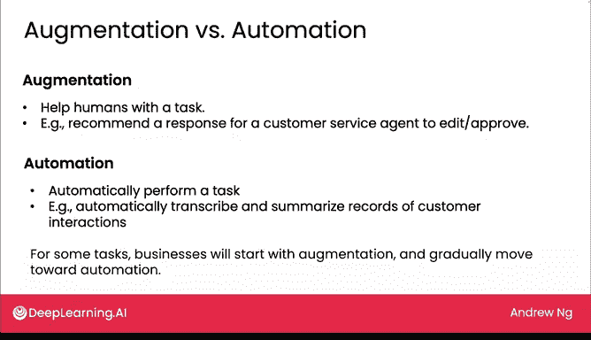
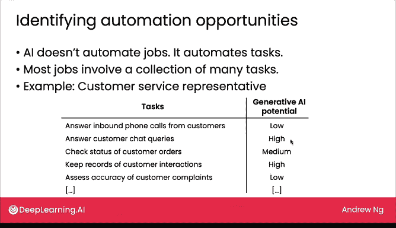
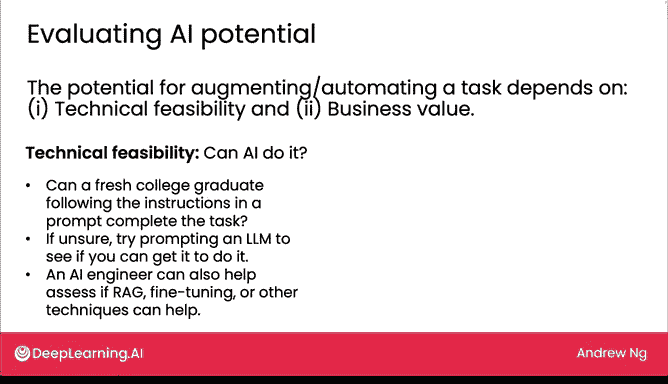
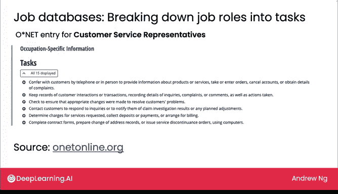

# 22：工作任务分析

在本节课中，我们将学习一个用于分析工作任务、以评估生成式AI应用潜力的实用框架。我们将了解如何将工作拆解为具体任务，并评估每项任务被AI增强或自动化的可能性。

许多企业，无论规模大小，都拥有众多员工执行着各式各样的任务。经济学家埃里克·布林约尔松、汤姆·米切尔和丹尼尔·洛克提出了一个框架，用于分析工作任务，以评估其被AI自动化的可能性。事实证明，这个“工作任务”框架不仅有助于经济学家理解AI的经济影响，也能帮助企业识别应用生成式AI的具体机会。接下来，我们看看具体如何操作。

## 从“工作”到“任务”

媒体上有很多关于“AI是否会取代工作”的讨论。但从技术和商业角度来看，更有用的思路不是将AI视为自动化“工作”，而是自动化“任务”。大多数工作实际上都由一系列不同的任务组成。

让我们看一个例子。一位客户服务代表会执行多项任务，包括：
*   接听客户的来电。
*   通过文字聊天界面回答客户的咨询。
*   查询客户订单状态。
*   记录客户互动信息。
*   评估客户投诉的准确性。

如果你所在的公司拥有许多客户服务代表，那么分析使用生成式AI潜力的第一步，就是理解在你们公司里，这些代表具体执行哪些任务。

## 评估任务的AI潜力

在列出任务之后，我们可以逐一审视这些任务，尝试评估生成式AI在辅助、增强或自动化这些任务方面的潜力。

以下是针对上述客户服务任务的潜力评估示例（仅为假设）：
*   **接听客户来电**：潜力较低。让生成式AI接电话并进行长时间对话目前仍相当困难。
*   **回答客户文字聊天**：潜力较高。
*   **查询订单状态**：潜力中等。
*   **记录客户互动**：潜力较高。
*   **评估投诉准确性**：潜力较低。

最右侧一栏的评估都是假设性的，实际对你业务的影响会有所不同，并取决于你业务的具体情况。但经过这样的分析后，你可能会决定将精力集中在“回答客户文字聊天”和“记录客户互动”这两项潜力最高的任务上。

## 增强与自动化

生成式AI带来的机会可以是“增强”或“自动化”。

*   **增强**：指使用AI帮助人类更高效地工作。在客户服务场景中，我们可以让生成式AI为客服代表推荐回复内容，由代表编辑或批准后再发送给客户。如果我们不确定AI能否给出好的回答，这种推荐回复的方式可以加快工作速度，但并未完全自动化，这就是增强的例子。
*   **自动化**：指让AI系统完全自动执行一项任务。例如，自动转录和总结客户互动记录，这就是自动化的例子。

在许多应用案例中，企业有时会从增强开始，让人类在投入使用前复核或最终确定AI的输出。随着你对生成式AI的输出建立起信任和信心，用户界面可以进行调整，使流程对人类来说越来越高效，并逐渐转向更高程度的增强，最终可能实现完全自动化。

## 如何评估潜力？

那么，如何得出右侧的潜力评估列呢？如何评估不同任务对生成式AI的潜力？一项任务被增强或自动化的潜力主要取决于两点：**技术可行性**和**业务价值**。

### 技术可行性

技术可行性指的是“AI能否做到”，以及“构建一个AI系统来做这件事的成本有多高”。

关于使用大语言模型，我们上周讨论的框架——询问“一个刚毕业的大学生能否根据提示词中的指令完成这项任务”——可以给你一个初步的、不一定完全准确但有用的判断。有时，如果你不确定大语言模型能否完成某项任务，我鼓励你尝试提示一个大语言模型，看看能否让它做到。只要不泄露机密信息，这可以是一个快速进行的实验。

例如，你可以取一些回答聊天查询的提示词，粘贴到大语言模型中，或许能快速了解其回答的质量。这可以帮助你相对快速地评估使用生成式AI处理特定任务的技术可行性。AI工程师也可以帮助你评估是否需要更高级的技术，如检索增强生成、微调或其他技术，并让你了解构建AI系统处理某项任务的复杂性和成本。

本课程主要关注使用生成式AI技术的技术可行性。如果你或你的团队熟悉其他AI工具（如监督学习），也可以评估使用其他工具来增强或自动化不同任务的技术可行性。

### 业务价值

除了技术可行性，第二个需要仔细思考的标准是**业务价值**。即，使用AI来增强或自动化一项特定任务有多大价值？

为了构建对业务价值的思考，我会问以下问题：
1.  这项任务花费了多少时间？我们实际能实现多少时间节省？
2.  使用AI更快、更便宜或更一致地执行这项任务，是否能创造巨大价值？

虽然增强和自动化似乎主要带来成本节约，但本周晚些时候我们会看到，当你自动化一项任务时，其好处有时远不止成本节约，因为它还能促使你重新思考围绕该任务的工作流程。如果现在听起来还不完全明白，不用担心，我们将在本周晚些时候看到一些具体例子。

## 一个有用的资源：工作任务数据库

在结束本视频前，我想分享一个可能对分析如何将工作拆解为任务有用的资源：在线职业数据库。你可以查询这些数据库，了解构成某个职业的具体任务。

这里有一张来自名为“O*NET”网站的截图，这是一个美国政府资助的网站。对于“客户服务代表”这个职业，它列出了许多不同的任务，包括“通过电话或当面与客户沟通”、“记录客户互动”等等。

我发现像这样的职业数据库通常比较通用，不一定完全符合你公司的具体情况。因此，我不建议直接使用O*NET等数据库的结果，并假设它对你的公司完全准确。通常，你会看到一些条目，觉得“不，这似乎不适用于我的公司”。但我发现，这是一个有用的资源，可以为你提供思路，并帮助确保在思考公司不同岗位人员执行的任务时没有遗漏任何内容。

O*NET有点以美国为中心，但它有一个友好易用的用户界面。我鼓励你尝试使用它。此外，其他一些国家或地区也有特定的在线数据库可供查找。但对于许多职业角色来说，O*NET可能是一个合理的初始起点。

## 总结

本节课中，我们一起学习了如何审视不同的工作岗位，并将其拆解为具体任务，然后分析每项任务被增强或自动化的潜力。我希望你能尝试使用O*NET网站，感受不同工作岗位中的不同任务是什么样的。

在本视频中，我们以客户服务代表为例进行了分析。在接下来的视频中，我还想带你看看其他一些工作岗位的例子。