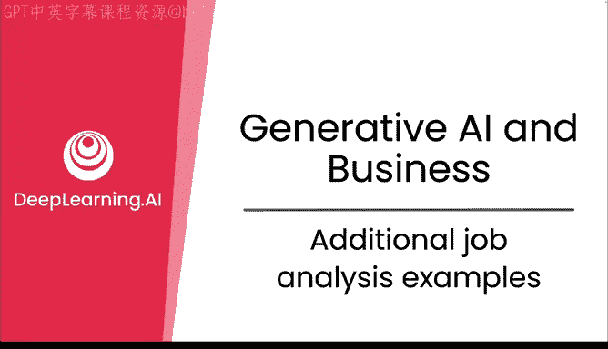
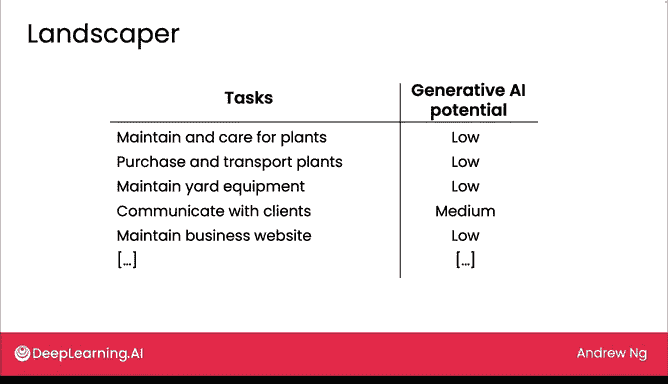

# 23：工作任务分析补充案例 📊

在本节课中，我们将通过几个具体职业的案例，学习如何系统地分析一项工作所包含的各项任务，并评估生成式AI在其中应用的潜力。我们将看到，最具潜力的AI应用点，往往并非我们最初直觉想到的那个“标志性”任务。

## 工作任务分析案例

上一节我们介绍了通过分解任务来分析工作的方法。本节中，我们来看看如何将这个方法应用到几个具体的职业中，并理解其分析过程。

我发现，对于许多职业，人们心中都有一个标志性的、能独特定义该职业的任务画面。

例如，计算机程序员是写代码，医生可能是看病人，律师则是上法庭辩论案件。我认为，当人们思考AI的应用机会时，本能地会问：AI能做那个最标志性的角色或任务吗？

但我发现，当我们真正系统地分析一项好工作所包含的各项任务时，最好的机会可能与我们最初的本能直觉相符，也可能不符。让我们看几个例子。

### 计算机程序员 👨‍💻

以下是计算机程序员日常工作的一部分任务列表：

*   **编写代码**：这是程序员的核心任务。
*   **编写文档**：为代码编写说明文档。
*   **响应用户支持请求**：处理用户反馈的问题。
*   **代码审查**：检查评估他人编写的代码。
*   **收集需求**：明确软件需要实现的功能。

如果你要评估生成式AI在这份工作中的潜力，你可能会发现，虽然编写代码可以由AI辅助完成，但这相对而言是一项较难的任务。然而，用生成式AI来编写文档可能实际上更容易实现。

请不要过于严肃地看待这些例子中的“AI潜力”一栏，因为这些都是非正式的评估。如果要基于技术可行性和商业价值进行严谨评估，你的具体结论可能会有所不同。但我认为，让生成式AI为代码编写文档，确实比让它直接编写代码本身要容易。

在许多不同的职业中，AI的最佳潜力可能并非你最初想到的那个最明显的任务。

### 律师 ⚖️

让我们看另一个例子。律师花费大量时间起草和审阅法律文件。他们经常需要回答客户关于如何解释法律的问题。如果准备法庭案件，他们必须审阅证据。有时他们参与谈判和解，有时他们代表客户出庭。

我发现，系统地列出这些任务，并系统地评估其潜力，有时会得出有趣的结论。

因此，我认为生成式AI在协助起草和审阅法律文件，以及解释法律方面具有很高的潜力。而我无法想象律师派一个机器人上法庭代表他们辩论，至少短期内不会。所以，如果你在律师事务所工作，类似这样的分析可能有助于你决定实际想在何处使用生成式AI。

### 园艺师 🌿

最后一个例子是园艺师。园艺师需要维护照料植物、修剪植物、运输植物、维护设备、与客户沟通、维护商业网站等等。当然，我列出的只是这些职业所执行任务的一个子集。如果你自己进行分析，每个职业最终可能会列出5到30项不等的任务。

在这种情况下，我认为这些任务中的大部分，其生成式AI的潜力实际上相当低。因此，与计算机程序员和律师相比，园艺师的工作在未来几年受生成式AI的影响可能较小。

## 从成本节约到增长机遇 💡

当人们考虑增强与自动化时，最初的想法往往是节约成本，因为如果你自动化了某项工作，似乎就能省钱。但在大多数技术创新中，从蒸汽机、电力到计算机的发明，许多公司一开始都考虑节约成本，但最终实际上将更多精力投入到追求收入增长上。

这是因为增长没有上限，但你能节省的钱是有限的。当某些任务实现自动化后，事实证明，有时你可以重新思考企业创造价值的工作流程。

例如，如果因为自动化，你能以便宜一千倍的成本做某件事（比如回答客户咨询），那么与其仅仅节省成本，你或许能够建立一种新型的客户服务组织，以好一千倍的方式服务人们。这种思维方式可以带来远超成本节约的增长机遇。

在下一节视频中，我们将一起看看这方面的具体例子。

## 本节总结

本节课中，我们一起学习了如何通过分解具体职业（如程序员、律师、园艺师）的任务来评估生成式AI的应用潜力。关键收获是：**最具价值的AI应用点，往往需要通过系统分析才能发现，而非仅凭对职业的刻板印象**。同时，我们认识到，引入AI的目标不应局限于成本节约，更应着眼于通过重构工作流程来创造新的增长机遇。