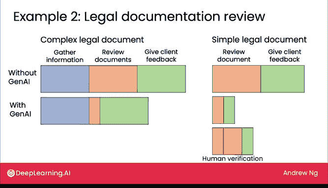
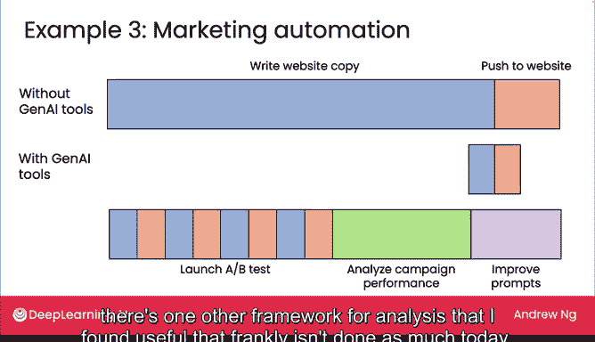
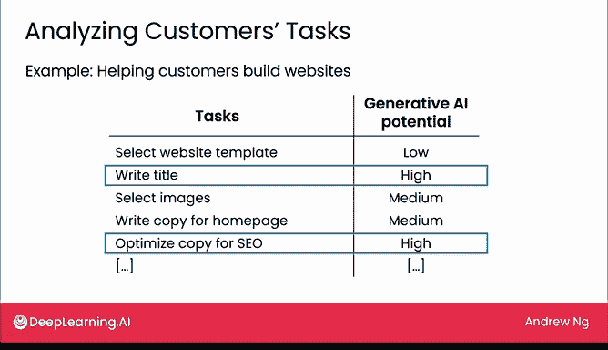

# 24：新工作流与新机遇

在本节课中，我们将探讨生成式AI如何通过重塑工作流程来创造价值，而不仅仅是节省成本。我们将通过几个具体例子，分析AI如何帮助不同职业提升效率并催生新的增长机会。

---

生成式AI不仅能节省成本，更能促进收入增长。作为一种通用技术，生成式AI创造价值的途径多种多样。本视频将重点介绍几种正在兴起或较为常见的增长路径。

## 工作流程的重塑

上一节我们提到了生成式AI的广泛价值，本节中我们来看看它是如何通过改变具体工作流程来实现这些价值的。

### 1. 外科医生的研究阶段

让我们考虑一个假设的例子：一位外科医生在准备并执行手术。在没有生成式AI工具的情况下，他们可能需要花费大量时间进行背景研究，以了解医疗程序及其在特定患者身上的应用。然后，他们才会进入手术室进行手术。

如果生成式AI（可能结合了自定义的RAG或检索增强生成工具）能够协助这项工作的研究部分，那么深入研究医疗程序所需的时间和精力就可能减少。之后，他们仍然需要去执行手术。

因此，这个例子假设性地说明了生成式AI如何帮助外科医生，或任何需要先研究再执行任务的岗位。下图展示了工作流程以及所需精力可能发生的变化。

### 2. 律师审查复杂文件

第二个例子：一位律师审查复杂的法律文件。在没有生成式AI的情况下，他们首先需要从客户那里收集信息，与客户坐下来真正理解这份合同的目的、签署方是谁以及关键商业条款是什么。然后他们可能会审查文件，最后再与客户坐下来提供反馈。

使用生成式AI后，收集信息可能仍需要和以前差不多的精力。但如果生成式AI能帮助审阅文件，或许这个步骤可以缩短。然而，律师可能仍然需要与客户坐下来提供详细的反馈。这是一个基于我所见公司实践的假设性例子，你的工作流程细节可能有所不同。

相比之下，审查相对简单的法律文件（例如典型的保密协议NDA）时，工作流程的变化可能如下：可能没有太多信息需要收集。因此，律师可以直接审查文件，然后向客户提供反馈。

现在，有了生成式AI，文件审查可能会快得多。如果我们使用生成式AI生成一份总结问题的文件，律师可以更高效地发送给客户并与之讨论，那么提供客户反馈的过程也可能变得更高效。我看到的情况是，公司可能会探索构建这样的系统，但在构建之后，可能会决定进一步改变工作流程。

例如，在审查文件后，我们决定在中间增加一个快速的人工验证步骤，以双重检查生成式AI对文件的总结是否全面和正确，然后再由生成式AI和律师共同进入向客户提供反馈的最后一步。这种工作流程的重组在将生成式AI或其他AI工具引入系统后非常常见，因为当一个任务被自动化或增强后，重新思考为了交付有价值的工作成果（如手术或法律文件审查）而需要完成的其他任务，通常是合理的。

### 3. 营销人员的A/B测试

让我们看第三个例子，工作流程的重新设计可以变得更加复杂。如果营销人员需要为网站撰写文案，这通常非常耗时且需要大量思考。之后，他们可能会将新的网站文案推送到网站上，这就是营销人员推广新产品的方式。

但有了生成式AI工具，假设营销人员找到了一种方法来显著加速并提高撰写网站文案的效率。一旦撰写网站文案变得如此高效，那么投资于更好的软件流程以使推送网站更高效也变得值得。如果我们做到这里，那么我们只是拥有一个能够更高效工作的营销人员。

但这里是我们如何重新思考工作流程的方式：当营销人员想要推广新产品时，他们可以撰写一些文案并推送到网站，然后也许撰写一个不同的文案变体，并将第二个版本推送到网站。这样他们就可以开始启动A/B测试，现在可以拥有两个不同版本的网站文案，并开始衡量哪个效果更好。

事实上，如果我们撰写和推送文案的效率如此之高，也许我们现在可以生成四个不同的版本，从而测试四个版本。在收集了所有四个版本网站的数据后，我们最终可能会坐下来花相当长的时间分析活动效果，看看哪个网站文案效果最好。然后基于这种理解，回去进一步改进网站文案，也许是通过改进我们用来生成文案的提示词。

因此，在这个例子中，尽管看起来生成式AI可以仅用于节省成本，帮助营销人员在撰写和推送文案的过程中更高效，但我们也可以以完全不同的方式利用这种效率，撰写、推送和测试更多版本的网站文案。这也导致了营销人员工作流程的其他变化，从而希望营销人员能够交付更具吸引力的营销活动。

## 从客户任务中寻找机遇

在本视频中，我们已经看到了生成式AI不仅能节省成本，还能通过新型服务或产品带来显著增长的几种方式。除了通过审视公司员工执行的任务来寻找增长机会外，还有一个我发现有用的分析框架，坦白说，目前应用得不多，但可能值得你的工作考虑。

这个框架是：与其分析员工的任务，不如也分析你的客户的任务。

例如，假设你提供一项帮助客户构建网站的产品或服务。那么我建议你考虑列出你的客户必须完成的任务（不是你员工的任务，而是你客户的任务）。在这种情况下，也许你的客户必须首先为网站选择一个模板以获得初始设计，然后他们必须为网站撰写标题，接着选择图片，为首页撰写文案，并为搜索引擎优化（SEO）优化文案，使其易于通过搜索引擎找到，可能还有其他任务。

如果你分析客户任务的生成式AI潜力，那么你也可能识别出机会。在这种情况下，撰写标题和搜索引擎优化（SEO）是生成式AI可以帮助你的客户的地方。我发现这种分析和头脑风暴框架有时能引导公司构建不同的产品或服务交付给客户。这可以是获得大量满意客户并因此追求业务增长的另一个方法。

## 总结与展望

生成式AI创造价值并带来增长的途径有很多。在头脑风暴框架方面，我发现审视如何自动化或增强员工的任务，或者自动化或增强你客户的任务，是思考如何创造价值的有用方法。但如果你有一些并非来自这些头脑风暴框架的其他想法，那也很好。我希望你也探索构建那些想法。

在构思出如何在业务中使用生成式AI的想法后，有些可能可以通过网络用户界面完成，但有些可能需要构建定制的软件应用程序。在下一个视频中，我们将看看常见的团队结构以及构建生成式AI软件应用程序的一些最佳实践。好消息是，正如我在第一周也提到的，这可能比你想象的需要更少的资源，因为与早期的一些AI技术相比，生成式AI允许非常高效地构建AI应用程序。让我们在下一个视频中探讨这一点。

