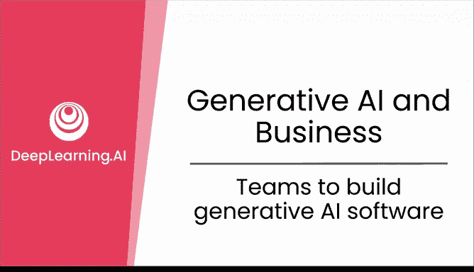
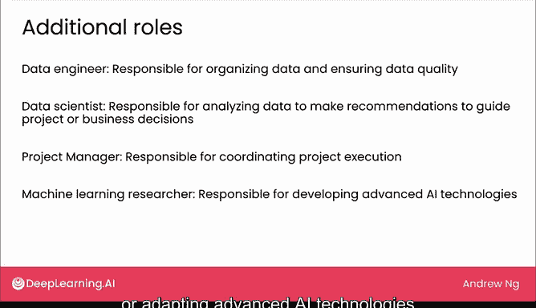

# 25：构建生成式AI软件的团队

## 概述
在本节课中，我们将学习如何组建一个团队来构建生成式AI应用程序。我们将探讨团队中常见的角色、各自的职责，以及如何从小规模开始进行尝试。

---

我的团队曾与许多大大小小的公司合作或为其提供建议，共同构建了各种各样的生成式AI应用程序。

在本视频中，我想与大家分享我所观察到的一些最佳实践，以及启动此类项目的典型团队可能是什么样子的。

## 核心团队成员角色

以下是构建生成式AI应用程序时最常见的角色。

### 软件工程师
最常见的角色之一是**软件工程师**，他们负责编写软件应用程序并确保其稳定运行。

我发现，当软件工程师投入少量精力学习大型语言模型和提示工程的基础知识后，他们就能在构建基于AI应用的小型团队中发挥巨大作用。因此，如果你的团队中已有软件工程师，鼓励他们花一点时间学习AI和提示的基础知识是值得的。

### 机器学习工程师
团队中另一个常见的角色是**机器学习工程师**，他们通常负责实现AI系统。

许多机器学习工程师在生成式AI兴起之前就已经在构建AI系统。我发现，如果一个机器学习工程师花些精力学习AI模型，并且不仅限于提示工程，还掌握一些更高级的技术，如检索增强生成和微调，那么他将在构建AI应用程序中扮演非常高效的角色。

### 产品经理
我还在一些团队中看到另一个角色，即**产品经理**，虽然不如前两者常见。

产品经理主要负责识别和界定项目范围，并确保所构建的产品对客户有用。

## 关于“提示工程师”角色

最后，我们来谈谈“提示工程师”这个角色。媒体对此有一些炒作。

但我观察到，很少有公司将其作为一个专门的职位来招聘。实际情况是，少数公司为少数顶尖的提示工程师发布了招聘信息，这引发了媒体炒作，让人们以为仅靠写提示就能赚大钱。

然而，如果你仔细查看提示工程师的实际职位描述，会发现这些工作实际上需要完成很多其他任务，而不仅仅是编写提示。它们看起来更像是额外学会了提示工程的机器学习工程师。

因此，不要被“提示工程师”这个角色的炒作所迷惑。在实践中，大多数公司依赖的是那些也学会了AI模型或提示工程的机器学习工程师。实际上，要找到一份只写提示的工作并不容易，也没有公司会大量招聘只做这件事的人。

## 如何开始：团队规模与配置

如果你正在构建一个基于AI的应用程序，通常可以从一个非常小的团队开始。

我确实看到很多公司开始尝试，甚至只有一个人的团队，比如一个学会了一些提示工程的软件工程师，或者一个对AI提示有所了解的机器学习工程师。或许你也可以自己开始，使用一些网页界面进行实验和原型设计，以了解什么是可行的。

我也看到很多两人团队。如果你的团队有两个人，最常见的配置可能是一个机器学习工程师加一个软件工程师。但我也见过许多其他配置同样运作良好，比如一个学会提示的软件工程师加一个产品经理，或者两个对编写软件有所了解并愿意学习使用这些工具来构建新颖应用程序的热情人士。

## 大型团队中的其他角色

有时，在更大的团队中，你还会看到其他一些角色，如数据工程师、数据科学家、项目经理或机器学习研究员。让我也快速介绍一下这些角色，以便你在公司中遇到时能有所了解。

*   **数据工程师**：通常负责组织数据、确保数据质量，并且常常也负责数据安全。
*   **数据科学家**：通常负责分析数据，为项目或业务决策提供建议。
*   **项目经理**：可以负责协调项目执行。
*   **机器学习研究员**：通常负责开发先进的AI技术，或将先进的AI技术适配到你业务的具体需求中。

## 总结

本节课中，我们一起学习了构建生成式AI软件团队的关键知识。

生成式AI降低了构建基于AI应用程序的成本和门槛。如果你或你的团队有一个想法，我鼓励你尝试寻找资源，进行原型设计和测试，看看能否为自己或你的业务构建出一些东西。

在结束关于生成式AI与企业的这一部分之前，我想分析一下AI如何影响不同的工作岗位以及不同的行业领域。让我们在下一个视频中探讨这个问题。