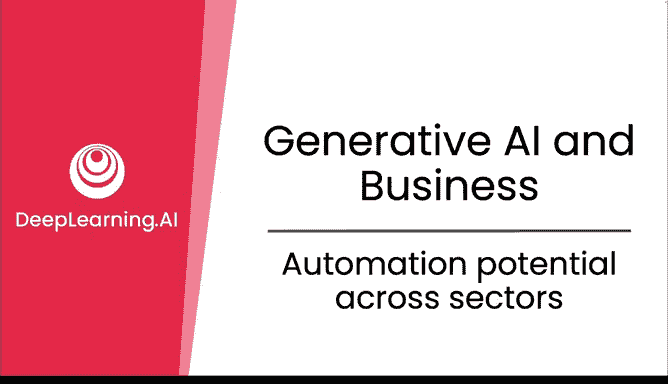
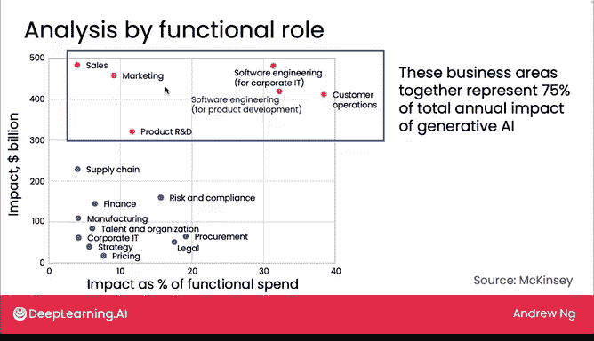
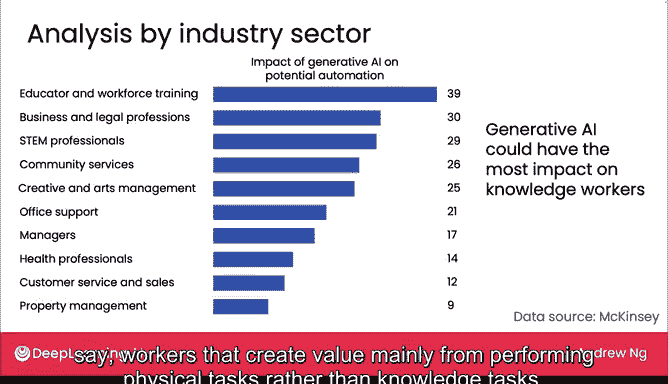

# 26：跨行业自动化潜力分析

在本节课中，我们将探讨生成式AI对不同行业和职业角色的潜在影响。我们将通过分析具体的研究数据，了解哪些领域可能面临最大的自动化或增强潜力，并思考这些宏观变化对个人和企业的意义。

我们已经了解了生成式AI如何对个人工作有益，并讨论了分析其对业务影响的方法。现在，让我们将视野放大，审视其对不同公司内部职位角色以及不同行业领域的广泛影响。本节视频的结论可能对某个特定企业的直接指导性较弱，但它将帮助你思考和预测未来可能发生的宏观变化。

让我们开始深入探讨。

## 职业角色的自动化潜力分析

首先，我们来看一项由OpenAI和宾夕法尼亚大学的研究人员共同进行的研究。该研究考察了不同职业受AI增强或自动化影响的程度。

以下是该研究得出的核心图表：

研究结果显示，**高薪职位往往比低薪职位更容易受到AI增强或自动化的影响**。在这张图表中，横轴代表薪资范围（从约3万美元到16.3万美元），纵轴衡量了这些工作受自动化影响的程度。

早期的自动化浪潮往往更多地影响低薪工作，因为AI可以完成更多重复性的常规任务。例如，监督学习技术倾向于自动化更多的低薪工作。然而，以大型语言模型为代表的生成式AI，正在使**高薪职业**面临更高的自动化风险。本周后续内容中，我们还将进一步讨论生成式AI对就业的影响。

## 按职能角色分析影响

接下来，我们看看麦肯锡进行的第二项研究，该研究按职能角色进行了分析。

下图绘制了不同职能领域，试图估算生成式AI将产生多大影响：

以下是该图表的关键解读：
*   **纵轴**：显示了以**十亿美元**为单位的总影响价值。图表上方的点对应那些受影响的绝对美元价值巨大的职能角色。
*   **横轴**：衡量了影响占该职能总支出的**百分比**。

根据这项研究：
*   **客户运营**（包括客户服务）将受到巨大的绝对美元价值影响（约4000亿美元），并且其影响占该职能总支出的比例也很大（可能接近40%）。
*   **销售**职能也将受到数千亿美元的影响，但作为销售总支出的一部分，其比例要小得多。
*   麦肯锡研究估计，图中顶部的黄色圆点所代表的职能，可能占生成式AI年度总影响的**75%**，这是一个显著的影响。

这并不意味着如果你在其他职能领域工作，就不需要关注生成式AI。例如，如果你在法律部门工作，生成式AI预计将影响法律职能支出的15%至20%，这对整个行业来说仍然是一个重大的转变，尽管法律服务的总支出远不如销售或市场营销那么大。

如果麦肯锡的研究是正确的，那么这些职能角色将在许多公司中通过生成式AI产生巨大影响。

## 按行业领域分析影响

最后，让我们看看生成式AI按行业领域划分的预估影响。

麦肯锡进行了一项关于AI自动化潜力（包含和不包含生成式AI）的研究。我们引用的数据仅显示生成式AI对自动化的影响，不包括监督学习等其他形式的AI。

受影响的行业包括：
*   教育与劳动力培训
*   商业与法律专业
*   软件工程等

这些数据的一个显著特点是，有些行业在生成式AI出现之前对自动化的暴露程度并不高，但随着生成式AI的兴起，现在看到了更大的自动化或增强潜力。因此，根据你所在或接触的行业，这类分析可以让你对相关行业可能发生的变化有所感知。

观察图表顶部的几行数据，一个普遍存在于这项研究及其他研究中的主题是：生成式AI的很大一部分影响将落在**知识工作者**身上。知识工作者是指那些主要通过其知识（包括专业知识、批判性思维和人际交往技能）创造价值的人。这与主要通过执行体力任务而非脑力任务创造价值的工人形成对比。

## 总结与展望

本节关于生成式AI与商业的讨论到此结束。生成式AI为个人、企业和社会带来了大量机遇。其巨大影响也引发了关于它将如何影响社会的疑问，并使一些人对未来在这个拥有惊人AI能力的世界中的生活感到焦虑。

在下一节视频中，我们将探讨AI如何影响社会，以及我们如何减轻风险并构建有益、负责任的AI。我们下节课见。