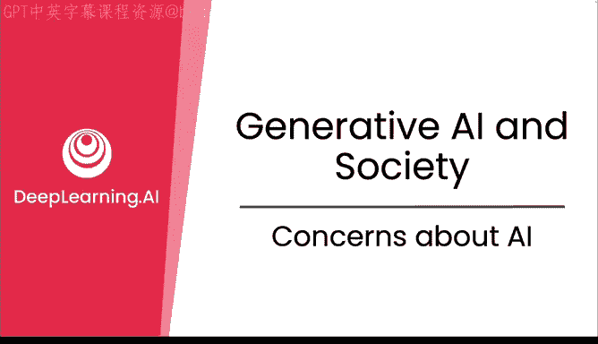
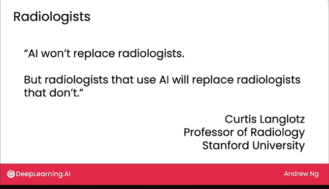
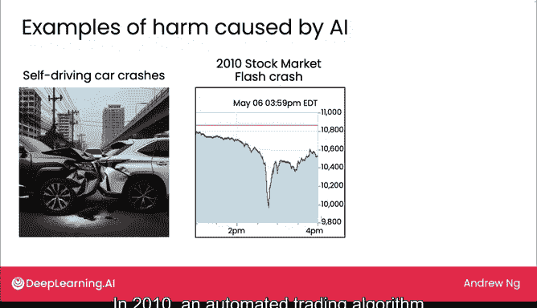
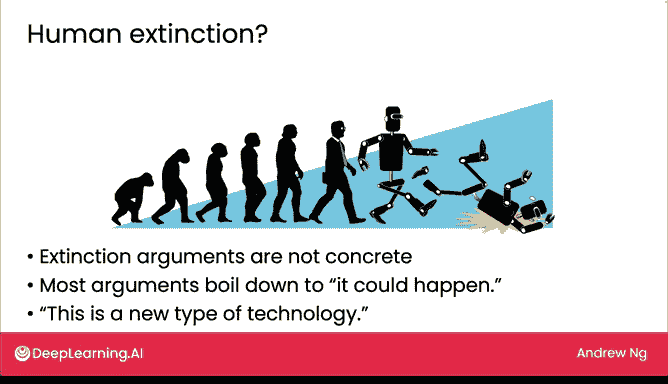
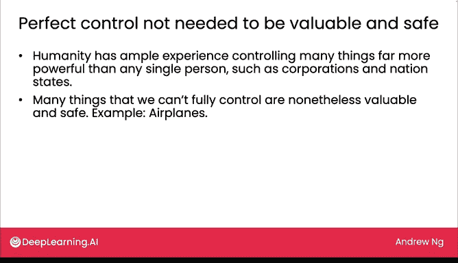

# 27：AI相关关切

## 概述
在本节课中，我们将探讨与人工智能，特别是生成式AI相关的几个主要关切。我们将分析AI是否会放大人类的偏见、AI对就业的影响，以及AI是否会威胁人类生存等核心问题。

## 偏见放大与缓解

上一节我们介绍了生成式AI的广泛应用，本节中我们来看看关于AI的第一个主要关切：它是否会放大人类社会已有的偏见。

大型语言模型（LMs）在互联网文本上进行训练，这些文本既反映了人类最优秀的品质，也包含了一些偏见、仇恨和误解。因此，模型也可能学习到这些负面特质。例如，在初始训练后，如果你让一个模型补全“CEO是____”这个句子，许多模型倾向于选择“男人”这个词。这反映了社会偏见，扭曲了所有性别的人都能成功领导公司的事实。

互联网上的文本代表我们的过去和现在，因此模型从这些数据中反映出一些过去的偏见或许并不令人意外。但我们可能希望LMs能代表一个更公平、偏见更少、更公正的未来，而不仅仅是反映过去的数据。

幸运的是，通过我们在第二周讨论过的**微调**，以及更先进的技术如**基于人类反馈的强化学习**，模型正变得偏见更少。以下是ROHF技术如何减少偏见的基本步骤：

1.  **训练奖励模型**：首先，使用人类标注的数据训练一个奖励模型。人类会对模型的不同回答进行评分（例如1-5分）。
2.  **自动评分**：然后，利用这个训练好的奖励模型，自动、低成本地对大量模型生成的回答进行评分。
3.  **模型自我优化**：最后，模型利用奖励模型的评分，进一步训练自己，以生成更多能获得高分、更符合人类偏好的回答。

ROHF已被证明能显著降低模型在性别、种族、宗教等特征上表现出偏见的可能性，使其更少提供有害信息，并对人更加尊重。如今，LM的输出已经比互联网上的平均文本更安全、偏见更少，并且这类技术还在持续改进。

## AI对就业的影响

在讨论了偏见问题后，我们转向第二个主要关切：当AI能以比人类更快、更便宜的方式完成工作时，谁还能维持生计？AI会让很多人失业吗？

为了理解这种可能性，让我们看看放射学的例子。多年前有预测认为，AI在分析X光图像上进步神速，将在五年内取代放射科医生。然而，五年过去了，AI还远未取代放射科医生。

这主要有两个原因。首先，解读X光片比当初预想的更困难。其次，也是更重要的，放射科医生的工作远不止解读医学图像。根据一项研究，放射科医生执行大约30项不同的任务，解读X光片只是其中之一。

以下是放射科医生承担的部分其他任务：
*   操作成像设备。
*   与患者或其他相关方沟通检查结果。
*   应对检查过程中的并发症（如患者恐慌发作）。
*   记录操作过程和结果。

AI确实有很大潜力来增强或辅助X光片的解读（技术上这主要通过监督学习而非生成式AI实现），但要完全自动化所有这些任务仍然遥不可及。因此，正如斯坦福大学放射学教授所言：“AI不会取代放射科医生，但使用AI的放射科医生会取代不使用AI的放射科医生。”这种效应预计将在许多其他职业中出现。

需要明确的是，帮助人们适应AI、为数不多因工作消失而遭受痛苦的人提供保障、以及确保受影响者拥有安全网和学习新技能的机会，这些挑战不容小觑。但回顾历史，从蒸汽机到电力再到计算机，每一波技术浪潮所创造的工作岗位都远多于它所摧毁的。AI将带来巨大的增长，并在此过程中创造许多新的就业机会。

## AI与生存风险

接下来，我们探讨可能是最大的焦虑：AI会导致人类灭绝吗？我们知道设计不当的软件可能产生戏剧性影响，例如导致致命事故或市场崩溃。但AI能导致人类灭绝吗？

对此存在不同观点。一些担忧集中于恶意行为者可能利用AI（例如制造生物武器）来毁灭人类。另一些人则担心AI可能无意中导致人类灭绝，就像人类因缺乏意识而驱使许多其他物种灭绝一样。

在评估这些论点时，我发现它们不够具体，未能明确说明AI如何导致人类灭绝。大多数论点归结为“这有可能发生”。虽然无法证明AI超级智能不会消灭人类，但似乎也没人能确切知道它将如何做到。

然而，我们知道人类拥有充足的经验来控制比任何个人都强大得多的实体（如公司和民族国家），也知道许多我们无法完全控制的事物（如飞机）仍然是安全且有价值的。在航空早期，飞机造成了许多伤亡，但我们从经验中学习，制造了更安全的飞机，并制定了更好的操作规则。今天，许多人登上飞机时并不担心生命安全。对于AI也是如此，我们正在学习更好地控制它，它正日益变得更加安全。

最后，如果我们审视人类面临的真实风险，例如气候变化导致全球人口锐减、未来的大流行病，或者小概率的小行星撞击事件，我认为AI将是我们应对这些挑战的关键组成部分。因此，我的观点是，如果我们希望人类在未来一千年中生存和繁荣，AI会增加我们成功实现这一目标的可能性。

## 总结

本节课中我们一起学习了关于生成式AI的几个核心关切。我们分析了AI可能放大社会偏见的问题，并了解了通过**ROHF**等技术可以有效地缓解这一风险。我们探讨了AI对就业的影响，认识到AI更可能改变而非完全取代大多数职业，并有望通过促进增长创造新的工作机会。最后，我们审视了关于AI生存风险的争论，指出虽然存在不同观点，但通过持续改进控制措施，AI更可能成为帮助我们应对重大全球挑战的工具，而非威胁。这些讨论为我们理解AI的社会影响提供了基础框架。