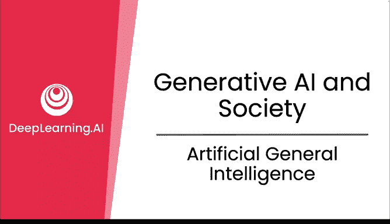
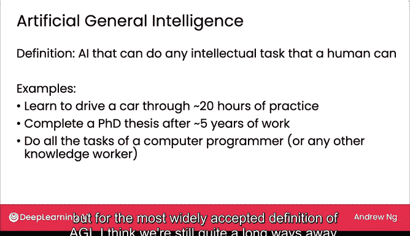

# 28：通用人工智能

在本节课中，我们将探讨通用人工智能（AGI）这一概念，了解其技术定义、当前发展水平以及它与现有AI技术的区别。

## 什么是通用人工智能（AGI）？🤔

通用人工智能是一个令人兴奋的概念。围绕它的一些困惑源于“通用”这个词的使用。众所周知，AI是一项通用技术，意味着它对许多不同的事情都有用。大型语言模型的兴起催生了像ChatGPT这样的单一模型，它们对许多事情都有用，感觉上像是通用技术。但通用技术与通用人工智能不是一回事。

让我们来看看AGI真正的技术定义是什么。

## AGI的技术定义 📖

AGI最被广泛接受的定义是：能够完成人类可以完成的任何智力任务的AI。有些定义实际上说“人类或哺乳动物可以完成的任何任务”，但我们现在先坚持这个定义。

以下是AGI能力的具体例子：

*   **学习驾驶**：如果拥有AGI，AI将能够通过大约20小时的练习学会开车，类似于一个青少年能做到的。这是深度学习先驱Yana Kun提出的一个例子。而今天，自动驾驶汽车还远未达到这个水平，肯定无法在短短20小时的练习后做到。
*   **完成博士论文研究**：如果拥有AGI，AI将能够在五年工作后（甚至可能更快）完成博士论文级别的智力研究任务。今天，AI可以在头脑风暴和写作的某些部分提供帮助，或者成为研究某些环节的思考伙伴，但我们显然离这个目标还很远。
*   **替代知识工作者**：如果拥有AGI，AI将能够完成计算机程序员或任何其他知识工作者的几乎所有任务，这些工作者对工作的贡献就是执行智力任务。显然，我们离这个目标仍然非常遥远。

## 关于AGI时间线的不同观点 ⏳

我知道关于实现AGI需要多长时间存在不同观点。我认为我们还需要几十年，甚至更长时间，但我希望在我们有生之年能看到它。一些企业对我们何时能达到AGI做出了更为乐观的预测。但我发现，这些企业中的大多数都改变了AGI的定义，设定了一个低得多的门槛。

我曾将其中一家企业使用的AGI定义展示给我的一位经济学家朋友，他打趣道：“天哪，按照这个AGI的定义，我想我们30年前就达到了。”因此，通过足够降低门槛，我们确实可以更快地“达到”AGI，但对于最广泛接受的AGI定义，我认为我们还有很长的路要走。

## 大型语言模型与AGI的关联 🔗

大型语言模型令人兴奋的一点是，我们可以将它们用作推理引擎，正如我上一节提到的。也许我们现在开始看到了AGI未来可能样子的粗略轮廓。我不认为有任何基本的物理定律阻止我们创造AGI，我认为AGI实际上将对人类社会非常有价值，但我们仍然需要一些重大的技术突破才能实现。

实现AGI的一个难点在于，它是以人类智能为基准来衡量人工智能的。人工智能和生物智能沿着两条非常不同的路径发展。例如，AI从比任何人类一生所能阅读的文本多得多的数据中学习。因此，AI在某些任务上已经远远优于任何人类。但要求AI做所有事情，即人类能做的所有智力任务，这仍然是一个非常高的标准。

## 总结与展望 🎯

本节课中，我们一起学习了通用人工智能（AGI）的概念。我们明确了AGI是指能够完成人类所有智力任务的AI，这与当前作为“通用技术”的AI模型有本质区别。我们通过具体例子（如快速学习驾驶、完成博士研究）说明了AGI的能力标准，并认识到尽管大型语言模型展现了推理潜力，但我们距离真正的AGI仍有数十年甚至更长的路要走，且需要重大技术突破。

尽管我们距离AGI还很遥远，但AI已经非常强大，负责任地使用它至关重要。在下一节视频中，让我们来看看负责任的人工智能。