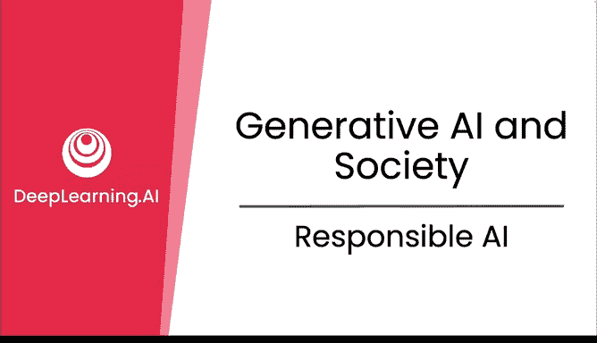
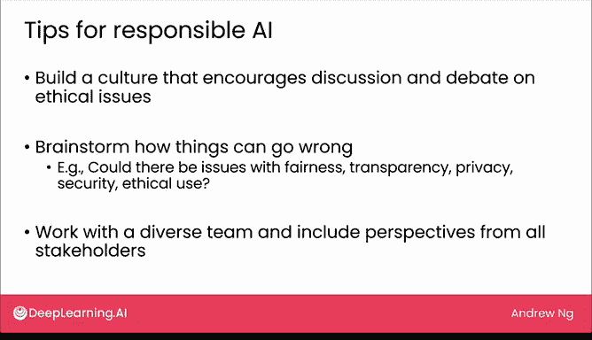

# 29：负责任AI 🧭

在本节课中，我们将要学习“负责任AI”的核心概念、关键维度以及如何在实践中应用它。负责任AI旨在确保人工智能的开发和使用符合道德、值得信赖且对社会负责。

## 概述

负责任AI指的是以符合道德、值得信赖且对社会负责的方式开发和使用人工智能。开发者、企业和政府都关心这一点，并持续进行对话与努力，以确保AI的构建和使用是负责任的。

由于对负责任AI的关注和努力，我们在过去几年中已经取得了相当大的进展。例如，许多政府和公司都发布了负责任AI的框架。

尽管如此，仍有大量工作有待完成。接下来，让我们具体看看负责任AI意味着什么。

## 负责任AI的关键维度

虽然我们仍在探索如何构建负责任AI的许多细节，但一些共同的主题已经浮现。以下是实现负责任AI的几个关键维度。

以下是实现负责任AI的五个关键维度：

1.  **公平性**：确保AI不会延续或放大偏见。
2.  **透明度**：确保利益相关者和受影响人群能够理解AI系统及其决策。
3.  **隐私**：保护用户数据并确保其机密性。
4.  **安全性**：保护AI系统免受恶意攻击。
5.  **道德使用**：确保AI被用于有益的目的。

## 实施挑战与最佳实践

这些维度或原则的挑战之一在于，其实施并非总是直截了当的。例如，至少在过去几千年里，人类一直在辩论什么是道德的、什么是不道德的。不幸的是，道德行为与不道德行为之间并没有明确的数学定义，尽管当然也存在许多明确的案例。

正因如此，对于个人、组织乃至国家而言，要采纳负责任AI，有一些新兴的最佳实践可以帮助进行讨论和辩论，从而做出更好、更负责任的决定，即使有时正确的做法可能并不明确。

我想分享几个建议。

### 实践建议

以下是几个有助于实践负责任AI的建议：

1.  **建立鼓励讨论的文化**：建立一个鼓励就道德问题进行讨论和辩论的文化非常重要。如果你的团队中有人对AI的使用有顾虑，他们最好能自由地提出这个问题，从而使团队可能做出更好的决定。
2.  **进行头脑风暴**：无论是独自一人还是与团队，甚至与更广泛的利益相关者群体一起，对可能出错的情况进行头脑风暴。在许多项目中，我发现这种头脑风暴有助于识别潜在问题，并让团队能够提前缓解它们。头脑风暴的检查清单可以是上一张幻灯片中描述的五个维度：AI系统是否可能在公平性、透明度、隐私、安全性或道德使用方面存在问题？例如，在我参与的一些项目中，我的团队会进行头脑风暴，思考我们部署的模型是否可能存在公平性问题，例如是否会表现出本课程前面提到的一些偏见。
3.  **与多元化团队合作**：我鼓励你与多元化的团队合作，并纳入所有受AI系统影响的利益相关者的观点。对于许多项目，寻求多样化的意见，并与那些可能与我本人非常不同的人交流，使我的团队能够更好地理解AI系统的影响，并引导我们做出更好的决策。例如，在构建医疗保健系统时，我发现与患者和医生交谈提供了与我不同的视角，并真正改变了我们项目的方向；在开发零售应用时，与一些客户和卖家交谈，为我的团队带来了我们原本不会有的新想法。我认为这种模式对许多项目都是适用的。

## 行业特定实践

如果你在特定行业工作，如医疗保健、金融、媒体或科技，可能已经出现了针对你所在行业的负责任AI最佳实践。在你启动项目时，参考这些实践也会很有用。

## 总结与展望

我们都希望利用AI让人们的生活变得更好。曾有几次，我评估了一些在财务上可行但在道德上存疑的项目，并最终放弃了它们。

当你决定要做什么和不做什么时，我希望你能持续考虑负责任AI，并且只从事那些你认为符合道德并能让人受益的项目。

现在，我们即将结束本课程。在下一节视频中，我们将一起回顾本课程所涵盖的全部内容。