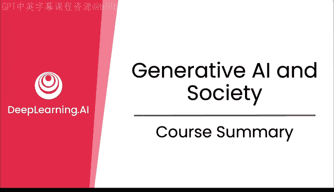
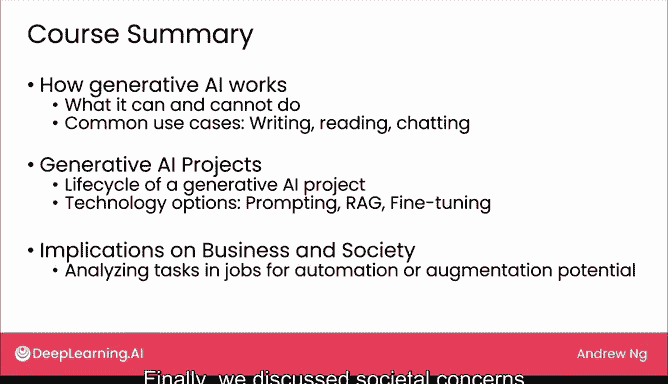

# 30：课程总结

在本节课中，我们将对《面向每个人的生成式AI》课程的全部内容进行回顾与总结。我们将梳理前三周学习的主要知识点，并展望生成式AI的未来。

很高兴您能坚持学习到本视频。我们一起学习了相当多的内容。本次课程即将结束，我深感不舍。

让我们回顾一下课程涵盖的主要主题。在第一周，我们讨论了生成式AI的工作原理，包括如何将其用作思考伙伴。我们探讨了它能做什么和不能做什么，并将其类比为一个遵循指令的大学生所能完成的许多任务。我们还讨论了一些常见用例，包括写作、阅读和聊天。

在第二周，我们讲解了如何构建生成式AI项目，包括项目的生命周期。我们还介绍了多种技术选项，包括提示工程、检索增强生成和微调。

**提示工程**示例：`请用简洁的语言总结以下段落...`
**检索增强生成**核心思想：`最终回答 = LLM(用户问题 + 检索到的相关文档)`
**微调**概念：在预训练模型的基础上，使用特定领域数据进一步训练模型。

最后在本周，我们讨论了生成式AI对商业和社会的影响。我们学习了一个将工作分解为任务以识别自动化或增强机会的框架，并看到了自动化或增强如何不仅能实现成本节约，还能催生全新的价值创造流程。最后，我们讨论了社会关切问题，并谈到了负责任的人工智能。

祝贺您完成本视频的学习。希望您已经学到了很多关于生成式AI的知识，并认为本课程有用。我希望许多人能够掌握并使用生成式AI，因此也请与其他人分享您所学到的知识，或许也可以推荐他们学习这门课程。

在结束之前，关于构建一个更智能的世界，我还有最后一个想法想与您分享。让我们进入本课程的最后一个视频。

本节课中，我们一起回顾了生成式AI的基础原理、项目构建方法以及其广泛的社会与商业影响。希望这些知识能帮助您更好地理解并应用这一变革性技术。