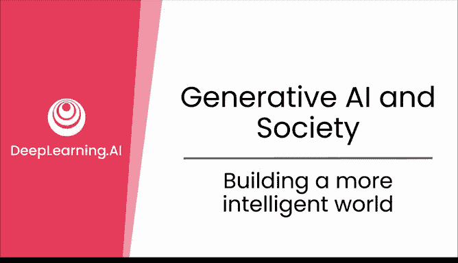

# 31：构建更智能的世界

在本节课中，我们将一起探讨人工智能如何帮助我们构建一个更智能的世界，并总结这门课程的核心愿景。

## 概述

感谢您观看这最后一个视频，并花费时间与我一同学习。作为本课程的总结，我想与您分享我对人工智能如何帮助我们构建一个更智能世界的期望。

## 什么是智能？

智能是运用知识和技能做出良好决策的能力。我们投入数年时间与数万亿美元用于教育，目的都是为了提升我们做出更好决策的能力。培养一个智慧的人类个体，需要巨大的养育、教育和训练成本，因此**人类智能是昂贵的**。

正因如此，在今天，只有最富有的人才能负担得起雇佣大量智能的成本，例如聘请专科医生来仔细检查、思考您的健康状况并提供建议，或者聘请一位花时间真正了解您孩子、并在他们最需要帮助的地方给予温和指导的家教。

## 人工智能的优势

然而，与人类智能不同，**人工智能可以被制造得很廉价**。人工智能有潜力让每个人都能以低成本“雇佣”智能。您不再需要为看医生或接受教育而担忧巨额账单，您可以“雇佣”一支由聪明、信息灵通的“员工”组成的队伍来为您深入思考问题。

它还有潜力为社会在应对一些最大挑战（如气候变化和流行病）时，提供更智能的指导。人工智能是一种新型的“电力”，有潜力彻底改变所有行业和人类生活的方方面面。

## 正视对AI的恐惧

当今对人工智能的恐惧，类似于电力刚出现时人们对它的恐惧。那时，人们害怕触电或电力引发毁灭性火灾。今天，电力仍然存在危险，但我想我们没有人会因为害怕触电而放弃灯光、取暖和制冷。

今天的人工智能仍然存在缺陷，在某些情况下会造成伤害。但人工智能的发展历程，是我们能为世界带来多少智能的一次激动人心的飞跃。同时，我们也在快速改进这项技术。

## 展望未来

随着我们持续改进技术并积累更多应用案例，人工智能将为全球带来更长寿、更健康、更充实的生活。随着技术进步，今天困扰我们的人工智能问题将会减少。

放眼人工智能之外，世界面临着许多问题，如气候变化、流行病、战争等，其中许多问题亟待解决。要解决它们，我们需要调动所有的智能，包括我们能集结的所有**人工智能**。

## 总结

非常感谢您学习这门课程。我希望您能发现生成式AI的用处，负责任地使用它来改善您和周围人的生活。并且，通过您对生成式AI的使用，持续为构建一个对所有人而言更美好、更智能的世界贡献力量。谢谢。