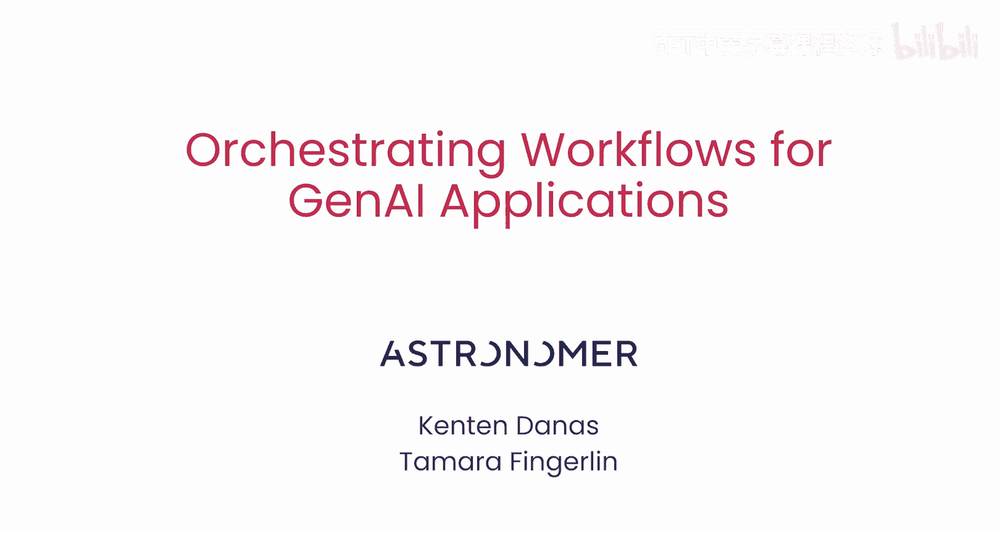
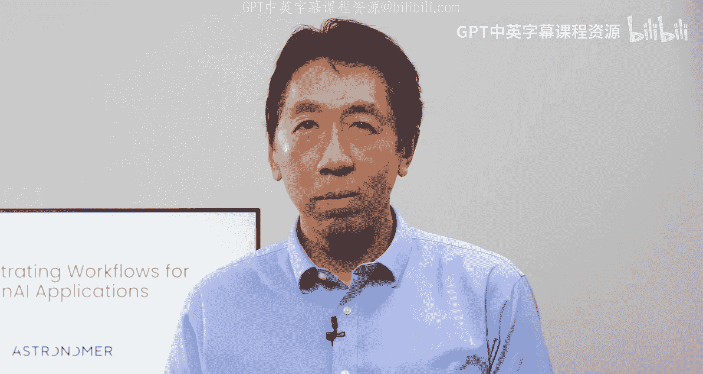
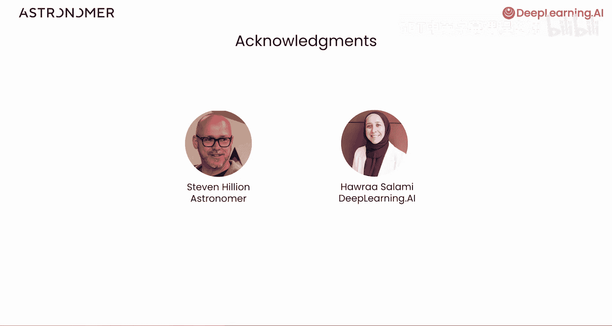
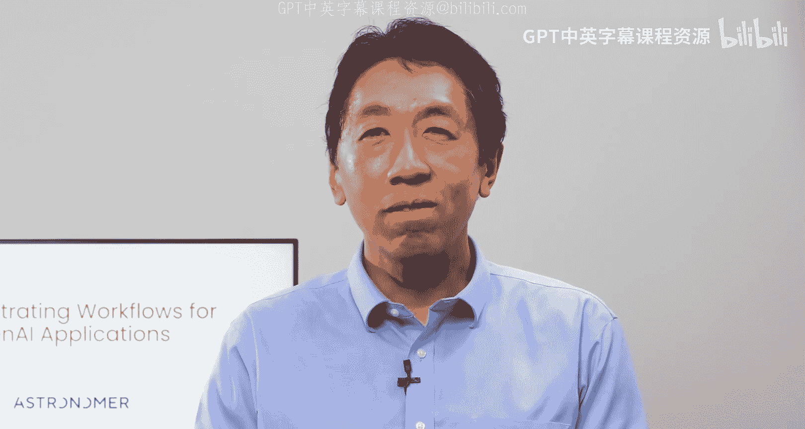

# 001：课程介绍 🎬

在本课程中，我们将学习如何将生成式AI应用的原型转化为自动化、可扩展的生产级工作流。我们将使用Airflow这一编排工具，构建一个能够处理书籍描述、计算嵌入向量并存储到向量数据库的RAG（检索增强生成）管道。

---

欢迎来到《为生成式AI应用编排工作流》课程，本课程是与Astronomer合作开发的。在本课程中，您将构建一个RAG管道。该管道从文本文件中提取书籍描述，然后计算这些描述的嵌入向量，并将嵌入向量存储到向量数据库中。您将使用Airflow来自动化此管道。Airflow是一个编排工具，它能确保各个步骤按正确顺序执行，并在正确的时间触发管道运行。

我们很高兴本课程的讲师是Astronomer的开发者关系高级经理Kenten Dens，以及开发者倡导者Tamara Fingngelin。

感谢Andrew，我们很高兴能与您合作开发这门课程。

要将您的概念验证从开发环境转移到生产环境，您需要将逻辑转化为由多个步骤组成的自动化管道，其中每个步骤代表一项操作。

例如，假设您可以访问一系列包含产品评论的文件，并且您已经编写了一个大型代码块来总结每个产品的评论。为了实现自动化，您可以将此逻辑分解为一系列步骤。

以下是分解逻辑的步骤示例：
1.  首先，找到每个产品的评论文本文件位置。
2.  其次，汇总每个产品的所有评论反馈。
3.  第三，使用语言模型总结每个产品的评论。
4.  最后，再次使用语言模型从摘要中提取情感倾向。

这种方法有助于您轻松识别整个管道中的故障点并从中恢复。

对于许多生成式AI管道，故障可能由于API速率限制或API返回其他错误而发生。例如，当语言模型需要处理大量产品评论时。在本课程中，您将学习如何为任务配置重试机制，以便管道可以在重试前等待一段时间。

您还将学习如何并行处理大量数据。例如，在摘要生成步骤，您可以并行处理每个产品的评论，而不是在一个步骤中处理所有产品的摘要。

最后，您还将学习如何在有新数据可用或更新时（例如一组新的产品评论对）触发管道运行。您将把这些实践应用到您的RAG示例中。

您将从包含RAG原型的Jupyter笔记本开始，该原型用于提取和嵌入书籍描述。在学习基本的Airflow语法后，您将把该原型转化为可手动运行的Airflow管道。

之后，您将安排它自动运行，使其在运行时适应您的数据，甚至添加自动重试和故障通知。在最后一课中，您将了解Airflow在现实生活中如何用于编排生成式AI工作流。

许多人参与了本课程的创作。我要感谢来自Astronomer的Stephen Hoian，以及来自DeepLearning.AI的Harra Salami，他们也为本课程做出了贡献。

将Jupyter笔记本转化为可运行的生产软件是任何AI开发人员的一项重要技能。在下一个视频中，您将经历整个过程，并了解如何自己操作。对于许多首次进行此操作的开发人员来说，一个不太直观的方面是：将工作流分解为步骤的过程通常会产生比预期更多、更小的独立步骤。掌握如何做到这一点的直觉将使您的应用程序运行得更快、更可靠。因此，请前往下一个视频学习相关内容。

---

在本节课中，我们一起学习了课程的整体目标：将生成式AI原型转化为自动化、健壮的生产管道。我们了解了使用Airflow进行工作流编排的优势，以及将复杂任务分解为可管理、可监控步骤的重要性。接下来，我们将开始动手实践，学习如何具体构建这样的管道。