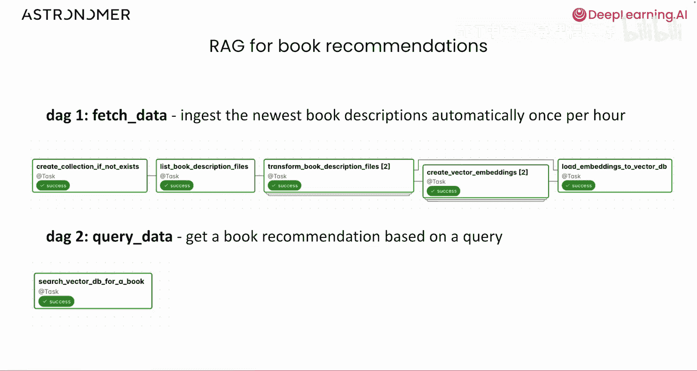
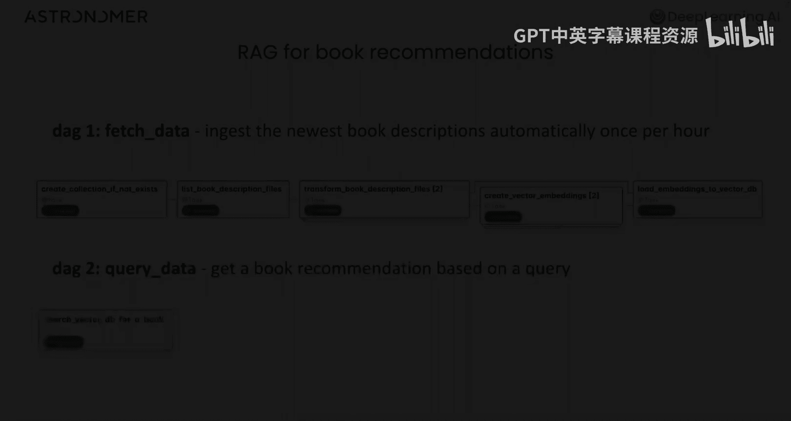

# 002：从笔记本到流水线 🚀

在本课程中，我们将学习如何为生成式AI应用编排工作流。具体来说，我们将探索将笔记本原型转化为生产流水线的最佳实践，了解Airflow及其核心概念，如DAG和任务。

## 什么是编排及其重要性？🤔

在深度学习的其他课程中，你可能使用Jupyter笔记本来开发生成式AI应用。笔记本非常适合开发，因为你可以轻松运行和测试应用程序不同部分的代码，实现快速反馈和实验。可以方便地集成任意数量的Python包和工具。

然而，一旦代码准备就绪，你可能希望自动运行它，以便在生产环境中为生成式AI应用提供支持。这在笔记本中不容易实现。当代码自动运行时，你需要额外的功能，例如可观测性，以便了解哪些任务成功、哪些失败以及流水线何时运行。你还需要一个健壮的系统，能够同时管理大量任务的运行、不同的资源需求以及出现问题时发送通知。

所有这些都可以通过一个编排工具来实现，该工具用于基于你的笔记本代码运行数据流水线。

## 编排示例 📊

举一个例子，假设你有一个原型，其中你获取一些文本输入，从中生成嵌入向量，并将其加载到向量数据库中。

在你的笔记本中，可能有三个单元格，你编写并测试了处理文本数据本地子集并将其加载到向量数据库实例的代码。现在，你可以将这个笔记本原型转化为一个流水线。

你的每个笔记本单元格都成为流水线中的一个步骤，可以自动运行并指向生产数据。你的流水线有三个步骤：获取文本、嵌入数据、加载到数据库。

除了自动运行每个步骤的代码外，它还将管理依赖关系，因为在将数据加载到数据库之前，你需要先获取数据。你的流水线还将包含你定义的逻辑，用于处理失败情况，例如是否重试、是否以某种方式收到通知，或者如果上游步骤失败，下游步骤是否仍然运行。

所有这些额外功能都是自动化笔记本代码和生产环境所必需的，并由编排工具提供。

## 认识Apache Airflow 🌪️

在这张幻灯片上，你会注意到我们的流水线有一个风车标志。这是Airflow的标志，Airflow是本课程中我们将要使用的编排器。

Apache Airflow是一个用于创作、调度和监控数据流水线的开源工具。它是程序化工作流编排的标准，在全球范围内非常流行。

在Airflow中，你的数据流水线是用Python编写的，这意味着Airflow可以与数据生态系统中的几乎任何工具集成。Airflow的架构使其具有无限的可扩展性，无论你需要运行一个流水线还是数千个。它拥有丰富的功能集，使其具有动态性和可观测性。该项目由一个充满活力的开源社区维护，新功能不断添加。

## Airflow核心概念 📚

使用Airflow时，有几个概念你应该了解。第一个是DAG。DAG这个名字来源于一个数学术语，但在Airflow中，你可以简单地将其视为一个数据流水线，或者在某些情况下，是数据流水线的一部分。

在DAG内部，你有任务，它们代表流水线中的一个工作单元。Airflow还有一个丰富的用户界面，显示你流水线当前和过去运行的概览。在本课程中，你将有机会探索Airflow的用户界面。

让我们通过回顾之前的例子来更深入地了解DAG的概念。在这个例子中，你将原型笔记本转化为流水线，你将拥有一个包含三个任务的DAG：一个用于获取文本输入数据，一个用于创建嵌入向量，一个用于将这些嵌入向量加载到你的向量数据库中。

在Airflow中，你的DAG有一个名称，例如“我的超棒流水线”，并会设定一个运行时间表，例如每天午夜运行。每个任务都包含你在笔记本中开发的Python代码。你还需要定义依赖关系，以便你的三个任务按顺序运行。如果数据尚未准备好，运行将数据加载到数据库的任务是没有意义的。

请注意，这只是Airflow中DAG的一个例子。你的DAG可能很简单，像这个一样，也可能更复杂。Airflow非常灵活。如果你能为你的用例用Python编写逻辑，你就可以将其转化为Airflow DAG。

## Airflow的常见用例 🔧

由于Airflow非常灵活，它通常被用作许多不同用例的编排器，包括编排生成式AI流水线。在本课程中，我们将介绍如何编排检索增强生成流水线，但你也可以编排其他类型的生成式AI流水线。

一个常见的用例是推理执行，这通常是在输入数据上运行训练好的机器学习模型并收集结果的过程。批量推理是推理执行的一种类型，这是一种一次性对大量输入数据使用训练好的机器学习模型生成预测的方法，因此数据是以批次提供的。在Airflow中，你可能运行一个夜间批量DAG，根据最新的每日客户活动和档案数据，对所有客户的流失可能性进行评分。

另一种推理执行类型是临时推理或异步处理，这意味着一旦数据到达，你就将数据输入模型以获取结果。虽然Airflow不用于流处理，但在某些情况下可以用于异步流水线。例如，你可能有一个Web应用程序，在用户创建个人资料时提供个性化产品推荐，信息被发送到Airflow，Airflow管理从训练好的模型中获取结果。Airflow也可用于管理自动化的模型训练、重新训练和微调。通常，任何基于Python的笔记本都可以转化为Airflow DAG和流水线。

## Airflow流水线设计最佳实践 🏆

在为生成式AI编排或任何用例设计Airflow流水线时，有几个最佳实践你应该牢记。遵循这些准则将有助于确保Airflow的灵活性使你的工作更轻松，而不会在生产中给你带来问题。

以下是三个关键的最佳实践：

1.  **原子性**：这意味着你应该创建流水线，使你的任务是原子的，每个任务完成一个单一的工作单元。
2.  **幂等性**：这意味着你设计流水线的方式是，如果你用相同的输入多次运行一个DAG或任务，它总是会产生相同的输出。请注意，对于生成式AI流水线，这并不总是可能的，这没关系。这是一个在合理时应遵循的一般准则，而不是每种情况下的硬性要求。
3.  **使用软件开发最佳实践**：因为Airflow流水线是Python代码，你可以像对待任何其他软件一样对待它们，并使用版本控制、CI/CD和自动化测试。

前两个最佳实践比较微妙，现阶段对你来说可能是新的，所以让我们更详细地看看它们。

## 深入理解原子性与幂等性 🔍

**原子性**在数据编排的上下文中是指每个任务应代表一个原子工作单元的原则。由于Airflow中的任务是Python代码，你可以随意定义它们。你可以将整个笔记本放入一个任务中，该任务为你的流水线完成所有工作，但流水线很少只有一个逻辑步骤。在前面的例子中，我们讨论了一个包含三个步骤的流水线：获取文本数据、生成嵌入向量并将其加载到向量数据库。如果你将所有逻辑放入一个任务中，如果它无法连接到数据库会发生什么？你将不得不重新运行所有代码，即使获取文本数据和生成嵌入向量的一切都正常。这既低效又难以管理。你甚至需要付出额外的努力才能弄清楚任务的哪一部分失败了。

通过将此逻辑分解为三个独立的任务，每个步骤一个，你可以获得更好的可观测性，并且可以通过仅重新运行需要重新运行的任务，更容易地从故障中恢复。通常，在Airflow DAG中拥有更多数量的任务并没有太多缺点，始终保持任务的原子性总是更可取的。

**幂等性**是另一个最佳实践，可以在出现问题时帮助你更快地恢复。一个幂等的任务意味着对于相同的输入，你得到相同的输出。例如，假设你有一个任务，其逻辑使用了当前日期。如果你使用像`datetime.now()`这样的函数来设计任务，那么任务将在每次运行时使用当前的日期和时间。因此，如果你有一个处理每日数据的DAG，并且在星期一你发现星期五的运行失败了，如果你重新运行你的任务，你将不会使用星期一的日期，而是使用星期五的日期，并且你将处理错误的数据。在这个特定的例子中，你可以使用Airflow的上下文，它允许你访问Airflow在运行流水线时使用的信息。这允许你获取与DAG计划日期相对应的日期，即使该日期现在已成为过去。

正如我们之前提到的，有时对于生成式AI流水线，要求每个任务或DAG都是幂等的并不合理。在某些情况下，你期望相同的输入产生不同的输出。这完全没问题。重要的是你知道幂等性是什么，以及在你的DAG设计中何时使用它是有意义的。

## 课程实践展望 🎯

现在你已经对Airflow概念有了一些背景了解，你可以开始在本课程的其余部分亲自尝试了。你将学习如何创建一个用于图书推荐的RAG应用程序，并将你的笔记本代码转化为Airflow DAG。

你将创建一个DAG，用于自动获取和摄取新书描述的数据，创建向量嵌入并将其加载到向量数据库中。你还将创建第二个DAG，根据你提供的查询，在你的向量数据库中搜索图书推荐。

## 总结 📝

在本节课中，我们一起学习了工作流编排的重要性，特别是如何将Jupyter笔记本原型转化为可自动运行的生产级流水线。我们介绍了Apache Airflow这一强大的开源编排工具，理解了其核心概念：DAG和任务。我们还探讨了设计Airflow流水线时应遵循的关键最佳实践，即原子性、幂等性以及应用软件开发标准。最后，我们预览了接下来的实践内容，即构建一个用于图书推荐的RAG应用流水线。掌握这些知识，是迈向稳健、可观测的生成式AI应用生产部署的第一步。