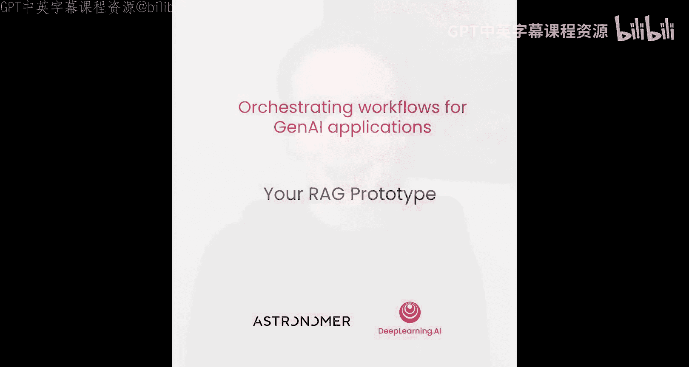
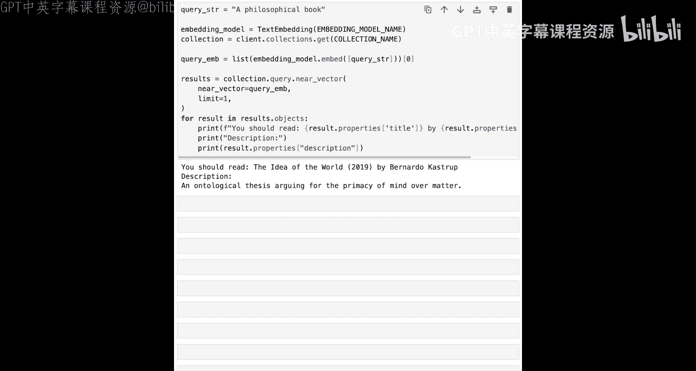

# 003：构建你的 RAG 原型应用 🧪

在本节课中，我们将探索一个功能完整的 RAG（检索增强生成）原型应用。这个应用能够摄取和嵌入书籍描述，并根据你的查询为你推荐想读的书籍。稍后，我们将把这个原型转化为一个可编排的工作流管道。



---

## 概述

我们将逐步构建一个 RAG 原型应用。首先，我们会设置必要的库和工具，然后创建向量数据库并加载数据。接着，我们会将文本数据转化为向量嵌入，并将其存储到数据库中。最后，我们将通过一个查询来测试这个系统，获取书籍推荐。通过这个过程，你将学习如何将 Jupyter Notebook 中的代码转化为一个结构化的管道，为后续使用 Airflow 进行编排打下基础。

---

## 导入必要的库

首先，我们需要导入本 Notebook 中将要用到的库。


以下是所需的库及其用途：

*   `os` 和 `json`：用于与文件系统交互和处理 JSON 数据。
*   `JSON`（来自 `IPython`）：用于在 Notebook 中以结构化格式美观地显示 JSON 字典。
*   `TextEmbedding`（来自 `fastembed`）：用于为书籍描述（包括你最喜欢的书）创建向量嵌入。
*   `Voyage`：一个轻量级向量数据库，用于存储和检索向量嵌入。
*   一个辅助函数：用于抑制冗长的日志输出。

```python
import os
import json
from IPython.display import JSON
from fastembed import TextEmbedding
import voyageai
from helper import suppress_stdout_stderr
```

由于 Airflow 可以编排任何 Python 代码，因此它可以与你喜欢的任何 AI 工具库（包括各种向量数据库）协同工作。在本例中，我们使用的是 Voyage 向量数据库。

---

## 设置应用变量

接下来，我们需要定义几个在整个 RAG 应用中都会用到的变量。

以下是需要定义的几个关键变量：

*   `COLLECTION_NAME`：在 Voyage 数据库中存储嵌入向量的集合名称，本例中为 `"books"`。
*   `BOOK_DESCRIPTIONS_FOLDER`：存储书籍描述文本文件的文件夹路径。我们已经准备了一些数据在 `includes/data` 文件夹中。
*   `EMBEDDING_MODEL`：本例中使用的嵌入模型。我们选择流行的、轻量级的 `"BAAI/bge-small-en-v1.5"`，该模型针对语义搜索和检索进行了优化。

```python
COLLECTION_NAME = "books"
BOOK_DESCRIPTIONS_FOLDER = "includes/data"
EMBEDDING_MODEL = "BAAI/bge-small-en-v1.5"
```

在 Notebook 环境中，我们通常使用工具的本地或嵌入式版本。这里也是如此，我们创建并连接到一个嵌入式的 Voyage 数据库实例，其数据将持久化存储在 `/tmp/voyage` 目录下。

```python
VOYAGE_PERSIST_DIRECTORY = "/tmp/voyage"
client = voyageai.Client(persist_directory=VOYAGE_PERSIST_DIRECTORY)
```

请暂停视频并运行此单元格，以创建你的 Voyage 实例并确认客户端已准备就绪。稍后，当你将此 Notebook 转换为 Airflow DAG 时，你将连接到一个在 Docker 中运行的 Voyage 实例。

---

## 创建向量数据库集合

上一节我们设置了数据库连接，本节中我们来看看如何在其中创建数据集合。

Voyage 中的集合（Collection）是一组共享相同数据结构的对象，例如一组产品描述、支持工单，或者在我们的案例中——书籍描述。以下代码首先列出已存在的所有集合，然后检查我们想要创建的集合是否已存在。如果不存在，则创建它；如果已存在，则直接获取该集合的引用以便后续交互。

```python
# 列出所有现有集合
existing_collections = client.list_collections()
existing_collection_names = [col.name for col in existing_collections]

# 检查目标集合是否存在，不存在则创建
if COLLECTION_NAME not in existing_collection_names:
    collection = client.create_collection(name=COLLECTION_NAME, size=384) # 384 是嵌入向量的维度
    print(f"Collection '{COLLECTION_NAME}' created.")
else:
    collection = client.get_collection(name=COLLECTION_NAME)
    print(f"Collection '{COLLECTION_NAME}' already exists, retrieved.")
```

现在，Voyage 数据库已经准备就绪，正等待着数据的注入。

---

## 准备书籍描述数据

我们的 `book_descriptions` 文件夹中已经存储了一些优秀书籍的描述文本文件。

运行下面的单元格，你可以看到当前文件夹中有两个文件，每个文件包含多本书的数据。

```python
description_files = os.listdir(BOOK_DESCRIPTIONS_FOLDER)
print(f"Files in folder: {description_files}")
```

让我们添加第三个文件，其中包含你喜爱的书籍。格式很简单：每行描述一本书，各部分由三个冒号 `:::` 分隔。

格式如下：
`索引号:::书名 (出版年份):::作者:::书籍描述`

我添加了两本我最喜欢的书：
1. 《The Idea of the World by Bernardo Kastrup》
2. 《Exploring the World of Lucid Dreaming by Stephen LaBerge》

```python
new_books = [
    "7:::The Idea of the World (2018):::Bernardo Kastrup:::A rigorous case for the primacy of mind in nature, drawing on philosophy, neuroscience, and physics to argue against materialist metaphysics.",
    "8:::Exploring the World of Lucid Dreaming (1990):::Stephen LaBerge:::A practical guide to learning how to become consciously aware within your dreams, based on scientific research at Stanford University."
]

new_file_path = os.path.join(BOOK_DESCRIPTIONS_FOLDER, "my_favorite_books.txt")
with open(new_file_path, 'w') as f:
    for book in new_books:
        f.write(book + '\n')
print(f"New books added to {new_file_path}")
```

你可以在此处暂停视频，添加你自己最喜欢的书籍。可以添加任意数量，只需确保遵循上述格式，并且每本书独占一行。

太棒了！现在我们需要从这些文本文件中读取数据，将文本转化为嵌入向量，然后将这些向量加载到 Voyage 数据库中。

---

## 读取并解析书籍数据

首先，我们循环遍历描述文件列表，并使用 `.readlines()` 方法读取每个文件。这个方法会创建一个列表，列表中的每个元素对应文件中的一行，也就是一本书的数据。

```python
list_of_book_data = []
for filename in description_files:
    filepath = os.path.join(BOOK_DESCRIPTIONS_FOLDER, filename)
    with open(filepath, 'r') as f:
        lines = f.readlines()
    for line in lines:
        if line.strip(): # 忽略空行
            parts = line.strip().split(':::')
            if len(parts) == 4:
                book_dict = {
                    "id": parts[0],
                    "title": parts[1],
                    "author": parts[2],
                    "description": parts[3]
                }
                list_of_book_data.append(book_dict)
```

接下来，我们使用三个冒号作为分隔符来提取书籍标题、作者和描述文本，并将它们格式化为每本书一个字典。每个文件产生的书籍字典列表会被存储在一个名为 `list_of_book_data` 的大列表中。

你可以使用 IPython 的 `JSON` 函数以可展开的结构化格式显示该列表的内容。

```python
JSON(list_of_book_data)
```

请随时暂停视频，检查你的书籍数据是否正确添加。

---

## 创建文本向量嵌入

在 RAG 应用中，向量嵌入用于实现语义搜索——即基于输入文本寻找相似文本。你每天交互的许多 AI 应用都使用 RAG 来提供更好的答案。例如，电商平台上的聊天机器人很可能能够访问其所有在售产品的最新专有产品描述的向量嵌入，因此它能比通用聊天机器人提供更准确的购物推荐。我们的原型应用也实现了相同的原理。

接下来，让我们为书籍描述创建嵌入向量。

我们使用 fastembed 的 `TextEmbedding` 来实例化嵌入模型，然后遍历书籍数据列表，获取每本书的描述。`.embed` 方法用于创建向量嵌入。`list()` 函数用于确保将生成器对象转换为 Python 列表。

```python
embedding_model = TextEmbedding(model_name=EMBEDDING_MODEL)
descriptions = [book["description"] for book in list_of_book_data]
embeddings_list = []
for desc in descriptions:
    # .embed 返回一个生成器，我们取第一个（也是唯一一个）嵌入向量
    emb = list(embedding_model.embed(desc))[0]
    embeddings_list.append(emb)
print(f"Created {len(embeddings_list)} embeddings.")
```

---

## 将数据插入向量数据库

现在，你可以将嵌入向量列表和格式化后的书籍数据列表压缩（zip）在一起，并将数据插入 Voyage 数据库。

每本书的标题、作者、描述以及向量嵌入被定义为一个数据对象，准备放入 Voyage 集合中。Voyage 支持使用 `.insert_many` 方法进行批量插入。

```python
# 准备要插入的数据对象
data_objects = []
for book, emb in zip(list_of_book_data, embeddings_list):
    obj = {
        "id": book["id"],
        "title": book["title"],
        "author": book["author"],
        "description": book["description"],
        "vector": emb.tolist() # 将 numpy 数组转换为列表
    }
    data_objects.append(obj)

# 批量插入到集合中
if data_objects:
    collection.insert_many(data_objects)
    print(f"Inserted {len(data_objects)} book records into the '{COLLECTION_NAME}' collection.")
```

现在，一切就绪，可以获取书籍推荐了。

---

## 查询与获取推荐

我想读一本哲学书。这个查询字符串会使用相同的嵌入模型进行向量化，然后执行“近邻向量搜索”，以找到描述与查询字符串最匹配的书籍。

```python
query = "I would like to read a philosophical book."
# 为查询文本创建嵌入向量
query_embedding = list(embedding_model.embed(query))[0]

# 在集合中搜索最相似的书籍
results = collection.search(query_embedding, limit=1)
for result in results[0]: # results 是一个列表的列表
    book_id = result.id
    # 根据 ID 找到对应的书籍信息
    recommended_book = next((book for book in list_of_book_data if book["id"] == book_id), None)
    if recommended_book:
        print(f"Recommended for you: {recommended_book['title']} by {recommended_book['author']}")
        print(f"Description: {recommended_book['description']}")
```

运行这个单元格，我得到了《The Idea of the World》的推荐——这确实是一本非常哲学的书。

请暂停视频，尝试不同的查询，实验一下是否能得到你之前添加的、自己最喜欢的书的推荐。

---

## 总结与展望

好了，你现在处于一个熟悉的境地：你拥有一个可工作的 AI 应用原型。在本例中，这是一个能够提供书籍推荐的 RAG 类型应用。在真实场景中，例如将其集成到书店网站的聊天机器人里，你将需要定期向数据库中添加新书，理想情况下这个过程是自动化的，并且需要对操作是否成功具备可观测性，能够防范 API 速率限制等瞬时问题，并在出现错误时发出警报。

这正是工作流编排发挥作用的地方。你已经有了原型，让我们在 Airflow 中将其转化为一个管道吧。在下一课中，你将学习如何创建基本的 Airflow 管道并在 Airflow UI 中与它们交互，然后使用本 Notebook 中的代码来构建你的 RAG 管道。



本节课中我们一起学习了如何构建一个完整的 RAG 应用原型，包括数据准备、向量嵌入生成、向量数据库操作以及语义搜索查询。这些步骤构成了许多现代 AI 应用的核心流程，为后续的自动化编排奠定了坚实的基础。