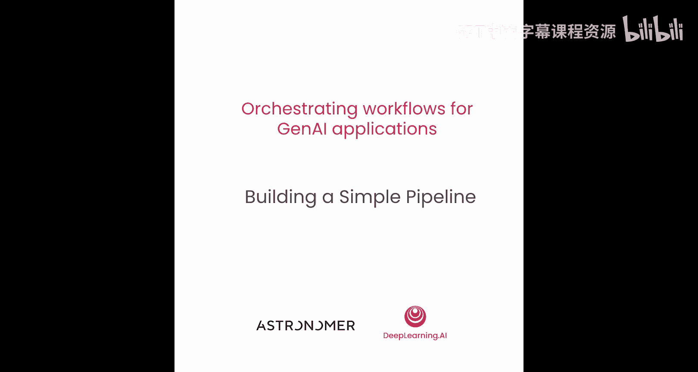
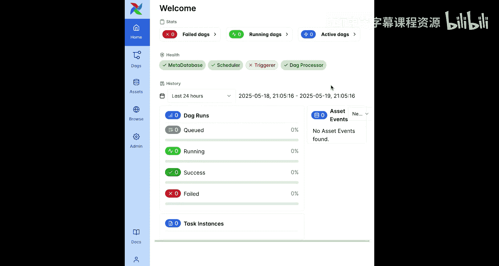
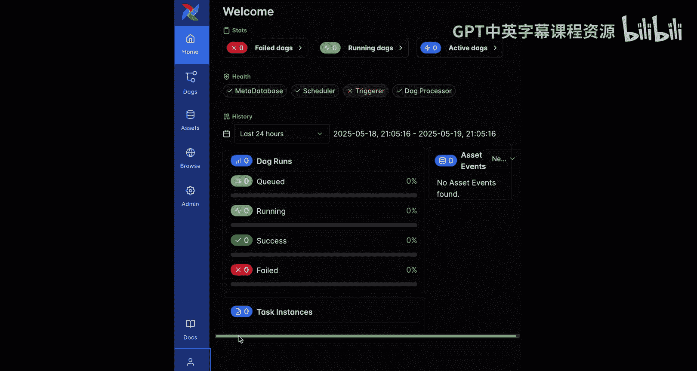
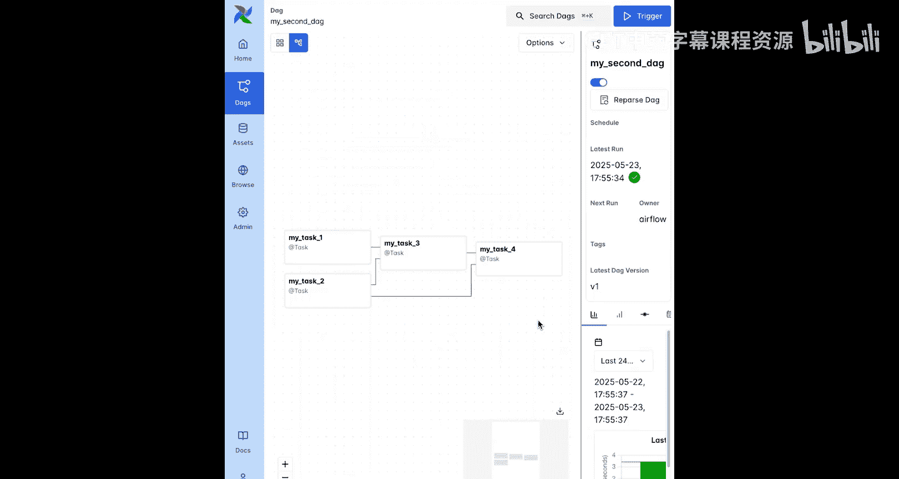

# 004：构建一个简单的流水线 🛠️

在本节课中，我们将构建第一个流水线，即一个仅使用三个 Airflow 特定模块的简单 Airflow DAG。构建完成后，我们将在 Airflow 用户界面中手动探索并运行这个 DAG。

## 访问 Airflow 环境 🖥️

在本次及后续课程中，你将拥有一个功能齐全的 Airflow 环境。

首先，运行第一个单元格以获取 Airflow 环境用户界面的链接。点击该链接将在新标签页中打开 Airflow UI，你可以使用用户名 `airflow` 和密码 `airflow` 登录。

登录后，你将进入 Airflow 环境的主页。此页面包含一些快速链接，以及 Airflow 环境各组件当前的健康状态。请注意，由于本课程不需要，触发器组件未在沙箱中运行。

主页还显示了你 Airflow 环境中 DAG 和任务运行的近期历史。目前，这些统计数据还是空的。

一个小提示：点击左下角的用户按钮，如果你愿意，可以将 UI 切换到深色模式。为了便于视频演示，本课程将坚持使用浅色模式。

## Airflow 核心组件概览 ⚙️

现在，我们有了一个正在运行的 Airflow 环境。让我们简要了解一下使你能够运行流水线的 Airflow 组件。

此环境中运行的组件包括：
*   **Airflow 元数据库**：存储所有对 Airflow 运行至关重要的信息，例如任务状态。
*   **调度器**：Airflow 的核心，确保所有 DAG 和任务按正确顺序运行。
*   **API 服务器**：完成多项任务，目前对你最重要的两项是：为你提供交互的 Airflow UI；作为工作节点与 Airflow 元数据库之间的接口。
*   **工作节点**：实际运行你任务代码的 Airflow 组件。在 Airflow 2 及更高版本中，它们不再像 Airflow 1 那样直接与元数据库交互，而是使用 API 服务器的任务执行接口。
*   **DAG 处理器**：解析你的 DAG 文件，并将序列化版本写入 Airflow 元数据库。

接下来，我们将添加第一个 Airflow DAG，供 DAG 处理器解析并添加到你的环境中。

## 创建第一个 DAG 📝

向 Airflow 添加 DAG 的最简单方法是在 Airflow 项目文件的指定位置（通常是顶级文件夹 `dags`）的独立 Python 文件中定义它们。

在这个笔记本环境中，你可以使用单元格魔法将一个笔记本单元格的内容写入 Airflow 项目 `dags` 文件夹中的 Python 文件。使用的魔法命令是 `%%writefile`。此命令特定于此学习环境。在常规的 Airflow 项目中，你需要在 `dags` 文件夹中创建一个新的 Python 文件，然后直接向其中添加代码。

在 Airflow 中，流水线由 DAG 表示。可以通过编写一个常规的 Python 函数，并用从 `airflow.decorators` 导入的 `@dag` 装饰器装饰它来创建 DAG。在此函数上下文中实例化的每个任务都会自动添加到 DAG 中。

目前，这个 DAG 是空的。让我们添加一个任务。

你可以使用 `@task` 装饰器将任何 Python 函数转换为 Airflow 任务。

`my_task_1` 是一个非常简单的函数，只返回一个小字典。你可以使用 `@task` 将此函数转换为 Airflow 任务，然后将被调用的任务函数的输出分配给一个对象，以便在下游使用。

接下来，你可以用同样的方式定义 `my_task_2`。此任务接受一个名为 `my_dict` 的参数，并打印字典中一个键的值。调用此任务函数时，你可以传入第一个任务的输出给 `my_dict`，这样第二个任务就会将 `airflow` 打印到日志中。你可以随意将此字典中 `my_word` 的值更改为你选择的单词。

运行此单元格以将此 DAG 保存到 `dags` 文件夹。Airflow 的 DAG 处理器组件会自动检查 `dags` 文件夹中的新 DAG，并将其添加到 Airflow UI 中。在此环境中，它每 30 秒执行一次。让我们在 30 秒内回到 Airflow UI 查看。

## 在 UI 中查看并运行 DAG 🚀

在 Airflow UI 中，你可以在 **DAGs** 页面（可通过侧边栏的第二个按钮访问）看到所有的 DAG。你的第一个 DAG 就在那里。

点击 DAG 名称进入 DAG 概览页面。从这里，你可以访问关于 DAG 的所有信息，从其结构、运行历史到所有已运行任务的日志。

目前看起来有点空。让我们手动运行这个 DAG。

点击右上角的蓝色 **Trigger DAG** 按钮，然后点击 **Trigger** 以创建 DAG 的手动运行。确保选中 **Unpause My First DAG on trigger** 复选框，因为暂停的 DAG 无法运行。

现在暂停视频并运行你的第一个 DAG。你可以随意运行多次。让我们至少创建三次运行。

很好，你现在有了一些 DAG 运行历史。每个条形代表此 DAG 的一次先前运行，每个方块代表一个任务实例（即该 DAG 运行中任务的一次运行）。你可以通过点击方块来访问任务的日志。在这里，你可以看到这次 `my_task_2` 的运行将 `airflow` 打印到了日志中。

除了这个称为 **Grid** 的先前 DAG 运行概览外，你还可以在 UI 中看到 Airflow DAG 的图。点击 DAG ID 下方的 **Graph** 图标，你可以看到此 DAG 中的两个任务。默认情况下，DAG 从左到右读取。在这种情况下，`my_task_1` 需要成功完成后，`my_task_2` 才能运行。但在 **Options** 菜单中，你可以更改此行为，例如，如果你更喜欢从上到下查看任务。

## 添加第三个任务并定义依赖 🔗

让我们向 DAG 添加第三个任务，该任务在 `my_task_1` 成功完成后立即运行。

回到你的笔记本，你可以添加另一个任务，我将其称为 `my_task_3`，并添加一个简单的打印语句。

现在，如何让这个任务在 `my_task_1` 之后运行？对于 `my_task_1` 和 `my_task_2`，Airflow 基于 `my_task_1` 的结果被 `my_task_2` 使用而自动推断出了依赖关系。

但 `my_task_3` 不接受任何参数。你必须显式定义依赖关系。

为此，从 `airflow.models.baseoperator` 导入 `chain` 函数。`chain` 在这里定义了 `my_task_1` 和 `my_task_3` 之间的显式依赖关系。

运行单元格后，DAG 文件在 `dags` 文件夹中被更新，最多 30 秒内，DAG 将在 Airflow UI 中更新。

你可以随意命名你的任务。用 `@task` 装饰的函数的名称将成为 Airflow 内部任务的名称。同样，你可以在函数中运行比简单打印语句更复杂的代码，Airflow 可以执行任何 Python 代码。

太棒了，让我们在 Airflow UI 中一起探索这个三任务的 DAG。

## 探索更新后的 DAG 图 🔄

你现在可以看到第三个任务已被添加。它依赖于 `my_task_1`，并与 `my_task_2` 并行运行。这是 Airflow 的一大优势：只要满足要求，你可以并行运行许多任务。

你还可以看到最新的 DAG 版本已更新为 `v2`。Airflow 会自动跟踪 DAG 的结构变化。这个称为 **DAG 版本控制** 的功能是在 Airflow 2 中添加的。

你可以通过在 **Options** 菜单中选择版本来查看 DAG 图的过去版本。此外，**Code** 标签页（你可以查看但不能编辑 DAG 代码）也允许你查看先前 DAG 版本的代码。

## 实践：创建第二个 DAG ➕

好了，现在你知道了将 Python 代码转换为 Airflow DAG 中任务所需的一切。让我们通过向此环境添加第二个 DAG 来练习一下。

以下是第二个 DAG 的代码。这是代表 DAG ID 的 `@dag` 装饰函数的名称。重要的是，在 Airflow 环境中，所有 DAG 的 DAG ID 必须是唯一的。除此之外，你可以自由创建包含任意多任务的 DAG。我选择创建一个包含四个任务并做一点数学运算的 DAG。

请注意，此 DAG 中的 `chain` 函数定义了一个稍微复杂的依赖结构。传递给 `chain` 函数的第一个元素是一个包含两个对象的列表，每个对象引用一个任务。第二个元素是单个任务。这样就创建了两个依赖关系：一个在 `my_task_2` 和 `my_task_4` 之间，另一个在 `my_task_3` 和 `my_task_4` 之间。

这两个依赖关系被添加到 Airflow 基于任务间传递数据而推断出的现有依赖关系之上。`my_task_1` 和 `my_task_2` 由于推断的依赖关系而位于 `my_task_3` 的上游。

请注意，只要列表长度相同，你也可以在两个任务列表之间定义依赖关系，并且可以根据需要向 `chain` 函数添加任意多个参数。

准备好后，运行单元格以将文件保存到 `dags` 文件夹。最多 30 秒后，它将出现在 Airflow UI 中，你可以在那里创建任意多次 DAG 运行并探索 DAG。

如果你在运行之间进行结构更改（例如添加或重命名任务），你将创建 DAG 的多个版本。

## 总结 📚

在本节课中，我们一起学习了如何构建简单的 Airflow 流水线。我们首先访问并了解了 Airflow 环境及其核心组件。然后，我们创建了第一个 DAG，添加了任务，并在 Airflow UI 中手动运行了它。我们还学习了如何显式定义任务间的依赖关系，并探索了 DAG 版本控制功能。最后，我们通过创建第二个更复杂的 DAG 来巩固所学知识。

现在，你可以随意进行实验。一旦你对创建简单的 DAG 充满信心，就可以进入下一课，在那里你将把上一课中生成式 AI 工作流原型的代码转换为两个 Airflow DAG。