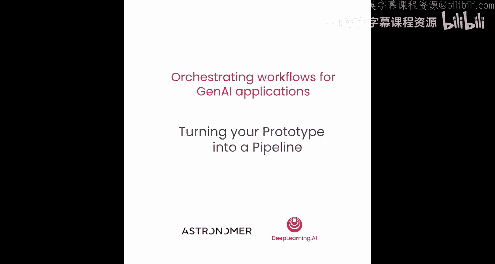
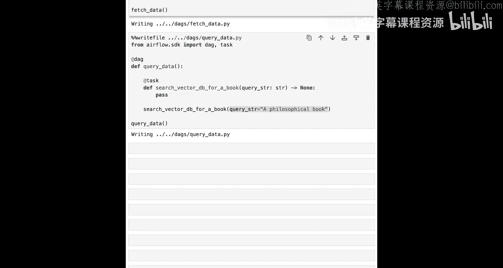
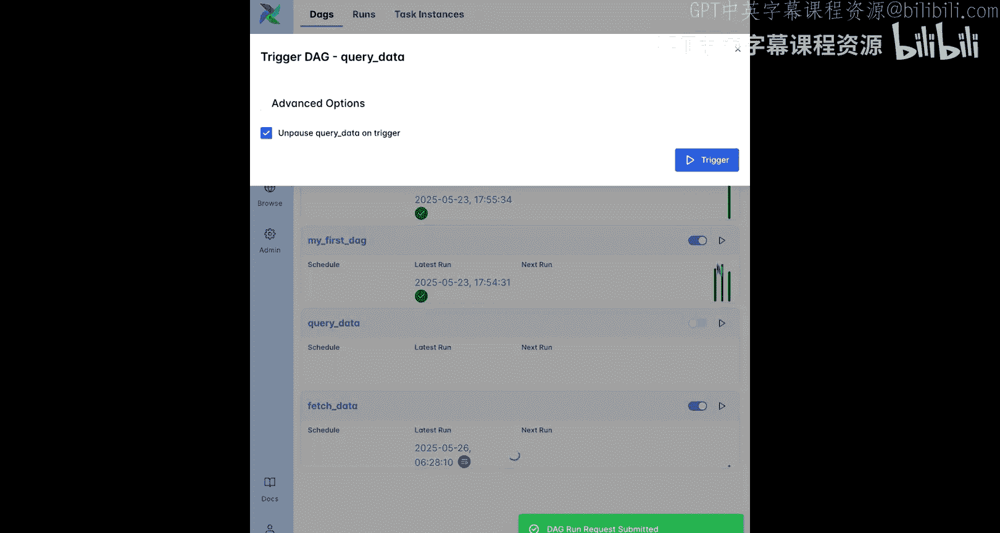
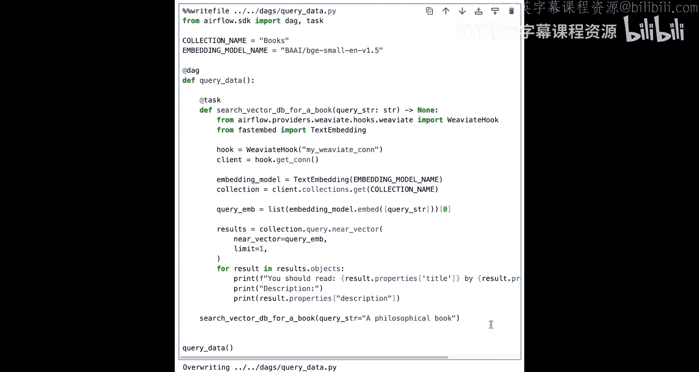

# 005：将原型转化为流水线 🚀

在本节课中，我们将学习如何将一个在Jupyter笔记本中开发的生成式AI原型，转化为一个可调度、可维护的Airflow流水线。我们将编写两个有向无环图，一个用于数据摄取、嵌入和加载，另一个用于查询向量数据库。

## 访问Airflow环境

与上节课类似，你可以运行第一个单元格来获取Airflow环境Web UI的链接，并使用用户名 `Airflow` 和密码 `Airflow` 登录。

使用相同的魔术命令 `%writefile`，你可以添加你的两个DAG。第一个DAG用于摄取、嵌入书籍描述并将其加载到Weaviate向量数据库，命名为 `fetch_data`。第二个DAG用于查询向量数据库，命名为 `query_data`。

## 定义DAG结构

与上节课一样，我们使用 `@dag` 装饰器创建DAG，并使用 `@task` 装饰器填充任务。

编写流水线的第一步是定义DAG结构。即，决定各个任务将执行什么操作、以什么顺序执行，并创建空任务。这里需要记住第一课的重要原则：**尽量使任务原子化**，以便在出现故障时能更容易地从失败点恢复。

原型中“摄取、嵌入和加载”的部分可以表达为五个任务：
1.  在向量数据库中创建集合（如果尚不存在）。
2.  列出流水线可用的书籍描述文件。
3.  将这些文件转换为字典列表。
4.  创建向量嵌入。
5.  将这些嵌入加载到向量数据库中。

大多数任务使用其前一个任务的输出作为输入。例如，创建向量嵌入的任务从上游的“转换书籍描述文件”任务获取转换后的书籍数据。唯一的例外是“如果不存在则创建集合”任务，它尚未嵌入依赖结构中。你可以使用 `chain` 函数来决定此任务在DAG中与其他任务的关系。一个合理的位置是在将嵌入加载到数据库之前，因为它负责准备向量数据库。

`query_data` DAG目前只有一个任务，名为 `search_vector_db_for_book`。在这个DAG的第一个版本中，你可以硬编码查询字符串参数的输入。

暂停视频并运行包含结构化DAG的两个单元格，将文件写入DAG文件夹。

## 检查并运行DAG

在Airflow UI中查看DAG并手动运行它们。请记住，在此环境中，新DAG可能需要长达30秒才会显示。

很好，你看到任务成功完成，但它们实际上还没有执行任何操作。接下来，我们将为每个任务填充代码。

## 填充任务代码

这些代码与第二课中的代码非常相似，大多数情况下，你可以将原型笔记本中的代码稍作修改后用于Airflow任务。下面我将指出每个任务所需的修改。

在多个任务中使用的变量可以在DAG的顶层声明以确保一致性。对于这个DAG，你将定义三个变量：集合名称、书籍描述文件夹和嵌入模型名称。请注意，默认情况下，每当Airflow解析DAG文件夹以查找更改时（默认每30秒），DAG文件顶层的代码都会被执行。这意味着你应该避免在DAG顶层运行耗时长的代码或建立外部系统连接。想象一下每30秒对你的数据库运行一次代价高昂的查询，我们应该避免这种情况。

对于“如果不存在则创建集合”任务，需要改变的是使用的向量数据库类型。笔记本使用嵌入式Weaviate数据库，这对于原型设计非常有用，但在生产环境中，你需要连接到本地或云端的托管数据库。你可以通过使用Airflow中的钩子来建立此连接。在Airflow中，钩子是能够连接到外部服务的类。例如，AWS、Google Cloud，以及像这里的Weaviate。它们作为Airflow提供者包的一部分可用。这里我们从已安装在Airflow环境中的Weaviate提供者包导入 `WeaviateHook`。连接是通过使用安全存储在Airflow内部、通过连接ID字符串引用的连接对象中的凭据创建的。在我们的示例中，连接ID是 `my_weaviate_conn`，我们已经为你将其创建为环境变量。有关如何设置Weaviate和Airflow的更多信息，请务必查看本课末尾的资源部分以及本课程末尾的可选视频。此任务的其余部分使用与笔记本中完全相同的代码来检查我们想要使用的集合是否已存在，如果不存在则创建它。

接下来的两个任务，“列出书籍描述文件”和“转换书籍描述文件”，也使用相关笔记本单元格中完全相同的代码。只需要进行两项修改：首先，你需要在任务函数的开头导入任务中使用的包；其次，你需要返回想要在下一个任务中使用的值。例如，“列出书籍描述文件”任务返回书籍描述列表，然后“转换书籍描述文件”任务将其用作输入。

创建向量嵌入也使用与笔记本单元格几乎相同的代码，只有一个小改动。默认情况下，只有一些数据类型可以在Airflow任务之间传递，例如可JSON序列化的数据或pandas数据框。因此，在传递给下一个任务之前，嵌入被转换为浮点数以确保JSON可序列化。在生产环境中，当在任务之间传递大量数据时，你会使用云存储解决方案，例如Amazon S3。这可以通过在任务代码中显式将文件写入云存储，或者通过更改Airflow配置以自动将任务之间传递的数据存储在第三方位置来实现。

`fetch_data` DAG的最后一个任务将嵌入加载到Weaviate。除了添加任务中使用的所有包的导入以及使用Weaviate钩子连接到Weaviate之外，代码与笔记本中的相同。运行单元格保存后，Airflow UI的代码选项卡会显示更新后的代码。现在触发DAG运行会导致 `include/data` 文件夹中文件内的所有书籍描述被摄取、嵌入并加载到与本地Airflow环境一起在Docker容器中运行的Weaviate实例中。

很好，现在你只需要完成 `query_data` DAG，以便能够使用Airflow DAG对这些数据运行近似向量搜索。这个DAG很简单，它只有一个任务，运行与笔记本中相应单元格相同的代码。唯一的改变是使用Weaviate钩子来建立与向量数据库的连接。通过手动运行DAG，你可以在任务日志中获得打印的书籍推荐。你可以随意将查询字符串更改为你正在寻找的书籍类型。

## 总结与展望

这很有趣，但在现实中，这样的流水线需要自动运行。想象一下你在一个在线书店工作，可用书籍列表会频繁变化，DAG需要定期运行以创建和添加新的书籍嵌入。**调度流水线是Airflow的核心功能之一**，也是我们下一课将要涵盖的内容。

在本节课中，我们一起学习了如何将Jupyter笔记本中的生成式AI原型转化为一个结构化的Airflow流水线。我们定义了DAG结构，填充了任务代码，并了解了在生产环境中需要考虑的修改，例如使用钩子连接外部服务和确保数据可序列化。最后，我们成功运行了流水线，实现了数据的自动化处理与查询。