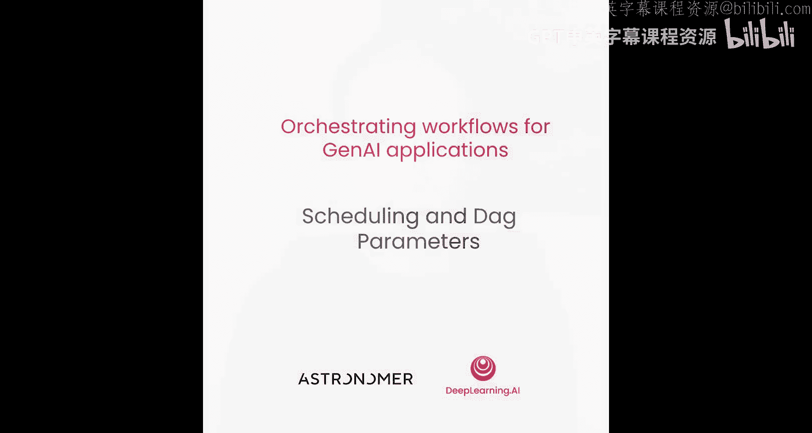
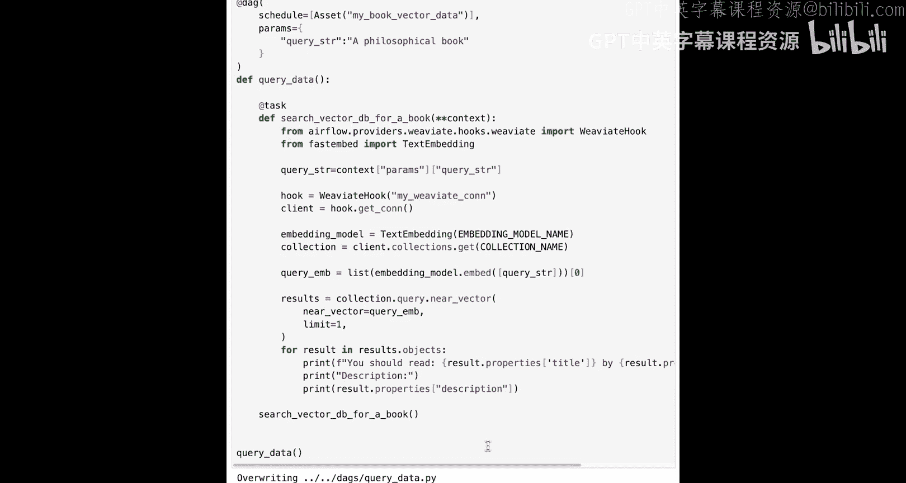
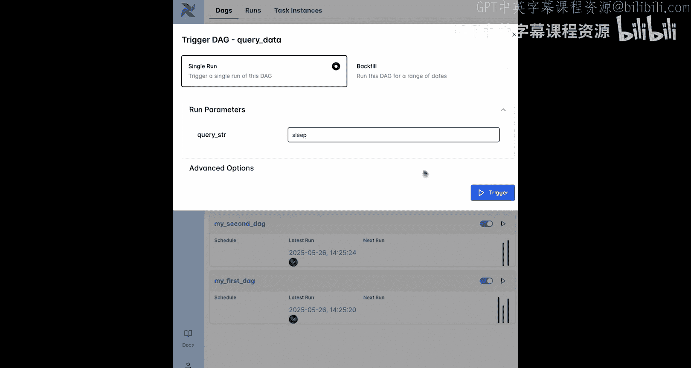
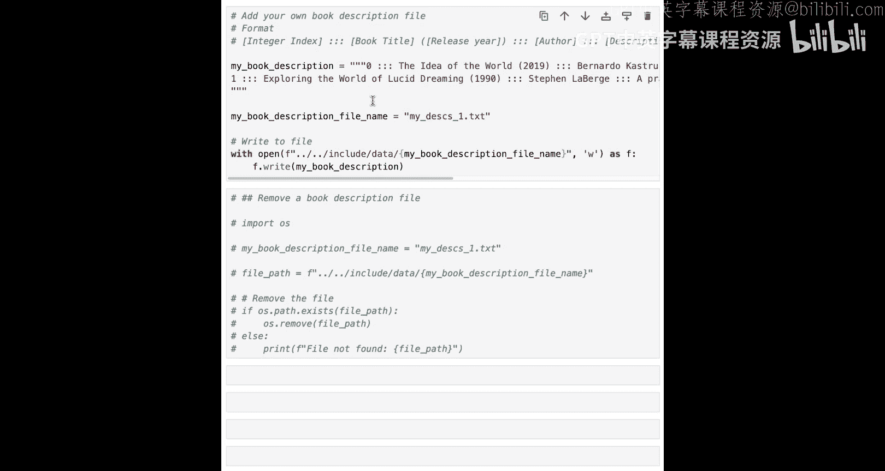

# 006：调度与 DAG 参数 🗓️

在本节课中，我们将学习如何调度之前编写的两个 DAG，使其能够自动运行。其中一个 DAG 将基于时间调度，每小时运行一次。另一个 DAG 将基于数据感知调度，一旦有新的嵌入数据被摄取到向量数据库，它就会立即运行。




## 概述

上一节我们编写了用于获取数据和查询数据的 DAG。本节中，我们将看看如何让这些 DAG 自动运行，而不是每次都手动触发。我们将介绍两种最常见的调度类型：基于时间的调度和基于数据感知的调度，并学习如何为 DAG 设置参数。

## 从手动到自动运行

在开发和执行临时工作流时，从 Airflow UI 手动运行 DAG 非常方便。但在大多数情况下，我们希望管道能够自动运行。例如，假设您在一家书店工作，新书会不断上架，您会希望管道能自动运行，为新添加的图书描述创建嵌入向量，以便顾客能够找到它们。

调度管道是 Airflow 的核心功能之一，它提供了多种不同的选项。

## 准备工作

在更新 DAG 之前，请确保上一课的 DAG（`fetch_data` 和 `query_data`）已经存在于您的 Airflow UI 中。由于实验环境会在 120 分钟后重置，您的 Airflow UI 可能不包含这些 DAG。

如果出现这种情况，请暂停视频，运行笔记本中第 5.2 节提供的代码单元。然后，您应该在 Airflow UI 中看到这两个 DAG。在进入调度部分之前，请确保手动触发它们一次。另外，对于本节课，您无需担心 `my_first_dag` 和 `my_second_dag`。

我们将介绍两种最常见的调度类型：基于时间的调度和基于数据感知的调度。您可以在本笔记本末尾的资源部分找到涵盖所有调度选项的指南链接。

## 基于时间的调度

在 Airflow 中，您可以通过向 `@dag` 装饰器添加 DAG 参数来调度每个 DAG。

让我们将获取图书数据的 DAG 调度为在每个小时的整点自动运行。为此，您需要向 `@dag` 装饰器添加 `schedule` 参数，并将其设置为每小时一次的 cron 字符串 `0 * * * *`，或者使用 Airflow 的简写形式 `@hourly`。

您还需要为 DAG 指定一个 `start_date`。在此日期之后，DAG 将根据其调度计划运行。请确保 DAG 的开始日期是过去的某个时间。

```python
from airflow.decorators import dag
from datetime import datetime

@dag(
    schedule="@hourly",  # 或 schedule="0 * * * *"
    start_date=datetime(2023, 1, 1),
    ...
)
def fetch_data_dag():
    # ... 任务定义
```

运行代码单元将更改保存到 DAG 文件夹后，您可以在 Airflow UI 的 DAG 列表和单个 DAG 页面上看到显示的调度信息。请注意，DAG 调度的更改属于结构性 DAG 变更，因此会创建一个新的 DAG 版本。

现在，只要 DAG 处于“未暂停”状态（即蓝色开关设置为“开”），它就会在每个小时的整点自动运行。基于时间的调度非常有用，但通常您并不确切知道 DAG 应该在何时运行，只是希望它在相关数据准备就绪时运行。

## 基于数据感知的调度

在我们的案例中，我们希望确保查询数据的 DAG 在嵌入向量加载到向量数据库后立即运行。这时，基于 Airflow 资产的数据感知调度就派上用场了。

Airflow 中的资产是一个对象，它代表管道中任何位置的真实或抽象数据对象。它可以代表云存储中的文件、关系数据库中的表，或者在我们的案例中，代表向量数据库中的一个集合。

作为 DAG 的作者，您可以通过将资产分配给任务的 `outlets` 参数来决定哪个任务更新哪个资产。任务实际上并不需要与底层数据对象交互，但在本例中，它确实进行了交互。当此任务成功完成时，将为该资产创建一个资产事件，表明资产已被更新。

下游的 DAG（在我们的案例中是 `query_data`）可以基于一个或多个资产接收到新资产事件来进行调度。您可以将资产想象成小旗子，任务在成功完成后会挥舞这些小旗子；而数据感知调度就像是告诉一个 DAG，等待正确的旗子组合被举起。

让我们为 `fetch_data` DAG 中的最后一个任务分配一个要更新的资产。您可以使用任务的 `outlets` 参数来添加资产。此参数在任何任务中都可用，包括传统的 Airflow 操作符。将 `outlets` 参数设置为该任务更新的资产列表。在我们的案例中，任务将嵌入向量加载到向量数据库。我们称此资产为 `my_book_vector_data`。

```python
@task(outlets=[Dataset("my_book_vector_data")])
def load_embeddings_to_vector_db(...):
    # ... 任务逻辑
```

在 Airflow UI 的 DAG 图中，您可以通过打开选项菜单并在“依赖关系”字段中选择“外部条件”来查看 DAG 连接到的资产。现在，`fetch_data` DAG 中的 `load_embeddings_to_vector_db` 任务会更新 `my_book_vector_data` 资产。

很好，现在让我们基于对此资产的更新来调度 `query_data` DAG。

在 `query_data` DAG 的 `@dag` 装饰器中，添加 `schedule` 参数并将其设置为该 DAG 应等待的资产。请确保使用与添加到 `fetch_data` DAG 中的资产完全相同的名称 `my_book_vector_data`。该名称用于标识资产，并将更新它的上游 DAG 与基于它调度的下游 DAG 连接起来。

```python
@dag(
    schedule=[Dataset("my_book_vector_data")],
    ...
)
def query_data_dag():
    # ... 任务定义
```

这种连接在 Airflow UI 中是可见的。如果您点击“资产”按钮，可以在资产列表中看到 `my_book_vector_data` 资产。点击它以打开资产图，该图显示了与此资产连接的所有 DAG。从这个视图，您可以暂停和取消暂停 DAG，并通过点击其名称直接导航到相关的 DAG。

您还可以使用屏幕右上角的蓝色按钮手动创建资产事件。可用的两个选项是：
*   **Materialize**：触发资产上游的 DAG 运行。如果 `load_embeddings_to_vector_db` 任务成功，则创建一个资产事件。
*   **Manual**：仅创建资产事件，导致下游 DAG 运行。

后一个选项在开发过程中测试资产调度时非常有用。

请注意，也可以使用 Airflow REST API 从 Airflow 外部创建资产事件。

很好！现在两个 DAG 通过数据感知依赖关系链接在一起。在编写复杂的 Airflow 管道时，通常会有许多 DAG 通过许多资产链接起来，以便在相关数据更新时，它们能像多米诺骨牌一样全部运行。

## 其他 DAG 参数

除了 `schedule` 之外，还有许多其他 DAG 参数可以用来修改 DAG 的行为。您可以在资源部分找到完整列表的链接。

另一个对 `query_data` DAG 有用的 DAG 参数是 `params` 参数。它允许您修改手动触发 DAG 时显示的表单，以请求特定的输入。让我们使用此参数，允许用户在 Airflow UI 中手动运行 DAG 时，为查询字符串参数输入不同的值。

在 `@dag` 装饰器中，您可以添加 `params` 作为参数，并将其设置为参数字典，其中包含每个输入的默认值。当手动运行 DAG 时，您的用户将能够覆盖此默认值。

```python
@dag(
    params={"query_string": "a book about AI"},
    ...
)
def query_data_dag():
    # ... 任务定义
```

参数字典中的值存储在 Airflow 上下文中。上下文是一个包含有关 Airflow DAG 运行信息的字典，可以在 Airflow 任务内部访问。

要访问上下文，请在 Airflow 任务的定义中放入 `**context`。在我们的案例中，这将替换 `query_string` 参数，但 Airflow 上下文也可以与任意数量的任务参数一起使用。

在任务函数内部，使用上下文变量上的 `params` 键，并用您的参数名（本例中为 `query_string`）对其进行索引。然后，查询字符串的值将被任务的其余部分用于执行神经向量搜索。请确保也从任务调用中移除 `query_string` 的硬编码值。

```python
@task
def query_vector_db(**context):
    query = context["params"]["query_string"]
    # ... 使用查询字符串执行搜索
```

保存更改后，Airflow UI 现在在手动运行 DAG 时会显示一个用于输入查询字符串的字段。



例如，输入“我想读一本关于睡眠的书”。检查 DAG 运行的日志，您可以看到任务现在推荐了一本关于清醒梦的不同书籍，非常完美。



如果您想为本课添加自己的包含图书描述的文件以供查询，请运行辅助代码单元。

## 总结

在本节课中，我们一起学习了如何为 DAG 设置自动调度。我们介绍了两种主要的调度方式：基于时间的调度（如每小时运行）和基于数据感知的调度（依赖资产事件）。我们还学习了如何使用 `params` 参数，让用户能在手动触发 DAG 时提供自定义输入。



现在，您的 DAG 已经完成了调度，并且查询数据 DAG 包含了一个方便用户从 Airflow UI 查询不同书籍的选项。这些 DAG 已基本准备好投入生产。下一课将重点介绍如何进一步并行化此管道，使其更高效且更易于排查问题。