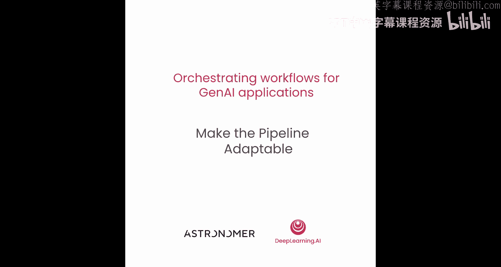
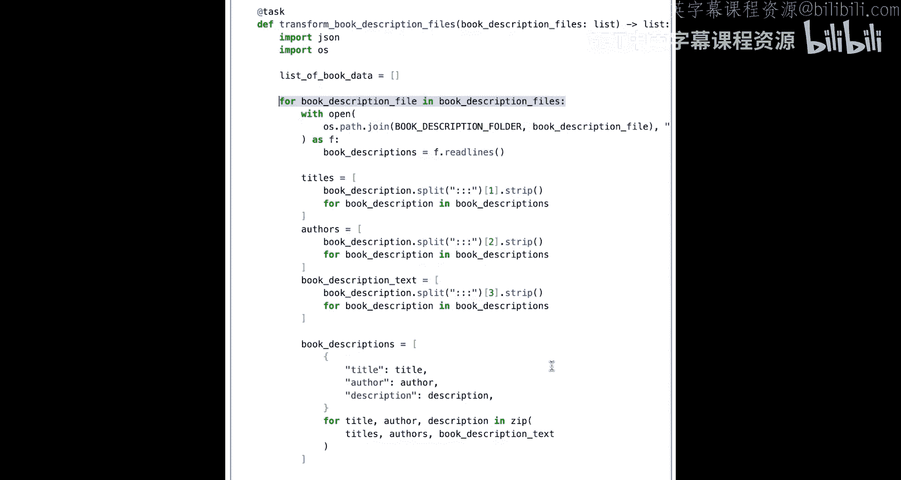
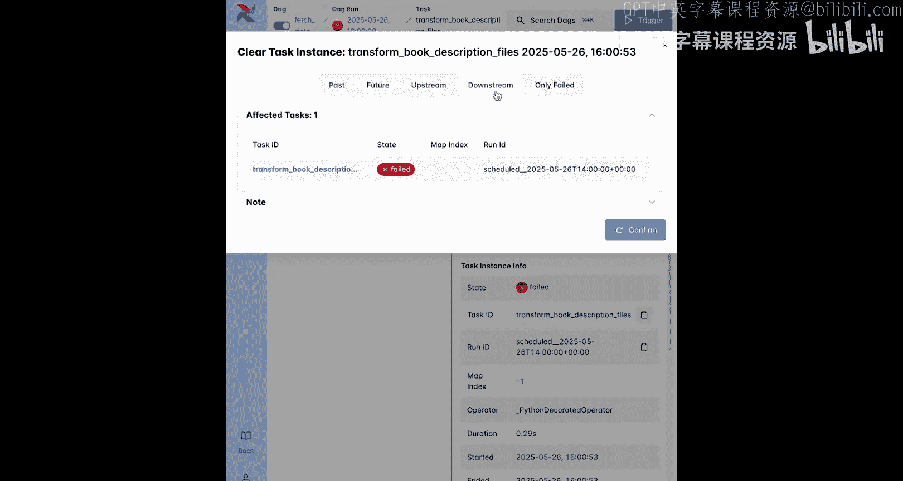
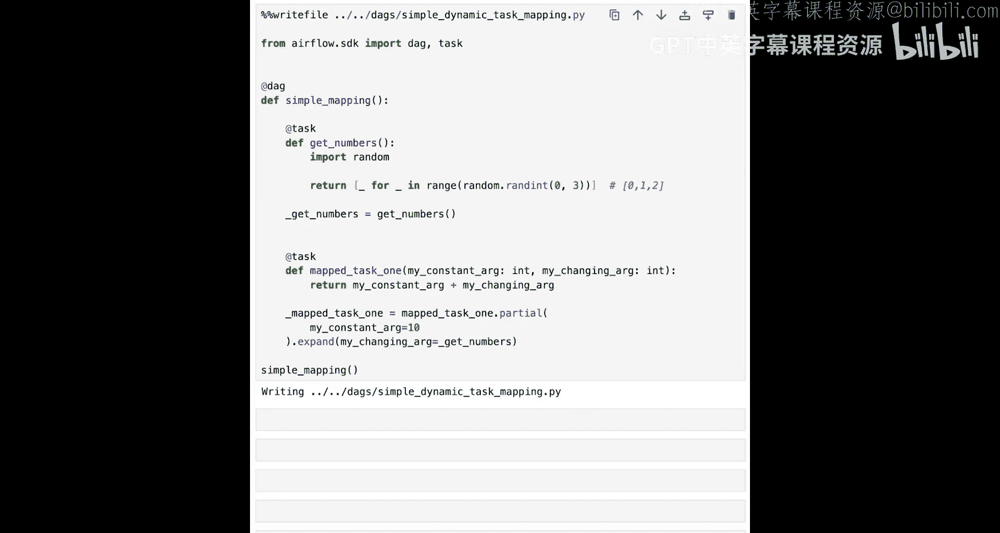
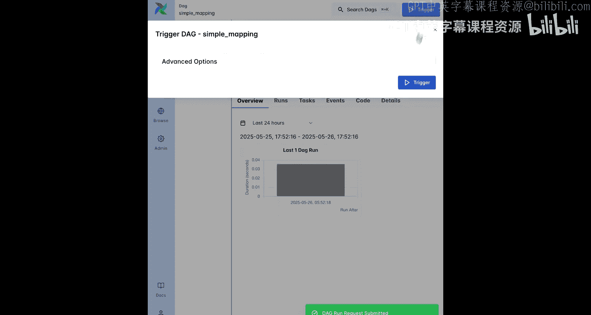
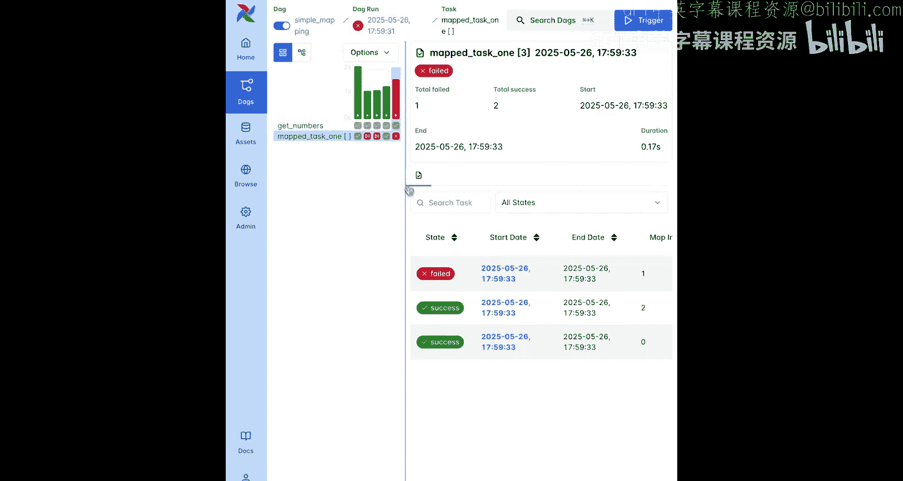
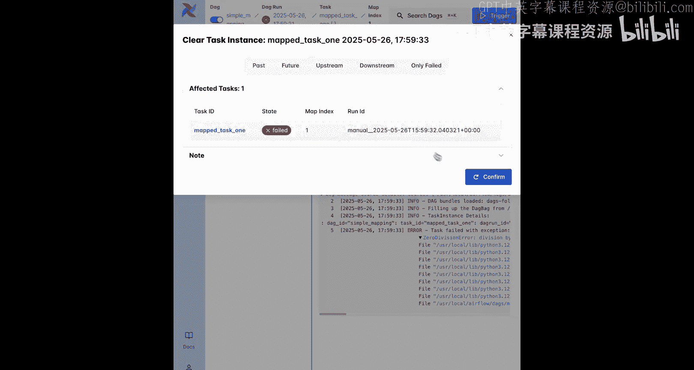
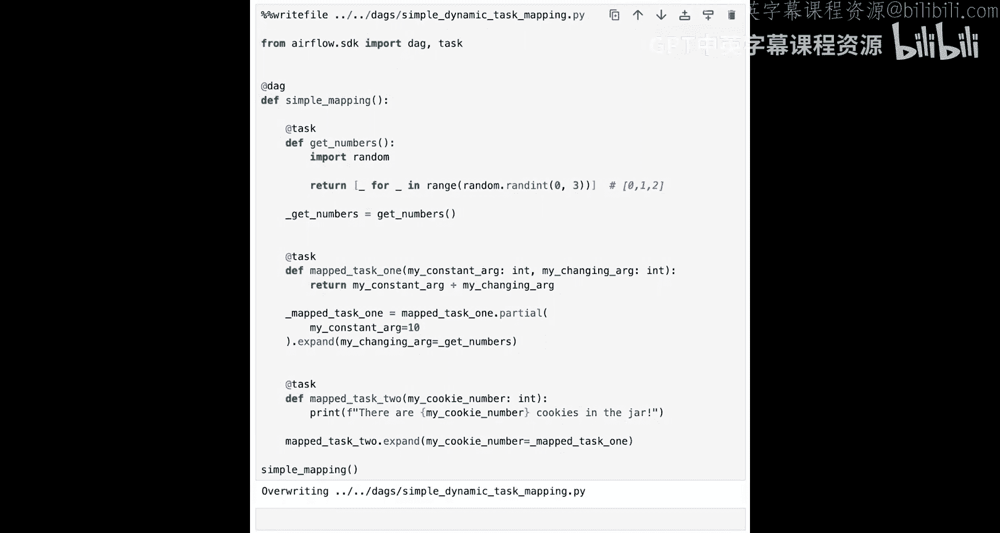
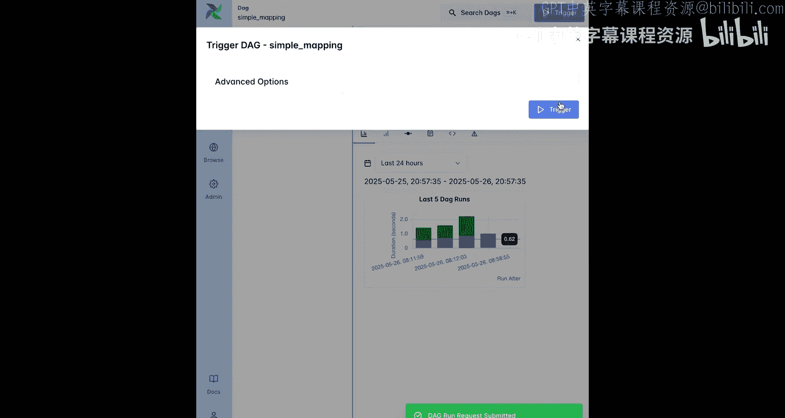
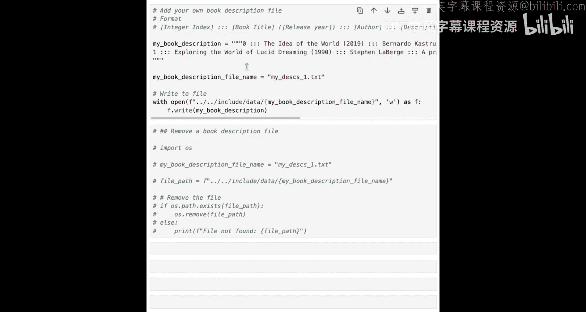

# 007：使工作流具备适应性 🛠️




在本节课中，我们将学习如何利用 Airflow 的高级特性——动态任务映射，使你的数据处理流水线能够在运行时根据数据量进行自适应调整。通过这项技术，你可以为每个书籍描述文件创建并行的任务实例，从而使流水线更易于调试、更加健壮。

## 为何需要动态任务映射？🤔

在运行 `fetch_data` 流水线时，你可能已经注意到它并非完全原子化。所有书籍描述文件都在同一个任务的 `for` 循环中被处理。这在原型设计和开发阶段运行良好。





但设想一个在线书店，每天需要处理成百上千个书籍描述文件。如果其中一个文件存在格式错误，整个 `for` 循环就会失败，导致整个任务失败。为了恢复，需要重新运行整个任务，即使那些没有问题的文件也需要被再次处理。

对于涉及与 AI 模型交互的任务（如嵌入或推理任务），这种重复处理会迅速增加成本。

幸运的是，Airflow 的动态任务映射功能可以解决这个问题。它允许你创建一个在运行时能根据数据量进行自适应的流水线。具体来说，你可以根据 DAG 运行时确定的输入，创建可变数量的任务副本。

## 构建一个简单的映射示例 🧪

动态任务映射最好通过实践来学习。在修改 `fetch_data` 流水线之前，我们先构建一个简单的 DAG 来熟悉这个功能。

以下代码定义了一个名为 `simple_mapping` 的新 DAG。第一个任务 `get_numbers` 使用随机包返回一个长度可变的列表。

```python
from airflow.decorators import dag, task
import random

@dag(schedule=None, start_date=pendulum.datetime(2023, 1, 1, tz="UTC"), catchup=False)
def simple_mapping():
    @task
    def get_numbers():
        # 模拟不同数量的待处理文件
        return random.choice([[], [1], [1, 2], [1, 2, 3]])

    @task
    def mapped_task_1(my_constant_arg, my_changing_arg):
        return my_constant_arg + my_changing_arg

    # 动态映射任务
    mapped_task_1.partial(my_constant_arg=10).expand(my_changing_arg=get_numbers())

simple_mapping_dag = simple_mapping()
```

*   **`get_numbers` 任务**：返回四种可能的列表之一：空列表（模拟没有新文件）、包含1个、2个或3个整数的列表（模拟有1、2或3个新文件）。
*   **`mapped_task_1` 任务**：这是一个将被动态映射的任务。它有两个参数：`my_constant_arg`（每个副本都相同）和 `my_changing_arg`（每个副本不同）。
*   **`.partial()` 方法**：用于指定所有任务副本中保持不变的参数。
*   **`.expand()` 方法**：用于指定在任务副本间变化的参数，它需要被设置为一个列表。在本例中，它被设置为 `get_numbers` 任务返回的列表。

这意味着，对于 `get_numbers` 返回列表中的每个元素，都会创建一个 `mapped_task_1` 的任务副本，每个副本处理列表中的一个元素作为 `my_changing_arg` 的输入。

运行此 DAG 后，你可以在 Airflow UI 的网格视图中看到效果。点击 `mapped_task_1` 任务方块，可以查看每次运行创建了多少个动态映射的任务实例。如果上游任务返回空列表，则该任务会被完全跳过（在网格视图中显示为粉色方块）。



## 链接动态映射的任务 ⛓️



在 Airflow 中，你经常需要并行化处理数据的多个步骤。在 `fetch_data` 流水线中，我们希望为文件转换和描述嵌入这两个步骤，每个书籍描述文件都创建一个并行任务。这可以通过将上游动态映射任务的输出传递给下游任务的 `.expand()` 方法来实现。

以下是如何在简单示例中链接第二个动态任务：

```python
    @task
    def mapped_task_2(my_cookie_number):
        return my_cookie_number * 2

    # 链接动态任务：mapped_task_2 映射 mapped_task_1 的输出
    mapped_task_2.expand(my_cookie_number=mapped_task_1.partial(my_constant_arg=10).expand(my_changing_arg=get_numbers()))
```

*   **`mapped_task_2` 任务**：这是第二个动态映射任务。
*   **链接**：在 `mapped_task_2.expand()` 中，我们将 `mapped_task_1` 的输出（即其所有副本的返回值列表）传递给 `my_cookie_number` 参数。
*   **结果**：`mapped_task_1` 和 `mapped_task_2` 将始终拥有相同数量的动态映射任务实例。





你可以在 Airflow UI 中多次运行 DAG 来确认这一点，检查不同 DAG 运行中的任务实例数量。

## 改造 `fetch_data` 流水线 🔧

现在，我们可以将动态任务映射应用到 `fetch_data` 流水线中。

决定动态映射任务数量的任务是 `list_book_description_files`，它返回一个包含所有书籍描述文件名的列表。

将被动态映射以并行处理每个文件（替代 `for` 循环）的任务是 `transform_book_description_files` 和 `create_vector_embeddings`。每个任务只需要进行少量修改。

**对于 `transform_book_description_files` 任务：**





1.  **输入变更**：输入从书籍描述文件列表变为单个文件名。
2.  **移除循环**：由于输入现在是单个文件，可以移除遍历文件列表的 `for` 循环。
3.  **调整返回值**：返回值从一个列表的列表，改为仅返回单个文件内所有书籍的描述列表。
4.  **应用动态映射**：在函数调用中使用 `.expand()` 方法，而不是直接调用任务。

**对于 `create_vector_embeddings` 任务：**

1.  **输入变更**：输入从书籍数据列表变为单个书籍数据。
2.  **移除循环**：移除 `for` 循环。
3.  **调整返回值**：相应调整返回值。
4.  **应用动态映射**：在函数调用中使用 `.expand()` 方法。

任务中的其他代码可以保持不变，下游的 `load_embeddings_to_vector_db` 任务也无需修改。

保存更改并运行 DAG 后，你可以在 Airflow UI 的网格视图中点击 `transform_book_description_files` 和 `create_vector_embeddings` 任务方块，查看创建的任务实例数量。这个数量对应于你的文件位置中当前可用的书籍描述文件数量。

你可以使用辅助单元添加更多书籍描述文件，来改变此 DAG 中动态映射任务实例的数量。

## 总结 📝

本节课中，我们一起学习了 Airflow 的动态任务映射功能。我们了解了为何需要它来构建健壮的流水线，并通过构建简单示例和改造现有流水线，掌握了如何创建和链接动态映射的任务。

动态任务映射的主要优势在于：
*   **易于调试**：如果一个动态映射任务失败，你可以直接检查其日志并在必要时重新运行它，而无需重新运行同一任务的其他实例。
*   **提高效率**：特别是当有大量任务副本时，可以避免因单个文件错误而重复处理所有文件。



现在，你已经对如何使用动态任务映射来并行化 Airflow 任务有了扎实的理解。让这个流水线为生产环境做好准备的最后一步，是为任务失败事件做准备。在下一课中，你将学习如何配置任务以在失败时自动重试并向你发送警报。