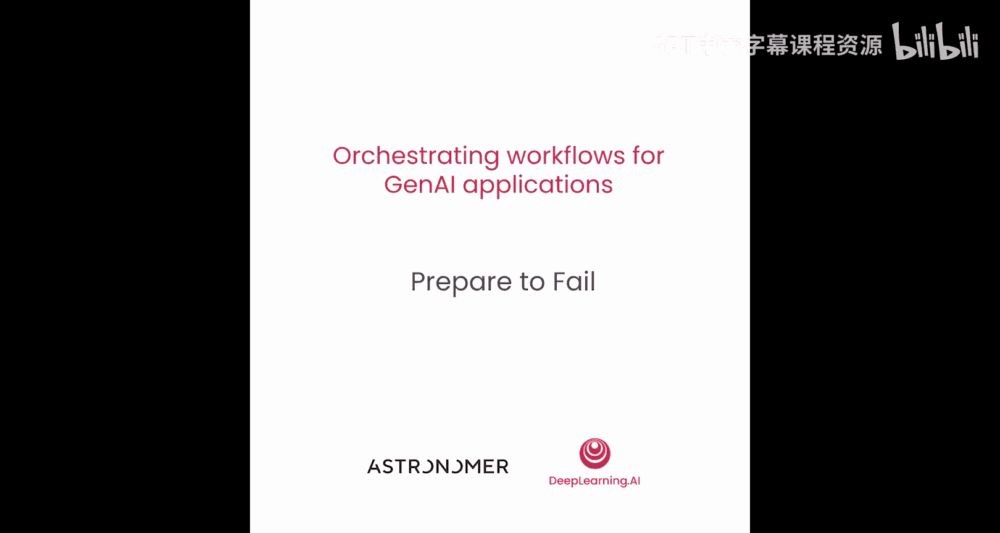
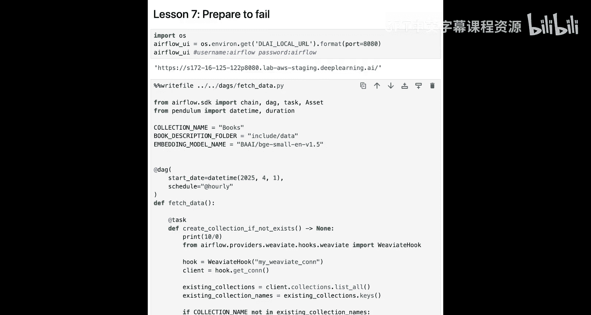
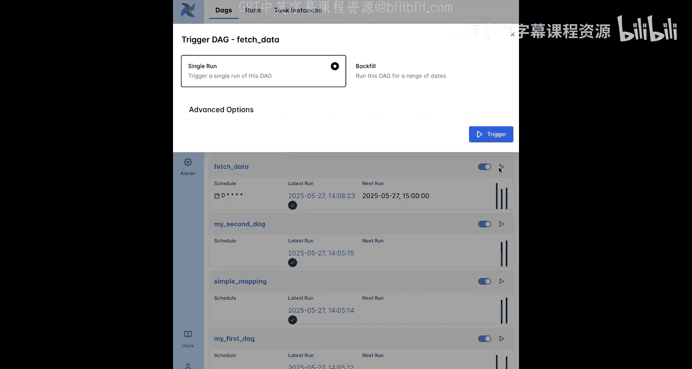
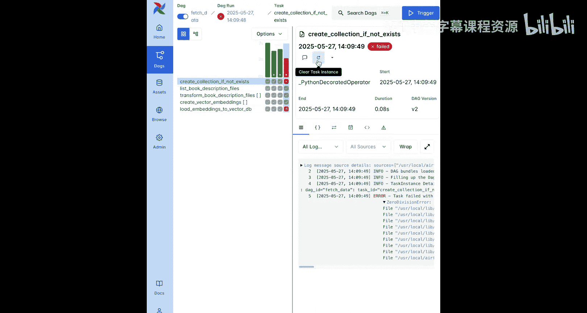
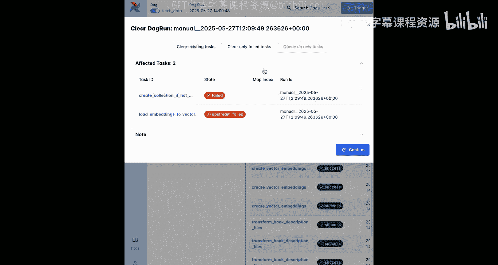
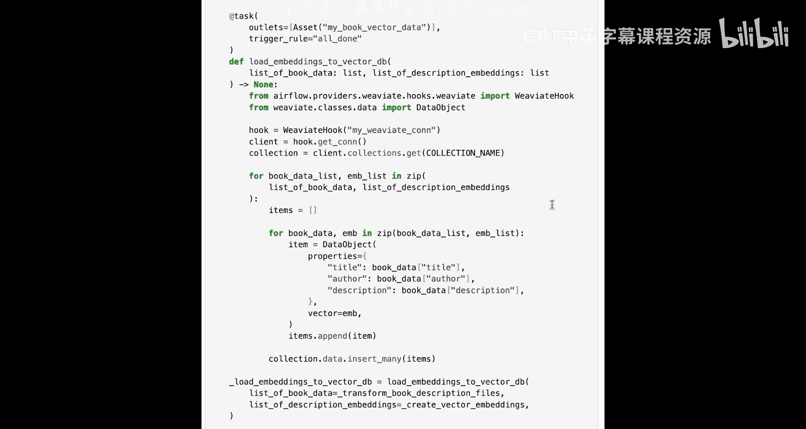
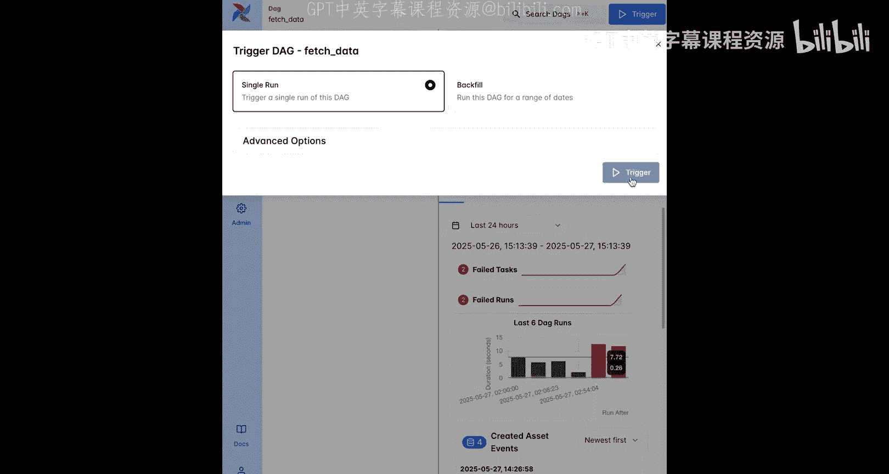
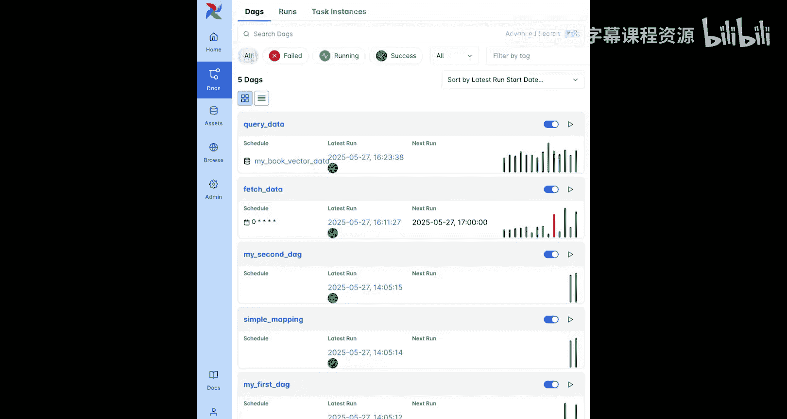
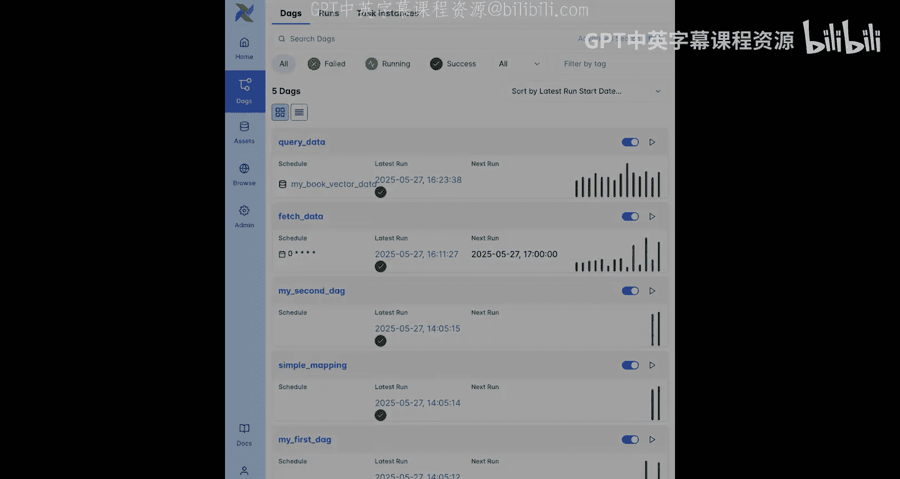

# 008：准备应对失败 🛡️




在本节课中，我们将学习如何使你的数据处理流水线（Pipeline）更加健壮。你将了解如何添加自动重试机制来应对临时性故障，并学习在任务或整个工作流失败时如何添加通知。

## 概述

上一节我们介绍了如何构建基础的工作流。本节中，我们来看看如何增强其容错能力。我们将通过模拟任务失败、设置自动重试、调整任务触发规则以及配置失败回调通知，来构建一个能够优雅处理错误的、生产就绪的流水线。



## 模拟任务失败



首先，我们通过制造一个错误来观察工作流的失败行为。在 `create_collection_if_not_exists` 任务中，添加一行会导致Python零除错误的代码。

```python
print(10 / 0)
```

在Airflow中，任务内的任何错误或异常都会导致该任务失败，并且错误行之后的代码将不会被执行。这与Python脚本或Jupyter Notebook的行为一致。



保存修改后的DAG文件后，你可以在Airflow UI中手动触发一次DAG运行。`create_collection_if_not_exists` 任务的失败将导致整个DAG运行失败。

## 查看与理解失败状态

在Airflow UI的DAG概览页面，你可以看到最近失败任务的错误日志摘要，并有一个快速链接可以查看完整日志。



无论是在网格视图还是图形视图中，你都能看到失败任务如何导致其下游任务 `load_embeddings_to_vector_db` 进入 `upstream_failed` 状态。这意味着该下游任务没有运行，因为它的上游任务并未全部成功完成。

## 从失败中恢复

要从此类失败中恢复，首先需要修复代码错误。移除导致错误的 `print` 语句并保存DAG文件。

然后，回到Airflow UI。你可以使用“清除任务实例”按钮来重新运行失败的任务。如果侧边栏已折叠，该按钮显示为一个向前弯曲的箭头。

点击此按钮后，你会看到几个选项。一个常见的选择是 `downstream`。这意味着你不仅会重新尝试失败的任务，还会尝试其所有下游任务。

对于复杂工作流中的多个失败任务，通常更快的方法是清除整个DAG运行。在网格视图中点击失败的DAG运行的红色条，然后选择“清除运行”或向前弯曲的箭头图标。默认情况下，打开的菜单会重新尝试DAG中的所有任务，但你也可以将其设置为仅清除失败或上游失败状态的任务。

## 实现自动重试

手动恢复适用于已知错误，但如果故障是暂时的（例如API在周六晚上宕机几分钟），我们更希望Airflow能自动重试，而不是等到周一再手动处理。

这时就需要用到自动任务重试功能。`retries` 是一个任务参数，它决定了每个任务在最终失败前有多少次重试机会。你可以使用 `retry_delay` 参数来设置重试之间的等待时间。

在实践中，这是Airflow最强大也最容易实现的功能之一。一个常见策略是为DAG中的所有任务设置默认的重试次数。

你可以使用 `default_args` 参数来为DAG中的所有任务定义默认参数。将其设置为一个包含 `retries=1` 和 `retry_delay=timedelta(seconds=10)` 的字典，将为该DAG中的每个任务提供一次失败后的重试机会，并在10秒后进行第二次尝试。

保存更改后，重新添加 `print(10 / 0)` 这行代码来模拟失败。在Airflow UI中手动运行DAG，你会看到 `create_collection_if_not_exists` 任务不会像之前那样立即失败。相反，其状态会变为 `up_for_retry`（显示为带向前箭头的黄色方块）。10秒后，任务会再次尝试。在这个例子中，它仍然会遇到相同的错误并最终失败。但如果问题是暂时的（如API不可用或达到速率限制），第二次运行就可能会成功。

## 覆盖默认重试设置

如果某个任务需要比其他任务更多或更少的重试次数，该怎么办？这很简单。你可以通过在单个 `@task` 装饰器中提供相同的参数，来覆盖在 `default_args` 字典中定义的所有默认值。

例如，添加 `retries=5` 和 `retry_delay=timedelta(seconds=2)` 会给这个任务在初次失败后5次额外的重试机会，总共6次尝试，每次间隔2秒。

## 调整任务触发规则



另一个常见情况是，某些任务经常失败，但你仍然希望其下游任务能够运行。在本例中，如果集合已经存在于向量数据库中，那么即使 `create_collection_if_not_exists` 任务失败，向其加载数据仍然可以工作。



默认情况下，Airflow任务要求其所有上游任务都成功才能运行。这被称为触发规则，默认的规则叫做 `all_success`。

Airflow提供了许多其他触发规则。一个实用的规则是 `all_done`，它使得任务在其所有上游任务完成后就运行，无论这些上游任务的最终状态是成功、失败、上游失败还是被跳过。

如果将 `load_embeddings_to_vector_db` 任务的触发规则设置为 `all_done`，那么只要其所有上游任务完成，它就会运行，即使 `create_collection_if_not_exists` 任务失败了。

保存DAG并在Airflow UI中创建新的运行后，你可以看到 `load_embeddings_to_vector_db` 任务会等待其所有上游任务完成，然后运行，尽管 `create_collection_if_not_exists` 任务失败了。DAG运行本身也会被标记为成功，尽管它包含一个失败的任务。DAG运行的最终状态仅由其叶子任务（没有下游任务的任务）决定。如果所有叶子任务都处于成功或跳过状态，那么DAG运行就算作成功。

## 配置失败通知回调

现在，你已经能完全控制任务失败时的处理方式了。但还缺少最后一块拼图：对于某些关键任务和DAG，你希望在它们失败时得到警报，例如通过电子邮件或Slack消息。

你可以使用回调函数为你的DAG添加警报。回调函数存在于DAG和任务级别，适用于不同情况。最常用的是 `on_failure_callback`。

让我们为DAG中的所有任务添加一个失败回调。还记得为DAG中所有任务定义任务参数的最快方法吗？没错，就是将其添加到 `default_args` 字典中。

`on_failure_callback` 参数可以设置为任何函数。一旦任何任务失败，这段代码就会运行。在本例中，我们只是在任务日志中打印一条消息。在实际场景中，你可以编写代码调用你选择的消息工具，或者使用预构建的通知器类。

回到Airflow UI并创建另一个手动DAG运行，你可以看到任务失败后，回调函数被执行，并向任务日志打印了一行信息。如果你希望回调函数只在整个DAG运行失败时才运行，可以将其提供给DAG本身的 `on_failure_callback` 参数。

## 使用回填处理历史数据

假设你度了两周假回来，发现DAG运行历史中有几次失败，或者有些DAG可能完全错过了运行。又或者，你对DAG进行了更改（例如为机器学习模型的训练集添加了另一个特征），并希望重新运行过去的DAG运行，以查看改进后的模型在历史数据上的表现。

在Airflow中，你可以为任何基于时间调度的DAG回填过去任何日期的运行。在Airflow UI中点击“触发”按钮，选择“回填”，然后定义你的日期范围以及回填行为：是仅填充缺失的运行，还是填充缺失运行并重新运行现有的DAG运行，亦或是重新运行该时间段内的所有运行。

点击“运行回填”后，只要回填在进行中，Airflow UI就会显示一个横幅，你可以在上面暂停或停止回填。

## 总结





本节课中，我们一起学习了如何使你的生成式AI应用工作流具备生产级的鲁棒性。我们探讨了如何模拟和处理任务失败、设置自动重试机制、通过调整触发规则来控制任务依赖关系、配置失败回调以便及时获得通知，以及如何使用回填功能处理历史数据或重新运行更新后的流水线。现在，你已经掌握了将原型Notebook转化为健壮、可监控的Airflow流水线所需的所有基础知识。在下一课中，我们将了解现实世界中的生成式AI工作流，包括真实的示例流水线。