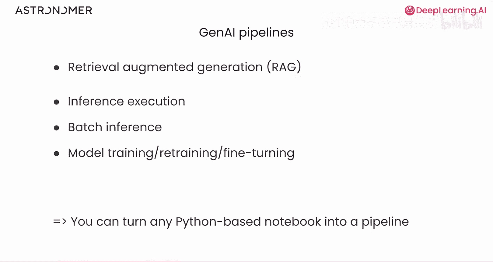
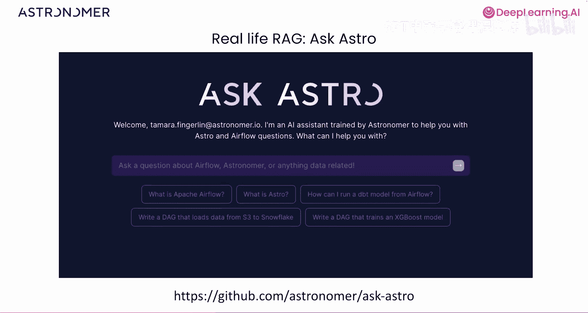
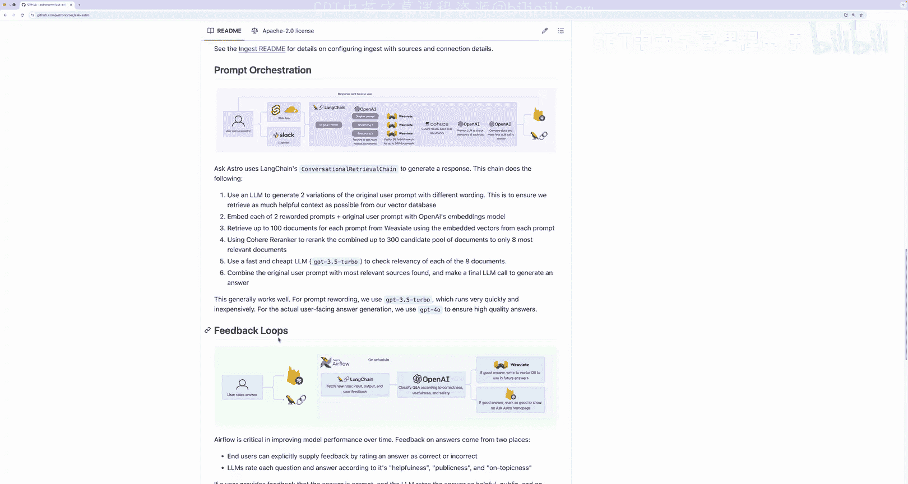
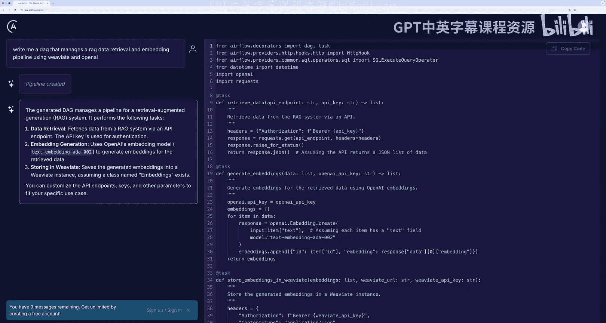
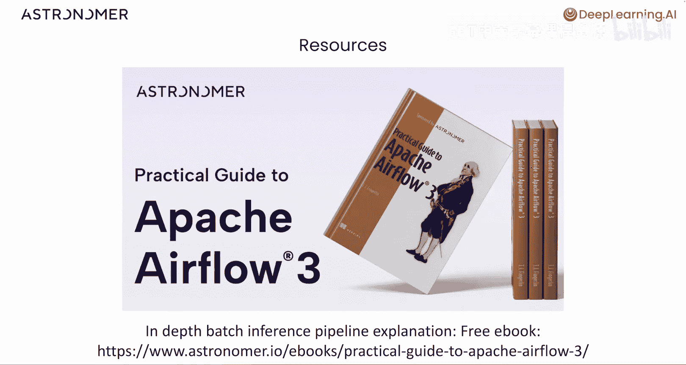

# 009：现实中的生成式AI流水线 🚀

在本节课中，我们将探讨在完成基于Airflow的RAG应用构建后，如何将其投入生产环境，并了解其他类型的生成式AI流水线编排。我们将分析Astronomer公司的真实案例，并讨论规模化部署时的关键考量。

## 从学习到生产 🏭

上一节我们介绍了如何使用Airflow编排RAG应用。本节中，我们来看看将此类流水线投入实际生产时需要考虑的事项。

Airflow作为编排器，适用于多种场景，包括不同类型的生成式AI流水线。本课程重点教授了检索增强生成流水线的编排，但Airflow同样能编排其他类型。

*   **推理执行流水线**：这类流水线编排在输入数据上运行已训练机器学习模型并收集结果的过程，通常使用Airflow实现。这可能是**批量推理流水线**或其他推理类型。
*   **模型管理流水线**：Airflow可用于管理自动化的模型训练、重新训练和微调。请记住，任何基于Python的笔记本都可以转化为Airflow的DAG或流水线。

## 真实案例：Ask Astro 🤖

为了将理论付诸实践，Astronomer公司使用Airflow构建了自己的真实世界RAG应用。

Ask Astro是安德森·霍洛维茨基金会的LLM应用架构的一个开源参考实现。它是一个问答型LLM应用，用于回答关于Airflow和Astronomer的问题。

以下是这个开源RAG应用的关键组成部分：

*   **数据源**：数据从GitHub issues、Airflow和Astro文档以及Airflow Slack等来源获取。
*   **数据处理**：使用LangChain处理数据，并用OpenAI进行嵌入。
*   **数据存储**：结果存储在Weaviate向量数据库中。
*   **流水线编排**：整个流程由Airflow编排。

Airflow还被用于随时间推移改进模型性能。用户可以对应用给出的答案进行评分，这些评分数据会按计划由LangChain和OpenAI处理，用于更新Weaviate中的数据，从而重复好的答案，避免差的答案。

## Ask Astro的应用价值 💡

这个RAG应用对Airflow开发者极为有用。Ask Astro可以帮助你为任何想要实现的用例编写和更新DAG。

例如，我们可以输入一个查询：“*为我编写一个使用Weaviate和OpenAI管理RAG数据检索和嵌入流水线的DAG。*”

Ask Astro会自动为我们编写DAG。我们可以获取这段代码，在Airflow中运行，并根据需要进行修改。这是本课程所学知识的真实世界示例实现，希望它能成为你进一步学习Airflow和生成式AI编排的工具。

## 生产环境考量 ⚙️

当你将类似驱动Ask Astro的RAG流水线投入规模化生产时，在编写完流水线后，还需要考虑其他几个方面。

*   **多数据源摄入**：你可能需要从比本课程中更多的来源摄取数据。这可以通过Airflow轻松管理，例如创建更多并行运行的DAG，或在某些情况下使用之前学过的**动态任务映射**。
*   **数据预处理**：你可能需要对源数据进行额外的转换，例如文本分块、选择或文档预筛选。请记住，只要你能用Python函数实现，就可以将其转化为Airflow任务。
*   **数据质量检查**：在Airflow中实现数据质量检查也很容易，这对于保持应用数据最新至关重要。
*   **模型与反馈循环**：你可能会使用Airflow进行模型的微调、部署以及实现用户反馈流水线。反馈有助于提升RAG应用的性能，并且可以使用Airflow自动化，就像我们在Ask Astro示例中展示的那样。

## 其他生成式AI流水线类型 🔄

我们还想简要介绍其他可以用Airflow编排的生成式AI流水线类型。

虽然本课程没有展示推理执行或批量推理DAG，但它们通常使用Airflow实现。一个用例示例是自动化个性化新闻简报服务。

在此场景中，可以设计两个Airflow流水线：
1.  一个传统的ETL流水线，用于获取新闻简报所需数据、格式化并创建模板。
2.  一个底部的批量推理流水线，它接收用户输入，通过将用户数据发送给LLM提示词，为每位读者个性化新闻简报内容，并将结果加载到新闻简报模板中。

这个DAG可以作为**批量推理DAG**运行，例如每日处理所有新用户信息。但它也可以使用**在线推理执行**运行，即当用户在网页表单中输入信息并希望立即获取新闻简报时，流水线会向消息队列发送消息，通过事件驱动调度触发Airflow中的DAG。

这个示例本身值得一门完整的课程，我们仅在高层次上提及。但现在，你可以将其作为使用Airflow实现其他生成式AI编排的灵感来源。

## 规模化与高级调度 🚀

就像本课程中的RAG应用一样，在生产中实现批量或推理执行流水线也需要考虑其他因素。

*   **处理更高规模**：你可能将Airflow用于规模显著更大的场景，例如为电商网站上的所有新产品生成产品描述。在这种情况下，你的Airflow DAG可能看起来与这里看到的非常相似，但你需要关注扩展Airflow基础设施，可能使用托管服务。
*   **利用高级调度**：除了每日运行DAG，你可能希望它们在数据可用时立即运行，以便为你的生成式AI应用提供后端支持。一个例子是用户根据在线杂货店的购买记录请求个性化食谱。**事件驱动调度**让Airflow在用户输入请求后立即启动该流水线。

## 扩展工具：Airflow AI SDK 🛠️

Airflow之外还有其他软件包可以帮助你实现生成式AI流水线。

例如，由Astronomer开发的**Airflow AI SDK**是一个基于Pydantic AI的开源包，用于从Airflow中与LLM协作。

你可以使用 `@task.llm` 装饰器轻松地从Airflow任务中调用LLM，或者交互并编排AI智能体调用。该代码库包含详细的示例帮助你入门。

## 总结与后续学习 📚

本节课中，我们一起探讨了将RAG流水线投入生产的考量，分析了Ask Astro真实案例，并了解了其他类型的生成式AI流水线编排。Airflow在生产环境中的规模化应用涉及多数据源管理、高级调度和基础设施扩展。

最后，本课程仅仅触及了使用Airflow编排生成式AI流水线所能实现功能的表面。一个很好的进一步阅读资源是由Astronomer编写的《Manning实用Apache Airflow 3指南》。这本免费电子书详细介绍了你需要了解的Airflow 3所有功能，包括深入的批量推理流水线解释。它是你学习旅程中极佳的下一步。