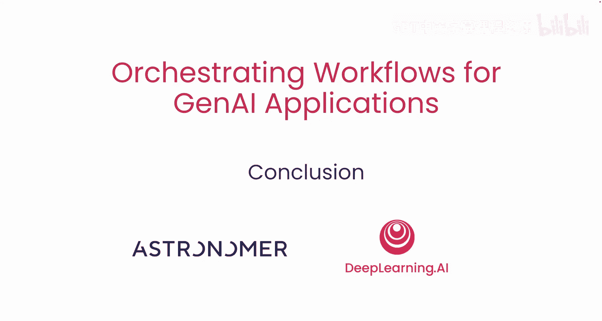

# 010：总结

在本节课中，我们将对如何将生成式AI应用从原型转化为自动化工作流进行总结。

## 课程总结 🎓

恭喜你，现在你已经掌握了如何使用Eflow将笔记本中的原型转化为自动化流水线。

你可以将本课程中学到的所有最佳实践应用于任何生成式AI工作流。

## 后续学习建议 📚

上一节我们总结了核心知识，本节中我们来看看如何继续实践。

如果你想在本地设置FFflow以练习编写更多生成式AI应用，请务必查看本课程末尾的附加资源和可选视频。

我迫不及待想看到你将用FFL构建出什么成果。

## 最终总结

本节课中我们一起学习了如何利用Eflow工具将生成式AI应用从笔记本原型阶段，系统化地升级为可维护、可扩展的自动化工作流。我们回顾了核心概念，并为你指明了继续深入学习和实践的路径。