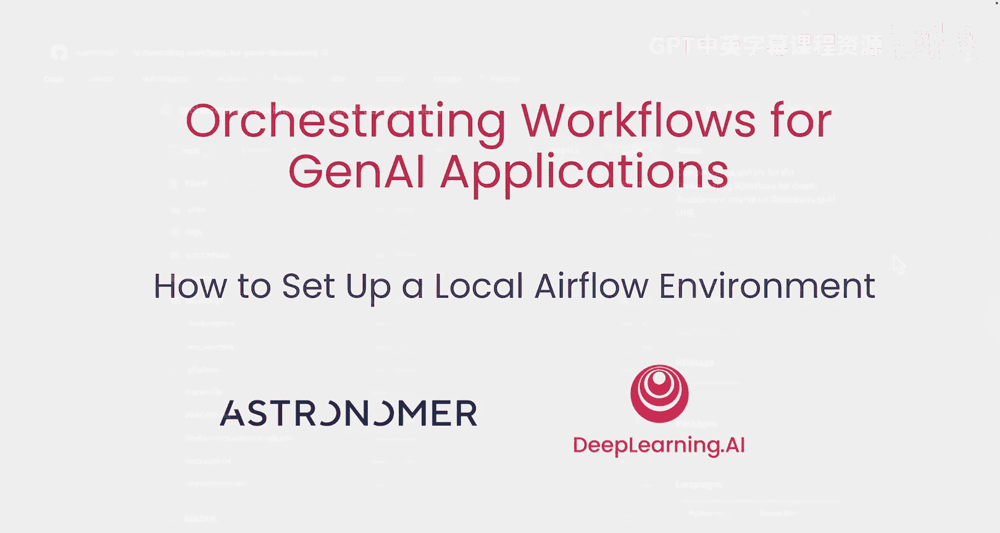
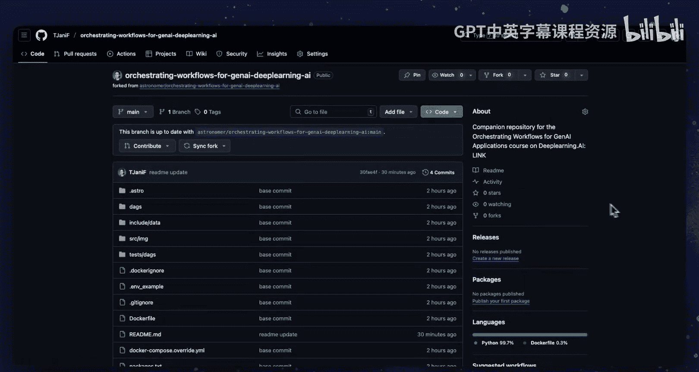
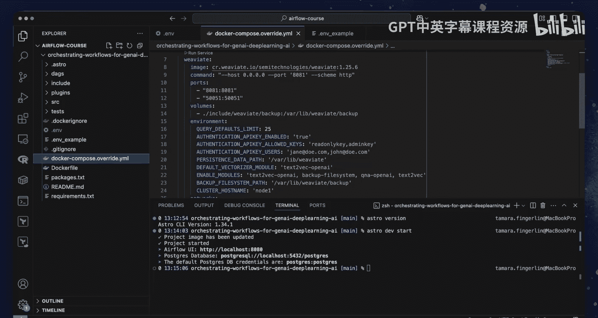
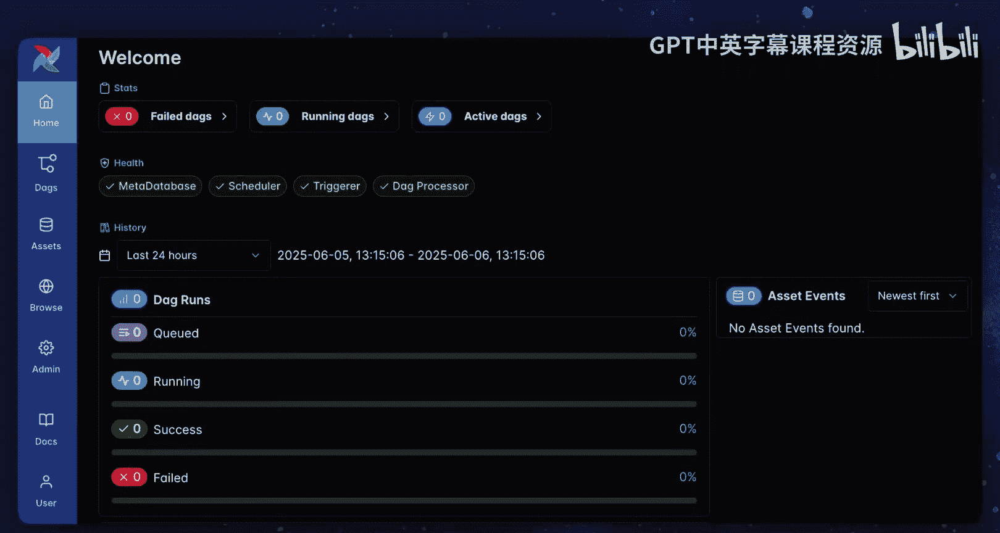
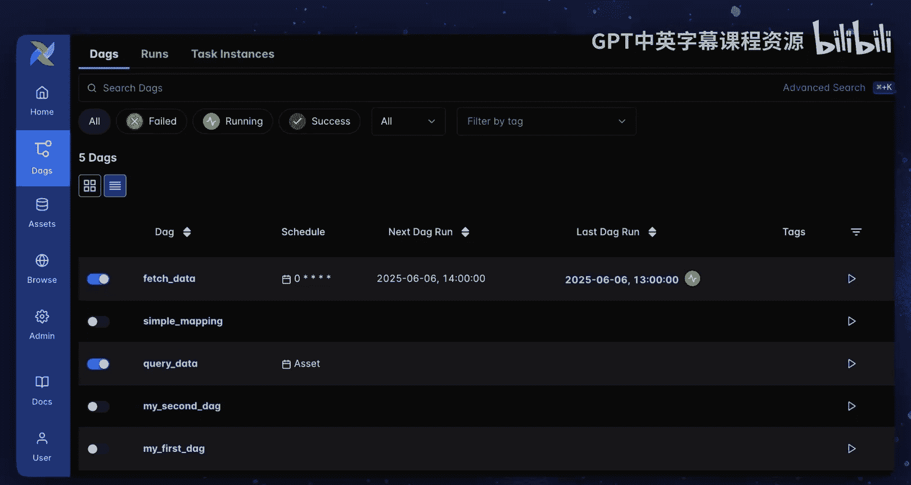
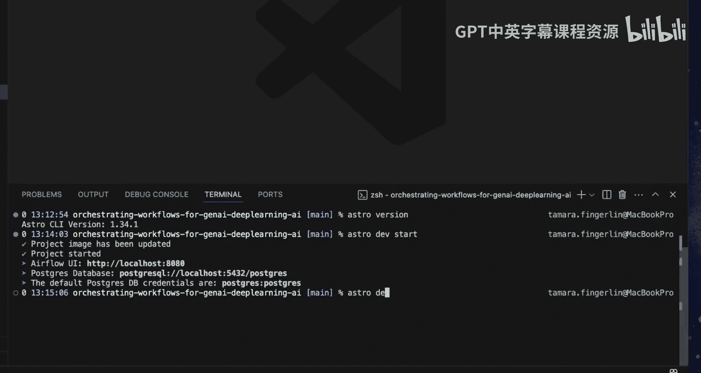

# 011：如何设置本地Airflow环境 🛠️

在本节中，我们将学习如何在本地计算机上设置Airflow和Weaviate环境，以便运行本课程中构建的DAG（有向无环图）工作流。



## 概述

本教程将指导您完成在本地机器上配置Airflow和Weaviate的步骤，使您能够运行本课程中开发的工作流。我们将从获取代码库开始，逐步完成环境设置，最终在本地运行Airflow实例。

## 获取项目代码



首先，您需要获取本课程的项目代码。

1.  访问Astronomer组织下的GitHub仓库，其名称为 **orchestrating-workflows-for-genai-deeplearning-ai**。
2.  将此仓库**Fork**到您自己的GitHub账户中。
3.  将Fork后的仓库**克隆**到您的本地计算机。
4.  使用终端或命令行工具，**进入**克隆下来的项目目录。

您可以使用任何喜欢的代码编辑器（例如VS Code）来编辑DAG文件和运行命令。

## 安装Astro CLI

要在本地运行此项目，您唯一需要在机器上安装的软件包是 **Astro CLI**。这是一个由Astronomer开发的免费工具，用于在容器中本地运行Airflow。

*   **在Mac上安装**：使用Homebrew包管理器，运行命令 `brew install astro`。
*   **在其他操作系统上安装**：请查阅Astro CLI官方文档以获取相应的安装说明。

如果您已经安装了Astro CLI（例如像我一样），请通过运行以下命令确保您的版本至少为 **1.34.1**：
```bash
astro version
```

## 配置环境变量

安装好Astro CLI后，您需要对代码库进行一项小修改。

1.  在项目的**根目录**下，创建一个名为 **`.env`** 的新文件。
2.  将 **`.env.example`** 文件中的内容**复制**到新建的 `.env` 文件中。

这个环境变量文件定义了Airflow实例与本地Weaviate环境之间的连接。如果您希望连接到不同的Weaviate环境（例如Weaviate Cloud），可以修改此文件中的相应变量。

> **注意**：您可以在 `.env` 文件中加入您自己的OpenAI API密钥，但这对于运行本课程的管道并非必需。

## 启动本地环境

保存好 `.env` 文件的更改后，在项目的根目录下运行以下命令：
```bash
astro dev start
```

此命令将启动运行本课程所涉及的Airflow核心组件的四个容器：
*   **调度器** (Scheduler)
*   **API服务器** (API Server)
*   **执行器** (Executor)
*   **Airflow元数据库** (Metadata Database)

此外，`astro dev start` 命令还会初始化一个**触发器**组件（本课程未涵盖），并基于 `docker-compose.override.yml` 文件中的定义，创建一个用于本地**Weaviate实例**的容器。

> **提示**：您无需在机器上预先安装Docker来运行此命令。如果您的系统没有Docker，Astro CLI会自动为您设置Podman来运行容器。

## 访问Airflow界面

当所有容器准备就绪后，Airflow的Web用户界面将在 **`http://localhost:8080`** 自动打开。您无需任何凭据即可登录。





现在，您可以在自己的计算机上运行与本课程中构建的相同的DAG，并开始构建您自己的生成式AI流水线。

## 部署到云端

当您准备好部署流水线时，可以将其推送到任何类型的Airflow部署环境。如果您拥有Astro账户（提供免费试用），只需使用以下命令即可将您的流水线部署到云端：
```bash
astro deploy
```

## 总结





本节课中，我们一起学习了如何在本地设置完整的Airflow和Weaviate开发环境。我们完成了从获取代码、安装必要的CLI工具、配置环境变量，到最终启动本地服务并访问Web界面的全过程。现在，您已具备在本地运行和测试生成式AI工作流的能力，并为将来将其部署到生产环境做好了准备。