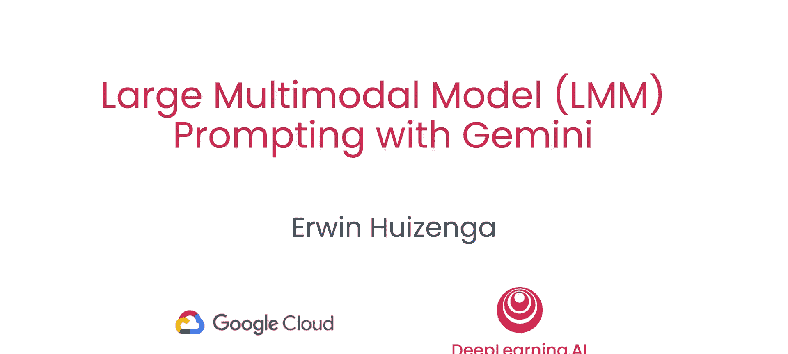
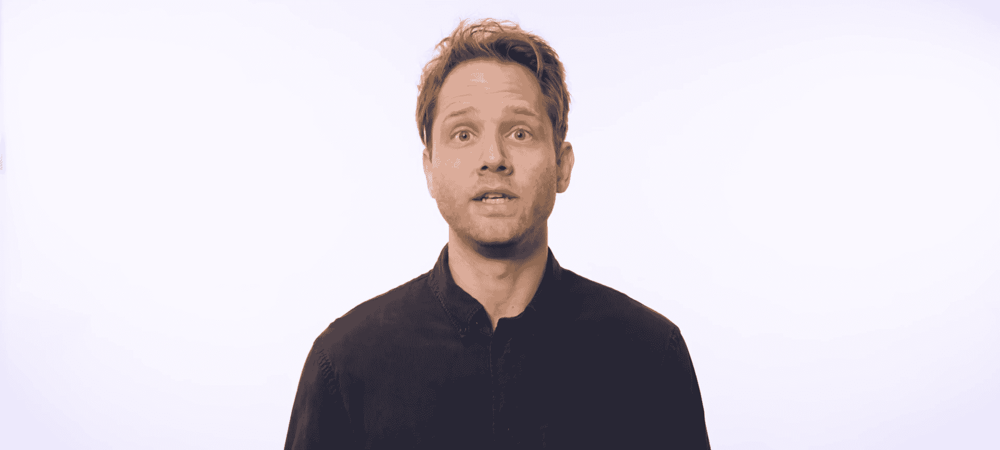
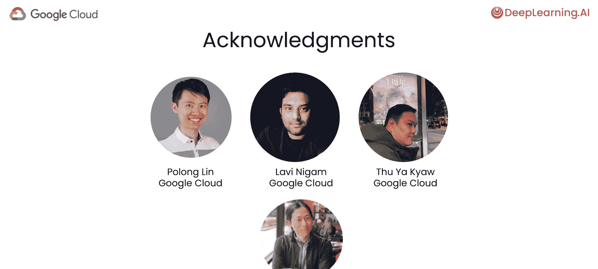
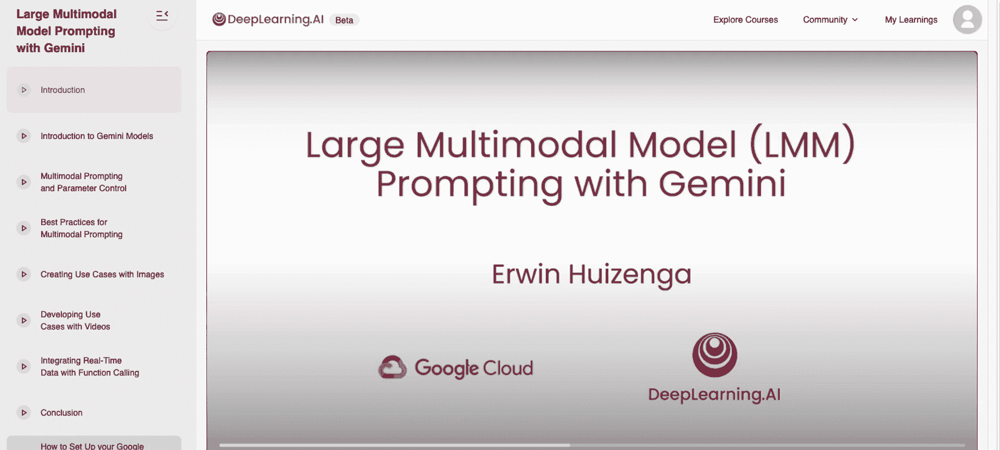
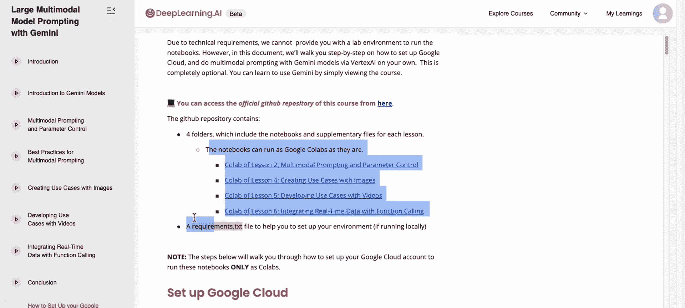

# 001：课程介绍与概览 🚀

在本节课中，我们将要学习大型多模态模型（LMM）的基础知识，并了解如何使用谷歌的Gemini模型来处理文本和图像等多种类型的数据。课程将涵盖从基本概念到实际应用的全过程。

想象一下，你正在设计一个客户服务应用程序。一位客户上传了一张产品的图像，例如一台微波炉旁边还有一个红薯，并询问“我该怎么处理这个？”。大型多模态模型允许你直接结合文本和图像来回答这个问题。

在LMM出现之前，一种可能的方法是使用图像字幕生成模型来编写图像的描述，然后将该描述和用户问题一同输入到大型语言模型（LLM）中。但是，一个大型多模态模型可以直接处理文本和图像的组合输入，从而减少了因字幕遗漏关键细节而导致错误的机会。

Gemini是最新一批从一开始就被训练来理解文本、图像、音频和视频混合内容的模型之一。我很高兴向大家介绍本课程的讲师欧文·惠辛加，他是谷歌云机器学习的开发者倡导者，在LLM和LMM方面拥有深厚的经验。

谢谢，安德鲁。我很高兴与你和你的团队在这方面合作。在本课程中，你将学习如何构建多模态应用。具体来说，你将学习什么是多模态，如何使用Gemini API处理不同类型的数据（如图像和视频），以及设置参数和提示工程的最佳实践。你还将学习如何在多个图像或视频上应用高级推理。

例如，你将看到的一个应用场景是：输入一份同时包含文本和图表的文档，然后让LMM回答那些需要阅读和理解文本及图表图像的问题。你将使用Python和Vertex AI上的Gemini来构建这些多模态应用。

你将探索各种多模态用例，并学习如何使用Gemini模型与图像进行交互，包括那些在视频中包含文本或表格的图像。你将学习选择模型参数，并了解这些参数如何影响模型的创造力和一致性。你将发现提示多模态内容的最佳实践，并使用大型语言模型来改进、编辑和增强内容，类似于数字营销人员在为社交媒体准备内容时所需的工作。

此外，你将学习如何通过函数调用，用实时数据集成来增强语言模型的能力。许多人致力于创建这门课程。我要感谢谷歌云团队的Paulong Lin、Lavi Nigam和Thu-Yu Qua，以及来自DeepLearning.ai的Eddie Hsu，他们也为这门课程做出了贡献。

在下一个视频中，Erwin将介绍多模态和Gemini。在你完成这门课程后，无论何时你同时拥有文本和图像数据，我都希望你能运用本课程中的想法，如此快速地开发应用程序，以至于其他人会将你视为效率的典范。让我们继续看下一个视频并开始吧。

本课程仅以视频形式呈现。你只需观看课程即可了解关于Gemini的所有信息。如果你希望自己运行代码，我们为你提供了如何访问和运行笔记本的说明。

让我向你展示这些说明在哪里。在视频播放器的左下角，你可以点击“如何设置您的GCP账户”。这会带你到一份文档。在这份文档中，你将找到如何注册谷歌云平台账户的说明。你还可以找到如何访问谷歌Colab笔记本的说明。

本节课中我们一起学习了课程的整体介绍、大型多模态模型（LMM）的基本概念及其应用潜力，并了解了后续学习将使用的工具和资源。下一节，我们将正式开始探索多模态的世界。