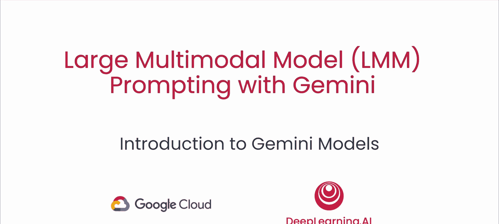
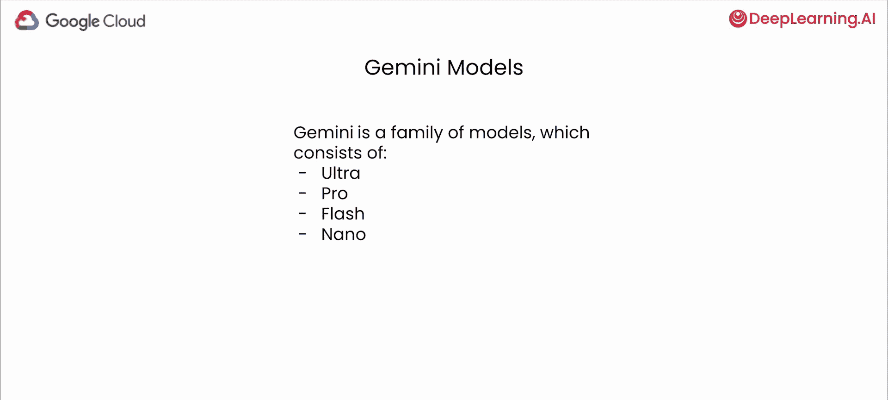
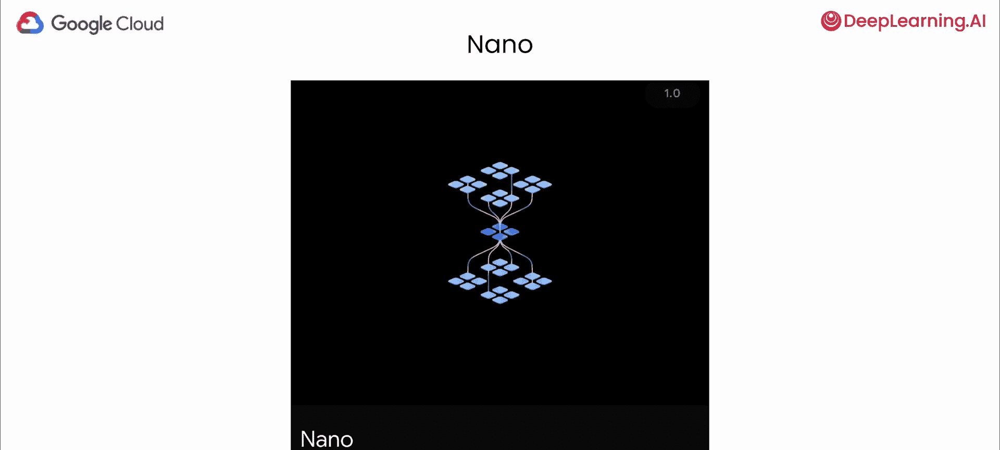
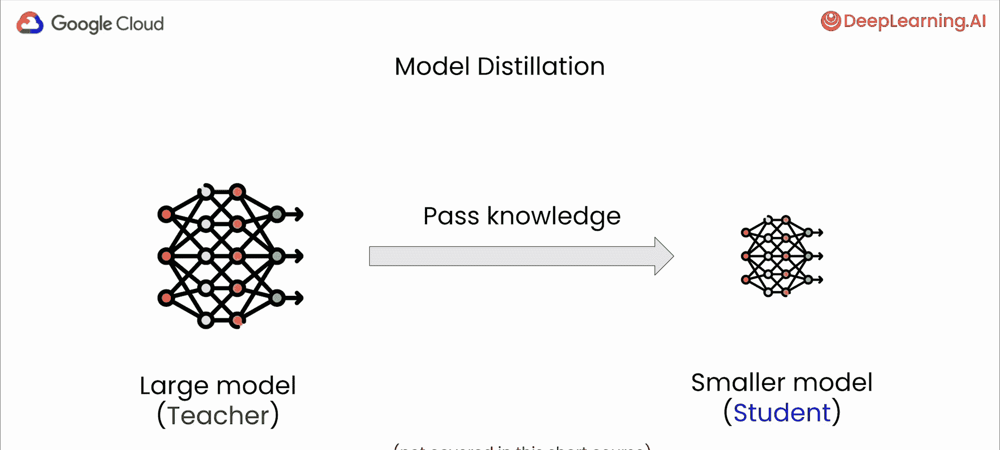
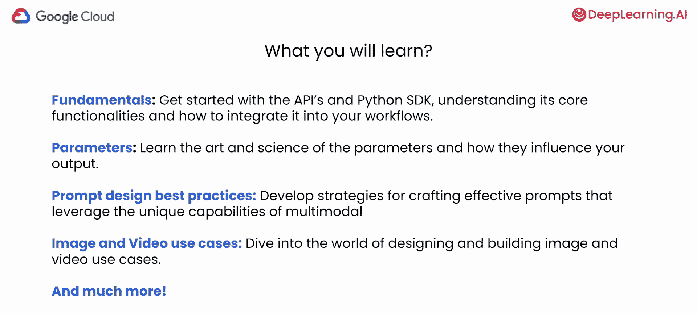

# 002：Gemini模型家族概览 🧠

在本节课中，我们将学习什么是多模态模型，探索Gemini模型家族中的不同成员，并理解如何根据你的具体应用场景选择最合适的模型。

## 概述

首先，让我们快速概览一下Gemini模型家族。Gemini是Google DeepMind开发的多模态模型。这意味着它不仅仅像许多纯文本语言模型那样只在文本数据上训练。Gemini还在图像、音频、视频和文本等多种模态的数据上进行了训练。这种多模态方法使得模型能够在不同模态之间进行推理。例如，模型不仅能识别图片中的猫，还能理解猫玩耍的视频、猫叫的声音，甚至能用一首诗来描述它。这就是多模态的力量。在本课程中，你将深入了解多模态，并着手解决一些非常有趣的用例。

Gemini不只是一个单一的模型，它是一个为适应不同需求而设计的模型家族。可以将其想象为选择适合工作的正确工具。家族中有不同大小的模型，每个模型都专门为满足不同的计算限制和应用要求而定制。

## Gemini模型家族详解

上一节我们介绍了Gemini是一个多模态模型家族，本节中我们来看看家族中的具体成员。

以下是Gemini模型家族的主要成员：

1.  **Gemini Ultra（超大型）**
    *   这是最大且能力最强的模型，在包括推理和多模态任务在内的广泛复杂任务中，提供最先进的性能。然而，在现实世界中，使用最大的模型并不总是最佳策略，因为它可能在响应速度上有所权衡。

2.  **Gemini Pro（专业版）**
    *   这是一个性能经过优化的主力模型，在模型能力、响应速度等方面取得了良好平衡，并且泛化能力优秀。这使其非常适合需要高质量响应和高效率的广泛应用。

3.  **Gemini Flash（闪速版）**
    *   这是一个专门为成为最快、最具成本效益的模型而构建的版本，适用于高吞吐量任务，旨在提供更低的延迟和成本。它非常适合需要模型快速响应的用例，例如客户服务聊天机器人或实时语言翻译工具。

4.  **Gemini Nano（纳米版）**
    *   这是专为直接在用户设备（如Pixel手机）上运行而设计的轻量级模型。它是通过**模型蒸馏**过程创建的。这个过程可以类比为教学：一个大型专家模型（教师）将其知识传递给一个更小、更紧凑的模型（学生）。目标是让学生模型学会最重要的技能，而不需要教师模型那样庞大的计算资源。

## 为何选择设备端模型？

我们了解了Gemini Nano是设备端模型，那么选择在设备上运行模型有哪些优势呢？

以下是两个主要原因：

*   **数据隐私与安全**：在本地处理数据可以避免将用户敏感数据发送到中央服务器，这对于处理敏感信息的应用程序至关重要。
*   **离线访问**：用户即使在没有互联网连接的情况下也可以使用AI功能，这对于需要离线工作或网络连接不稳定的应用非常有用。

## 如何为你的用例选择模型？

面对如此多的模型选项，你可能会感到困惑。选择最佳模型并非一刀切，每个模型都有其优势和权衡。

以下是帮助你做出决策的关键步骤和考虑因素：

1.  **理解你的用例**：首先明确你要构建什么，是聊天机器人、内容生成工具还是其他应用？不同的任务倾向于不同的模型能力。
2.  **评估关键要求**：将你的用例与以下三个核心维度进行对比：
    *   **模型能力**：评估模型规格是否与你的用例匹配。例如，它是否需要处理图像而不仅仅是文本？公式可以表示为：`所需能力 ⊆ 模型能力`。
    *   **延迟**：你的应用需要多快的响应速度？如果实时交互至关重要，你需要一个能快速生成响应的模型。
    *   **成本**：更大的模型通常性能更卓越，但计算成本也更高。需要在性能和预算之间取得平衡。

例如，如果你正在开发一个图像搜索工具，你可能需要优先考虑具有出色图像处理能力的模型。

## 深入理解多模态

我们已经多次提到“多模态”，现在让我们具体看看这意味着什么。

一个多模态模型能够理解并处理图像、视频、文本、音频、PDF甚至代码等多种形式的输入。这对你的用例意味着巨大的灵活性。例如，你可以：
*   从图像或扫描文档中提取文本。
*   理解图像或视频中发生的事情，识别物体、场景甚至情绪。

更酷的是，你可以以交错的方式提供这些输入。例如，在一个请求中，你可以混合提供文本、图像、代码等。输入的顺序可以变化，并且顺序很重要，我们将在后续课程中讨论这一点。

## 高级推理与跨模态推理

Gemini模型还具备高级推理和跨模态推理能力。这意味着模型可以分析复杂的信息，并从不同模态中提取见解，使其在科学、法律、金融等需要处理多种信息形式的领域极具价值。

设想一个场景：你是一位研究气候变化影响的研究员。Gemini可以协同分析科学论文（文本）、卫星图像（视觉数据）和温度图表（数值数据），从而帮助你识别模式和趋势，理解全局。

**视觉示例**：
假设有一张包含学生物理问题解答的图片。我们可以向模型提供这张图片和一个文本提示：“请逐步推理这个问题，并判断学生的答案是否正确。如果错误，请解释错误并解决问题。”
模型随后能够跨文本和图像进行推理：理解图片中的文字和图示，分析学生的解答步骤，最终给出一个包含文本和数学公式（如LaTeX）的响应。

## 课程预告

至此，你已经了解了Gemini模型家族、多模态的含义以及跨模态推理的能力。在整个课程中，你将学习以下内容：
*   **基础**：如何通过Python SDK和API开始使用这些模型。
*   **核心功能**：如何将模型集成到你的工作流程或用例中。
*   **参数**：参数如何影响模型的输出。
*   **提示工程**：针对多模态模型的最佳提示实践。
*   **用例**：大量的图像和视频应用案例，以及如何使用这些模型来解决它们。

## 总结

本节课中，我们一起学习了：
1.  Gemini是一个由不同规格模型组成的多模态模型家族，包括Ultra、Pro、Flash和Nano。
2.  多模态意味着模型能理解和处理文本、图像、音频、视频等多种形式的输入。
3.  选择模型时，需要根据用例的具体需求，权衡模型能力、响应延迟和成本。
4.  Gemini具备强大的跨模态推理能力，能够分析混合信息并提取深层见解。
5.  本课程将引导你从基础开始，掌握使用Gemini模型解决实际问题的全套技能。