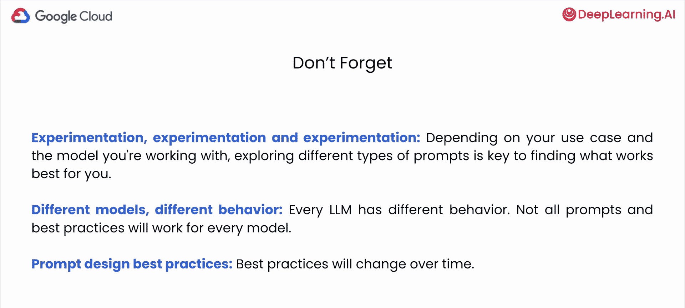
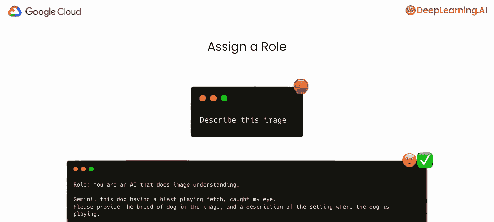
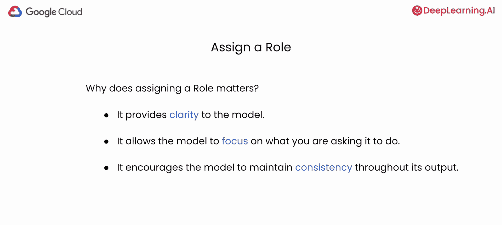
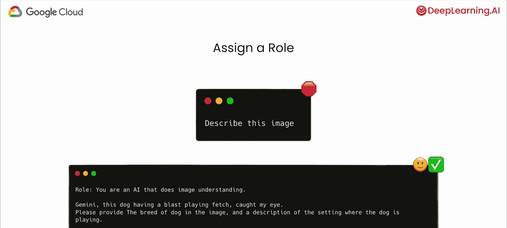
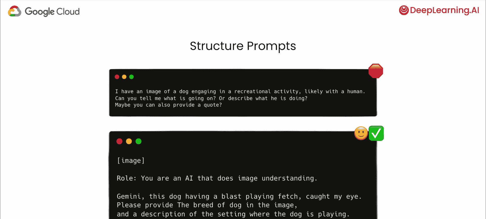
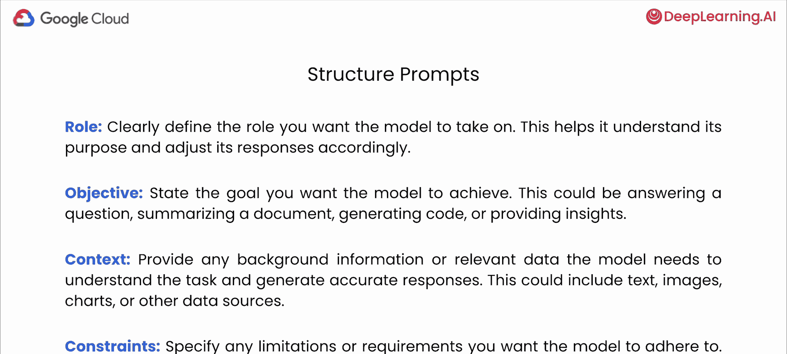
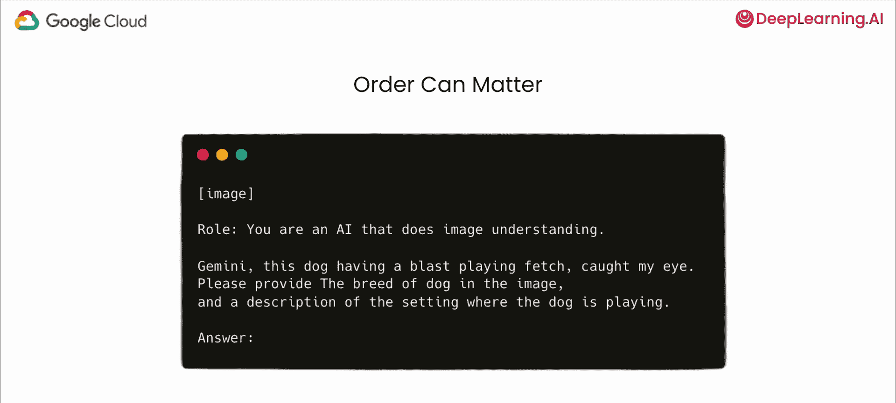
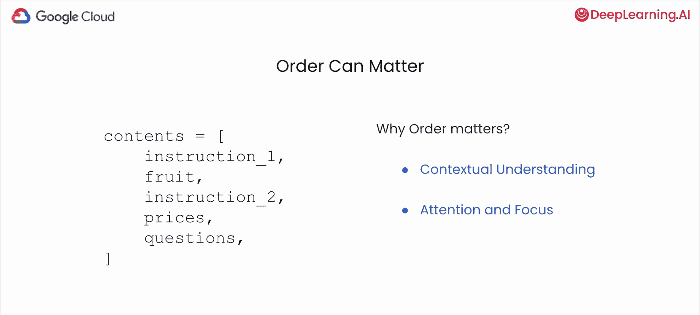

# 004：最佳实践 🚀

在本节课中，我们将学习如何为包含图像的用例设计有效的提示。我们将探讨从技术规范到提示结构设计的一系列最佳实践，帮助你引导多模态模型生成更准确、更相关的输出。

## 技术规范与基本原则 📋

上一节我们介绍了多模态模型的基本概念，本节中我们来看看使用图像输入的具体技术要求和基本原则。

图像在输入模型前会被转换为标记。目前，每个用例最多可以使用3000张图像。支持的图像格式是PNG或JPEG。图像中的像素数量没有限制，但较大的图像会被自动缩小，且通常效果更好。每张图像会占用258个标记。

在使用多模态大型语言模型时，需要记住这是一个不断发展的领域。以下是几个关键原则：

*   **实验至关重要**：对于多模态模型，没有一种放之四海而皆准的完美提示方法。不同的用例、模型甚至数据类型都需要不同的方法。你需要探索各种提示结构、措辞和格式，以找到最适合你具体用例的方法。
*   **模型行为各异**：每个模型都有其自身的特点和细微差别。在一个模型上效果良好的提示，在另一个模型上可能不会产生相同的结果。要注意不同模型对你的提示如何响应，并相应地调整你的方法。
*   **最佳实践会演变**：我们做的研究和实验越多，就越了解哪些方法对我们的用例和不同模型有效。大型语言模型领域正在迅速发展，新的技术和最佳实践会不断涌现。

## 精心设计有效的多模态提示 ✨

为了探索如何精心制作有效的多模态提示，让我们深入一个具体场景。想象你有一张图片，比如一张可爱狗狗的图片，并且你想了解图片中正在发生什么。这就是提示设计和提示工程变得至关重要的地方。通过精心设计你的指令，你可以引导模型处理图片并理解其背景，从而生成你用例所需的特定输出。

以下是一些可以帮助改进多模态提示设计的技巧和策略。

### 确保清晰与简洁

清晰和简洁很重要。把提示想象成给同事分配任务。如果你的指示模糊或冗长，结果可能不是你所期望的。对于这些模型也是如此。虽然多模态模型很强大，但它们不是读心者。所以要像给一个聪明但需要明确指导的人解释任务那样编写你的提示。要避免过于技术性的行话，或对模型应该知道什么做出假设。

### 使用角色指令

在与模型交互时，提供明确的指令至关重要。一种有效的技术是在你的提示中为模型分配一个特定的角色。可以这样想：想象你在导演一场戏。你不会只是给演员一个剧本然后说“去吧”。你要告诉他们他们的角色是什么、动机是什么，以及应该如何与他人互动。类似地，角色指令告诉模型在你的请求的上下文中应该如何行动。

以下是角色指令的重要性：

*   **提供清晰性**：角色指令明确了模型的任务，减少了歧义并提高了其输出的相关性。
*   **引导聚焦**：它们引导模型朝向特定的风格、语气或细节水平，使响应更符合你的需求和用例。
*   **确保一致性**：通过指定一个角色，你鼓励模型在其整个输出中保持一致的声音和视角。

例如，你可以指定模型的角色是“一个进行图像理解的人工智能”。另一个例子是，如果你要总结财务文件，可以给模型指定为“财务专家”的角色。

### 构建提示结构

提示结构至关重要，因为你设计输入的方式直接影响多模态模型的表现。你构建提示词的方式会影响模型解析提示词中信息的能力，还有助于模型正确理解如何使用给定信息。

为了给提示词构建结构，你可以使用前缀或类似XML标签来划分提示词的不同部分。例如，一个结构良好的提示可以是：首先提供图像，接着分配一个角色，然后提出你的问题或请求，最后留出空间让模型提供答案。

没有一种结构适用于所有情况。这取决于你的用例和你使用的模型，所以也需要对此进行试验。

以下是提示词结构重要的原因：

*   **组织信息**：它帮助模型轻松识别你输入中的不同类型内容，例如图像、角色和问题。
*   **引导解释**：它阐明了每条信息应该如何使用以及与其他信息的关系。图像是要被总结吗？它是一个代码片段要被执行吗？提示词结构提供了这些线索。
*   **鼓励期望的输出**：通过在提示词中设定明确的期望，你增加了得到你所期望的那种回应的可能性。

以下是你可以用来给提示词添加结构的一些元素：

*   **角色**：帮助模型理解其目的并相应地调整其回应。
*   **目标**：说明你希望模型实现的目标，例如回答问题、总结文档、生成代码或提供见解。要尽可能具体。
*   **背景**：提供模型需要理解任务并生成准确回应的任何背景信息或相关数据，可能包括文本、图像、图表等。
*   **限制条件**：指定你希望模型遵守的任何限制或要求，例如回应的长度、输出的格式（如指定输出为HTML格式）或对某些类型内容的限制。

### 注意信息呈现顺序

在多模态模型中，你呈现信息的顺序在模型输出的质量和相关性方面起着重要作用。这既适用于文本提示的结构（你构建问题、指令的方式），也适用于不同模态（如图像、文本、表格）的输入顺序。你呈现不同类型输入的顺序会影响模型的理解和连接信息的能力。

例如，考虑一个分析医疗报告的场景。通过在X光图像之前呈现患者的病史，可以帮助模型更好地解释视觉信息。

以下是顺序重要的原因：

*   **提供上下文理解**：模型在处理信息时会建立更好的理解。你呈现细节的顺序可以为后续信息的解释设定基础。
*   **引导注意力与焦点**：通过战略性地排序你的提示和模态，你可以引导模型的注意力到特定方面，可能提高其回应的准确性。

同样，建议你实验提示的顺序和不同模态的输入顺序。

## 总结 📝

本节课中，我们一起学习了为多模态模型（特别是涉及图像的用例）设计提示的最佳实践。我们首先了解了图像输入的技术规范，并确立了实验、适应模型特性和关注领域发展的基本原则。接着，我们探讨了如何通过确保提示的清晰简洁、使用角色指令、构建良好的提示结构以及注意信息呈现顺序等策略，来精心设计有效的多模态提示。这些技巧旨在帮助你引导模型，使其输出更准确、更符合你的具体需求。记住，实践和迭代是掌握提示工程的关键。