# 005：使用图像创建用例 🖼️


在本节课中，我们将学习如何利用多模态模型处理图像和文本提示，创建实用的应用场景。我们将通过三个具体案例，学习如何从图像中提取信息、进行跨模态推理以及构建推荐系统。


## 课程概述

我们将从基础设置开始，然后逐步探索三个涉及图像的用例：
1.  从水果图像和价目表中提取信息并计算成本。
2.  根据客厅风格，从多张椅子图像中推荐合适的家具。
3.  分析收据图像，并根据公司政策检查费用合规性。

---

## 环境设置与初始化 🔧

在深入具体用例之前，我们需要完成基础的环境设置。这包括获取API凭证、指定服务区域以及导入必要的开发工具包。

以下是初始化步骤的核心代码：

```python
# 导入必要的库
from google.cloud import aiplatform
from vertexai.generative_models import GenerativeModel, Image

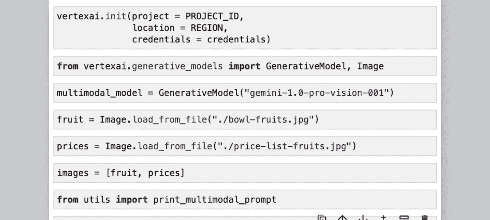

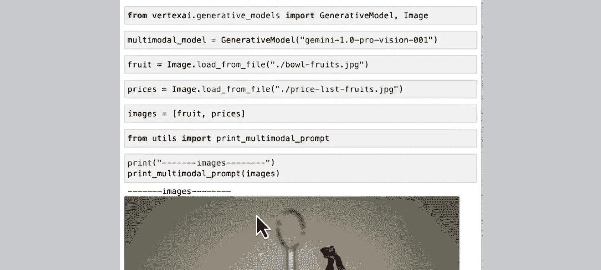

# 初始化SDK，需要提供凭证、区域和项目ID
aiplatform.init(project=“your-project-id”, location=“us-central1”)

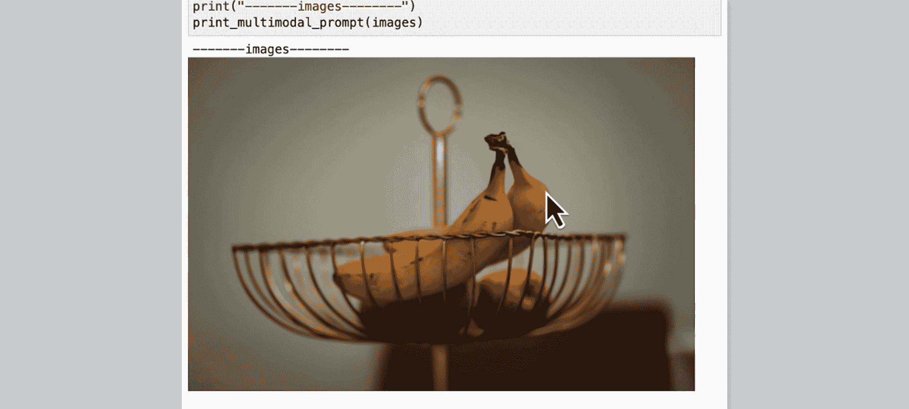

# 导入我们将要使用的多模态模型
model = GenerativeModel(“gemini-1.0-pro-vision-001”)
```

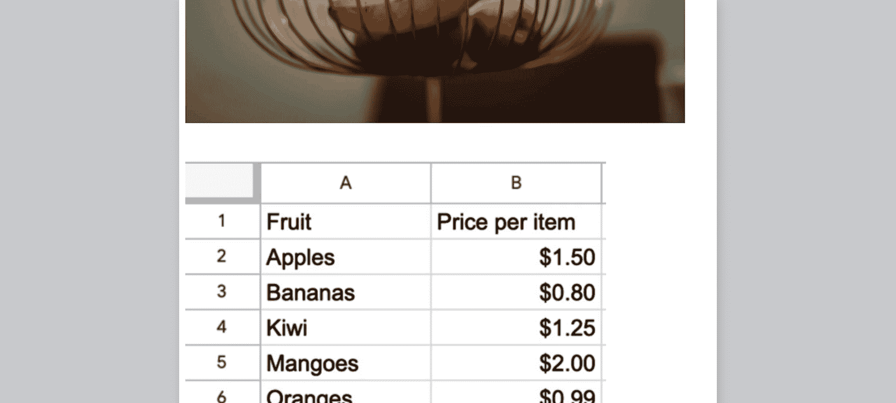

完成上述设置后，我们就可以开始构建和发送包含图像的提示了。

---

## 用例一：跨模态信息提取与计算 🍎

上一节我们完成了环境配置，本节中我们来看看第一个用例：如何让模型同时理解文本指令和图像内容，并进行推理计算。

我们的目标是：根据一碗水果的图像和一份水果价目表的图像，回答一系列问题，例如计算制作水果沙拉还需要购买哪些水果及其总费用。

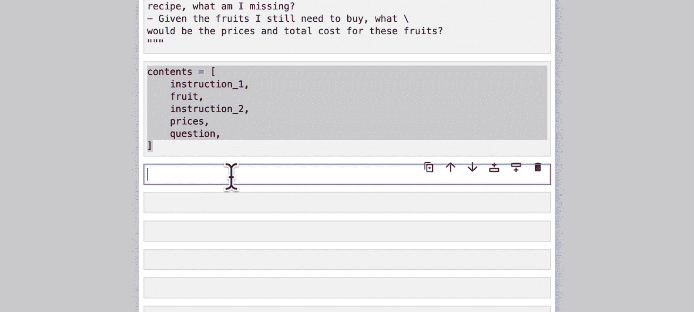

### 步骤分解

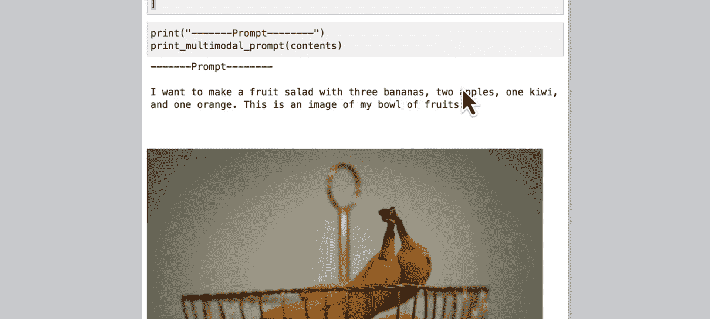

以下是实现该用例的关键步骤：

1.  **加载图像**：从本地文件加载水果碗和价目表两张图片。
    ```python
    fruit_image = Image.load_from_file(“fruit_bowl.jpg”)
    price_image = Image.load_from_file(“price_list.jpg”)
    ```

2.  **构建提示内容**：将指令、图像和问题组合成一个有序的列表。清晰的指令结构有助于模型更好地理解任务。
    ```python
    content = [
        “指令一：我想用三个香蕉、两个苹果、一个猕猴桃和一个橙子制作水果沙拉。这是我水果碗的图像。”,
        fruit_image,
        “指令二：根据以上指令，这是我当地超市的水果价格表。”,
        price_image,
        “问题：1. 描述我碗里有哪些水果及数量。2. 根据食谱，我缺少什么水果？3. 我还需要购买的水果的价格和总费用是多少？”
    ]
    ```

3.  **调用模型并获取响应**：将构建好的内容列表发送给模型。
    ```python
    response = model.generate_content(content)
    print(response.text)
    ```

### 执行结果分析

模型成功识别出碗中有“两个香蕉和两个苹果”。对比食谱需求，它准确地指出缺少“一个香蕉、一个猕猴桃和一个橙子”。最后，它从价目表图像中提取了对应水果的价格（香蕉0.80美元，猕猴桃1.25美元，橙子0.99美元），并正确计算出总费用为3.04美元。

这个例子展示了模型如何**跨越文本和图像模态进行推理**，根据视觉信息回答复杂的计算性问题。

---

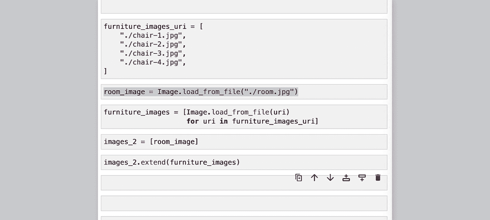

## 用例二：基于图像的多模态推荐系统 🛋️

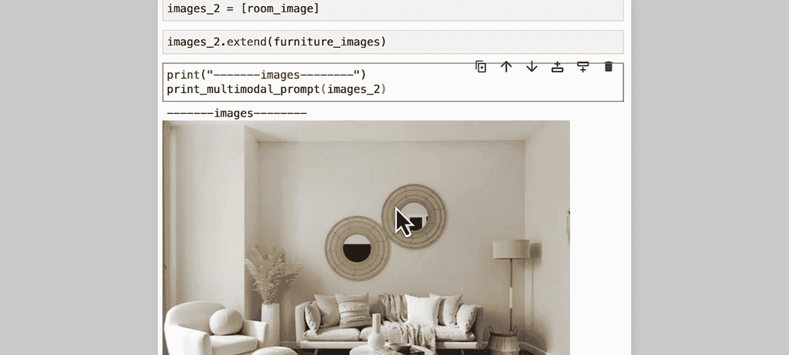

在学会了基础的信息提取后，本节我们将探索一个更贴近生活的应用：使用多模态模型作为推荐系统，为客厅挑选合适的椅子。

在这个用例中，我们将向模型提供一张客厅图片和四把不同椅子的图片，要求模型以室内设计师的身份，评估每把椅子是否与客厅风格相匹配。

### 步骤分解

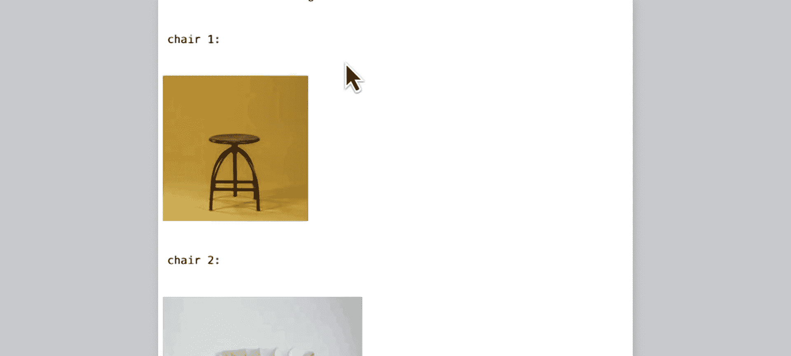

以下是构建家具推荐系统的步骤：

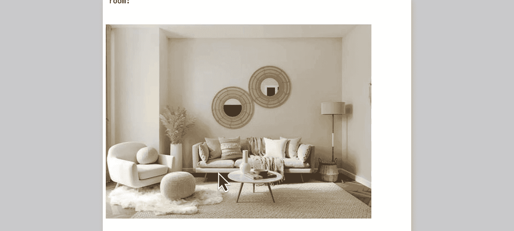

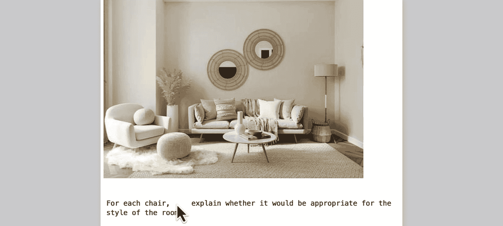

1.  **加载所有图像**：加载客厅图像和椅子图像列表。
    ```python
    room_image = Image.load_from_file(“living_room.jpg”)
    chair_images = [Image.load_from_file(f“chair_{i}.jpg”) for i in range(1, 5)]
    ```

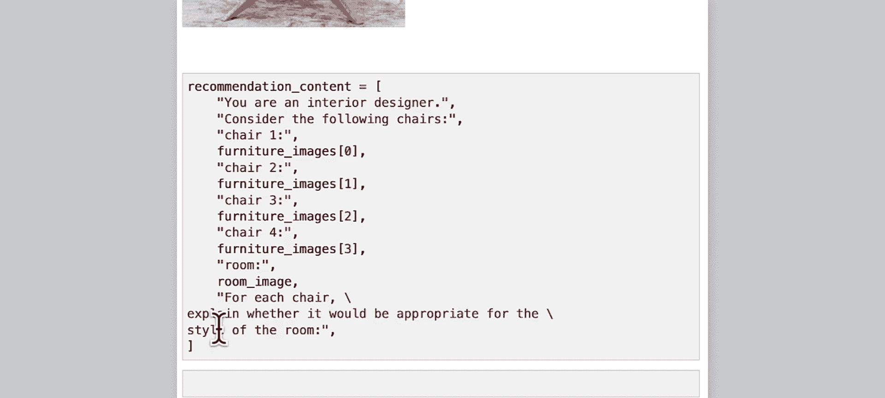

2.  **构建组合提示**：这次我们将所有指令和图像一次性组合在一个变量中，这是一种更简洁的提示构建方式。
    ```python
    recommendation_content = [
        “你是一名室内设计师。考虑以下椅子：”,
        *chair_images, # 解包椅子图像列表
        “以及我的房间：”,
        room_image,
        “请针对每一把椅子，解释它是否适合这个房间的风格。”
    ]
    ```
    **注意**：在构建提示时，需注意多余的空白可能会影响模型响应，因此最好打印检查一下提示的最终格式。

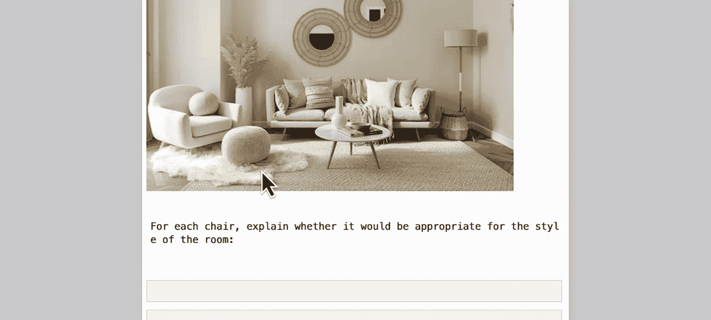

3.  **获取推荐结果**：发送提示并解析模型的回答。
    ```python
    response = model.generate_content(recommendation_content)
    print(response.text)
    ```

### 执行结果分析

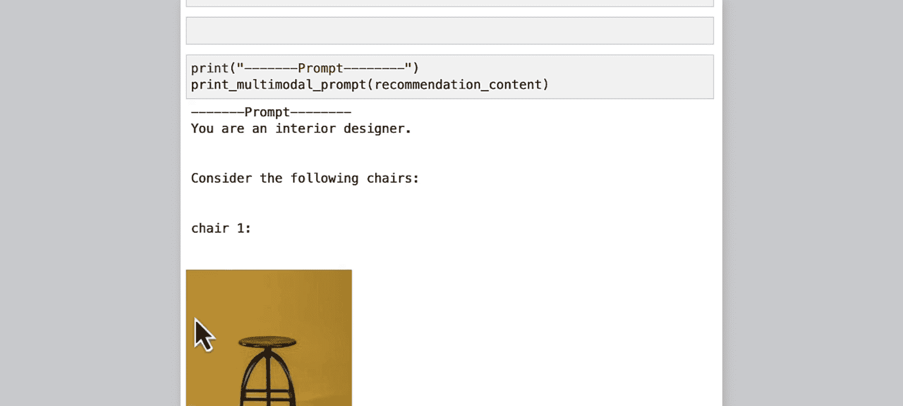

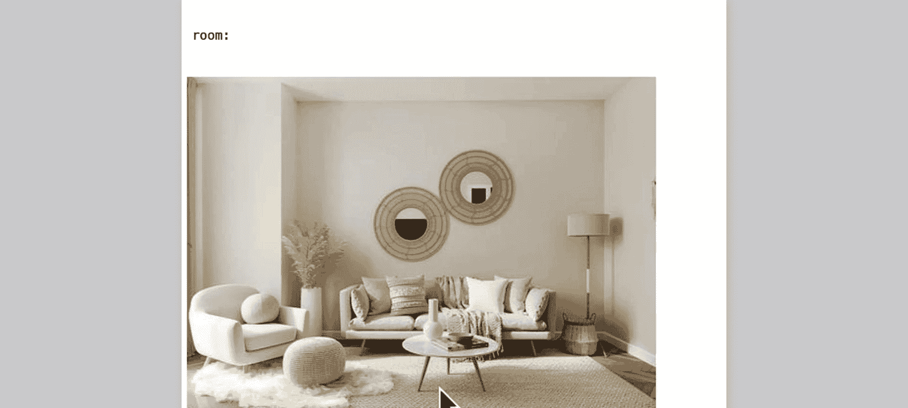

模型对每把椅子都给出了详细评估。例如，对于一把由木头和金属制成的椅子，模型认为它“不适合”，因为房间是现代风格，具有简洁的线条。而对于另一把具有时尚现代设计、采用中性软面料的椅子，模型则认为它“非常适合”，能与房间的线条和颜色相得益彰。

重要的是，模型的判断不仅基于颜色，还考虑了**材质、设计风格**与房间整体氛围的协调性，展现了深层次的视觉理解能力。

---

## 用例三：处理复杂文档与策略检查 📄

接下来，我们将挑战一个更复杂的任务：使用功能更强大的Gemini 1.5模型来处理质量不佳的收据图像，并结合文本文档（公司政策）进行费用合规性检查。

这个用例模拟了真实的财务审核场景，模型需要整合图像中的结构化数据（收据项目）和文本中的非结构化规则（政策条款）。

### 步骤分解

以下是实现费用审核自动化的工作流程：

1.  **导入更强大的模型**：Gemini 1.5支持更长的上下文（最多100万tokens），适合处理冗长文档。
    ```python
    model = GenerativeModel(“gemini-1.5-pro-001”)
    ```

2.  **加载多模态输入**：加载收据图像和公司政策文本文件。
    ```python
    receipt_images = [Image.load_from_file(f“receipt_{i}.jpg”) for i in range(1, 4)]
    with open(“travel_policy.txt”, “r”) as f:
        company_policy = f.read()
    ```

3.  **构建详细提示**：为模型设定角色、规则和具体任务清单。特别要求模型在信息不足时保持透明。
    ```python
    audit_content = [
        “指令：请基于提供的信息如实回答。如果信息不足无法确定答案，请明确指出。”,
        “角色：你是一名人力资源专业人士和差旅费用专家。”,
        “任务：你正在审核一次商务旅行的费用报销。请根据以下收据和公司政策完成审核：”,
        “1. 逐项列出所有收据上的项目（含税）。”,
        “2. 计算总销售税。”,
        “3. 从收据中，单独提取‘员工与同事共餐’中员工本人的餐费（仅肯德基碗餐）。”,
        “4. 计算其他人的用餐金额。”,
        “5. 根据公司政策检查所有费用，并标记任何问题。”,
        “公司政策：”, company_policy,
        “收据：”, *receipt_images
    ]
    ```

4.  **执行审核并分析结果**：模型将输出详细的审核报告。
    ```python
    response = model.generate_content(audit_content)
    print(response.text)
    ```

### 执行结果分析

模型成功完成了多项任务：
*   **信息提取**：从模糊的收据图像中准确逐项列出了所有费用。
*   **分类计算**：区分了员工个人餐费与同事的餐费，并分别计算。
*   **策略合规性检查**：根据政策文本，成功标记了问题费用。例如，它发现“绿色冰沙”属于政策中明确规定的不可报销项目，并指出了每日限额超标的问题。

这个案例展示了多模态模型在**处理质量参差不齐的视觉信息**，并将其与**复杂文本规则相结合**以做出综合判断方面的强大能力。

---

## 课程总结 🎯

本节课中，我们一起学习了使用大型多模态模型处理图像提示的核心方法。我们通过三个循序渐进的案例掌握了：

1.  **跨模态推理**：让模型根据图像内容回答文本问题，并进行简单计算（水果成本计算）。
2.  **视觉风格推荐**：利用模型对图像风格、颜色、材质的理解，构建简单的推荐系统（家具搭配）。
3.  **文档与策略审核**：结合长文本上下文和图像处理能力，完成复杂的信息提取与规则校验（费用报销审核）。

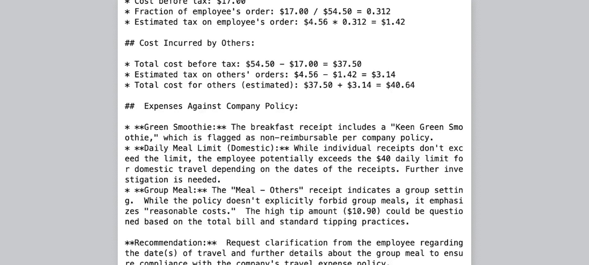

关键收获在于，通过精心构建的提示（清晰的指令、有序的内容结构），我们可以引导模型在文本和图像之间建立联系，完成从简单信息查询到复杂逻辑判断的各种任务。在下一节课中，我们将把目光投向动态的视觉内容——视频，学习如何利用模型分析视频并解决“大海捞针”式的信息检索问题。