# 006：视频用例

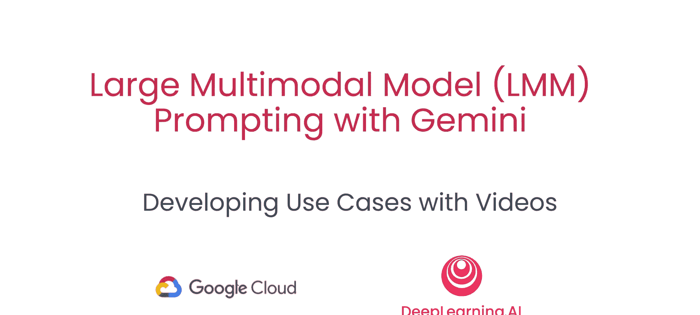

## 概述
在本节课中，我们将学习如何使用Gemini模型与视频进行交互。我们将探索如何从视频中提取标题、描述和元数据，如何基于视频内容进行问答，以及如何利用模型的大上下文窗口在长视频中执行“大海捞针”式的信息检索。


---

## 准备工作：初始化环境与模型

上一节我们介绍了课程的整体目标，本节中我们来看看如何设置环境以开始使用Gemini处理视频。

首先，我们需要运行辅助函数来使用Gemini API。这包括认证和初始化SDK。

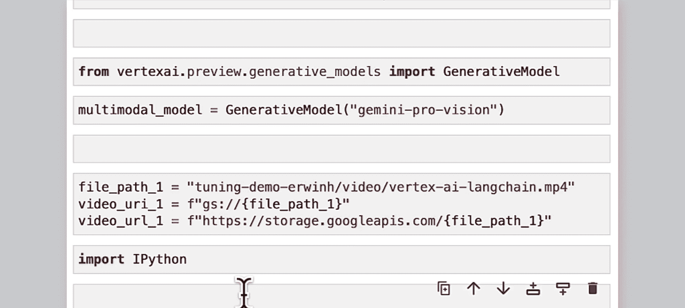

```python
# 导入必要的库并初始化Gemini SDK
import google.generativeai as genai

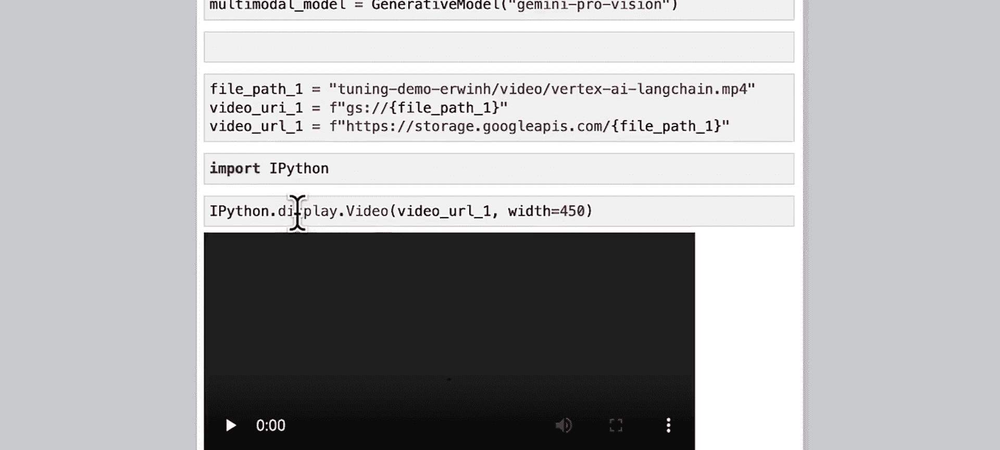

# 配置API密钥和区域
genai.configure(api_key='YOUR_API_KEY', transport='rest')

# 导入模型
model = genai.GenerativeModel('gemini-pro-vision')
```

**Gemini Pro Vision** 模型能够处理图像、视频和文本输入，是我们本节课将使用的主要工具。

---

## 用例一：为网站生成视频元数据

在第一个用例中，你将扮演一名数字营销人员，需要处理一个即将发布在网站上的视频。为此，我们需要从视频中提取标题、描述和用于网站后端的元数据。

### 加载并显示视频
首先，我们需要加载视频。这里我们使用一个关于顶点AI和LangChain的视频作为示例。

```python
import IPython.display
video_uri = "gs://your-bucket/path/to/video.mp4"
video_url = "https://storage.googleapis.com/your-bucket/path/to/video.mp4"

# 在笔记本中显示视频
IPython.display.display(IPython.display.Video(video_url))
```

**关键优势**：与传统的计算机视觉模型不同，在使用Gemini模型前，你**无需**对视频进行任何预处理（如格式转换、尺寸调整）。Gemini可以处理多种流行的文件格式（如MP4、MOV、MPEG）和几乎任何尺寸的视频。

### 构建提示词
接下来，我们为模型编写提示词。为了提高输出的质量，我们将提示词结构化，分为角色、任务和输出格式几个部分。

以下是构建提示词的步骤：

1.  **指定角色**：为模型设定上下文，例如“你是一名数字营销人员”。
2.  **明确任务**：逐步列出模型需要完成的具体任务。
3.  **定义输出格式**：指定我们希望答案以何种结构返回。

```python
# 定义提示词的各个部分
role = “你是一名数字营销人员，正在处理一个需要发布到网站上的视频。”
task = “””
请执行以下任务：
1. 为视频生成一个吸引人的标题。
2. 写一段简短的视频内容描述。
3. 生成网站后端所需的元数据。
“””
format_instruction = “请将元数据以JSON格式返回，包含以下键：title, description, language, company。”
```

### 调用模型并获取结果
现在，我们将视频和组合好的提示词发送给模型。

```python
from google.generativeai.types import Part

# 从URI加载视频内容
video_part = Part.from_uri(video_uri, mime_type="video/mp4")

# 组合所有内容
contents = [video_part, role, task, format_instruction]

# 配置生成参数
generation_config = {
    "temperature": 0.1, # 控制输出的随机性
}

# 生成响应
response = model.generate_content(contents, generation_config=generation_config, stream=False)

# 打印结果
print(response.text)
```

**输出示例**：
模型会返回一个包含标题、描述和结构化JSON元数据的响应。例如：
```
标题：在Vertex AI上使用LangChain构建AI驱动应用
描述：本视频演示了如何利用LangChain框架在Google Cloud的Vertex AI平台上构建和部署智能应用程序...
元数据：{“title”: “在Vertex AI上使用LangChain构建AI驱动应用”, “description”: “...”, “language”: “中文”, “company”: “Google”}
```

**提示词设计技巧**：将提示词分解为角色、任务、格式等独立变量，有助于代码的复用、迭代和维护。例如，若想更改输出格式，只需修改 `format_instruction` 变量即可。

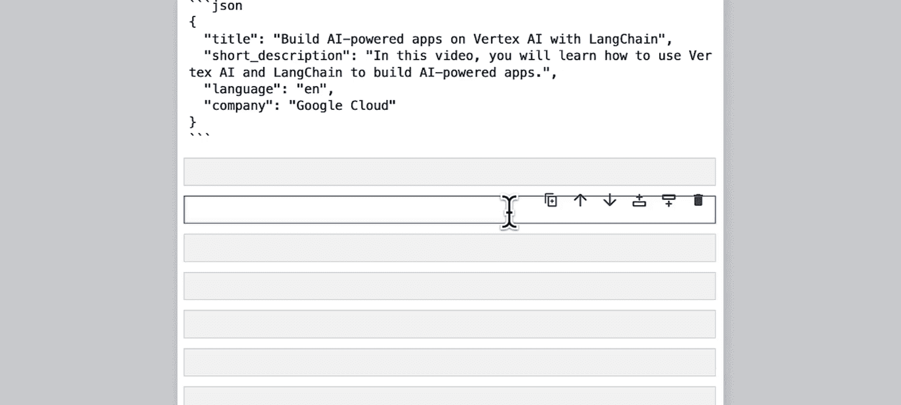

---

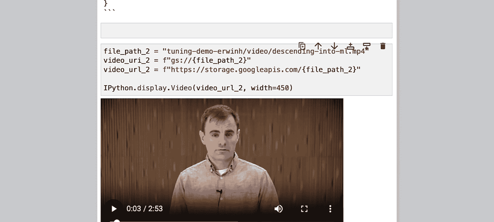

## 用例二：基于视频内容的链式问答

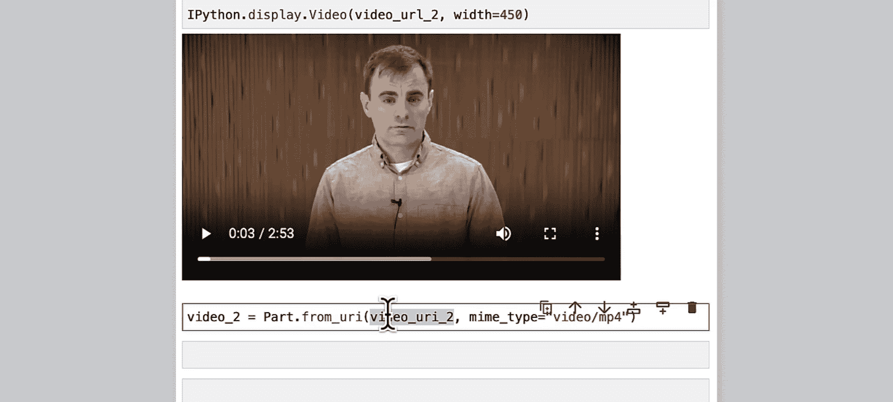

上一节我们学习了如何提取视频的概括性信息，本节中我们来看看如何就视频的细节内容进行深入的链式提问。

在这个例子中，我们将向模型提出三个相互关联的问题，后一个问题的解答依赖于前一个问题的答案。

### 加载新视频
我们使用一个讲解线性回归概念的视频。

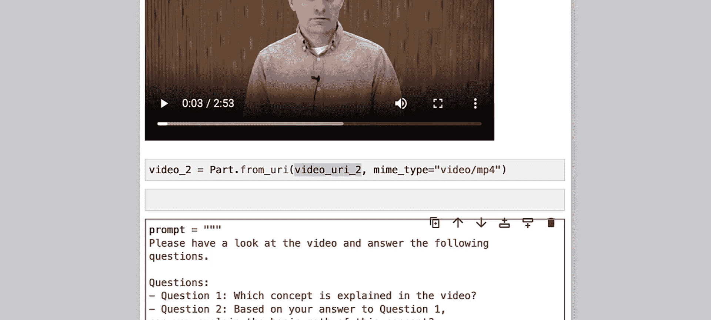

```python
video2_uri = "gs://your-bucket/path/to/regression_video.mp4"
video2_part = Part.from_uri(video2_uri, mime_type="video/mp4")
```

### 构建链式提示词
我们将所有问题整合在一个提示词中。

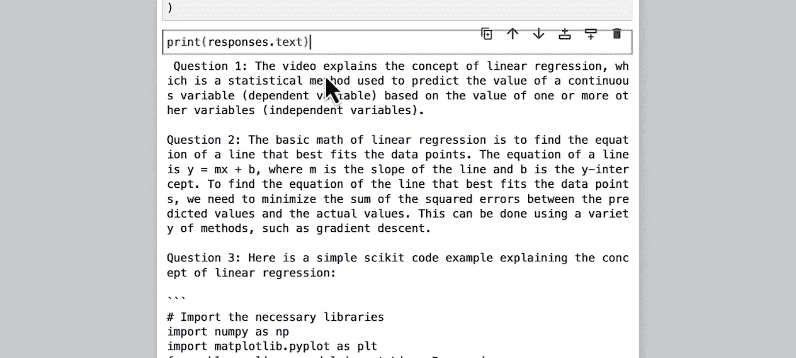

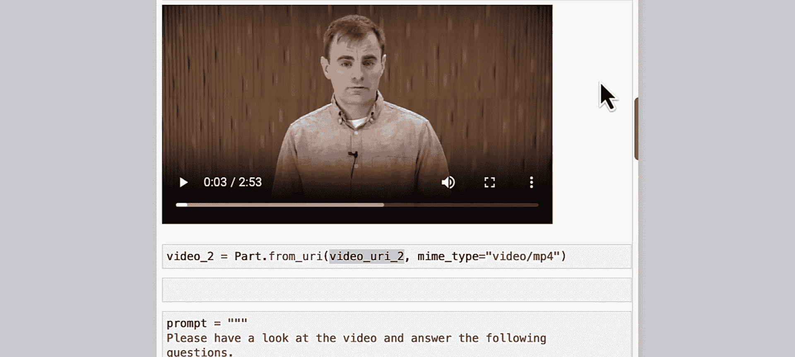

```python
prompt = “””
请观看视频并回答以下问题：
1. 视频中解释的核心概念是什么？
2. 基于问题1的答案，请解释该概念的基本数学原理。
3. 基于上述概念，请提供一个简单的Scikit-learn代码示例来说明它。
“””

contents2 = [video2_part, prompt]
```

### 获取并验证回答

```python
response2 = model.generate_content(contents2, stream=False)
print(response2.text)
```

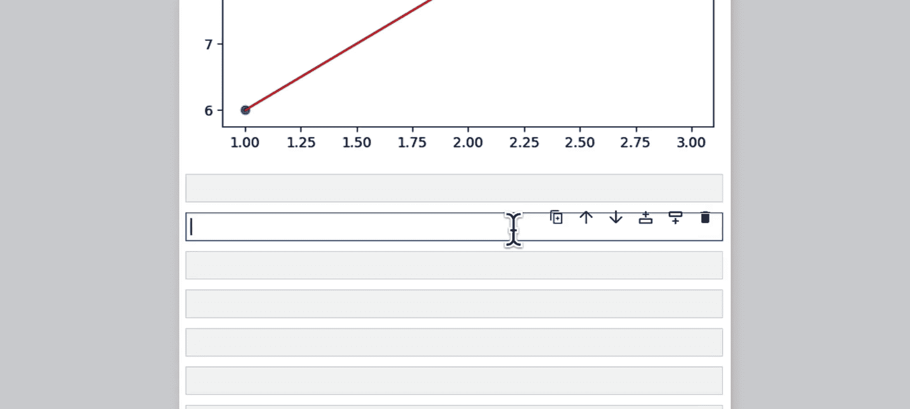

**模型输出可能包括**：
1.  概念：线性回归。
2.  数学原理：公式 **y = mx + b**。
3.  代码示例：一段使用 `sklearn.linear_model.LinearRegression` 的Python代码。

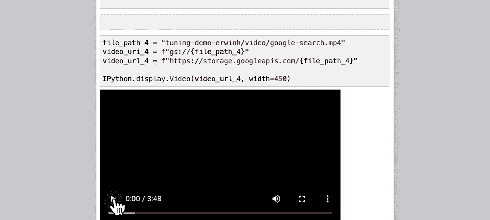

**重要提示**：当模型生成代码时，务必进行检查和测试，因为输出可能存在错误或不准确之处。

---

## 用例三：从视频中提取信息并制表

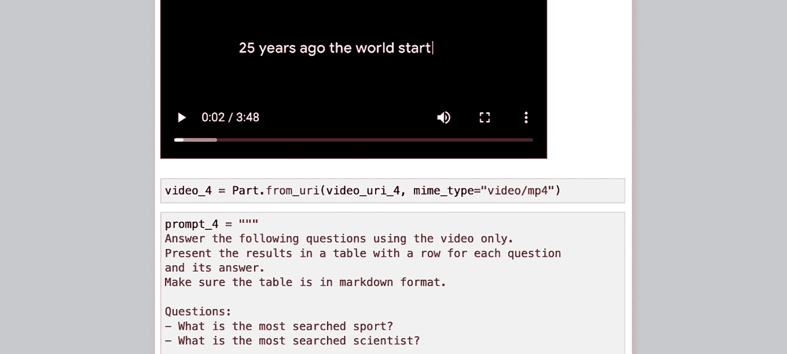

本节我们将练习如何从视频中提取特定信息，并要求模型以结构化的表格形式返回结果，便于查看和分析。

### 加载示例视频
我们使用一个包含多种信息图表的视频。

```python
video3_uri = "gs://your-bucket/path/to/infographic_video.mp4"
video3_part = Part.from_uri(video3_uri, mime_type="video/mp4")
```

### 编写提示词以生成表格
我们要求模型以Markdown表格的形式回答问题。

```python
prompt_table = “””
请根据视频内容回答以下问题，并将答案以Markdown表格形式呈现。
表格应有两列：‘问题’和‘答案’。

问题：
1. 视频中提到搜索量最大的运动是什么？
2. 视频中提到搜索量最大的科学家是谁？
（你可以根据视频内容添加更多问题）
“””

contents3 = [video3_part, prompt_table]
response3 = model.generate_content(contents3, stream=False)
print(response3.text)
```

**输出示例**：
| 问题 | 答案 |
| :--- | :--- |
| 搜索量最大的运动是什么？ | 足球 |
| 搜索量最大的科学家是谁？ | 尼古拉·特斯拉 |

**注意**：多模态模型有时会产生“幻觉”，即输出视频中并不存在的信息。如果遇到这种情况，可以尝试优化提示词，例如增加“如果视频中未提及，请回答‘未找到’”等指令。

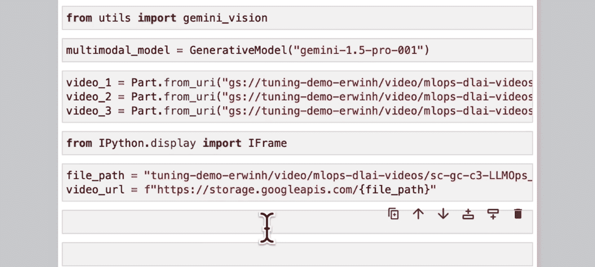

---

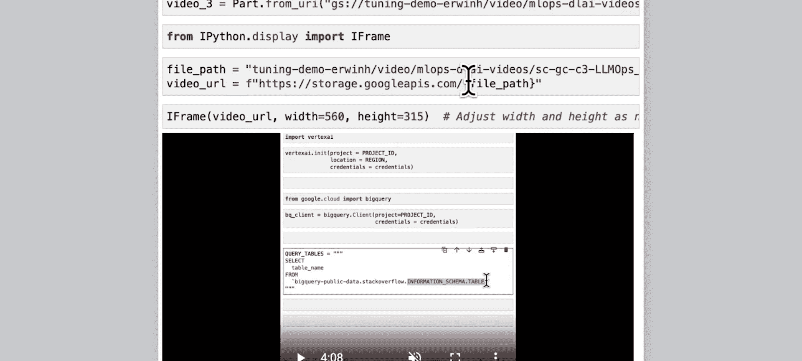

## 用例四：大海捞针——在长视频中检索特定信息

在最后这个用例中，我们将挑战模型的极限，学习如何利用其大上下文窗口，在总计超过50分钟的三个长视频中，精准定位一段特定的代码片段。这就是所谓的“大海捞针”测试。

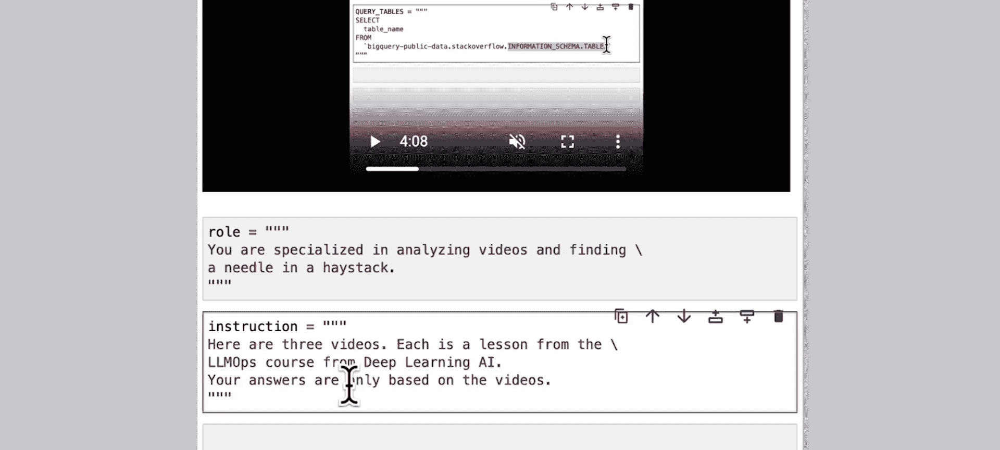

### 加载多个长视频
我们准备三个来自深度学习课程的长视频。

```python
# 加载三个视频部分
long_video_parts = []
uris = [“uri_video1”, “uri_video2”, “uri_video3”]
for uri in uris:
    part = Part.from_uri(uri, mime_type=“video/mp4”)
    long_video_parts.append(part)
```

### 设计复杂的检索提示词
我们采用更严谨的提示词结构：角色 -> 指令 -> 内容 -> 问题。

```python
role_needle = “你是一个专门用于分析视频内容并执行精确信息检索的AI助手。”
instruction = “””
这里有三个视频，均是‘大语言模型运维’课程的不同章节。你的回答必须严格基于这三个视频的内容。
“””
questions = “””
请完成以下任务：
1. 为每个视频生成一个不超过100字的摘要。
2. 在哪个视频中，讲师运行并解释了以下Python代码？请提供视频编号及该代码出现的大致时间戳。
代码片段：`bigquery.Client().query(...)`
“””
```

### 执行检索并分析结果

```python
# 组合所有内容：角色、指令、三个视频、问题
all_contents = [role_needle, instruction] + long_video_parts + [questions]

response_final = model.generate_content(all_contents, stream=True)
for chunk in response_final:
    print(chunk.text)
```

**模型可能输出**：
1.  三个视频的准确摘要。
2.  指出目标代码出现在“第二个视频”，时间戳约为“4分19秒”。

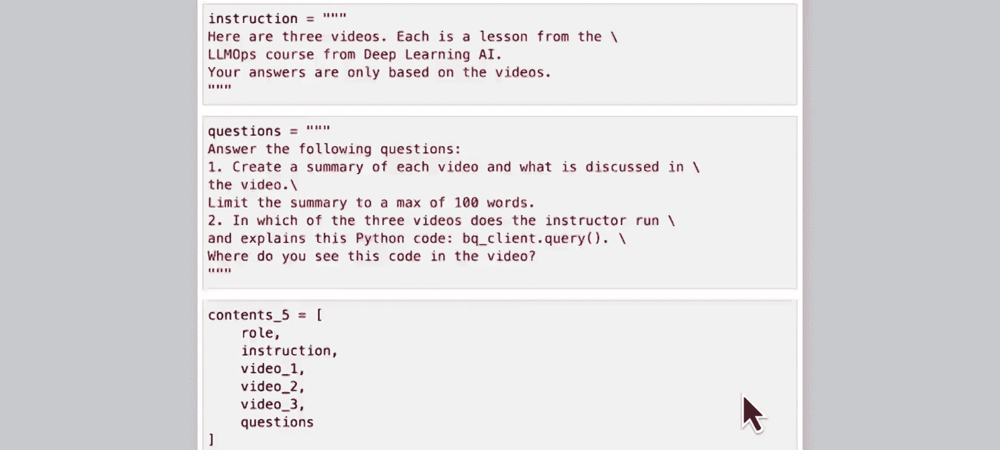

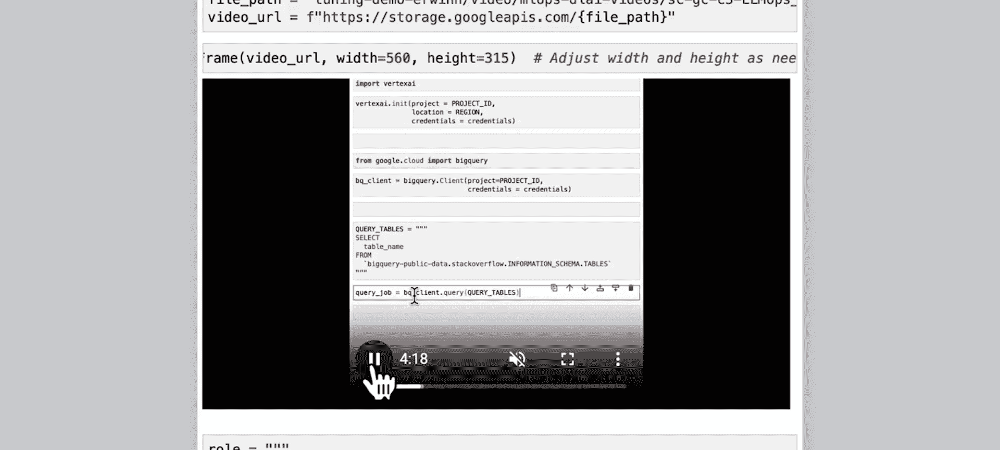

通过跳转到指定视频的对应时间点，我们可以验证模型检索的准确性。这项能力使得从海量视频内容中快速定位特定信息成为可能，极大地提升了效率。

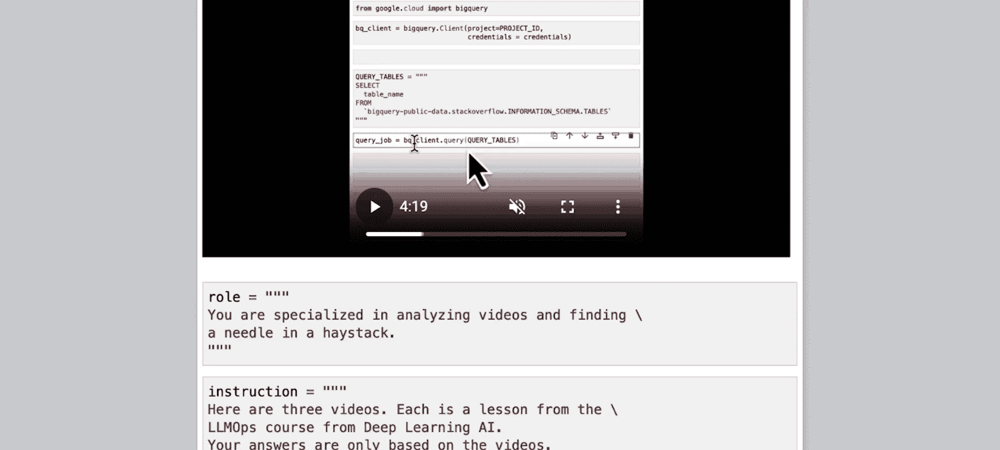

**实验建议**：你可以尝试调整提示词中各部分的顺序（例如将角色描述放在最后），观察这对模型的输出有何影响，从而更深入地理解提示词工程。

---

## 总结
本节课中，我们一起学习了使用Gemini多模态模型处理视频的多种实用技巧：
1.  **生成元数据**：无需预处理，即可从视频中提取标题、描述和结构化信息。
2.  **内容问答**：能够基于视频细节进行链式提问和回答。
3.  **信息提取与制表**：将视频中的关键信息以结构化表格形式输出。
4.  **大海捞针式检索**：利用大上下文窗口，在多个长视频中精准定位特定片段。

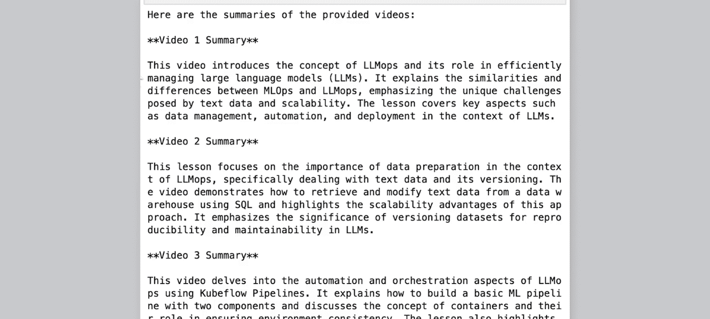

通过将复杂的任务分解为结构化的提示词，并充分利用模型的多模态理解能力，我们可以高效地让模型“看懂”视频，并完成各类自动化处理任务。