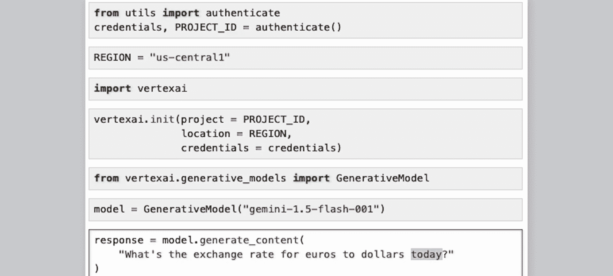
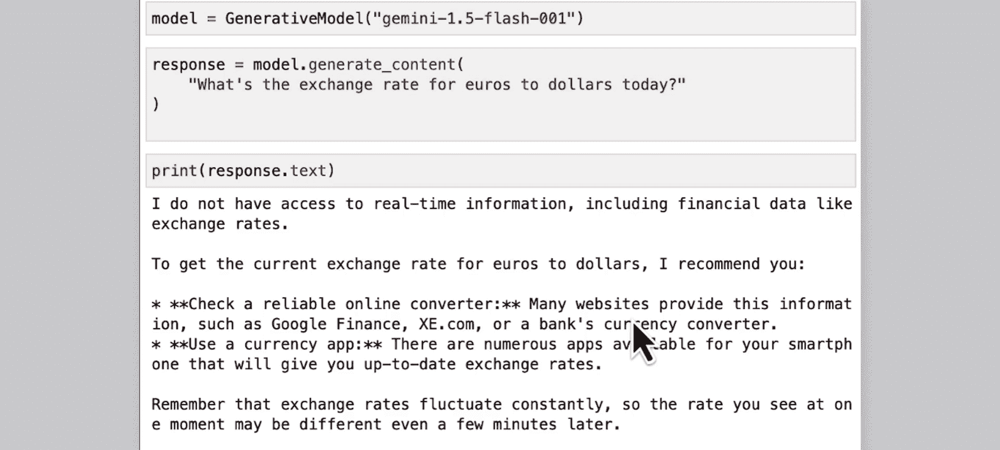
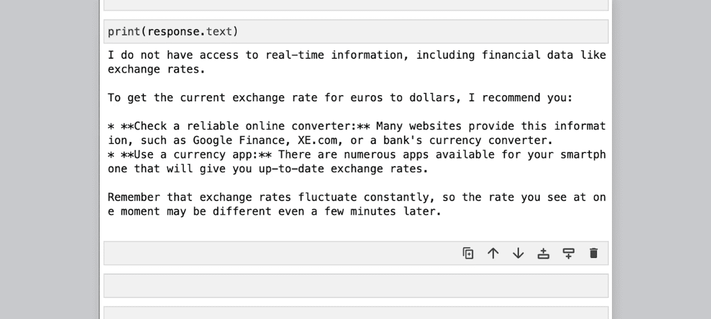
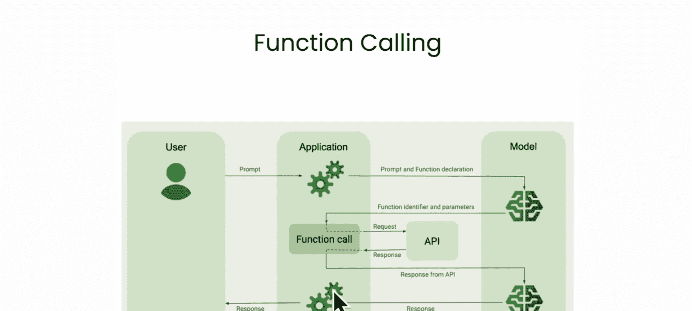
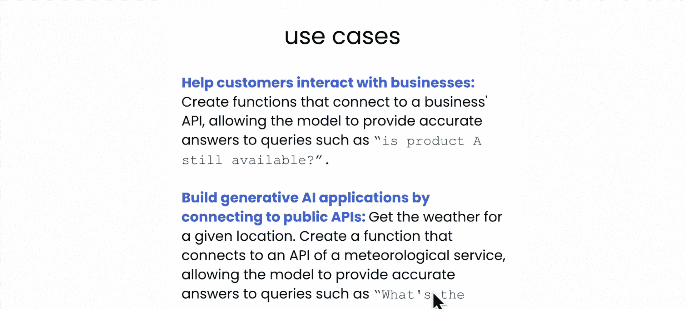
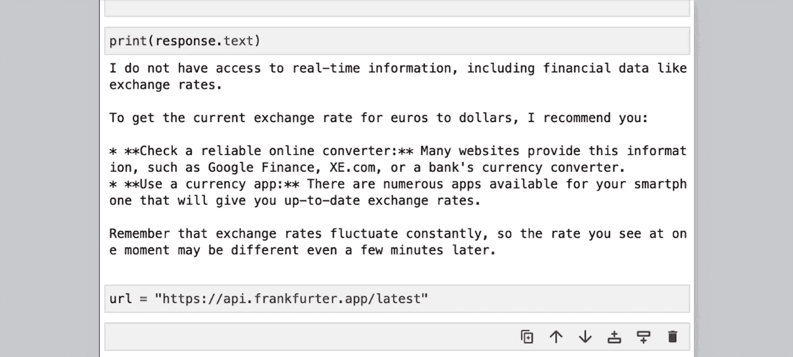
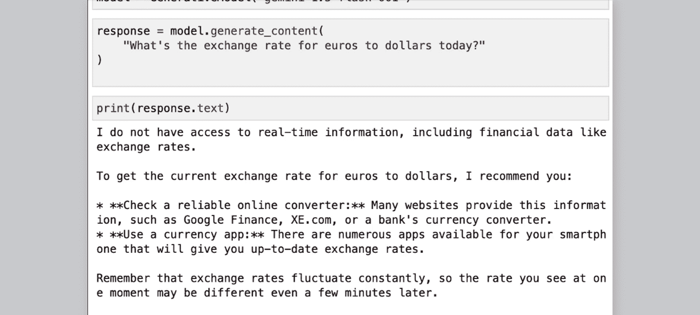
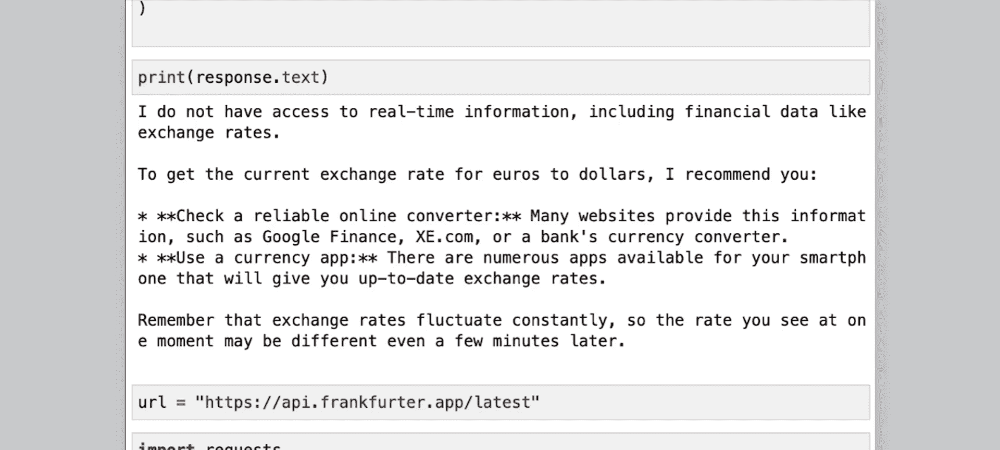
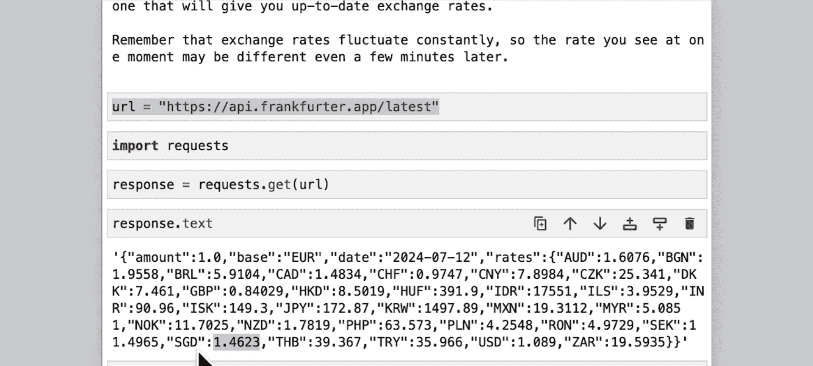
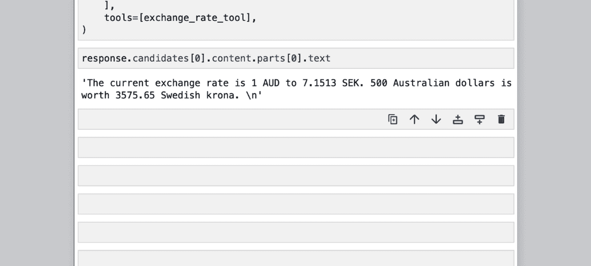

# 007：使用函数调用整合实时数据 📡


在本节课中，我们将学习如何通过“函数调用”功能，为大型语言模型（如Gemini）整合实时数据。这将解决模型知识陈旧、无法查询外部数据的问题，从而提升应用程序的准确性和自动化程度。


---

## 函数调用的必要性

上一节我们介绍了模型的基本调用。本节中我们来看看当模型知识不足时，我们如何为其赋能。

想象一下，你想知道欧元对美元的当前汇率。你可能会直接询问模型：“今天欧元对美元的汇率是多少？”。



为了测试，我们首先初始化Gemini API并调用模型：



```python
# 初始化模型并提问
prompt = "今天欧元对美元的汇率是多少？"
response = model.generate_content(prompt)
print(response.text)
```

模型可能会回复：“我无法访问实时信息，包括像汇率这样的金融数据。” 这表明大型语言模型存在两个主要限制：
1.  它们在训练后知识就被“冻结”，导致信息可能过时。
2.  它们不能主动查询或修改外部数据源。



**函数调用** 正是为了解决这些缺点而设计的功能。

---

## 函数调用的工作原理

那么，函数调用具体是如何工作的呢？它允许我们定义自定义函数并将其提供给模型。

以下是其工作流程的分解：
1.  **定义函数**：你创建一个函数（例如 `get_weather`），并详细描述它的功能、参数和返回值。
2.  **模型决策**：当用户提出请求（如“波士顿的天气如何？”）时，模型会分析你提供的函数列表，判断是否需要调用某个函数来获取信息。
3.  **输出结构化请求**：模型**不会直接执行函数**，而是输出一个结构化的请求，指明应该调用哪个函数以及需要传入什么参数（例如 `{“function”: “get_weather”, “location”: “Boston”}`）。
4.  **执行外部调用**：你的应用程序代码接收到这个结构化请求后，使用任何你喜欢的编程语言、框架或库去真正调用外部API（如天气服务API）。
5.  **反馈结果**：将API返回的结果（如“波士顿当前38华氏度，局部多云”）再次交给模型。
6.  **生成最终回复**：模型结合原始问题和API返回的数据，生成最终回复给用户。

这种模式的优势在于，你将模型强大的语言理解能力与你对代码、API和后端系统的完全控制权结合了起来。



---

## 实战：构建汇率查询函数

理解了原理后，让我们动手构建一个能查询实时汇率的函数。我们将使用欧洲中央银行（ECB）提供的开源汇率API。



首先，我们查看目标API的返回格式：

```python
import requests

url = “https://api.frankfurter.app/latest”
response = requests.get(url)
print(response.json())
```



API返回的JSON数据类似这样，其中基础货币是欧元：
```json
{
  “base”: “EUR”,
  “rates”: {
    “USD”: 1.0808,
    “SGD”: 1.4623,
    ...
  }
}
```



接下来，我们需要为模型定义函数声明。以下是关键步骤：



首先，导入必要的类并定义函数规范。函数声明需要详细描述函数的目的、参数及其类型。

```python
from google.generativeai.types import FunctionDeclaration, Tool



# 1. 定义函数声明
get_exchange_rate_func = FunctionDeclaration(
    name=“get_exchange_rate”,
    description=“获取两种货币之间的汇率”，
    parameters={
        “type”: “OBJECT”,
        “properties”: {
            “date”: {“type”: “STRING”, “description”: “获取汇率的日期，格式为YYYY-MM-DD”},
            “from”: {“type”: “STRING”, “description”: “要转换的起始货币代码，如EUR、USD”},
            “to”: {“type”: “STRING”, “description”: “要转换成的目标货币代码，如SGD、SEK”}
        },
        “required”: [“date”, “from”, “to”]
    }
)
```

然后，将函数声明封装到一个工具（Tool）中，供模型使用。

```python
# 2. 将函数声明封装到工具中
exchange_rate_tool = Tool(
    function_declarations=[get_exchange_rate_func]
)
```

现在，我们可以向模型提问，并传入我们定义的工具。

```python
# 3. 向模型提问，并传入工具
prompt = “澳大利亚元到瑞典克朗的汇率是多少？500澳大利亚元在瑞典克朗中值多少钱？”
response = model.generate_content(prompt, tools=[exchange_rate_tool])
print(response.text)
```

模型会分析问题，并判断需要调用 `get_exchange_rate` 函数。它返回的将不是一个自然语言答案，而是一个结构化的函数调用请求：

```json
{
  “function_call”: {
    “name”: “get_exchange_rate”,
    “args”: {
      “date”: “2024-12-07”,
      “from”: “AUD”,
      “to”: “SEK”
    }
  }
}
```

---

## 执行API调用并生成最终回复

模型给出了结构化请求，接下来就需要我们的代码来执行真正的API调用。

首先，我们从模型的响应中提取出函数调用参数。

```python
# 4. 从模型响应中提取函数调用参数
response_dict = response.candidates[0].content.parts[0].function_call
func_name = response_dict.name
args = response_dict.args

# args 现在是一个包含 {‘date’: ‘2024-12-07’, ‘from’: ‘AUD’, ‘to’: ‘SEK’} 的字典
```

然后，使用这些参数调用真实的汇率API。

```python
# 5. 使用参数调用真实API
api_url = f“https://api.frankfurter.app/{args[‘date’]}”
params = {“from”: args[‘from’], “to”: args[‘to’]}
api_response = requests.get(api_url, params=params).json()
# api_response 可能为 {‘rates’: {‘SEK’: 7.1513}, ‘base’: ‘AUD’, ‘date’: ‘2024-12-07’}
```

最后，将API返回的结果再次传递给模型，让它结合原始问题生成最终的自然语言回复。

```python
# 6. 将API结果反馈给模型，生成最终回复
final_response = model.generate_content([
    prompt, # 用户原始问题
    response.candidates[0].content.parts[0], # 模型的函数调用请求
    api_response # 真实的API结果
])
print(final_response.text)
```

模型会输出类似这样的最终答案：“当前汇率是1澳元兑7.1513瑞典克朗，500澳元价值3575.65瑞典克朗。”

---

## 函数调用的优势与应用场景

通过以上步骤，我们完成了一个完整的函数调用流程。让我们总结一下函数调用的关键优势：
*   **简化用户体验**：用户无需在应用和模型间手动切换或复制信息。
*   **减少错误**：自动化数据传递避免了手动输入可能产生的错误。
*   **提升自动化**：为更复杂的操作（如航班预订、酒店查询）提供了由自然语言直接触发的可能。

函数调用适用于任何需要为模型注入最新、特定外部信息的场景，例如：
*   **客户服务**：查询企业API，获取产品库存、最新价格。
*   **旅行应用**：获取实时航班信息、酒店价格并完成预订。
*   **资讯应用**：获取最新新闻、天气或金融市场数据。

---

## 总结



本节课中，我们一起学习了如何使用Gemini的**函数调用**功能来整合实时数据。我们了解了其工作原理，并一步步实践了如何定义函数声明、处理模型的结构化请求、执行外部API调用，以及将结果反馈给模型以生成最终答案。通过这种方式，我们可以有效克服大型语言模型的知识时效性限制，构建出更强大、更智能的应用程序。