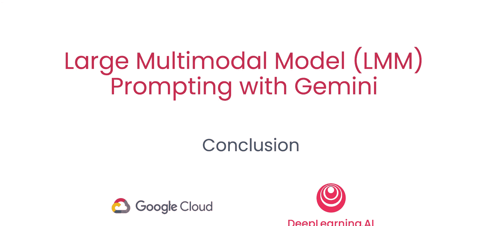

# 008：总结 🎯

在本节课中，我们将一起回顾整个课程的核心内容，总结关于使用Gemini大型多模态模型进行提示的关键知识与技能。

## 课程概述

在之前的章节中，我们学习了Gemini模型的不同类型，探索了如何使用文本、图像和视频来提示多模态模型，并研究了高效多模态提示的最佳实践。此外，我们还探讨了涉及图像和视频的各种应用场景，例如从复杂内容中提取特定信息，以及解决“大海捞针”式的难题。最后，我们学习了如何通过函数调用整合实时数据，以增强语言模型的能力。



## 核心内容总结

以下是我们在本课程中共同学习的主要内容要点：

1.  **模型类型**：我们了解了Gemini系列中不同规模和用途的模型，例如适用于快速响应的`gemini-pro`和专为视觉任务设计的`gemini-pro-vision`。

2.  **多模态提示**：我们掌握了如何构建有效的提示（Prompt），使其能够同时处理文本、图像乃至视频输入。一个基础的文本提示结构如下：
    ```python
    prompt = “请描述这张图片中的主要内容。”
    ```

3.  **最佳实践**：我们研究了提升提示效果的方法，包括明确任务指令、提供上下文示例（Few-shot Learning）以及结构化输出要求。

4.  **应用用例**：我们探索了多模态模型在具体场景中的应用，例如：
    *   **信息提取**：从一张包含文字和图表的产品图中提取价格、规格等关键数据。
    *   “**大海捞针**”测试：在冗长的文本或复杂的图像中，定位并回答一个非常具体的问题，以检验模型的理解与检索能力。

5.  **扩展与集成**：我们学习了通过**函数调用（Function Calling）** 将大模型与外部API或数据库连接起来。这使得模型不仅能生成回答，还能触发实际行动，例如获取实时天气数据或查询最新股价。其基本流程可以概括为：
    `用户查询` -> `模型识别意图并生成函数调用请求` -> `执行外部函数获取实时数据` -> `模型整合数据生成最终回答`。


## 结束语

本节课中，我们一起回顾了使用Gemini进行大型多模态模型提示的核心知识体系。从认识模型本身，到掌握文本、图像、视频的提示方法，再到学习提示工程的最佳实践和探索丰富的应用场景，最后延伸到通过函数调用实现与实时数据的集成。希望这些内容能帮助你更好地理解并运用多模态大模型来解决实际问题。