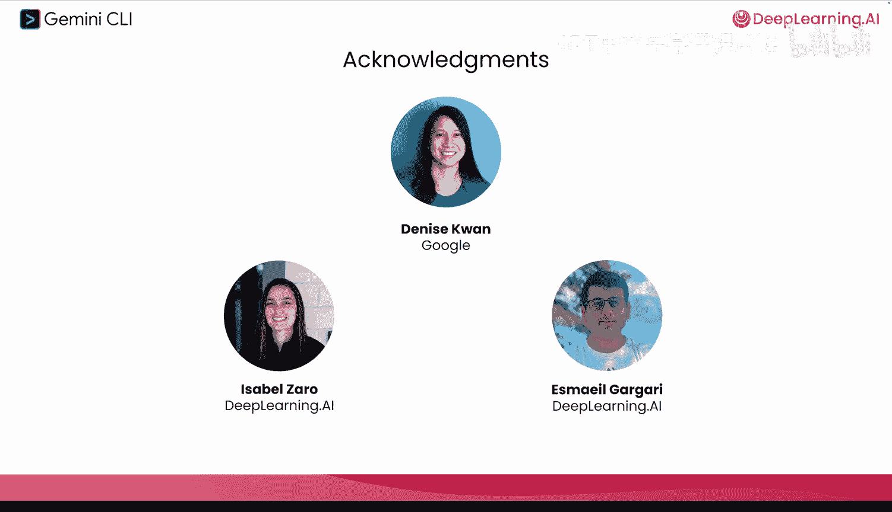

# 001：课程介绍 🚀

在本节课中，我们将要学习由吴恩达与谷歌合作推出的《Gemini CLI：使用开源智能体进行代码开发与创作》课程。我们将了解如何利用AI智能体编码助手来显著提升工作效率，并探索其在软件开发乃至非编码任务中的广泛应用。

## 课程概述

欢迎来到Gemini CLI课程。谷歌的开发者们正在使用智能体生成式编码助手来极大地加速工作流程。本课程将介绍谷歌内部关于智能体生成式编码的最佳实践。

上一节我们介绍了课程背景，本节中我们来看看课程的具体内容。你将学习如何将其应用于常见场景，例如构建Web前端、使用GitHub Actions自动化代码审查，甚至是创建社交媒体多媒体内容等非编码任务。

我个人非常喜欢使用Gemini CLI，并希望你也从中获得巨大价值。我们很高兴本课程的讲师是谷歌的开发者倡导者Jack Wellerwood。

感谢吴恩达。Gemini CLI是众多智能体编码助手之一，你可能已经使用或听说过。

## 课程学习路径

本课程将带你从安装Gemini CLI开始，一直到在自动化工作流中组织和协调多个工具与MCP服务器。

以下是课程的核心学习模块：

*   **协调开发**：学习如何在本地文件与云服务之间进行协调，以开发功能和分析数据。
*   **优化输出**：通过设计Gemini的上下文和记忆，以获得最佳的输出结果。
*   **自动化任务**：在后续课程中，你将使用复杂的自动化来处理诸如代码审查之类的常规任务。

在整个课程中，你将探索Gemini CLI在软件开发及其他领域的应用。我们将以策划一场AI会议（如下一届AI开发大会）为例。

以下是基于该示例你将完成的具体任务列表：

*   使用Gemini CLI原生的Google Workspace扩展，与文档和日历协作，为会议网站构建关键功能。
*   使用Canva MCP服务器创建会议营销材料。
*   构建一个数据仪表板，将与会者数据与现有公司数据库相结合。
*   使用Gemini CLI处理多媒体，将会议播客转换为社交媒体剪辑和帖子。
*   作为额外收获，你将看到Gemini CLI如何帮助组织和搜索混乱的课程材料，使学习更轻松，这有望在你下一门深度学习AI课程中提供帮助。

## 智能体编码工具的价值

许多人正在使用像Gemini Code或OpenAI Codex这样的生成式编码系统。这些智能体生成式工具之所以有价值，是因为它们能够访问你的本地机器。

因此，你可以授予它们在机器上运行命令的权限，例如 `pip install`、`playwright`、`npx` 或 `git`，来为你完成工作。

事实上，仅需一小套工具，这些智能体编码助手就能快速设置所需的开发环境，并构建完整的应用程序或功能集。

特别是在原型设计方面，我现在几乎不再手动编写代码，而是让AI编码助手为我编写。这极大地加快了我以及许多其他开发者的速度。原型设计从未如此快速。

## Gemini CLI的开源优势

Gemini CLI令人兴奋的一点在于它是完全开源的。你可以确切地看到它是如何工作的。

每一行代码，包括实际的指令和系统提示，都在我们的GitHub上公开。

我们已经合并了来自社区成员的数千个拉取请求，其中包括会话管理等热门功能，并且我们欢迎你的贡献。开源软件对于创新至关重要，尤其是在AI时代。

如果你感兴趣，可以去GitHub仓库查看提示词。完成本课程后，你也可以考虑为Gemini CLI或其他开源项目做出贡献。这些贡献为每个人创造了价值。

## 致谢与启动

说到贡献，许多人共同努力创建了这门课程。我要感谢来自谷歌的Denise Kwan，以及来自DeepLearning.AI的Isabel Zro和Ismail Ggari。

在最初的课程中，你将看到如何启动和运行Gemini CLI，并体验社区中最常见的任务、内置工具和使用模式。我相信使用Gemini CLI会给你带来很多乐趣。

让我们进入下一个视频，开始学习吧。

---

**本节课中我们一起学习了**：Gemini CLI课程的总体介绍、学习路径、智能体编码工具的核心价值，以及其作为开源项目的优势。我们了解到本课程将通过一个策划AI会议的完整项目，带领我们从环境搭建深入到复杂的自动化工作流。