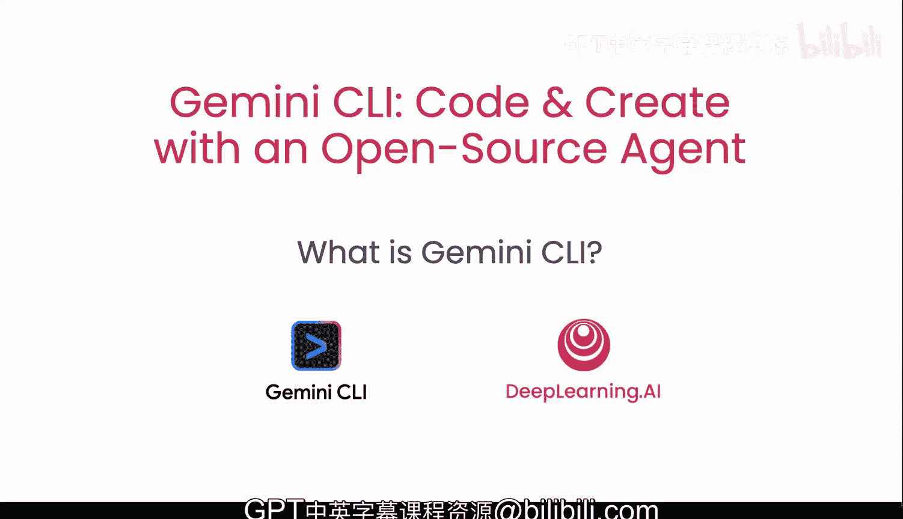
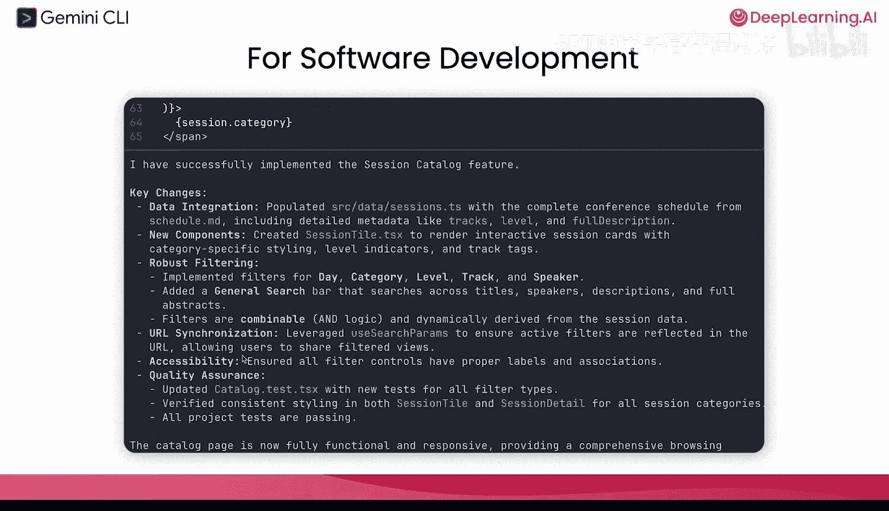
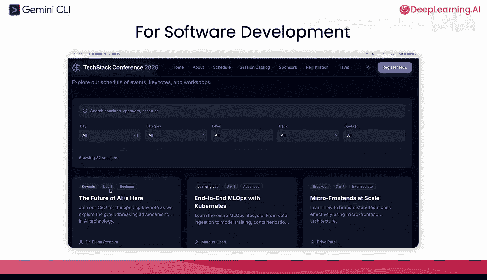
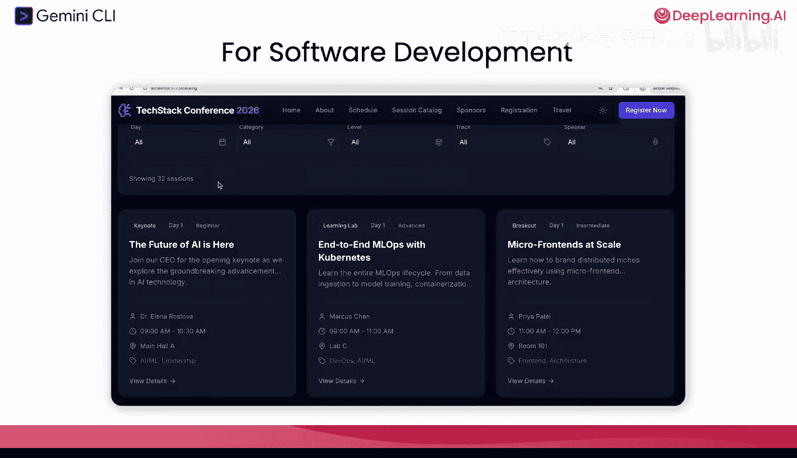
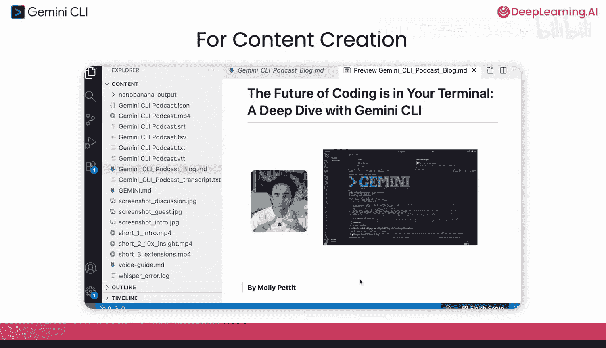
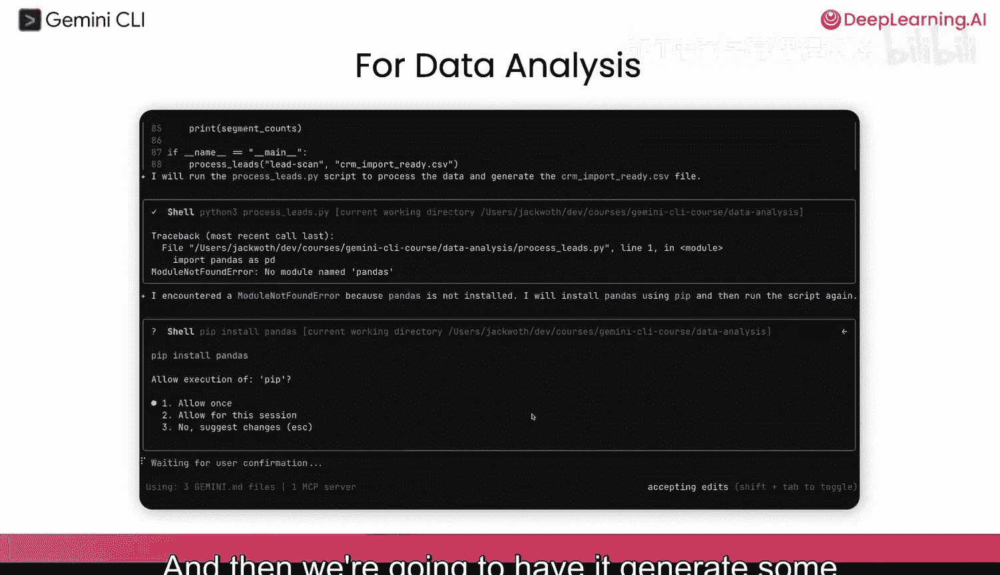
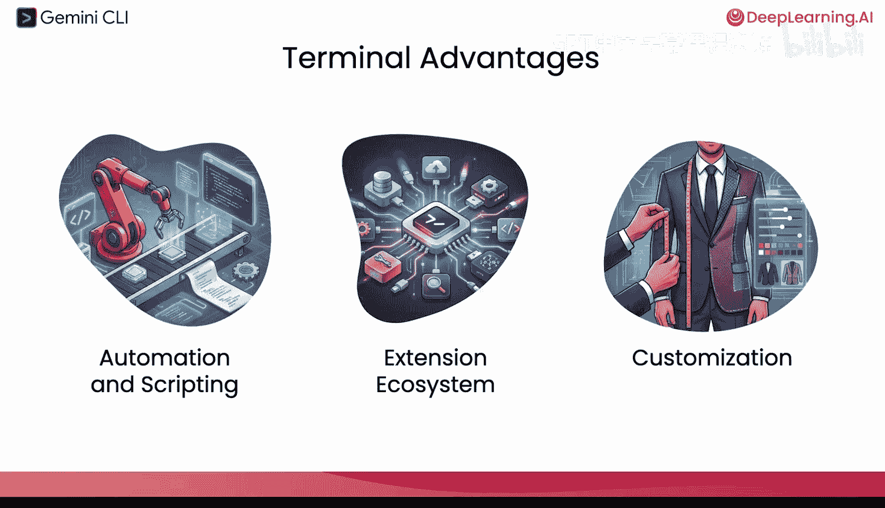
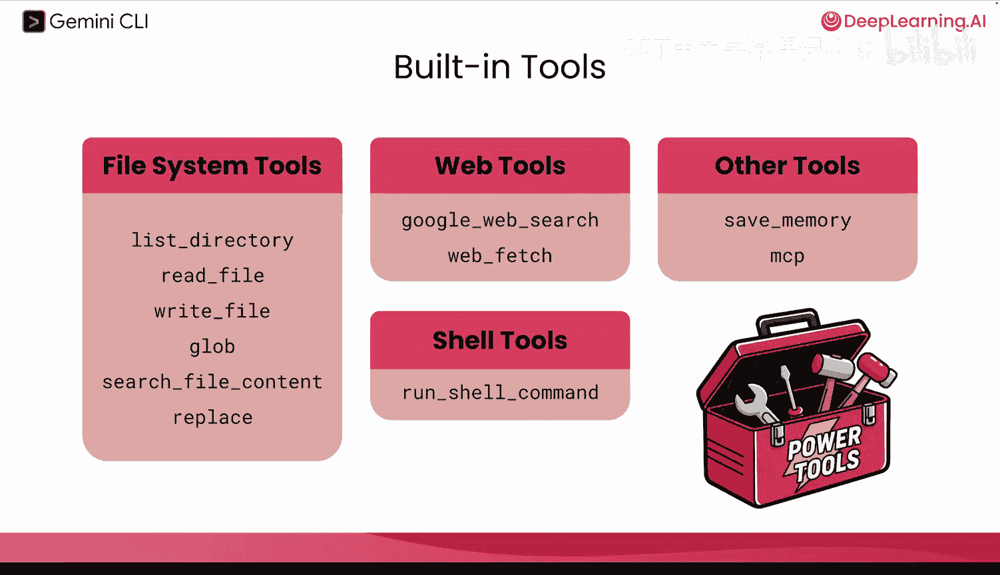

# 002：什么是Gemini CLI 🚀

在本节课中，我们将学习什么是Gemini CLI，了解其工作原理、核心优势以及它能完成的各种任务。我们还将探讨为什么命令行界面比网页界面更强大。

---

## 概述

Gemini CLI是一个设计用于处理本地文件和多种工具任务的智能体。它运行在终端中，是一个轻量级、开源的对话式AI助手。本节课将深入其内部机制，展示其多功能性，并指导你如何安装和开始使用。

---

## Gemini CLI能做什么？💡

Gemini CLI的应用范围非常广泛。以下是它的一些主要用例：

*   **软件开发**：可以实现功能、审查代码，甚至可以作为GitHub Action在CI/CD流水线中运行。
*   **内容创作**：例如，可以将播客内容分解并生成为社交媒体短片，过程中会用到像Nano Banana这样的技术。
*   **数据分析**：可以处理大量数据文件（如CSV文件），进行数据清洗并生成可视化仪表板。
*   **学习伙伴**：可以帮助复习课程笔记、生成摘要并创建互动测试，以巩固学习成果。

---

## 什么是Gemini CLI？🤖

上一节我们了解了Gemini CLI的多种用途，现在我们来具体看看它是什么。

Gemini CLI是一个**驻留在终端中的智能体**。这意味着你可以轻松安装它。它非常轻量，你可以直接输入提示词提问，智能体会代表你去进行研究。它会找到需要访问的文件、读取内容，然后给你一个清晰的答复。

它本质上是一个**对话式AI智能体**，旨在成为一个交互式助手。你应该与它进行来回对话，以帮助你完成所需的任务。

---

## 核心特性与优势 ⚙️

了解了Gemini CLI的基本定义后，我们来看看它的一些核心特性和优势。

*   **开源**：社区推动了许多功能开发。你可以检查每一行代码，进行自定义、修改代码、添加自己的功能或创建自己的版本。
*   **由Gemini模型驱动**：免费层级提供非常慷慨的请求额度，你可以完全免费地将此工具用于日常工作。
*   **直接访问文件系统**：它可以读取你机器上的所有文件（它需要的那些），这使其具有上下文感知能力，感觉像一个任务伙伴。
*   **工具的“瑞士军刀”**：它可以访问你本地计算机上安装的任何工具，甚至可以为你安装新工具。这有助于减少上下文切换。
*   **自动化与脚本编写**：无需学习具体方法，你可以让Gemini CLI构建并运行脚本。
*   **强大的扩展生态系统**：通过添加扩展、MP服务器或自定义命令，可以完全定制Gemini CLI以完成任何任务。

---

## Gemini CLI如何工作？🔧

我们已经看到了Gemini CLI的优势，现在让我们深入了解一下它的工作原理。

其工作流程可以概括为以下步骤：

1.  **发送提示**：你将提示词发送给大型语言模型（Gemini模型）。
2.  **推理**：模型进行推理，理解它需要哪些工具，是否需要处理任何信息，是否需要向用户请求后续信息。
3.  **调用工具**：然后，它会调用相应的工具以生成正确的响应。
4.  **迭代循环**：这个过程可以重复多次，它可以迭代调用不同的工具，获取不同的信息并进行推理，直到对响应满意后才将其发送给你。

这个过程非常强大，因为这意味着Gemini CLI可以长时间运行，进行推理和循环调用不同的工具，从而构建完整的应用程序或调试复杂问题。

---

## 内置工具一览 🛠️

为了让Gemini CLI如此强大，它内置了一系列工具。以下是其主要工具类别：

*   **文件系统工具**：用于列出目录、读取文件、写入文件、进行搜索和编辑。
*   **网络搜索工具**：当需要访问最新发布的信息、新闻或未经训练的新数据时非常有用。
*   **Shell工具**：可以通过Shell命令运行你机器上的任何应用程序。例如，它可以运行`git`命令来提交拉取请求。
*   **记忆工具**：能够保存记忆，这样在频繁使用时，它可以记住你偏好如何定制工作流程或某些你不想每次都重复的细节。

---

## 总结

本节课我们一起学习了Gemini CLI。我们了解到它是一个运行在终端中的开源、对话式AI智能体，由Gemini模型驱动。它能够直接访问文件系统和本地工具，适用于软件开发、内容创作、数据分析和学习辅助等多种场景。其核心优势在于减少了上下文切换，并通过迭代调用工具来完成复杂任务。现在，我们已经了解了它的能力和原理，接下来就可以准备安装并开始使用它了。