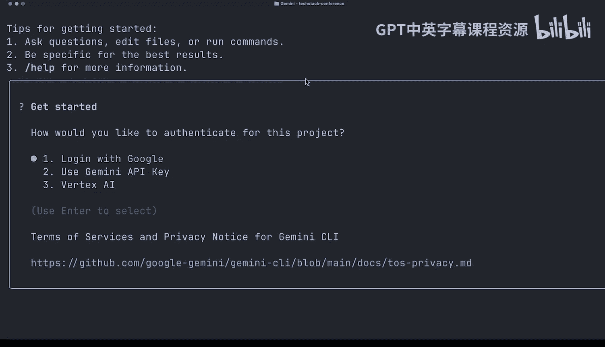
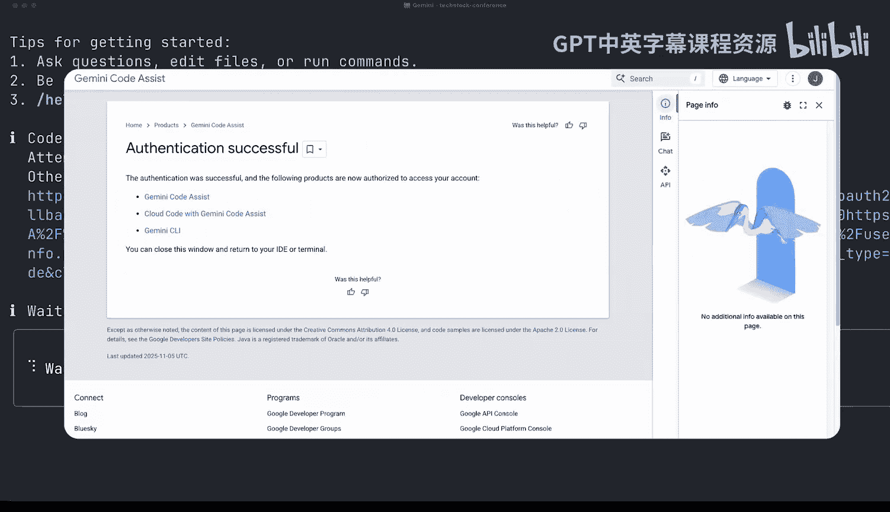
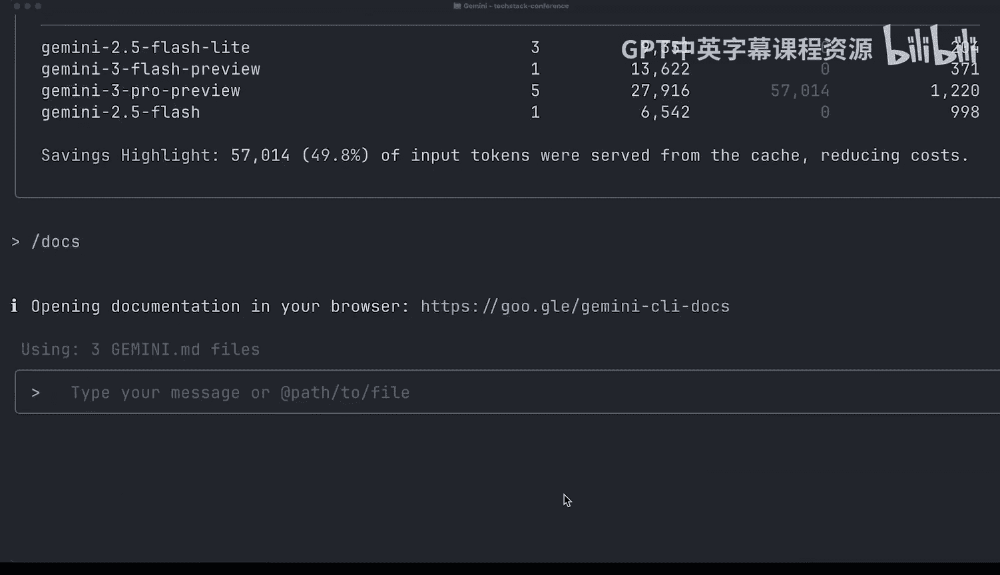
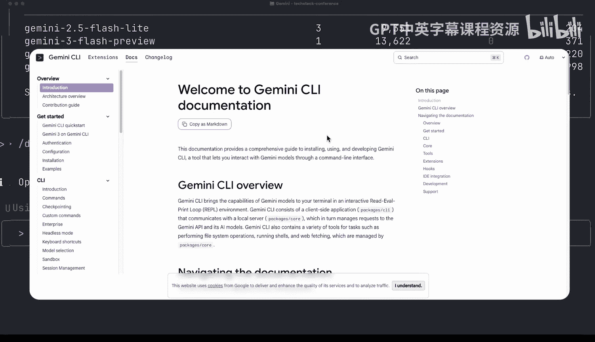
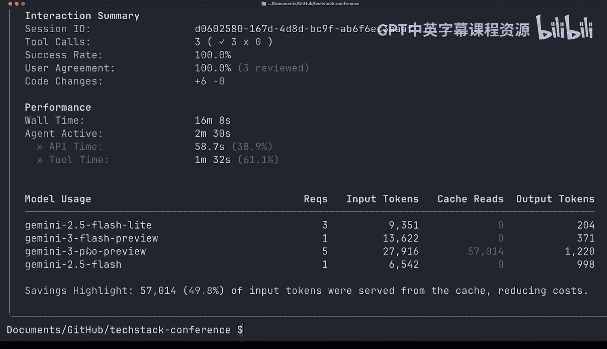

# 003：3. 初识 Gemini CLI 🚀

在本节课中，我们将学习如何安装并启动 Gemini CLI，探索其基本命令，并尝试完成第一个工作流程。我们将扮演一个科技会议组织者的角色，利用 Gemini CLI 来协助完成网站建设、研究规划、社交媒体运营及会后数据分析等一系列任务。

## 安装与启动


上一节我们介绍了课程背景，本节中我们来看看如何安装并运行 Gemini CLI。

首先，你需要安装 Node.js，因为 Gemini CLI 是一个 NPM 包。安装命令如下：

```bash
npm install -g @google/gemini
```

此命令会将 Gemini CLI 作为全局包安装，以便你可以在机器上的所有项目中使用它。



安装完成后，你可以在终端中通过输入 `gemini` 命令来启动它。启动时，请确保你位于项目目录下（例如我们的会议项目文件夹）。启动后，系统会提示你进行身份验证。



以下是三种身份验证方法：
*   **使用 Google 账户登录**：这是本课程推荐的方式，可访问免费层级。
*   **使用 API 密钥**：适用于后续需要更多请求的情况。
*   **使用 Vertex AI**：同样适用于需要更多请求的场景。

选择“使用 Google 登录”并回车，系统将在你的浏览器中打开 OAuth 流程。完成验证后，返回终端即可看到验证成功的提示。

## 界面与基本命令

成功启动后，你将看到 Gemini CLI 的界面，包含一些提示信息和 Gemini 横幅。默认情况下，系统使用“auto”模式智能选择最适合当前请求的 Gemini 模型。

要了解如何开始使用，可以输入 `s help` 命令。

以下是 `s help` 命令会列出的一些核心内置命令和快捷键：
*   `s settings`：打开设置菜单。
*   `s clear`：清除当前会话历史。
*   `s stats`：查看当前会话的统计信息。
*   `s docs`：在 CLI 内直接打开官方文档。
*   `s exit` 或 `s quit`：退出 Gemini CLI。

另一个有用的命令是 `s settings`。在设置中，你可以启用 Vim 模式、隐藏底部状态栏以使界面更简洁，或通过 `s theme` 自定义配色方案。

## 执行第一个任务

现在，让我们开始执行第一个任务。去年（2025年）的会议组织者留下了一份建议文件 `suggestions.md`。

我们可以使用 `@` 符号来引用该文件，为 Gemini CLI 提供上下文。输入提示词：“阅读 `@suggestions.md` 文件并总结建议”。Gemini CLI 会读取文件内容并给出总结，例如关于网站、日程安排和社交媒体标签的建议。

为了确保建议不过时，我们可以让 Gemini CLI 联网搜索最新的行业最佳实践。输入提示词：“根据在线最佳实践，验证这些建议是否仍然适用”。Gemini CLI 将调用网络搜索工具获取最新信息。

搜索完成后，我们可以让 Gemini CLI 将新发现整合到原始文档中。输入提示词：“将新的发现添加到 `suggestions.md` 文件中”。此时，Gemini CLI 会调用文件编辑工具并给出修改建议。

在处理工具调用建议时，你有多个选择：
*   按 `C S` 展开查看完整的更改差异。
*   选择 **允许一次**、**始终允许** 此工具，或在外部编辑器（如 VS Code）中打开。
*   也可以选择 **拒绝** 建议。

我们选择允许并写入文件。现在，`suggestions.md` 文件就包含了历史建议和最新的网络最佳实践。

## 会话管理与总结

完成一个任务后，最好使用 `s clear` 命令清除当前会话历史。这可以移除所有工具调用和对话记录，让你能清晰地开始下一个任务。

要查看当前会话的统计数据，可以运行 `s stats` 命令。它会显示模型所做的代码更改、工具调用、请求数量以及所使用的模型。由于我们使用“auto”模式，你会看到请求被智能地分配给了不同的模型。



如果需要了解更多功能或遇到问题，可以随时在 CLI 内运行 `s docs` 命令来打开官方文档。

要退出 Gemini CLI，只需输入 `s exit` 或 `s quit`，退出前你会看到本次会话的简要历史快照。






本节课中我们一起学习了 Gemini CLI 的安装、身份验证、基本命令和界面操作，并完成了第一个结合文件上下文和网络搜索的工作流程。我们还了解了如何管理会话、查看统计信息以及获取帮助。下一节课，我们将更深入地探讨 Gemini CLI 中的上下文与记忆管理功能。