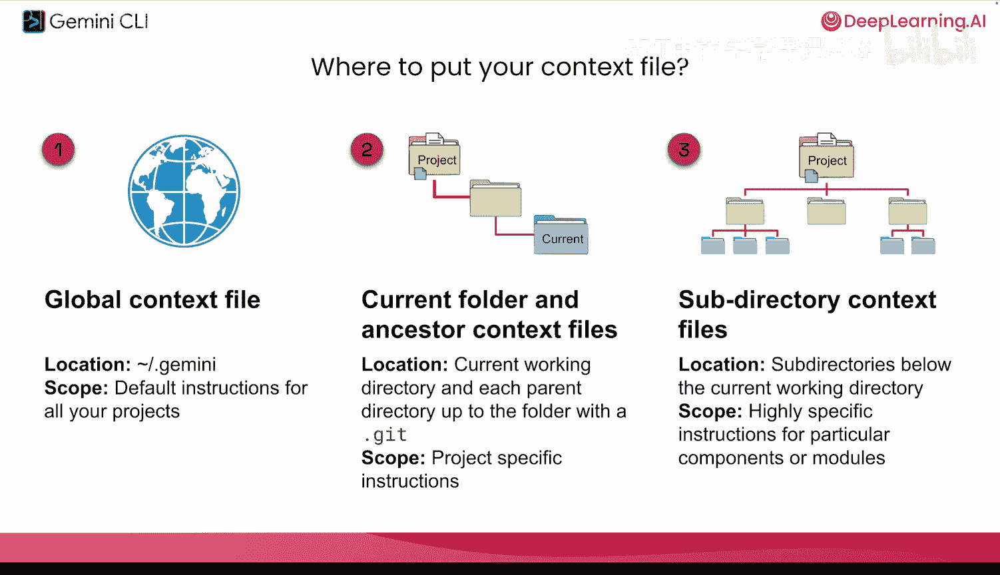
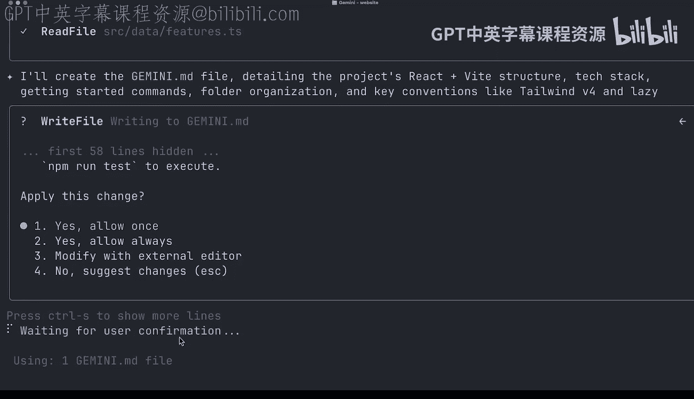
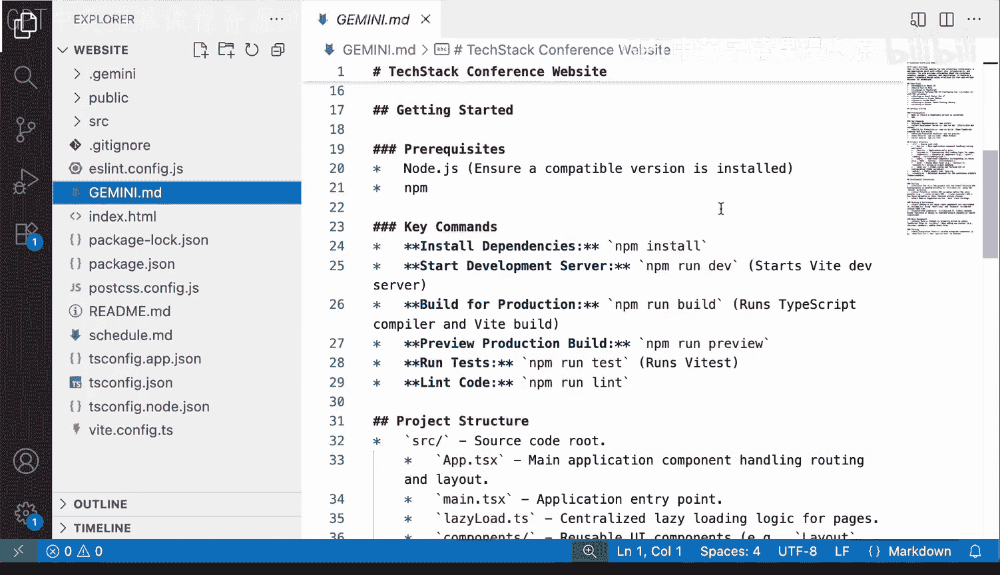
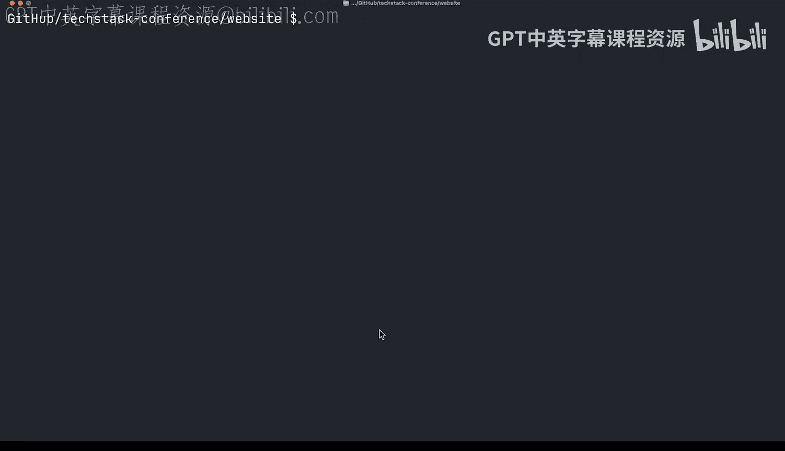

# 004：上下文是关键 🧠

在本节课中，我们将要学习AI智能体工作的核心——上下文。上下文决定了智能体知道什么以及如何行动，就像为你的私人助理提供工作手册一样重要。

## 什么是上下文？

上一节我们介绍了Gemini CLI的基本概念，本节中我们来看看其运作的基石：上下文。

上下文是AI智能体用来理解用户请求的信息集合。你可以将其想象为雇佣Gemini成为你的个人助理。你需要告诉它你的喜好和做事方式。

例如，如果你喜欢在咖啡里加12块糖，一个新助理不会知道这一点。Gemini CLI也是如此，我们需要为其提供必要的上下文，它才能高效地回答查询和响应。

## 上下文的类型

上下文可以以多种形式存在。以下是主要的几种类型：

*   **通用指令**：适用于所有项目的总体指导原则。
*   **项目特定指令**：针对特定项目的说明，例如“本项目使用Python”或“本项目使用UV而非Pip”。
*   **角色设定**：你可以为Gemini CLI设定一个角色，例如“你是一名QA测试员，请确保测试所有更改并在每次测试后结束”。

## 如何管理上下文文件？

那么，我们将所有这些上下文信息放在哪里呢？Gemini CLI从名为 `gemini.md` 的文件中读取上下文。

以下是管理这些文件的方法：

*   **全局上下文文件**：位于用户目录级别，其中包含的指令适用于你希望Gemini记住的所有项目。
*   **项目上下文文件**：你可以在特定项目文件夹中放置 `gemini.md` 文件。

Gemini加载这些文件的逻辑是：在当前文件夹中查找，并向上遍历祖先目录，直到找到一个 `.git` 文件夹为止，此路径范围内的所有 `gemini.md` 文件都会被纳入上下文范围。

*   **子目录上下文文件**：你还可以在子目录（如 `testing` 或 `builds` 文件夹）中拥有 `gemini.md` 文件。这非常有用，可以为不同的工作区域定制Gemini的行为。

## 实践：初始化项目上下文

我们的同事一直在为技术栈会议开发网站，现在将全部代码移交给了我们。我们想从头开始，了解这个项目的结构和组成。

Gemini CLI提供了几个命令来帮助你管理记忆和上下文。`/memory show` 命令可以显示当前的记忆内容。目前我们的记忆是空的。

`/memory add` 命令允许我们向全局的 `gemini.md` 上下文添加记忆。这会保存在所有项目中，适用于你希望Gemini在所有会话中记住的通用信息，例如你的名字、你希望它如何与你交谈，以及其他关键信息。

现在，让我们更进一步。一个好的习惯是为每个项目创建一个新的 `gemini.md` 上下文文件。向智能体提供关于你所使用技术的通用知识、项目结构概述以及特定文件的位置，可以极大地帮助它更高效地工作。用上下文引导智能体，能帮助它走上正确的道路，而无需在每次开始新会话时都重新探索你的代码或文件。

幸运的是，有一个内置命令可以帮助你快速为任何现有项目创建一个良好的初始上下文文件：`/init`。它会读取不同的关键文件，例如 `package.json`，查看依赖项，并浏览一些关键文件来理解项目。

你会看到Gemini CLI现在想要创建 `gemini.md` 文件，详细描述项目结构和我们使用的技术。我们的网站使用了React和Vite。它会梳理技术栈和文件夹组织，并将所有这些信息存储到上下文文件中。

创建好 `gemini.md` 文件后，我们可以仔细查看其内容，以了解网站的构建方式。文件中包含了关键细节，如项目的入门先决条件，以及关键命令，例如如何运行 `npm install`、如何启动开发服务器，甚至如何为生产环境构建项目。

现在，如果我们开始一个新会话并运行 `/memory show`，实际上可以看到我们的 `gemini.md` 文件内容已被加载到记忆中。

## 总结

本节课中我们一起学习了上下文的概念及其对AI智能体的重要性。我们探讨了上下文的类型，学习了如何通过全局和项目级的 `gemini.md` 文件来管理上下文，并实践了使用 `/init` 命令为现有项目快速生成初始上下文。通过为Gemini CLI提供清晰的上下文，我们可以引导它更准确、高效地理解我们的需求并执行任务。在下一课中，我们将重点学习如何通过模型上下文协议（MCP）来加载外部上下文。