# 005：5. 使用模型上下文协议（MCP）的工作流 🛠️

在本节课中，我们将学习如何使用模型上下文协议（MCP）将 Gemini CLI 连接到外部工具和服务。我们将通过一个具体示例，演示如何利用 Canva 的品牌素材来生成一个网页。

## 概述

模型上下文协议（MCP）是一个开放标准，它使得 AI 智能体能够无缝且安全地连接外部工具、API 和数据源。MCP 为大型语言模型（LLM）与上下文中的数据交互提供了一套标准。本节课，我们将学习如何配置 MCP 服务器，并将其与 Gemini CLI 结合使用，以扩展其功能。

## 什么是模型上下文协议（MCP）？

上一节我们介绍了 MCP 的基本概念。本节中，我们来看看它的具体工作原理。

MCP 是一个开放标准，它使得 AI 智能体能够无缝且安全地连接外部工具、API 和数据源。它为大型语言模型（LLM）如何与上下文中的数据交互提供了标准。

以 MongoDB 为例。假设我们有信息存储在 MongoDB 数据库中，并且 MongoDB 提供了一个 MCP 服务器。我们可以在 Gemini CLI 中使用该 MCP 服务器来访问所有数据、读取表格、并通过此标准协议对我们的实际数据库进行读写操作。

MCP 的价值在于它不局限于 Gemini CLI。如果我们决定迁移应用程序或使用不同的智能体，我们仍然可以使用完全相同的工具，因为我们使用了 MCP。这非常宝贵，因为它允许你在 Gemini CLI 内置功能的基础上进行构建，扩展你可访问的工具和命令。

你可以使用 MCP 连接到 Google Cloud、GitHub、Sneak 等。你甚至可以构建自己的 MCP 服务器来运行你的代码。你在日常任务中使用的任何流行云服务，很可能都有可用的 MCP 服务器。

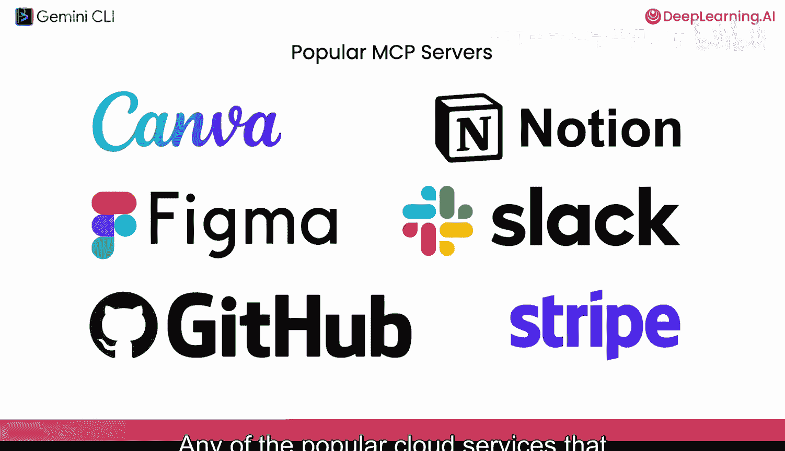

## 准备工作：查看网站结构

在将第一个 MCP 服务器连接到 Gemini CLI 之前，我们先来看看我们的网站及其结构。我们可以使用 Gemini CLI 的 shell 模式。

这个模式会直接传递并实际运行命令，而无需 Gemini CLI 进行“思考”。现在，你运行的任何命令都像是在你的普通终端中直接运行一样。

以下是启动开发服务器的步骤：

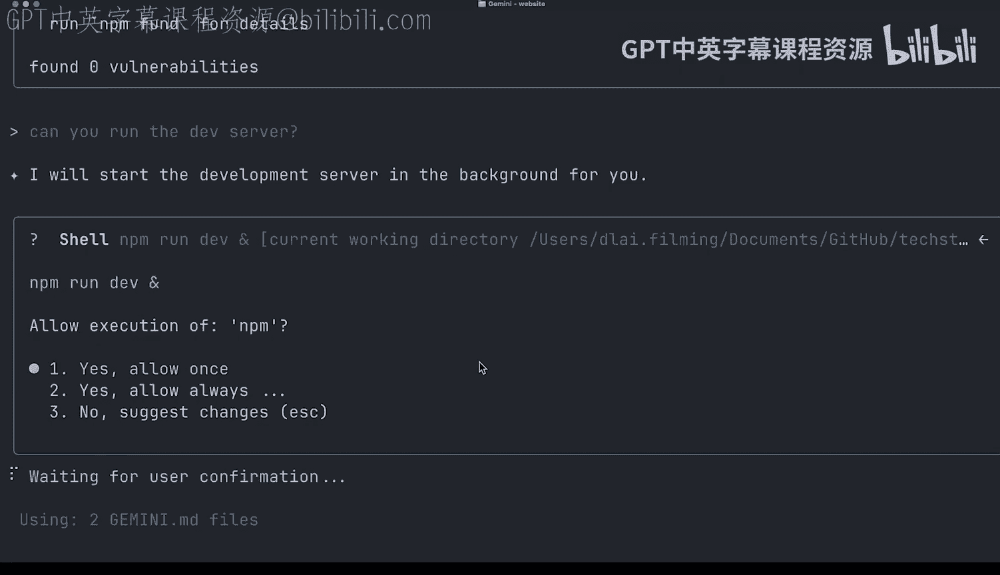

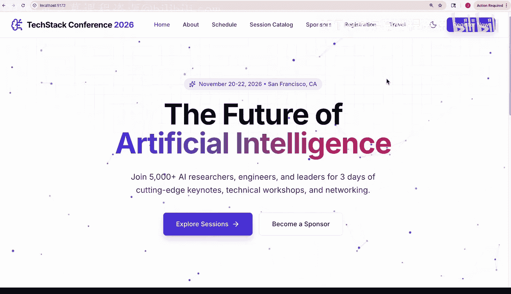

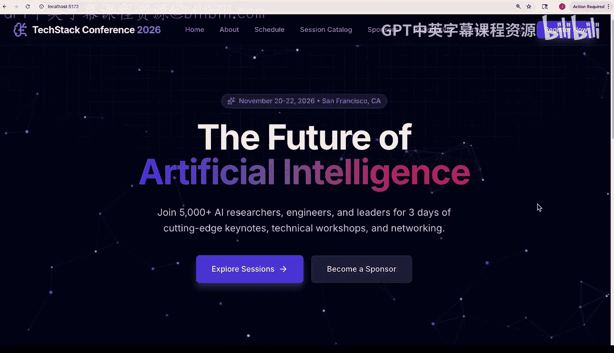

1.  首先，确保网站依赖已安装。
2.  运行实际的开发服务器。Gemini CLI 可以从我们的上下文中获知这一点，它甚至不需要去读取任何文件。它知道启动开发服务器的命令是 `npm run dev`。
3.  它会提示我们执行 shell 命令，我们允许它执行。
4.  然后，我们可以在端口 5173 上打开本地主机，查看正在运行的 npm 服务器。

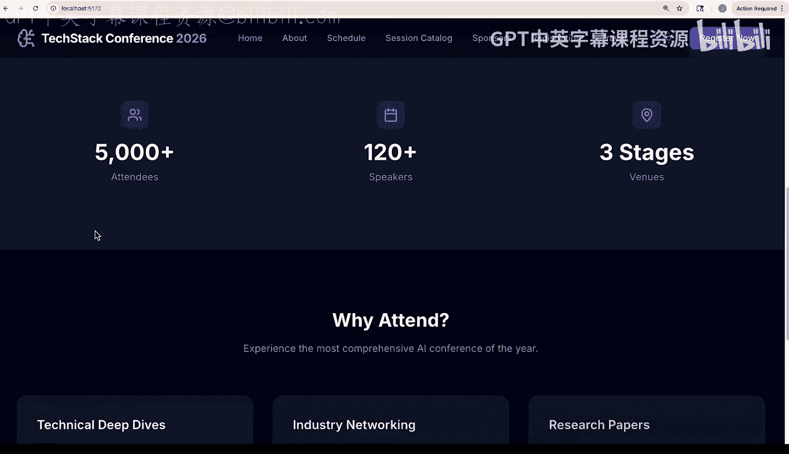

网站看起来不错，我们有了一个很好的基础，大部分想要的功能都已实现。

## 识别需求：添加社交媒体工具包

观察网站，我们发现缺少一个社交媒体工具包。参加会议的人会希望在社交媒体上分享，我们应该告诉他们使用什么话题标签，以及会议的颜色方案和字体。

我们的社交媒体团队已经在 Canva 中策划了一个品牌工具包，我们可以用它来实现这个功能。我们无需下载和保存图像及设计，而是可以利用 Canva 的 MCP 服务器，在 Gemini CLI 内部完成这项工作，而无需离开我们的终端。

## 连接 Canva MCP 服务器

Gemini CLI 有用于 MCP 的子命令，我们可以用一行命令添加一个 MCP 服务器。

以下是添加 MCP 服务器的命令：
```bash
gemini mcp add -t http canva <MCP_SERVER_URL>
```
*   `-t http` 指定我们使用的是 HTTP 远程服务器。
*   `canva` 是服务器的名称。
*   `<MCP_SERVER_URL>` 是远程 MCP 端点的 URL（你可以在 Canva 的在线文档中找到此 URL）。

运行该命令后，我们应该会看到 MCP 服务器已添加到我们的设置中。现在，当我们启动 Gemini CLI 时，它会要求我们对远程服务器进行身份验证。

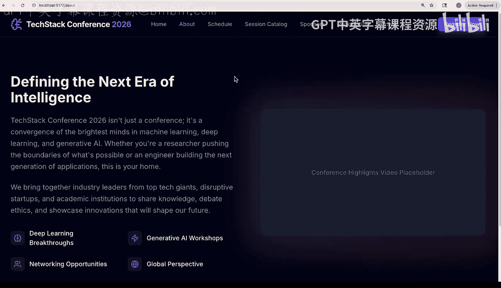

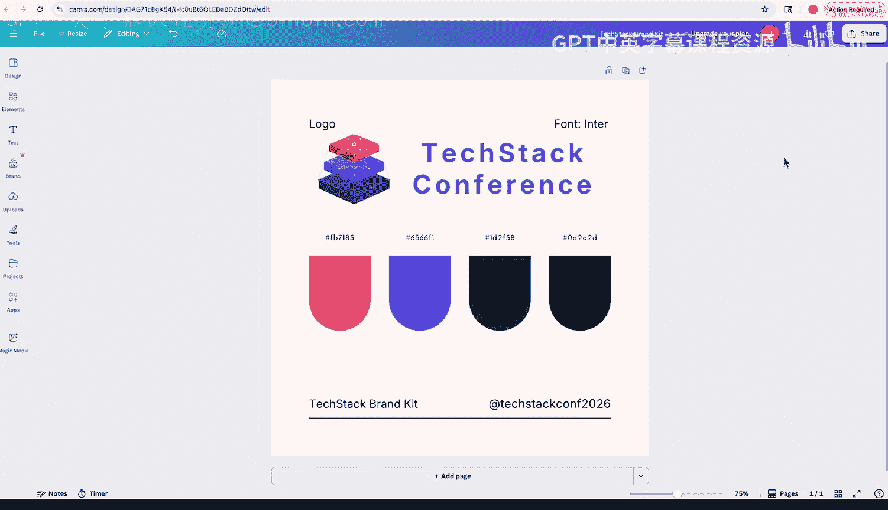

我们可以使用 `gemini mcp auth` 命令来完成。它会列出你配置的 MCP 服务器，我们选择 Canva。它会在你的本地浏览器中打开一个 OAuth 流程，你需要点击允许授权。

授权后，回到 Gemini CLI，你应该会看到已通过身份验证。要验证这一点，可以运行 `gemini mcp`。这将列出你可用的 MCP 服务器，并会有一个图标（例如绿色）显示你已连接。

`gemini mcp` 命令会列出所有可用的工具。如果你想查看详细描述，可以运行 `gemini mcp describe`。

## 使用 MCP 工具生成社交媒体页面

现在我们已经连接到 Canva 的 MCP 服务器，可以向它询问关于我们 Canva 设计的问题了。

例如，我们可以问：“你能列出我最新的设计吗？” Gemini CLI 会查看 Canva 提供的工具，并意识到它需要调用“搜索设计”工具。它会发现我们最近编辑的设计是 `techtac-brand-kit`。

接下来，我们让 Gemini CLI 读取该设计，并为我们的社交媒体工具包创建一个 `/socials` 页面。

Gemini CLI 会再次发现完成任务需要调用的工具。它会去获取设计。我们实际上看到它在这里并行调用了不同的工具，即在读取文件的同时，也从我们的 Canva 设计中获取内容。

我们可以看到它正在从我们的设计中提取不同的元素，例如屏幕上显示的内容，以及所有不同的字体和颜色。现在，它正在逐步制定计划，弄清楚如何将社交媒体页面添加到我们的网站中，然后开始编写文件。

为了加快流程，我们可以选择“全部允许，始终是”，而不是手动批准每一个确认。完成后，我们现在应该有了一个社交媒体页面，并且在页脚中应该有一个指向社交媒体工具包的链接。

让我们来看看效果。确实，页面上出现了“社交媒体工具包”链接。我们现在有了一个官方页面，可以发送给与会者，以便他们在社交媒体上发布时使用官方素材。

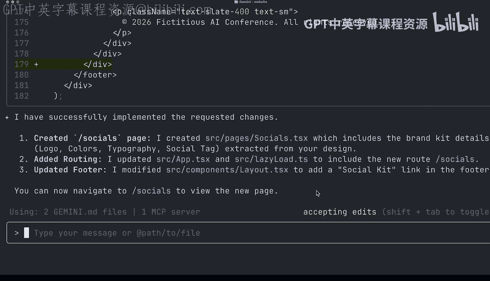

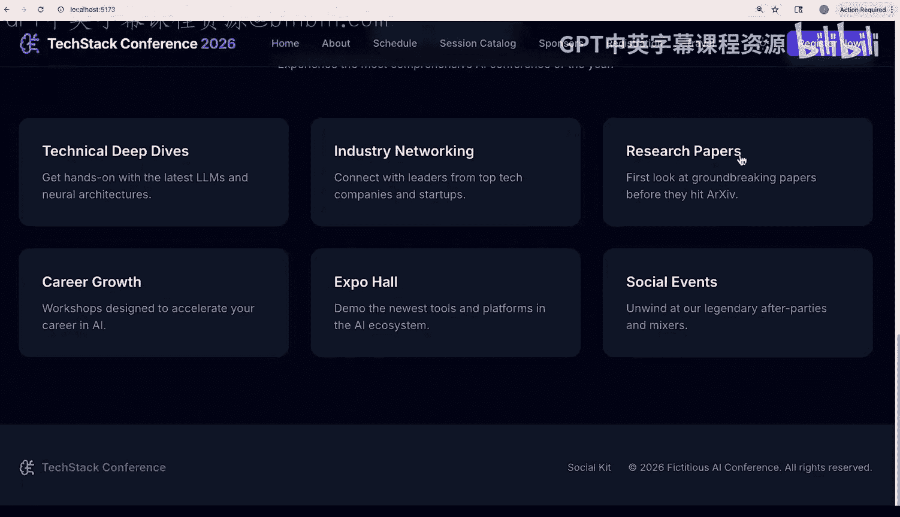

## 总结

本节课中，我们一起学习了模型上下文协议（MCP）的核心概念及其价值。我们通过实际操作，演示了如何将 Gemini CLI 与 Canva 的 MCP 服务器连接，并利用其工具自动生成网站所需的社交媒体页面。

Gemini CLI 可以代表你完成相当复杂的任务。我鼓励你尝试给 Gemini CLI 分配复杂的任务，你可能会对它能完成的事情感到惊讶。

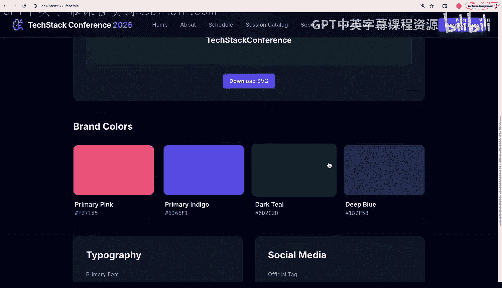

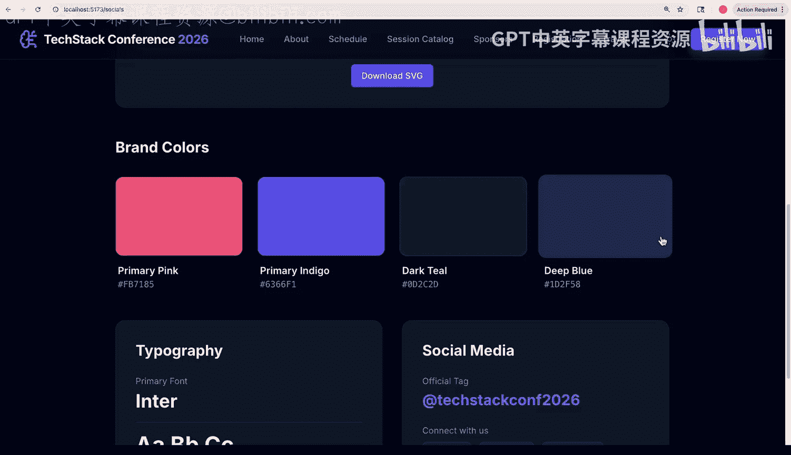

在接下来的课程中，我们将超越 MCP，探索 Gemini CLI 的扩展生态系统。