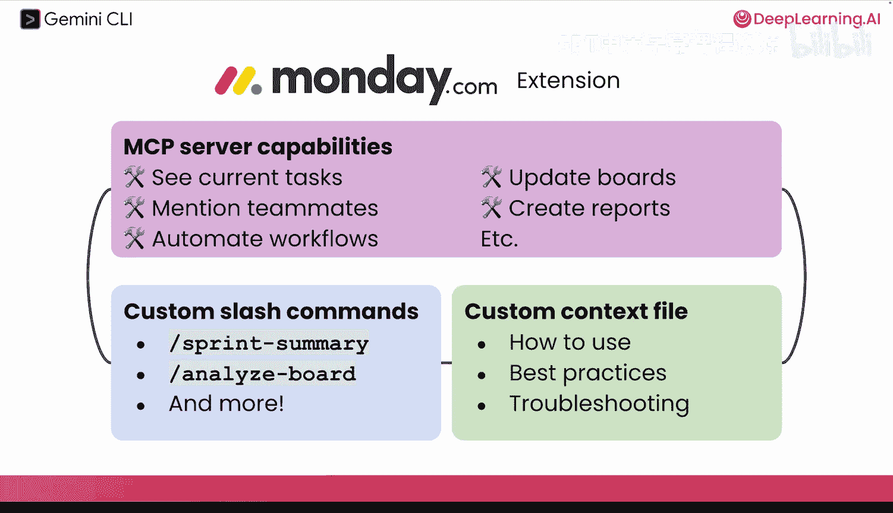
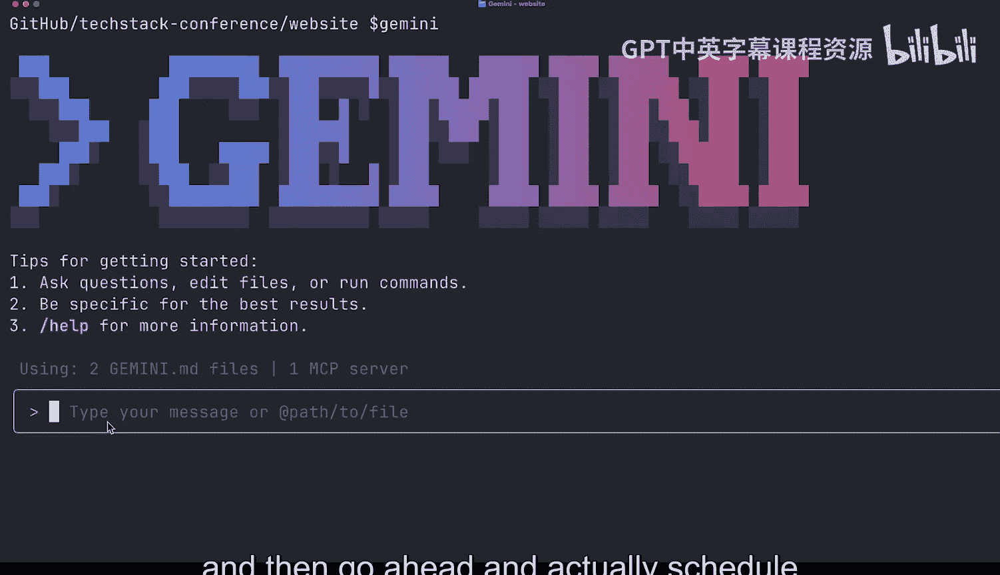
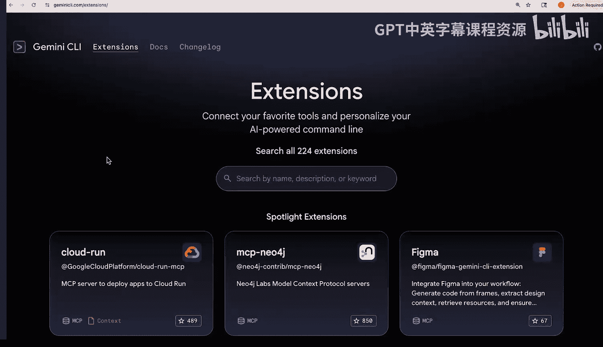
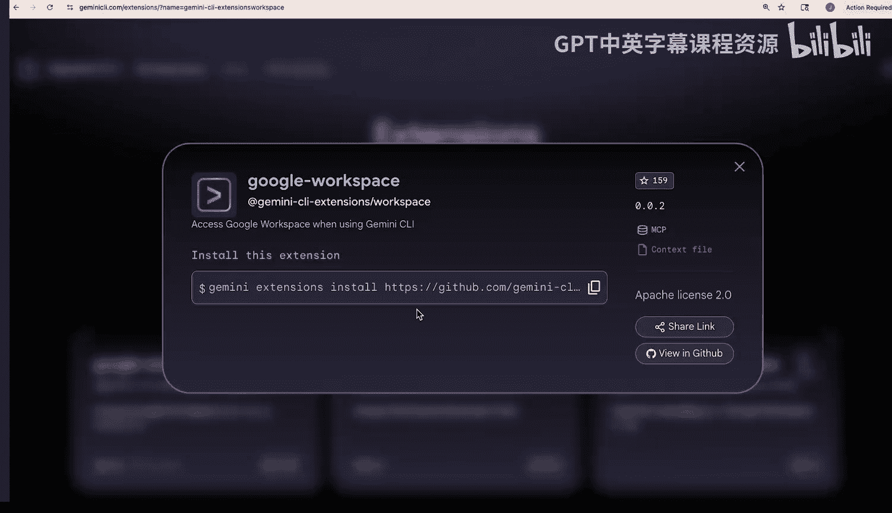
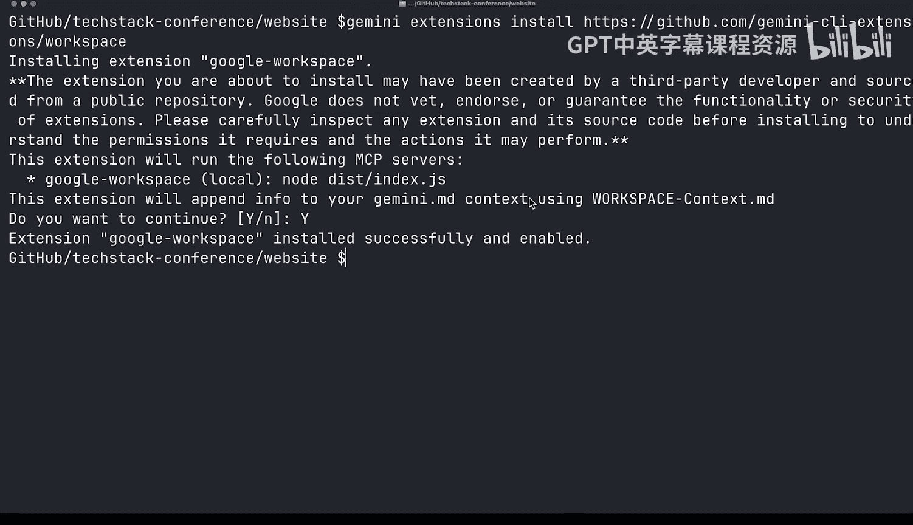
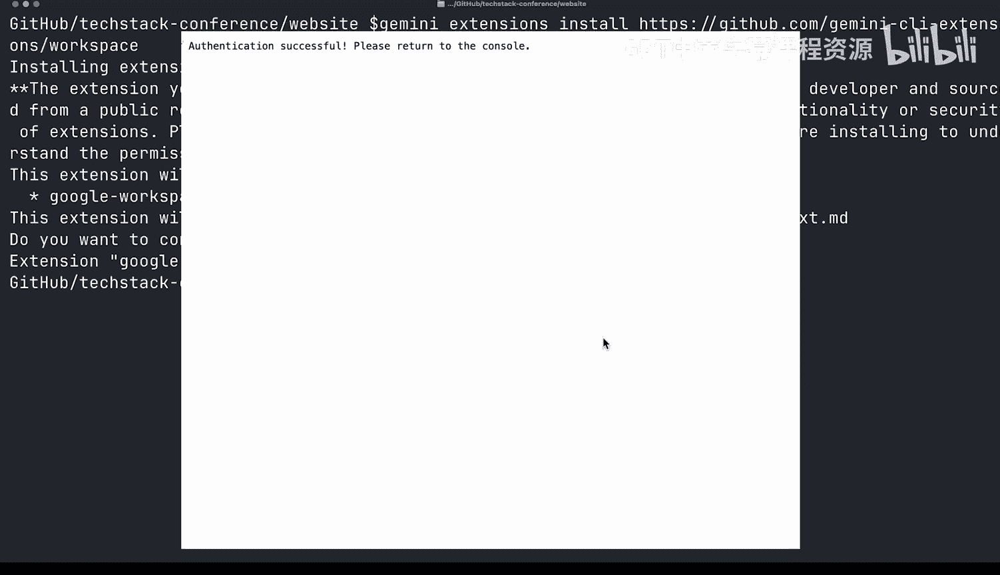
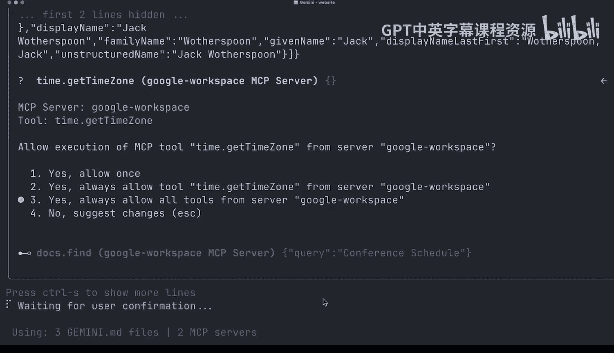
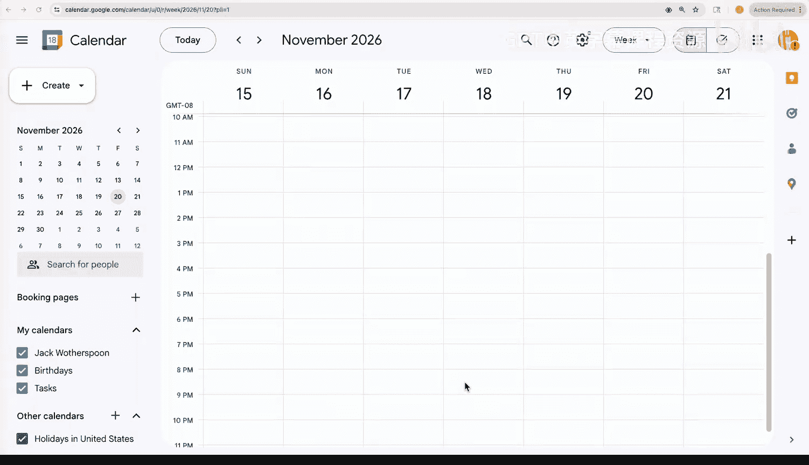
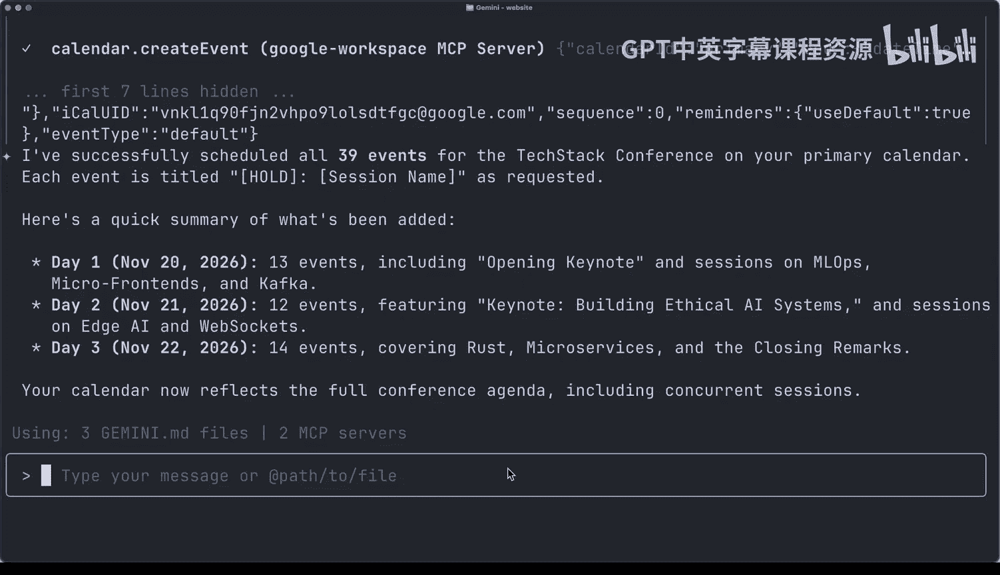
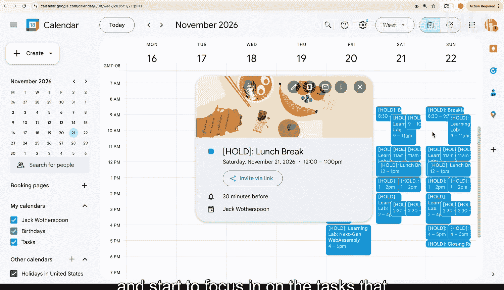

# 006：使用扩展进行自定义 🛠️

在本节课中，我们将学习如何使用 Gemini CLI 扩展来增强其功能。扩展将 MCP 服务器与自定义命令和上下文文件打包在一起，使你能够创建复杂的工作流。我们将探索扩展库，安装 Google Workspace 扩展，并演示如何跨文档、日历和表格协调工作。

## 扩展的核心概念

上一节我们介绍了 MCP 服务器，本节中我们来看看如何通过扩展来提升其能力。Gemini CLI 扩展超越了基础的 MCP 服务器功能。

它允许你将一个或多个 MCP 服务器打包成一个简单易安装的包，这个包包含一个自定义的上下文文件和自定义的 `s` 命令。MCP 服务器本身功能强大，但工具有时需要在复杂的工作流中使用。单个工具通常不了解其自身之外的上下文。通过将 MCP 服务器与自定义上下文文件捆绑，你可以告诉 Gemini 如何正确使用任何工具，从而真正创建这些复杂的工作流。

## 探索扩展生态系统

Gemini CLI 拥有一个庞大的扩展生态系统，目前有超过 200 个扩展。你可以在我们的网站上探索所有扩展。很可能你日常使用的工具已经有了对应的 Gemini CLI 扩展。

以下是几个扩展功能的例子：

*   **Monday.com 扩展**：通过此扩展，你可以访问 Monday.com 的 MCP 服务器，从而查看分配给你的当前任务、更新项目看板。它还附带一个自定义的 `s` 命令 `s sprint summary`，让你可以拉取当前团队的冲刺计划并获得快速摘要以跟上进度。此外，它还包含一个自定义上下文文件，解释了如何使用 Monday 扩展的最佳实践以及其 MCP 服务器的故障排除方法。

## 实践：安装与使用 Google Workspace 扩展

为了筹备我们一直在讨论的 `textt` 会议，我们一直在使用 Google Docs 来制定计划和日程。现在，我们可以安装 Google Workspace 扩展，从日程安排的 Google 文档中提取信息，然后直接在日历上为会议预约时间块。

要获取安装 Google Workspace 扩展的命令，让我们前往 `geminili.com` 上的扩展库。

点击扩展卡片将带我们到一键安装命令。

运行该命令会提示你确认是否要安装此扩展。扩展成功安装后，你可以打开 Gemini CLI。启动时会再次触发 OAuth 流程。请登录你的邮箱，选择“全部接受”以授予权限。这将允许它访问你的日历和 Google 文档等。

完成此步骤后，你可以返回 Gemini CLI。你可以运行 `s extensions list` 命令来查看所有已安装的扩展。

现在，让我们要求 Gemini CLI 读取我们的会议日程 Google 文档，并列出会议日程。Google Workspace 扩展会查询工具以了解当前登录的用户以及稍后在其工具中使用的时区。

Gemini CLI 已经读取了我们的 Google 文档，获取了会议日程信息。我是个忙碌的人，所以我想确保提前在日历上预留时间块，以免在会议期间被预约其他事情。

接下来，我们让 Gemini CLI 将这些时间块添加到我的日历中。我们确保日历邀请的标题是“预留 - [会话标题]”。

Gemini CLI 已经遍历了我们的日程，并通知我将创建 39 个日历邀请。它还注意到存在一些并发的会议会话，甚至询问我是否要在日历上创建多个重叠的事件。我们告诉 Gemini CLI 暂时不用担心这个问题，直接安排所有事件。

于是，Gemini CLI 继续操作，安排了所有 39 个事件。它会在这里给我们一个快速摘要。让我们看看，看起来是轻松的几天，好在早餐和午餐是空闲时间。

## 总结与展望

本节课中我们一起学习了如何通过 Gemini CLI 扩展来定制和增强其功能。我们了解了扩展如何将 MCP 服务器、自定义命令和上下文打包，以支持复杂的工作流。我们探索了扩展库，并实际操作安装了 Google Workspace 扩展，演示了如何跨文档和日历自动协调任务。

现在你已经了解了扩展 Gemini CLI 能力的各种方法，让我们更进一步，开始聚焦于你可以使用 Gemini CLI 完成的具体任务，例如软件开发。

