# 007：使用Gemini CLI进行软件开发 🛠️

在本节课中，我们将学习如何使用Gemini CLI来构建一个会议网站的功能。我们将从研究代码库开始，逐步实现功能，并进行测试。您将看到Gemini CLI如何处理从开始到结束的完整开发工作流程。

## 概述

Gemini CLI是一个功能全面的工具，可用于执行各种不同类型的任务，例如**Vibe Coding**、自动化、编写脚本、编写测试、清理代码库以及调试问题。在软件开发领域，其可能性几乎是无限的。

上一节我们介绍了Gemini CLI的基础，本节中我们来看看如何将其应用于一个实际的软件开发场景。

## 从功能请求开始

我们将继续处理之前提到的会议网站项目。现在，我们将利用Gemini CLI来增强我们的网站并构建一些功能。我们已经确定了会议的日程和演讲者名单。接下来，我们将让Gemini CLI实际实现一个功能请求：为会议网站的“会议目录”页面填充内容。

我强烈建议您再次查看我们的扩展页面，因为那里有许多优秀的开发者工具可以作为扩展安装。


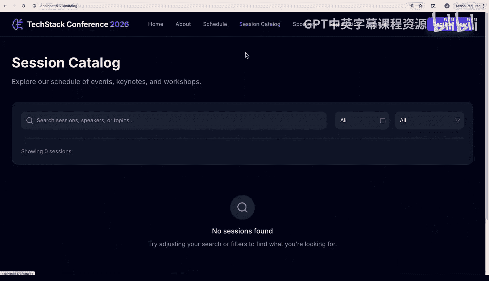

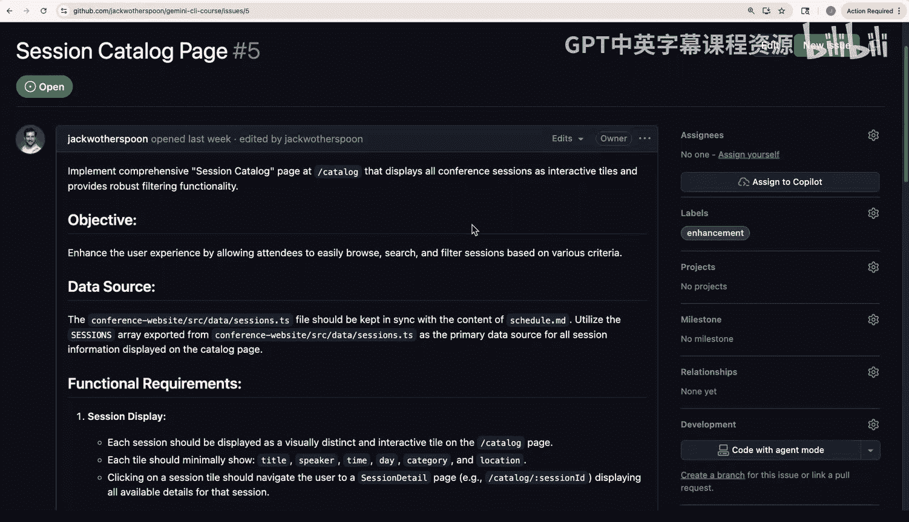

如果我们回到技术栈会议网站并进入会议目录页面，可以看到当前目录中没有任何会议内容。在Github上有一个关于此功能的开放功能请求，描述相当详细，您可以仔细查看。它包含了我们希望每个会议条目具备的信息类型，例如标题、描述、演讲者、时间、轨道等，以便能够进行过滤或搜索。

## 自定义斜杠命令的强大功能

之前我们简要提到过，现在我们将向您展示Gemini CLI中自定义斜杠命令的强大功能。

自定义斜杠命令位于您的 `.gemini` 文件夹内的 `commands` 子文件夹中。这些是 `.toml` 文件，允许您填写描述和提示。这些命令可以是任何内容，从像我们这里要做的实现功能请求，到代码审查。

我们将通过以下语法调用Github CLI并实际触发一个shell命令：

```bash
!{gh issue view}
```

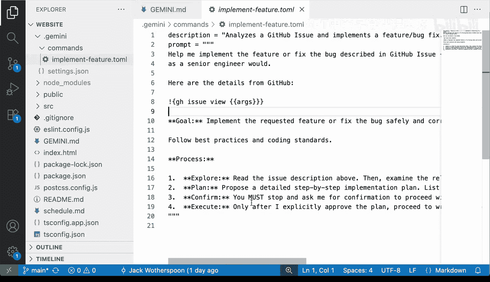

我们将通过指示一个感叹号后跟花括号来告诉它使用shell命令，在花括号内我们将放入我们的shell命令。所以 `gh issue view` 将使用Github CLI来拉取我们的功能请求，并获取我们实现它所需的所有信息。

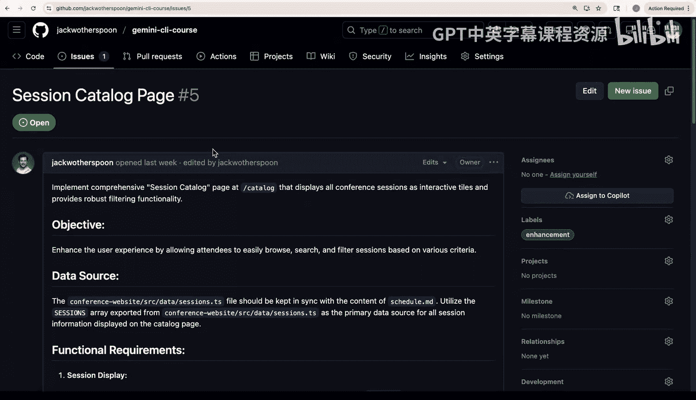

我们还可以在花括号中接收参数。这让我们可以传入我们想要拉取的问题编号。因此，当我们触发此命令时，我们将传入数字 `5`，因为这是我们仓库上的问题编号。

当我们运行斜杠命令时，它会询问我们是否要触发其中的shell命令。我们选择允许。

## 执行开发工作流

在我们的自定义斜杠命令中，我们指示Gemini去**规划**，然后**迭代**，接着**测试**和**审查**。因此，它将按照我们定义的顺序执行所有这些步骤。

您会看到，一旦它完成更改，它将提示运行测试。`npm run test` 命令之前在我们的 `gemini.md` 上下文文件中，所以我们可以看到测试失败了，因为我们添加了新功能。Gemini应该能够通过交互式命令发现这一点。

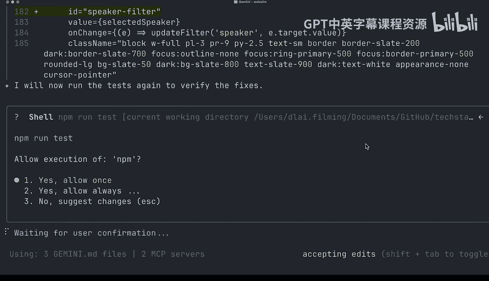

对于交互式命令，Gemini CLI允许您按 `Ctrl+F` 来聚焦于shell。我们可以聚焦于shell并按 `Ctrl+C` 退出。现在，Gemini CLI应该会去修复那些测试。

在它修复更改之后，让我们再次运行测试。我们可以看到所有测试都通过了，代码已正确更新。现在Gemini CLI告诉我们功能已完全实现。让我们去检查一下。

## 验证成果

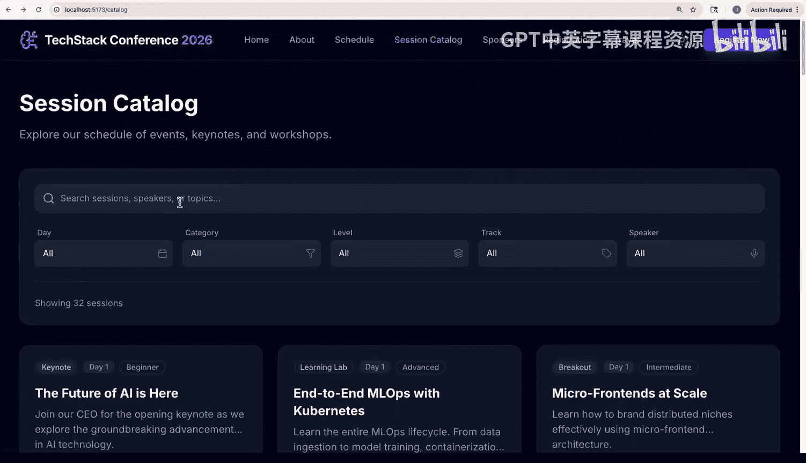

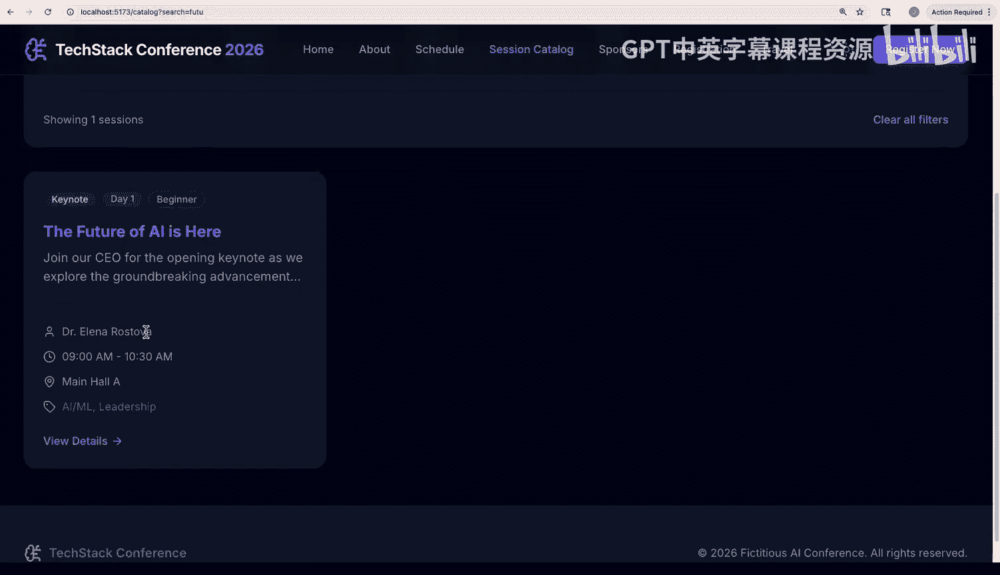

回到网站并查看我们新的会议目录页面，页面显示了32个会议，我们可以滚动查看所有不同的会议并查看详细信息。我们甚至可以进行过滤和搜索，例如搜索“Future of AI is here”并找到相应的会议。Gemini CLI已成功实现并测试了新功能。

## 基于图像反馈进行改进

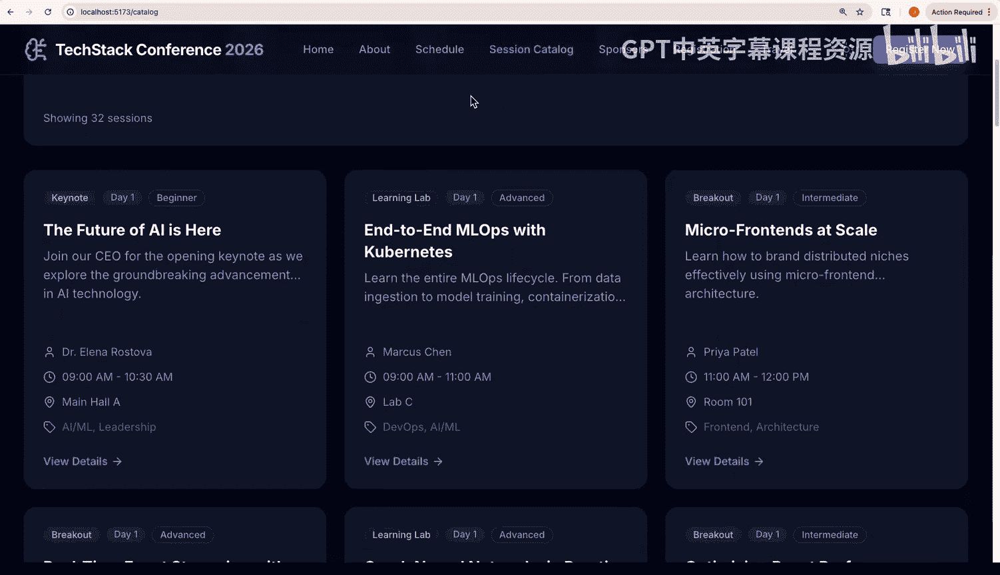

在查看会议目录时，我注意到“日程安排”和“一周概览”的格式不太理想。它占据了整个屏幕的宽度，而我们可以将这些信息以列的形式显示，以便一目了然。

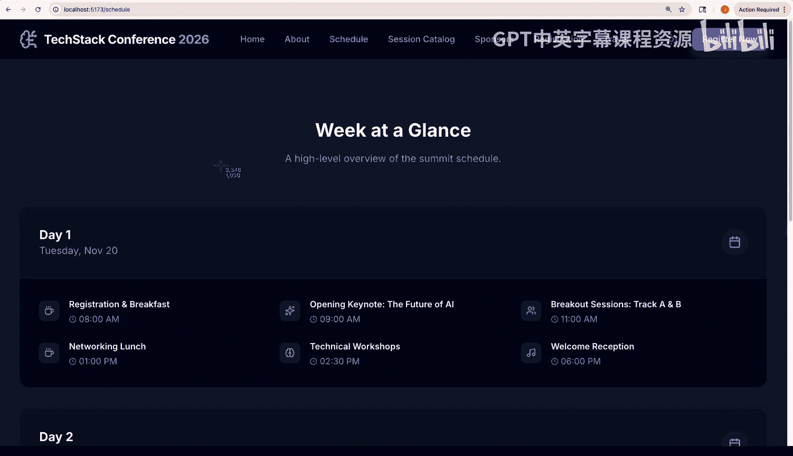

我们可以截取屏幕截图，并将其粘贴到Gemini CLI中，让Gemini CLI分析图像、理解它并进行适当的更改。我们只需正常输入提示并粘贴图像，您会看到它被添加到提示框中。

看起来Gemini CLI甚至确保它不会破坏任何测试。干得好，Gemini。现在看起来好多了。

## 代码管理与自动化审查

现在，我们将让Gemini CLI检出新分支并提交我们刚刚所做的更改。在这个过程中，Gemini CLI甚至会生成一个非常好的提交信息。

在我推送这些更改之前，实际上我想设置一个自动的拉取请求审查器，以便Gemini CLI作为GitHub Action在每一个拉取请求上运行并进行详细审查。我们可以在Gemini CLI中使用 `/setup github` 命令来完成此操作。

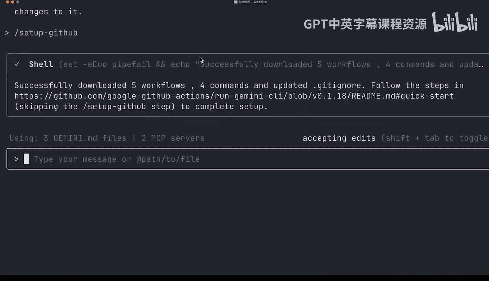

这个命令会下载GitHub Actions的所有工作流文件，并自动为您的仓库配置它们。然后，它会打开一个页面，您可以查看所有详细信息以及如何进行身份验证。我会将这些步骤添加到课程末尾的阅读材料中。

我已经设置了所有这些自动化，所以我们不需要经历所有步骤。但是当我们提出这个拉取请求时，我们应该会看到Gemini CLI会自动启动拉取请求审查。

Gemini CLI的GitHub Action也可用于不同的工作流。您甚至可以在拉取请求上评论“@Gemini CI，你能给我解释一下这个吗？”，它实际上会启动一个工作流，仅为添加评论并在GitHub Action完成后为您描述拉取请求。

当GitHub Action完成后，它会在拉取请求上评论其摘要以及一般反馈，并且它实际上会继续添加带有建议更改的评论，并根据严重程度用不同的颜色（例如黄色）标记它们。

建议看起来不错。我们继续提交，然后合并。

## 总结

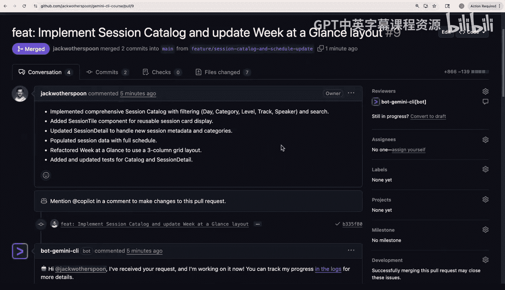

本节课中，我们一起学习了如何使用Gemini CLI实际实现一个功能，并让它审查自己的功能，甚至根据审查结果进行修复。现在，我们已经使用Gemini CLI实现了一个功能，并让它审查了自己的功能，还根据它自己的审查结果进行了修复。我建议您尝试一下，并在您自己的仓库上进行配置。请告诉我们进展如何。