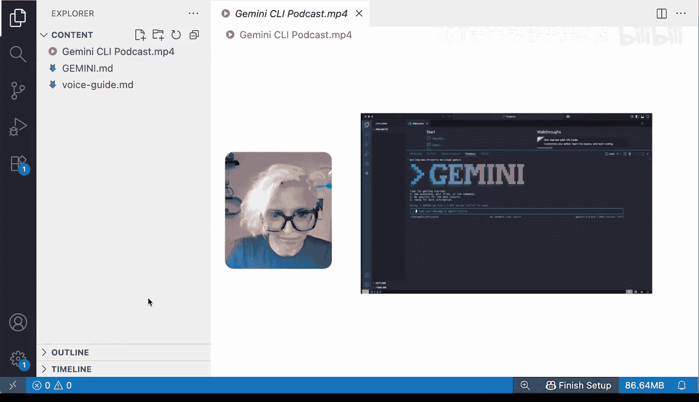
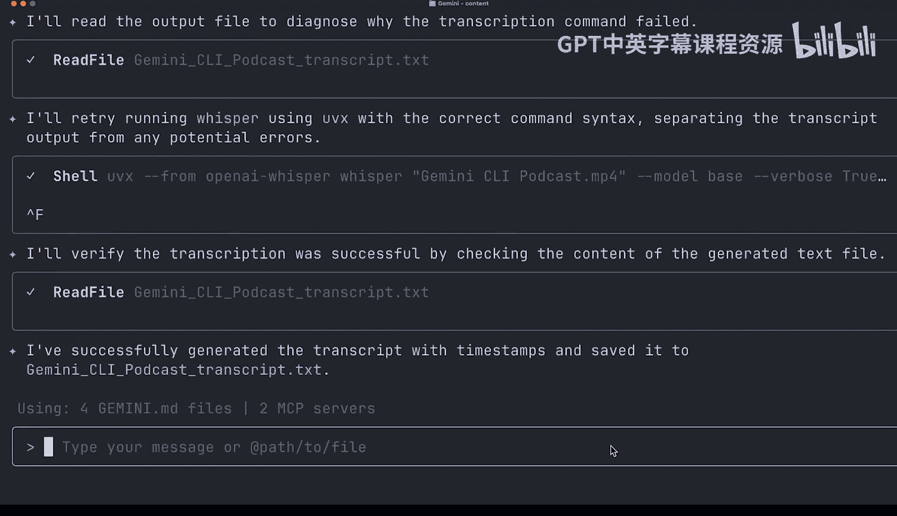
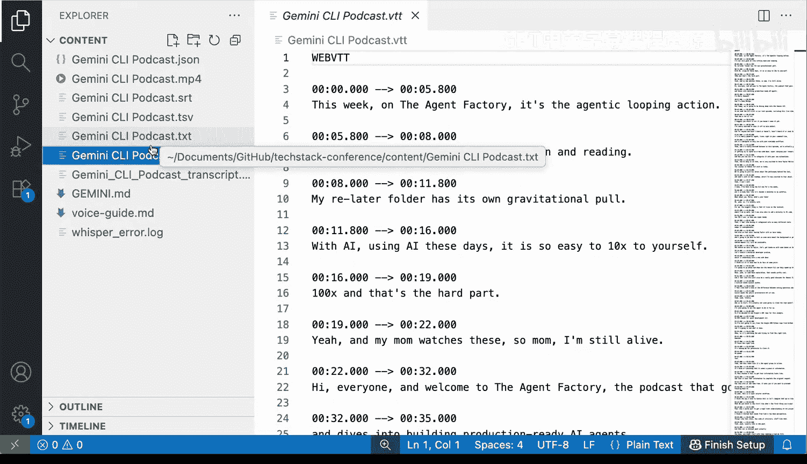
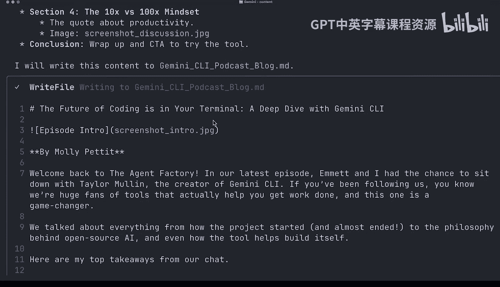
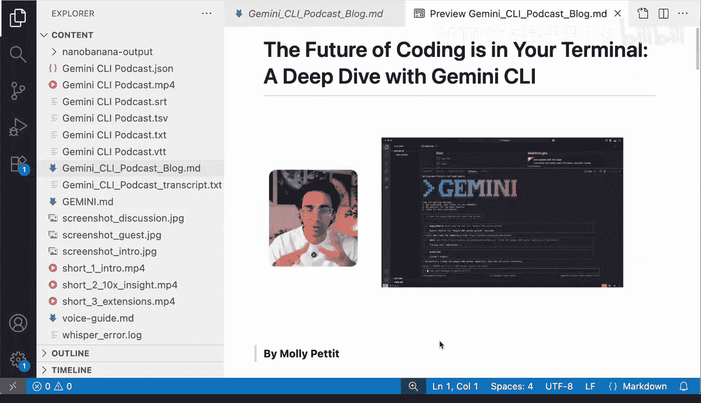
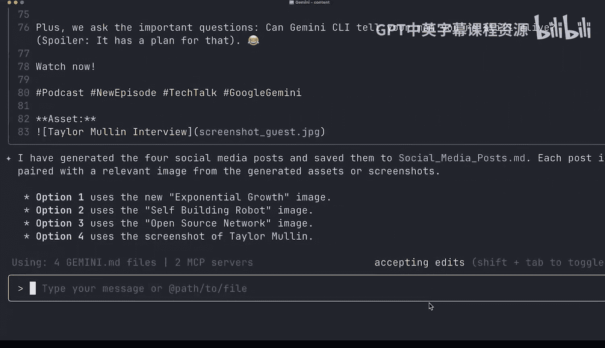
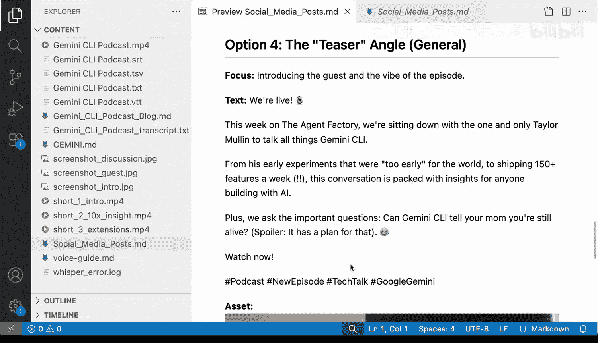

# 008：使用Gemini CLI进行内容创作 🎨

在本节课中，我们将学习如何将Gemini CLI的应用从代码开发扩展到非编码领域，特别是利用其强大的多模态能力进行内容创作。我们将通过一个实际的营销任务，演示如何使用Gemini CLI分析视频、生成短片、撰写博客以及创建社交媒体帖子。

---

## 从代码到内容：Gemini CLI的多模态优势

上一节我们介绍了Gemini CLI在编码方面的多种用例。本节中，我们来看看开发者如何将这类智能体工具的应用范围扩展到非编码场景。

Gemini CLI在处理多媒体数据（无论是图像还是视频）方面表现出色。它的核心优势在于**多模态**能力，这意味着它能够很好地与各种类型的文本、视频和图像进行交互。

让我们通过一个创意营销任务来具体探索。假设在一次会议中，我们录制了一段视频播客。团队成员已将视频文件发送给我们，并下载到了本地机器。我们的目标是使用Gemini CLI分析这段视频，并帮助我们制作一些宣传素材，例如几个短视频片段、一篇博客文章和一些社交媒体帖子。

此外，我们还将利用一些非常有用的扩展程序。在本课中，我们将使用 `nanoob-banana1` 扩展。现在，我们有一个内容文件夹，里面存放着本地的播客视频文件，以及团队成员发送过来的Gemini M上下文文件。

---

## 第一步：转录视频并添加时间戳

我们首先要执行的指令是让Gemini CLI为视频生成带时间戳和引用的转录稿，并将其保存到本地的TXT文件中。



以下是初始指令的示例：
```bash
# 假设的指令：让Gemini CLI处理视频并生成转录稿
gemini-cli process-video --input podcast.mp4 --transcribe --output transcript.txt
```

执行后，Gemini CLI会通知我们完成此任务需要某些工具，例如 `FFmpeg` 和 `Whisper`。它会自动检查这些工具是否已安装，并尝试设置环境。接着，它会调用相关工具（如使用Whisper通过Uv）来转录视频。

过程中可能会遇到一些问题，但Gemini CLI能够诊断并尝试恢复。运行完成后，它会遍历整个视频，生成带时间戳的转录稿。



结果完全符合我们的要求。此外，Gemini CLI还利用这些转录内容生成了不同格式的字幕文件。

---


## 第二步：从视频中创建宣传短片

接下来，我们要求Gemini CLI为我们创建一些短片。具体来说，是让它切入原始视频，剪辑出可用于社交宣传的片段。

手动完成这类工作通常很繁琐，因此拥有Gemini CLI这样的自动化工具非常方便。

Gemini CLI会分析内容，并 pinpoint 出三个它认为适合用于剪辑视频的短片时间段或时间戳。



任务完成后，它选取并剪辑出了三个片段。看起来分别是：
1.  Gemini CLI的介绍。
2.  关于“10倍 vs 100倍效率提升”的见解。
3.  关于“如今使用AI的Gemini CLI扩展”的讨论。


既然我们已经有了不同的视频剪辑，就可以更进一步了。

---

## 第三步：生成包含图像的博客文章

我们还需要一篇可以发布的博客文章，并且希望文章中包含图片。这时，我们将使用之前提到的 `nanoob-banana1` 扩展。我已经按照与安装Google Workspace扩展相同的方式完成了安装。

现在，我们指示Gemini CLI利用之前创建的转录稿来撰写这篇博客。

Gemini CLI会从视频本身截取屏幕截图，然后将这些图像作为输入传递给 `nanoob-banana1` 扩展，以帮助生成更具创意的图片。

任务完成后，它生成了一篇Markdown格式的博客文件。博客的标题是《编程的未来在你的终端中：深入探讨Gemini CLI》，相当吸引人。




我们可以看到，博客中很好地混合了屏幕截图和由nanoob-banana生成的图像。

---

## 第四步：创建社交媒体宣传帖子


现在我们有了短视频和博客，最后一项任务是让Gemini CLI为我们创建宣传用的社交媒体帖子。

执行相应指令后，Gemini CLI生成了四个社交媒体帖子。让我们来看一下效果。



它提出的一些帖子创意相当不错，甚至可能达到可以直接发布的标准。


---

## 总结与展望

本节课中，我们一起探索了Gemini CLI在内容创作领域的强大应用。我们演示了如何让它：
1.  **转录视频**并生成带时间戳的文稿。
2.  **自动剪辑视频**，识别并提取关键片段制作成宣传短片。
3.  **撰写图文并茂的博客文章**，利用扩展程序增强图像创意。
4.  **生成社交媒体宣传文案**，为内容推广提供素材。

我们已经看到了Gemini CLI众多不同的用例。接下来，我们将稍微转换方向，离开文本会议的场景，为您带来一节我们认为非常有用的附加课程。考虑到您正在学习在线课程，我们将展示如何利用Gemini CLI来辅助学习。




