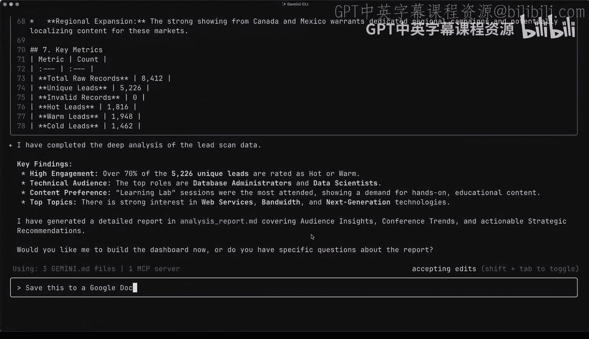
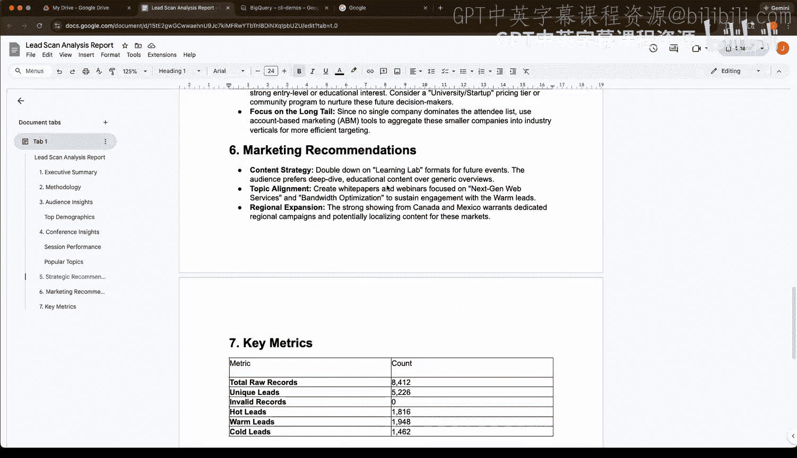
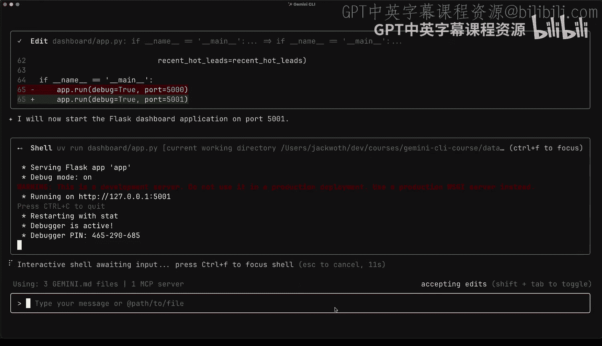
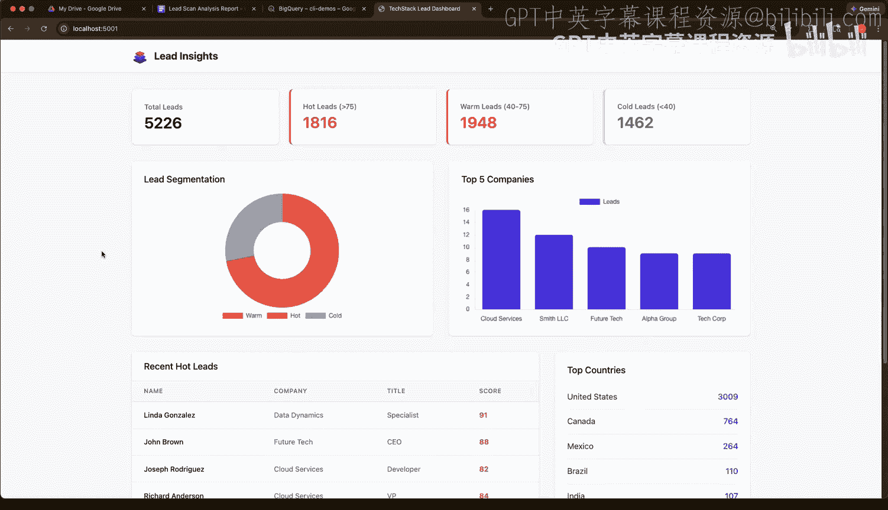

# 009：使用Gemini CLI进行数据分析 🧮

在本节课中，我们将学习如何使用Gemini CLI来处理和分析数据。我们将从一个会议结束后收集到的海量参会者扫描数据入手，演示如何利用Gemini CLI完成数据清洗、分析、存储、报告生成以及可视化仪表板构建的完整流程。

## 数据源与目标

上一节我们介绍了Gemini CLI的基本能力，本节中我们来看看如何用它处理真实数据。Gemini CLI或任何智能体CLI的优势之一，在于其能够处理和读取各种不同类型的数据。这些数据既包括结构化数据（如CSV文件），也包括非结构化数据（如Google文档、PDF、源代码、图像、图表），甚至可以通过网络搜索获取信息。

本次课程中，TEXTT会议已圆满结束。现在面临的挑战是如何处理会议期间收集的所有数据。当参会者走过会议展区、参加分会场或访问展位时，他们的徽章会被扫描。每次徽章扫描都是一个数据点，因此我们拥有了成千上万个数据点。我们的目标是深入分析这些数据，以便为明年的会议做出可执行的决策。

为了实现这个目标，我们将使用Gemini CLI来导入所有数据，帮助清理数据，进行分析，并最终构建一个美观的可视化仪表板，以便轻松查看结果。

## 准备工作与环境配置

在开始使用Gemini CLI进行本课内容之前，让我们先查看一下我们的上下文文件 `gemini.md`。我们已经根据以下信息定制了上下文文件：
*   关于如何定义“热门线索”、“温线索”和“冷线索”的见解。
*   我们希望如何总结数据以及希望仪表板呈现样子的见解。
*   仪表板或分析结果的受众是谁等见解。

我们处理的数据包含数千条会议记录，例如扫描ID、参会者ID以及参会者信息（如姓名、邮箱等），这些都是在会议中扫描徽章时通常会收集的信息。

我们已经将Gemini CLI启动在数据分析文件夹中，准备就绪。

## 数据清洗与处理

我们将告诉Gemini CLI查看我们的线索扫描数据。数据存储在本地以及云端的Google Sheets中。我们指示它处理并清理数据。它将执行以下操作：
*   遍历数据并移除重复项。
*   移除无效数据。
*   为我们提供一个干净、可用于构建仪表板的最终数据集。

Gemini CLI再次使用工作区扩展从Google Sheets检索数据，并使用其内置工具读取本地的CSV文件。它将创建一个本地Python脚本并运行，以帮助我们处理和清理线索数据。

您会注意到，Gemini CLI会将我们的Google Sheets保存到本地文件，以便以统一和简洁的方式处理所有内容。它尝试运行Python脚本时，看起来想使用`pip`，但作为Python开发者，我更喜欢`uv`。因此，我告诉Gemini CLI使用`uv`工具而不是`pip`，以获得更好、更干净的虚拟环境。

现在可以看到它已成功处理了所有线索。我们的原始线索扫描数据中有超过8000条记录，其中超过5000条被归类为“唯一线索”。根据优先级细分，我们拥有大约1800条热门线索、1900条温线索和1400条冷线索。

## 数据存储与验证

处理完这些线索后，我们实际上希望将它们保存到数据库中，以便日后访问，或者让团队成员能看到我们正在查看的相同数据。因为目前数据仅存储在本地CSV文件中。

因此，我们告诉Gemini CLI将数据导入到Google Cloud上的BigQuery数据库。Gemini CLI将利用我本地机器上的工具。我已经安装了`gcloud` CLI和`bq` (BigQuery) CLI。只需几个快速命令，它就能将所有数据上传到BigQuery。

现在，它正在使用那个`bq` CLI来创建数据集。我们可以通过查询BigQuery表中有多少温线索来快速验证这一点。可以看到，我们得到的结果与之前本地分析的结果相同：有1948条温线索。

## 深度分析与报告生成

现在，让我们更进一步，要求Gemini CLI对数据进行深入分析，找出趋势和重要细节，这些可能是我们营销团队在未来营销计划中想要使用的。

这一次，Gemini CLI将创建另一个Python脚本，但这次会更侧重于营销分析。可以看到，这些数据现在包含了诸如参会者来源最多的公司、最多的国家、不同的职位头衔、哪些会议环节最吸引人，以及一些战略和营销建议。

它将分析结果保存为本地机器上的Markdown文件。但我们希望将其保存为Google文档，以便快速与其他团队成员分享。

如果我们转到Google Drive查看，可以看到Gemini CLI已成功将其创建为Google文档。文档中包含了供快速浏览细节的执行摘要、我们如何将线索分类为热/温/冷的标准，以及快速的受众洞察和人口统计数据。

## 构建可视化仪表板

这已经很棒了，但我们可以更进一步，让Gemini CLI用所有这些数据创建一个美观、视觉吸引力强的仪表板，使其变得更好。因为我们希望仪表板使用我们的Logo以及从品牌指南中获取的配色方案，而这些我们已默认添加到网站项目中。

默认情况下，Gemini CLI只能访问给定项目中的文件。我们可以利用`/dir add`命令或Gemini CLI内的`/their add`命令，将另一个项目添加到会话状态中，以便Gemini CLI能够访问像我们的Logo SVG文件这样的文件，并查看我们网站项目中的字体颜色。

现在，我们可以告诉Gemini CLI构建仪表板，使用我们的品牌颜色和会议Logo。它将搭建项目框架并添加依赖项（如Flask）以实现这个仪表板。它会创建Flask应用程序的`app.py`文件以及包含我们品牌颜色和Logo的HTML文件。

看起来Gemini CLI尝试启动应用程序，但该端口在我们本地机器上已被占用。因此，我们提示它使用不同的端口并再次尝试启动应用程序。

成功了！看起来Gemini CLI已在端口5001上成功启动了Flask仪表板。如果我们转到运行该应用程序的本地主机的5001端口，可以看到我们的仪表板已启动并运行，在左上角使用了TEXTT会议的Logo，并采用了我们网站的配色方案。

您可以看到，它包含了与我们Google文档分析报告中相同类型的数据，但这次是以一个美观的仪表板形式可视化呈现，我们可以点击不同的项目，查看顶级公司的细分、近期的热门线索等。

## 总结与展望

这只是使用Gemini CLI来处理和帮助您应对复杂数据的一种方式。但还有大量不同的用例，我希望您能进一步探索。

在本节课中，我们一起学习了如何使用Gemini CLI完成从数据清洗、存储、深度分析到生成可分享的报告和交互式可视化仪表板的完整数据分析流程。我们看到了它如何整合多种数据源、利用本地和云端工具，并根据品牌指南定制输出，从而将原始数据转化为有价值的商业洞察。