# 010：使用开源智能体辅助学习 📚

在本节课中，我们将学习如何将 Gemini CLI 作为你的个人导师和学习伙伴，利用其联网搜索功能来获取准确、有据可查的信息，从而辅助你的学习过程。我们将通过一个具体的计算机科学课程复习案例，演示如何让 Gemini CLI 总结教材、生成学习指南并创建交互式测验。

## 概述

上一节我们介绍了 Gemini CLI 的基本功能。本节中，我们来看看如何将其应用于学习场景。我们将扮演一名正在为计算机科学期末考试复习的学生，课程教材长达 200 多页。我们的目标是利用 Gemini CLI 高效地处理这份长篇文档，生成复习材料。

## 处理长篇文档的策略

由于我们的 PDF 教材超过 200 页，我们不想一次性将整个文档加载到上下文中，这可能导致效率低下或超出限制。为了应对这个问题，我们在本学习项目对应的 `gemini.md` 配置文件中，指示 Gemini CLI 使用 Python 的 `PyPDF2` 包来分块读取 PDF 文件。

```python
# 示例：使用 PyPDF2 分块读取 PDF
import PyPDF2
# ... 读取并处理 PDF 的代码逻辑
```

这种方法能让我们迭代处理小块的 PDF 内容，从而更高效地完成任务。

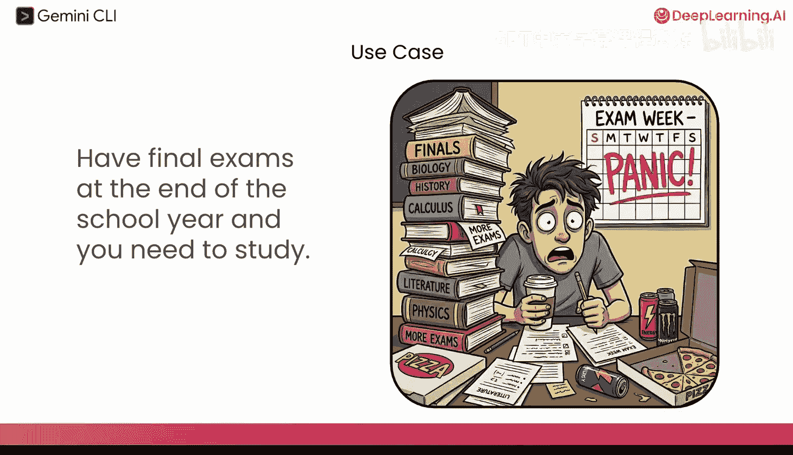

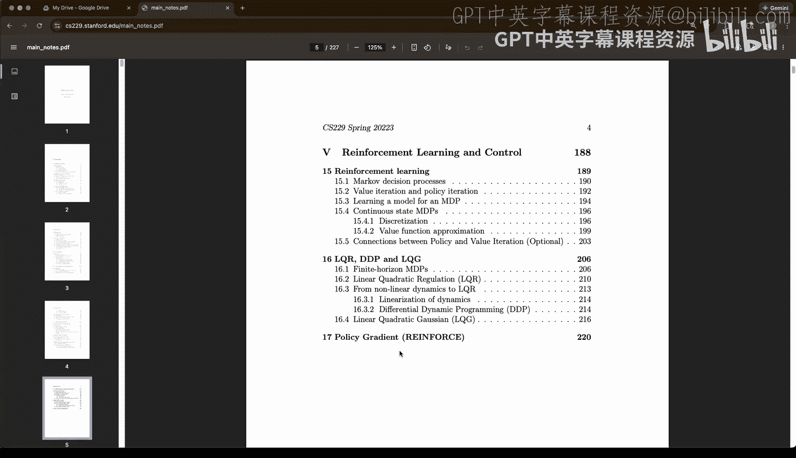

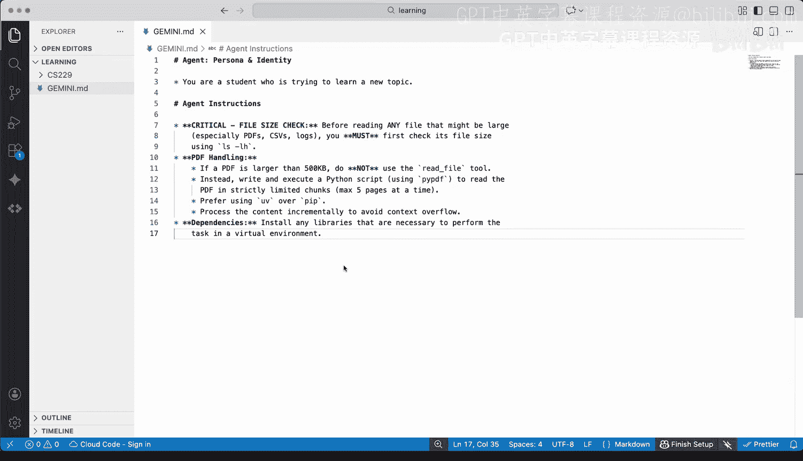

## 分步学习辅助实践

我们已经在本地的“学习”文件夹中启动了 Gemini CLI。接下来，我们将通过几个步骤来展示其辅助学习的能力。

### 第一步：总结课程章节

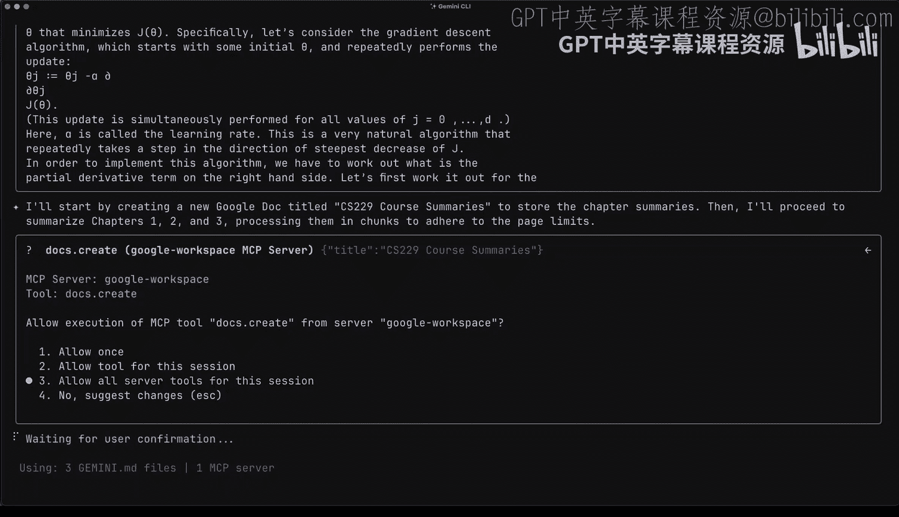

首先，我们让 Gemini CLI 总结教材的每一章，并将结果保存为 Google 文档，以便我们查阅精简版的“速记笔记”。

以下是 Gemini CLI 执行此任务的过程：
*   Gemini CLI 遵循我们的 `gemini.md` 配置文件，因为文件较大，它会创建一个脚本来分块读取 PDF。
*   它开始以较小块读取 PDF。
*   随后，它会利用工作区扩展功能，请求创建一个新的 Google 文档来存放“CS 229 课程总结”。
*   在获得权限后，Gemini CLI 开始逐章阅读、总结，并将内容实时追加到我们创建的 Google 文档中。

我们可以打开这个 Google 文档，实时看到总结内容正在生成。例如，前一秒第六章的总结还不存在，现在我们已经能看到关于“支持向量机”的章节摘要了。我们等待它完成所有 17 章的总结。

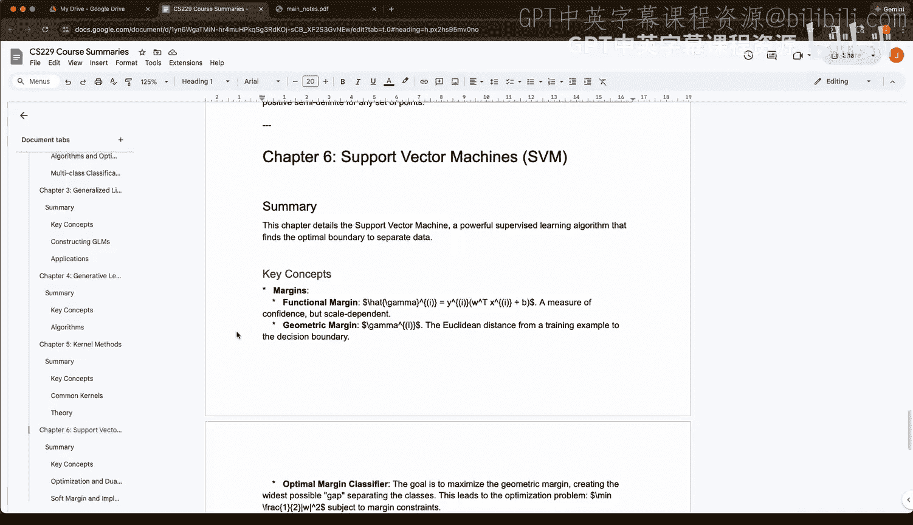

### 第二步：生成学习指南

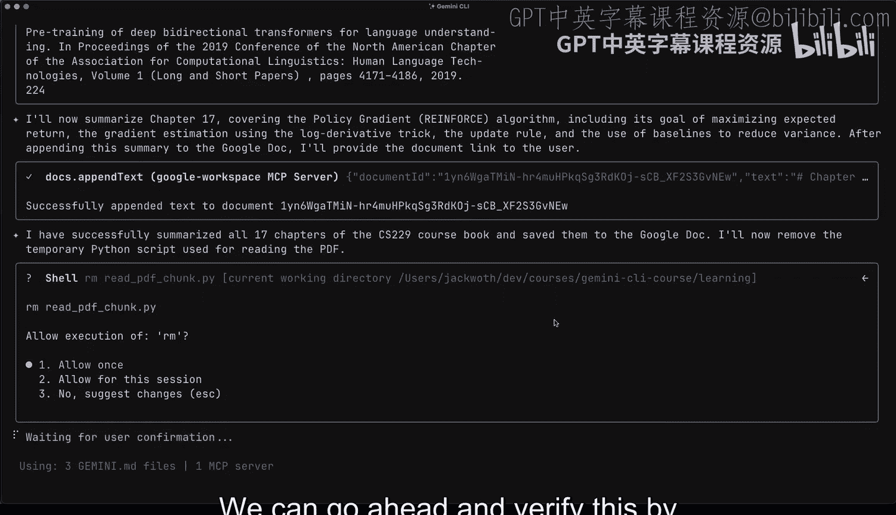

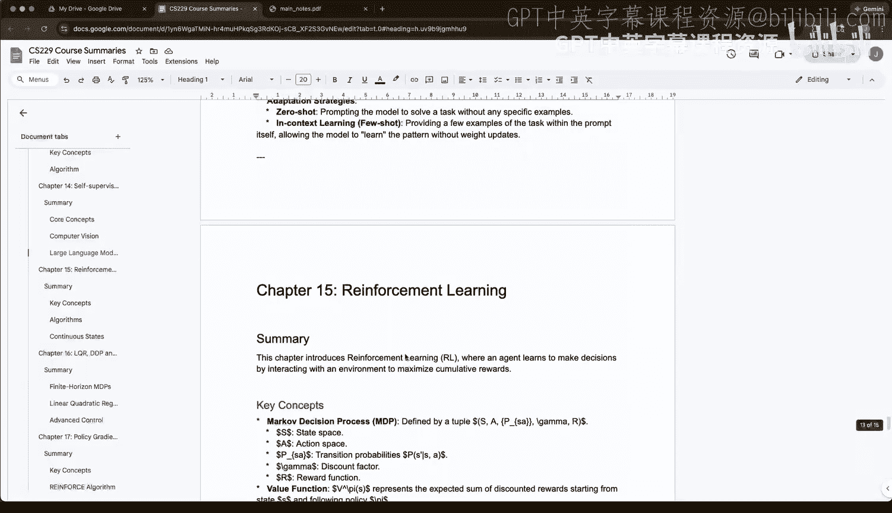

现在我们已经有了每章的总结，接下来让 Gemini CLI 为每一章生成一份学习指南。这份指南应包含问题、答案以及一些值得在考试前掌握的关键思考题。

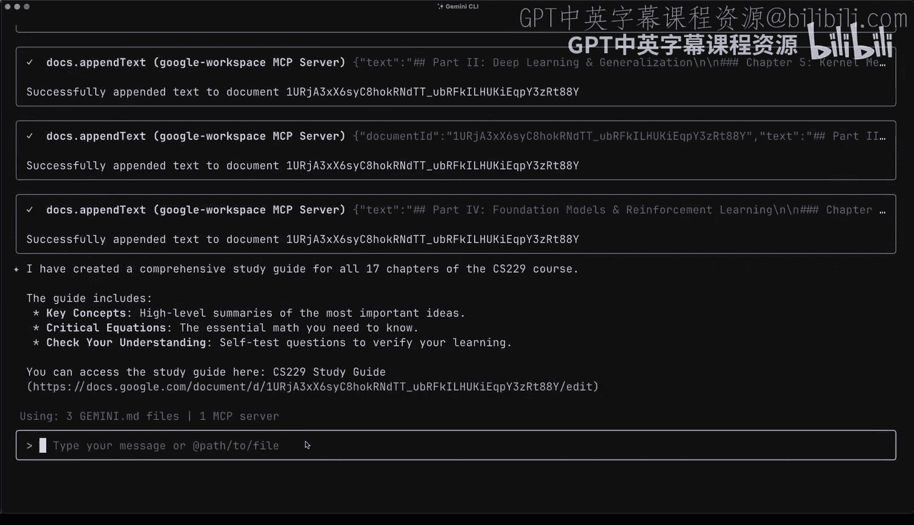

我们同样要求它将这份学习指南保存到一个新的 Google 文档中。这个过程相当迅速，任务很快完成。检查新生成的 Google 文档，我们可以看到其中包含了**关键概念**、**核心公式**以及“检查你的理解”部分，该部分会提出诸如“为什么我们使用正规方程而不是梯度下降？”这样的问题。

### 第三步：创建交互式测验

仅仅阅读总结和回答问题可能有些枯燥。让我们更进一步，让 Gemini CLI 创建一个可以实时测验我们知识的交互式 Web 应用程序，这样会更有趣。

我们没有给它任何技术栈的限制或指示，因此这将完全由 Gemini CLI 自主决定使用什么技术来创建这个交互式应用。它创建了一个简洁的 HTML 文件，我们可以在浏览器中直接打开，或者使用 shell 命令 `open practice_test.html` 在默认浏览器中打开。

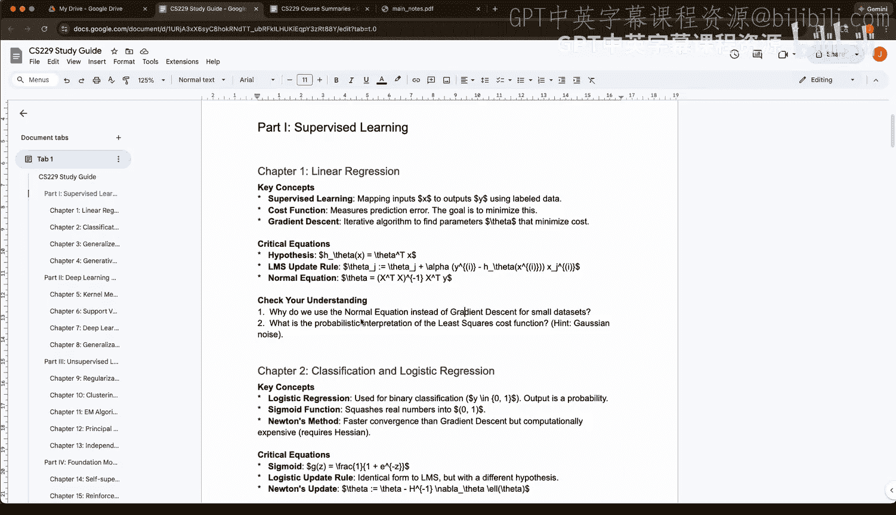

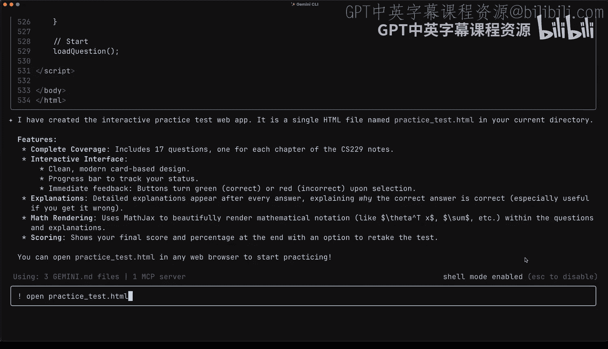

我们得到了一个由 Gemini CLI 创建的交互式练习题测试界面。我们可以快速测试一下，例如，第一题可能答错了，系统会友好地提供正确答案的详细信息，这对于学习过程非常有帮助。

## 总结

在本节课中，我们一起学习了如何将 Gemini CLI 打造为强大的学习助手。在短短几分钟内，我们利用它完成了教材总结、生成学习指南和创建交互式测验多项任务。

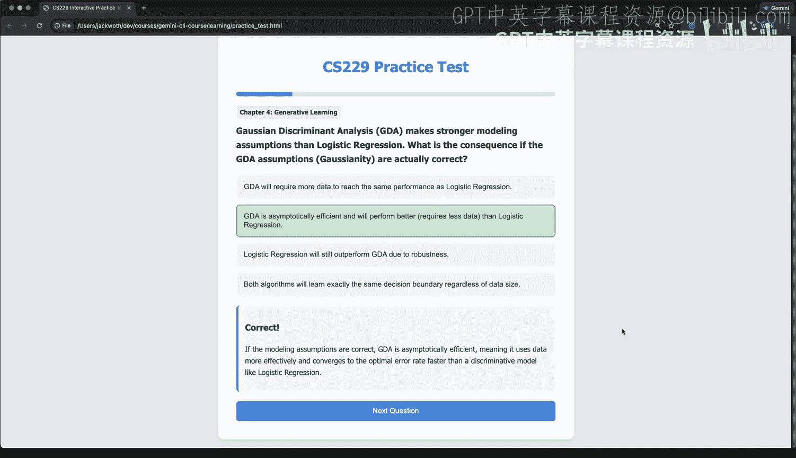

我希望这节课能启发你跳出思维定式，以多种方式运用 Gemini CLI——无论是作为导师、学习帮手，还是研究助理。下次当你学习新主题、备考，甚至只是进行研究和头脑风暴时，不妨启动 Gemini CLI，让它协助你完成整个过程。你会发现效率大大提高，并且能够完成许多单凭自己难以完成的任务。