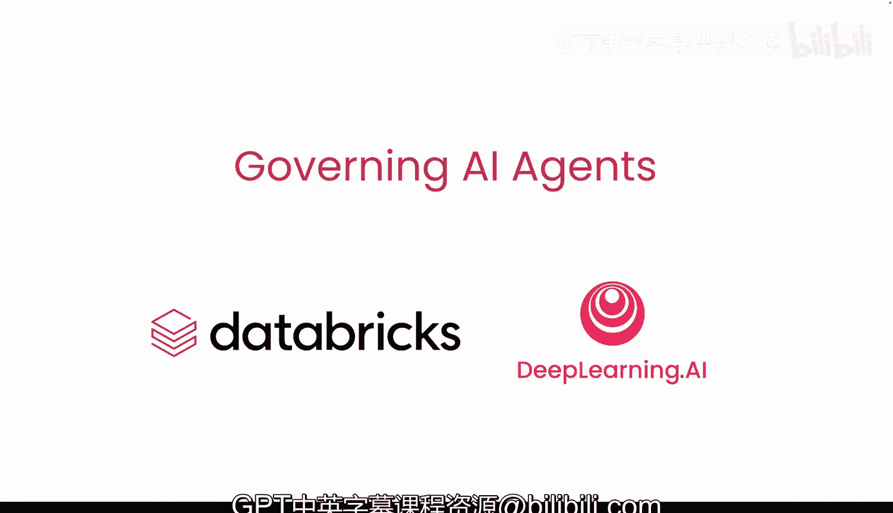
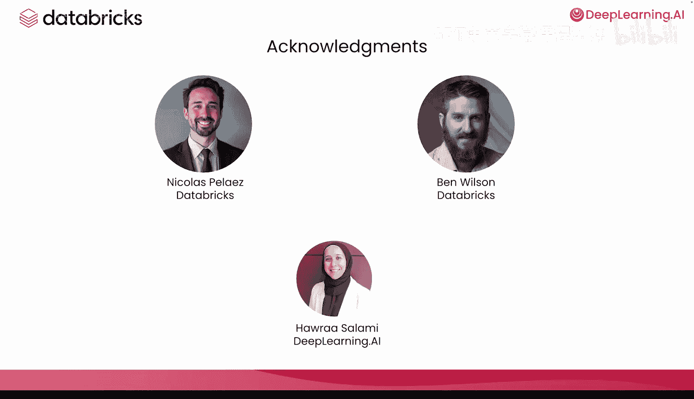

# 001：课程介绍 🎬

在本课程中，我们将学习如何将数据治理整合到AI智能体的工作流程中，以确保智能体能够安全、可靠且准确地处理数据。

数据治理包含一系列政策和实践，通过实施这些措施，可以确保智能体仅能访问其所需的数据，保护个人信息免遭未经授权的访问，并使你和你的团队能够监控智能体的性能。

本课程的讲师是来自Databricks的技术营销经理Andrew Robs。我们很高兴能与他合作。

## 为何需要数据治理？🔍

假设你想构建一个专注于客户分析的智能体。你可以为它定义一组工具，使其能够摄入客户人口统计、交易记录、网站互动或调查反馈等数据。

如果你授予该智能体访问所有这些数据的广泛权限，它可能会泄露客户的私人信息，例如信用卡信息、地址或个人购买行为数据，这些信息可能不应被所有公司员工看到。

然而，如果你在构建智能体时就考虑到数据治理，那么你就可以确保智能体妥善处理这些数据。

## 治理实践示例 🛡️

以下是你可以实施的一些具体治理实践：

*   **访问控制**：你可以在部署环境中指定智能体可以访问哪些表或列。
*   **数据保护**：你可以加密客户ID并掩码信用卡信息。
*   **质量监控**：你可以为智能体的输入和输出实施数据质量检查。
*   **评估与可观测性**：你可以添加评估以衡量输出质量，并启用可观测性来追踪智能体的处理步骤。

所有这些实践都有助于你持续监控智能体的行为，并调试任何故障场景。

## 本课程内容概览 📚

在本课程中，你将学习如何将这些治理实践应用到一个将在Databricks上构建和部署的智能体上。

为了确保你的智能体遵循最小权限访问原则，你将通过视图授予智能体特定的、有意的访问权限。这些视图本质上是像表一样工作的SQL查询，它们将只包含智能体任务所需的数据。

为了让智能体访问这些视图，你需要学习如何指定智能体的权限。接着，你将构建工具使智能体能够访问数据，并将这些工具作为函数注册到Unity Catalog中。Unity Catalog是一个开源数据目录，可确保只有经过授权的智能体或用户才能访问这些工具。

之后，你将使用OpenAI SDK实现智能体逻辑，使用MLflow对其进行评估并启用追踪功能。

最后，你将部署你的智能体。

## 如何开始实践 🚀

为了跟上课程实验，你可以创建Databricks免费版账户，免费尝试实验。

本课程的创建离不开许多人的努力。我们要感谢来自Databricks的Nicholas Ps和Ben Wilson，以及来自Deeple AI的Harra Salami对本课程的贡献。

在下一课中，Amber将带你了解AI智能体数据治理的四大支柱，这总结了如何治理AI智能体的主要方面。四大支柱是：生命周期管理、风险管理、安全性和可观测性。

让我们进入下一个视频开始学习。

---

**本节课总结**：我们一起了解了本课程的目标——为AI智能体实施数据治理，探讨了治理的必要性，并预览了即将学习的关键实践，包括访问控制、数据保护、质量监控以及使用特定工具和平台（如Unity Catalog和MLflow）来构建、评估和部署安全的智能体。