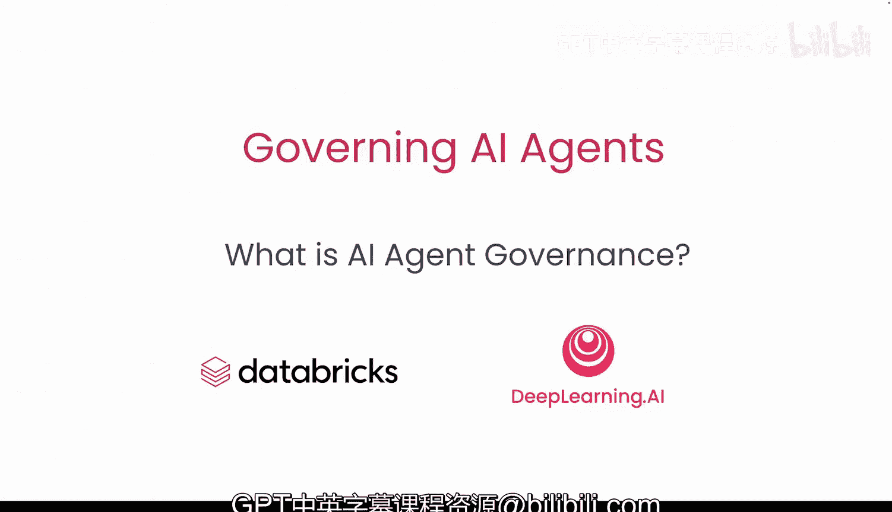
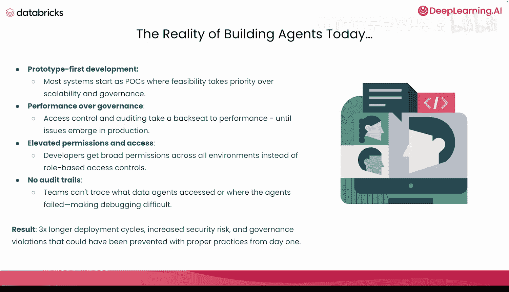
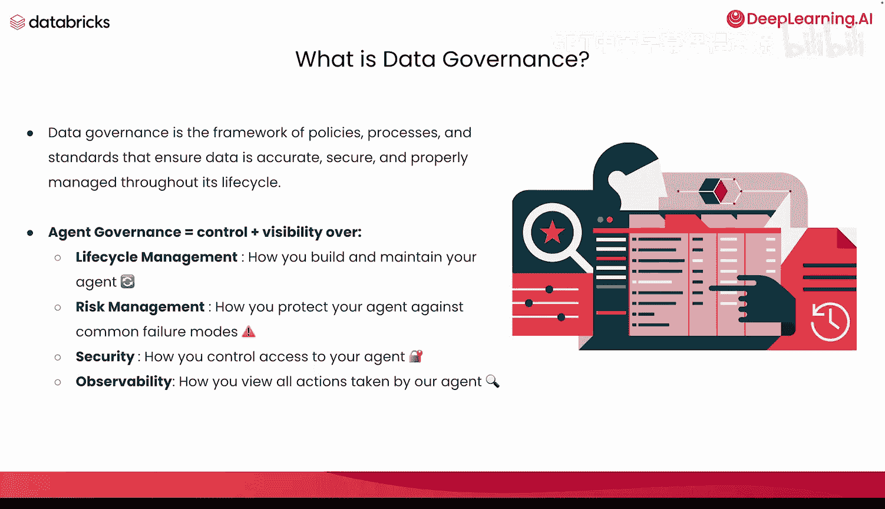
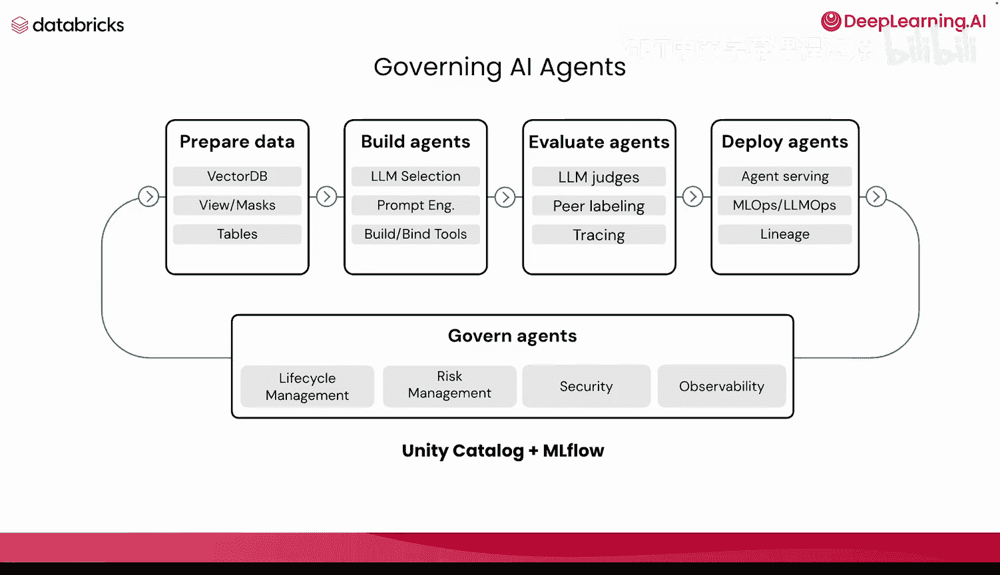
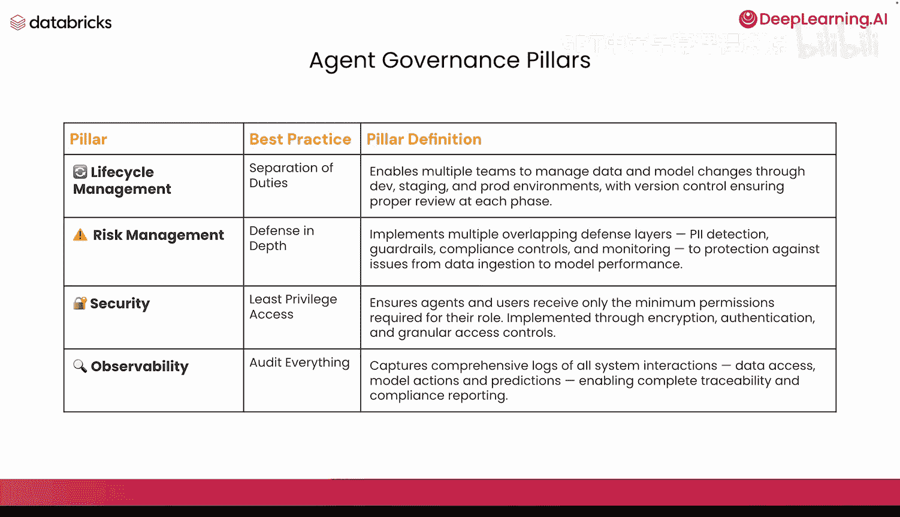
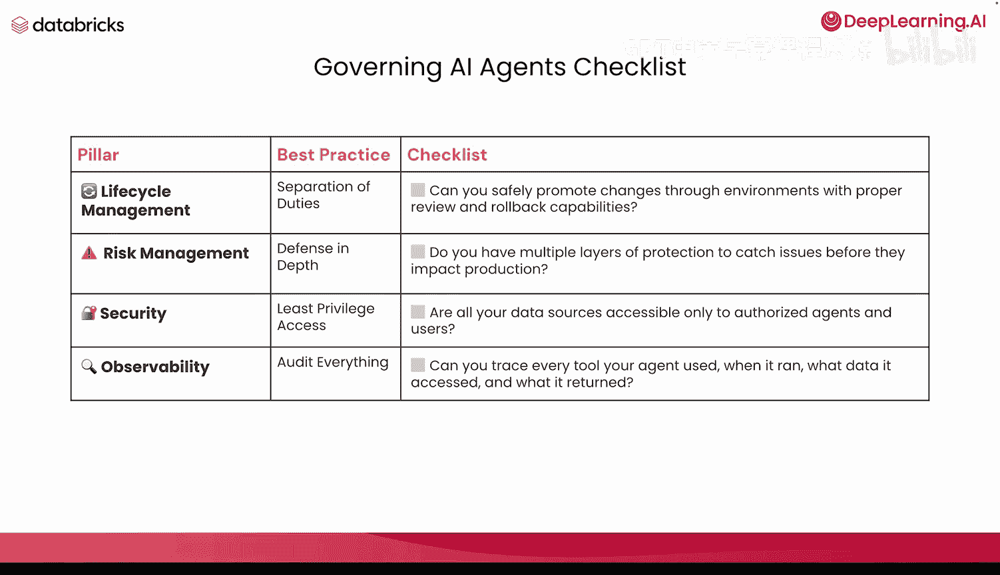

# 002：什么是AI智能体治理 🧠

在本节课中，我们将学习AI智能体治理的四大支柱，并了解如何将它们应用到你的智能体工作流程中。

## 概述

当前构建AI智能体的现实情况是，开发往往从原型开始。大多数系统最初作为概念验证或演示，此时可行性优先于可扩展性和治理。从演示开始并非坏事，但问题在于性能指标（如模型的准确性）开始优先于访问控制、审计等治理措施。我们不希望治理让位于性能，尤其是在生产环境中出现问题时，因为解决这些问题的唯一方法正是依靠治理。

## 当前构建智能体的挑战

上一节我们介绍了治理的重要性，本节中我们来看看当前开发实践中常见的几个具体挑战。

*   **权限管理宽松**：开发者在构建初期通常拥有跨所有环境的广泛权限，而非基于角色的访问控制。当准备将系统投入生产时，这种过高的权限会带来严重风险。
*   **审计追踪缺失**：团队往往无法精确追踪智能体执行了哪些操作、访问了哪些数据、在何处失败，这使得调试变得极其困难。
*   **部署周期延长**：一个精心构建、耗时两三周的概念验证，交给团队进行生产部署时，可能需要长达八个月。这是因为团队必须回头重新处理安全和治理的各个方面，从而引入了额外的安全风险。

因此，最佳实践是从第一天起就贯彻治理原则。

## 什么是智能体治理？

那么，究竟什么是智能体治理？数据治理是确保数据在其生命周期内准确、安全、可靠并得到妥善管理的政策、流程和标准框架。而**智能体治理**的核心是**控制力**加**可见性**，具体体现在以下四个维度：

1.  **生命周期管理**：如何构建和维护你的智能体。
2.  **风险管理**：如何保护你的智能体免受常见故障模式的影响。
3.  **安全性**：如何控制对智能体的访问。
4.  **可观测性**：查看智能体采取的所有操作的能力。

## 治理在智能体系统构建中的位置

接下来，我们看看治理如何融入智能体系统的构建流程。基本上，构建一个智能体始于数据准备（如创建表、视图、掩码、向量数据库），然后是构建智能体本身（绑定工具、添加提示词、选择大语言模型），接着是评估智能体（通过大语言模型评判、同行标注或黄金数据集）。之后是部署智能体，确保其提供服务并追踪谱系。而贯穿这个从始至终全过程的，就是**治理层**，它涵盖了生命周期管理、风险管理、安全性和可观测性。

我们将借助Unity Catalog和MLflow等工具来应用这些治理层。如前所述，治理涵盖了你从数据创建到模型监控所构建的一切。为了帮助开发者概念化和归类这些领域，我总结了以下四大支柱。

## 智能体治理的四大支柱与最佳实践

以下是智能体治理的四大支柱及其对应的核心最佳实践：

*   **生命周期管理**
    *   **最佳实践：职责分离**
    *   **公式/描述**：`开发环境 -> 预发布环境 -> 生产环境`，配合版本控制。
    *   这使得多个团队能够通过开发、预发布和生产环境来管理数据和模型变更，并在每个阶段确保进行适当的审查。

*   **风险管理**
    *   **最佳实践：深度防御**
    *   **公式/描述**：`PII检测 + 护栏 + 合规控制 + 监控`。
    *   即实施多个重叠的防御层，包括个人身份信息检测、护栏、合规性控制和监控，以防范从数据摄取到模型性能各环节可能出现的问题。

*   **安全性**
    *   **最佳实践：最小权限原则**
    *   **公式/描述**：`权限 = min(角色所需权限)`。
    *   这确保智能体和用户仅获得其角色所需的最低权限，通过加密、身份验证和细粒度访问控制来实现。

*   **可观测性**
    *   **最佳实践：全面审计**
    *   **公式/描述**：`日志 = 数据访问日志 + 模型操作日志 + 预测日志`。
    *   即捕获所有系统交互的全面日志，包括数据访问、模型操作和预测，从而实现完整的可追溯性和合规性报告。

## 实现最佳实践的技术与工具

现在，我想带你了解一些实现每项支柱最佳实践的常用技术和工具。

以下是各支柱对应的关键技术或工具类别：

*   **生命周期管理（职责分离）**：版本控制、CI/CD流水线、环境管理（开发/预发布/生产）、隔离、部署编排、变更管理（回滚能力）。
*   **风险管理（深度防御）**：数据质量监控、PII检测、护栏、合规性能力、模型验证。
*   **安全性（最小权限）**：单点登录、API密钥管理、多因素身份验证、服务主体、秘密管理、访问控制、数据保护、网络安全。
*   **可观测性（全面审计）**：在GenAI中常提到用于记录模型追踪的开放遥测标准，但这里更广泛，包括：审计日志、应用日志、推理日志、访问日志、监控能力、谱系追踪、告警。

## 部署就绪检查清单

以上是四个主要领域。下次当你构建智能体功能并思考“它是否已准备好部署？是否适用于生产用例？”时，可以参考以下检查清单，以牢记这些最佳实践：

*   **生命周期管理**：能否在通过适当审查和具备回滚能力的前提下，安全地跨环境推进变更？
*   **风险管理**：是否具备多层保护机制，以便在问题影响生产环境之前将其捕获？
*   **安全性**：是否所有数据源都仅对授权的智能体和授权用户开放？
*   **可观测性**：能否追踪智能体每次运行时使用的每个工具、访问了哪些数据以及返回了什么结果？

这些正是你的生命周期管理、风险管理、安全性和可观测性所需的关键能力。在本短期课程中，你将看到这些支柱的实际应用。

## 总结

本节课中，我们一起学习了AI智能体治理的四大支柱：**生命周期管理**、**风险管理**、**安全性**和**可观测性**。我们探讨了当前开发中的常见挑战，理解了治理贯穿智能体构建的全流程，并介绍了每个支柱对应的最佳实践、实现工具以及一个实用的部署前检查清单。牢记这些原则，将帮助你构建更可靠、安全且易于维护的AI智能体系统。