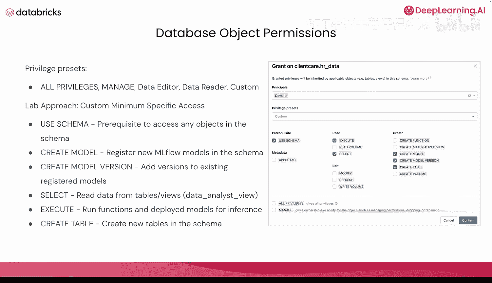
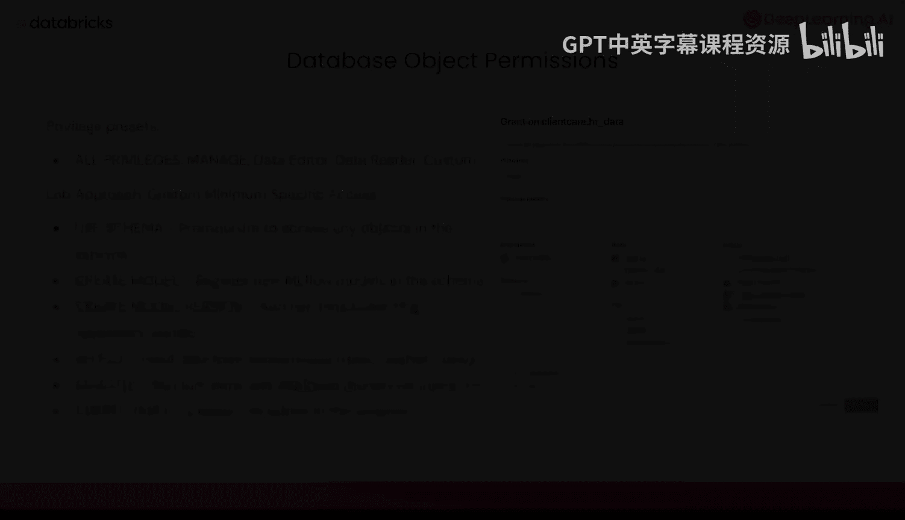

# 003：在目录中建立治理体系 🏛️

在本节课中，我们将学习如何将AI智能体治理的四大支柱付诸实践。我们将重点介绍Unity Catalog，了解它是什么，并探索其核心组件。通过本课，你将掌握如何在Databricks环境中利用Unity Catalog来实施统一的数据与AI资产治理。

## 概述

上一节我们介绍了AI智能体治理的四大支柱。本节中，我们将看看如何借助Unity Catalog将这些治理层应用到数据上。Unity Catalog本质上是你的治理基础，它是一个统一的数据目录，提供跨Databricks工作区的访问控制、审计、血缘追踪、数据质量监控等功能。

## 什么是Unity Catalog？

Unity Catalog是一个统一的数据目录，为跨Databricks工作区的数据与AI资产提供访问控制、审计、血缘追踪、数据质量监控等功能。

由于你将在Databricks工作区中操作，最好了解Databricks工作区是一个供团队编写代码、运行笔记本和访问数据的环境，是与队友协作的绝佳方式。Unity Catalog为所有这些工作区提供了统一的治理。

## Unity Catalog的结构与元存储

使用Unity Catalog时，最好理解其结构和元存储的概念。

元存储是Unity Catalog中数据的顶级容器。它注册有关数据和AI资产的元数据，以及管理其访问权限的规则。每个元存储都公开一个三级命名空间：**目录**、**模式**和**表/视图/卷/函数**，你的数据可以通过这个结构进行组织。

## 数据库对象详解

现在，我们来深入了解一下每个层级的具体含义。首先是数据库对象。

Databricks主要使用两种主要的可搜索对象来存储和访问数据：
*   **表**：用于存储结构化的表格数据。
*   **卷**：用于存储非结构化的非表格数据。

此外，你还可以从这两者创建向量数据库。如果你使用Databricks向量搜索，无论是包含向量列的表，还是卷，都可以创建向量索引。这些向量数据库将继承Unity Catalog为所有AI检索应用提供的所有安全和审计能力。

简单回顾一下：表用于结构化数据，卷用于非结构化数据，两者都可以用来创建向量数据库。

## 从目录、模式、表的角度看数据对象

从目录、模式和表的角度来看Databricks对象，其结构如下：

*   顶级容器是**目录**，它包含所有模式。
*   接下来是**模式**，通常也称为数据库，它包含你所有的数据对象。数据对象可以包含在单个模式中。

以下是模式中可以包含的数据对象类型：
*   **表**：按行和列组织的数据集合。
*   **视图**：针对一个或多个表的保存查询。
*   **卷**：云对象存储中的所有非结构化数据，可以是PDF、图像、视频等任何非结构化数据。
*   **函数**：返回值的保存逻辑。函数也是你的工具或技能，你可以将其附加到智能体上以查询数据。
*   **模型**：使用MLflow打包的AI模型。这些也可以是你的智能体，你可以将智能体注册为一个使用MLflow打包的AI模型。我们将在本课程的实验二中看到具体做法。

## 实践案例：Client Care公司

在本课程的实验一中，你将创建并使用Unity Catalog对象来创建表。

我们将模拟一家名为Client Care的公司，并创建一个包含所有HR数据的数据库。模式将命名为`HR_data`。请记住，我们的结构是：目录 `client_care`，模式 `HR_data`，然后是该模式下的所有数据表。

我们将创建一个分析师视图。这个视图将匿名化许多关键的个人身份信息，例如社会安全号码、姓名等，只提供数据分析师所需的信息。

我们将构建函数。我们会构建数据掩码函数，以及可以查询数据的函数。我们将把这些函数作为工具绑定到我们的智能体上，以便智能体能够使用我们构建的特定视图来查询数据。

我们将构建模型。在这里，我们将再次把正在构建的模型注册为MLflow模型，这将是我们的智能体。因此，我们将智能体视为一个模型，或者任何定制的微调大语言模型。

## 集中化治理与权限预设

接下来，你将看到Unity Catalog如何为Databricks环境中的所有数据对象提供集中化治理。

在深入实验一之前，了解一下权限预设。我们可以授予所有权限、创建管理权限、编辑特定信息、读取权限或自定义权限。

我们将为我们即将创建的开发人员组设置自定义权限。这个实验希望使用自定义的、最小化的特定访问权限。因此，我们将授予这些开发人员以下权限：
*   使用模式的权限。
*   创建模型的权限。
*   创建模型版本的权限。
*   使用SELECT语句从表和视图中读取数据的权限。
*   执行权限，以便他们可以运行函数并为推理部署模型。
*   在模式中创建新表的权限。

再次强调，如果你想为所有开发人员提供广泛的访问权限，只需点击“所有权限”即可。如果只想管理访问权限，可以在那里进行管理。自定义预设中，我可以选择“编辑者”、“读者”，它会相应地更改权限。但“自定义”选项将让你能够进行更精细的手动控制。当然，撤销权限和授予权限一样简单。

## 总结

本节课中，我们一起学习了Unity Catalog作为AI智能体治理基础的核心概念。我们了解了它的三级命名空间结构，认识了表、卷、视图、函数和模型等关键数据对象，并通过一个公司案例看到了如何在实际中应用。最后，我们探讨了如何通过权限预设来实现精细化的访问控制。在接下来的实验中，你将亲手实践这些概念，建立自己的治理体系。