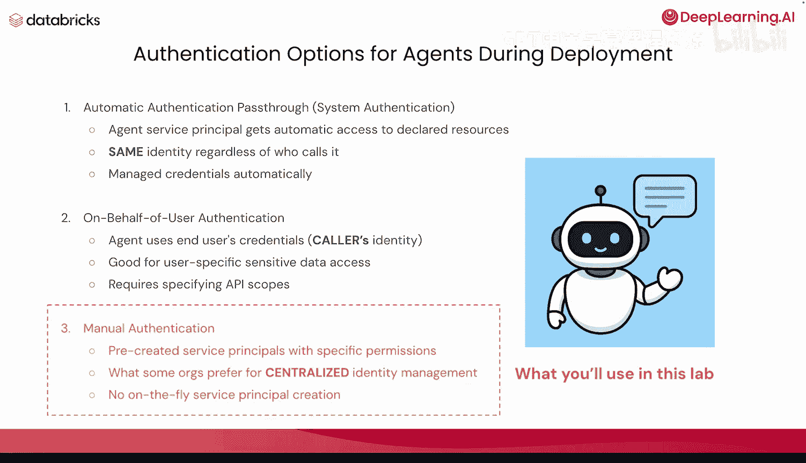
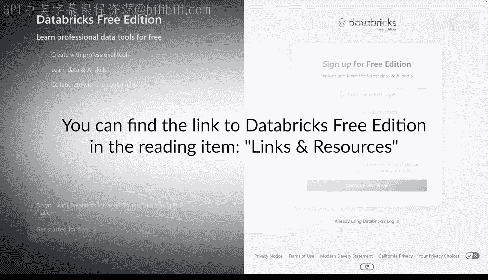
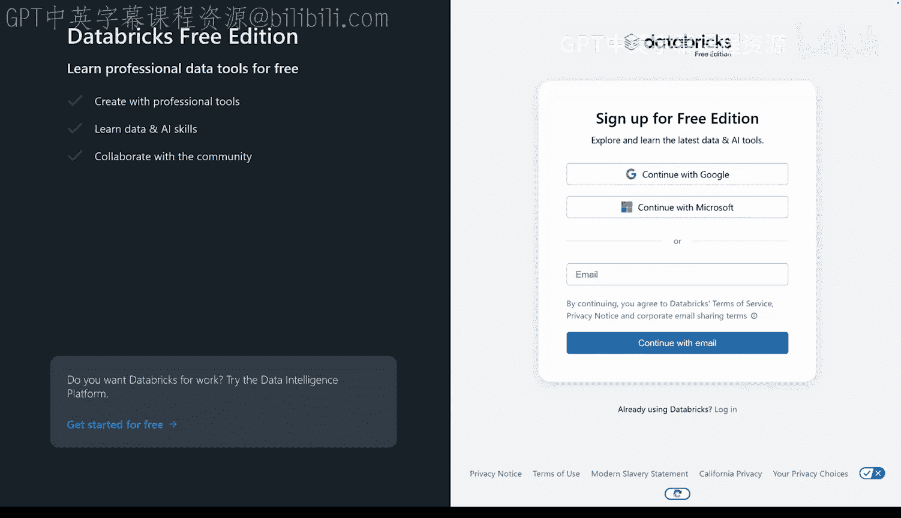

# 004：为智能体添加身份

在本节课中，我们将学习如何为部署的AI智能体分配正确的身份和权限，以确保其只能访问所需的数据。我们将重点介绍Databricks中的身份类型，并解释为何以及如何为智能体创建专用的服务主体。

## 概述

部署智能体时，必须确保其拥有适当的权限来访问所需数据。本节课程将介绍Databricks中的主要身份类型，并指导你如何为智能体分配一个专用的服务主体身份，以实现安全且可审计的访问控制。

## Databricks中的身份类型

在Databricks平台中，主要存在三种身份类型，用于管理和控制对资源与数据的访问。

以下是这三种身份类型的详细说明：

*   **用户**：这是由Databricks识别的用户身份，通常以电子邮件地址表示。每个真实用户都对应一个用户身份。
*   **服务主体**：此类身份用于作业、自动化工具和系统，例如脚本、应用程序和CI/CD平台。它们代表非人类的实体。
*   **组**：组用于简化身份管理，可以轻松地将访问权限分配给工作区、数据和其他安全对象。一个组可以包含多个用户和/或多个服务主体。

通过使用组，管理员可以一次性向整个组授予权限，而无需逐个用户或服务主体进行操作，这极大地提升了管理效率。

## 管理角色

除了基本身份，Databricks还设有专门的管理角色来管理这些身份。

以下是主要的管理角色及其职责：

*   **账户管理员**：这是最高级别的管理员角色，可以添加用户、服务主体和组到账户中，并分配其他管理角色。
*   **工作区管理员**：可以将用户和服务主体添加到账户中，并授予他们访问特定工作区的权限。
*   **组管理员**：可以管理特定组内的权限，并分配组管理员角色。
*   **服务主体管理员**：负责管理服务主体的角色。

## 智能体的身份管理挑战

上一节我们介绍了Databricks中用于“人”的身份体系，但对于AI智能体而言，身份管理则面临独特的挑战。

智能体需要自己的身份来运行自动化任务并访问数据。如果使用人类管理员的凭证，会带来安全和审计风险。此外，无论由谁触发，智能体都需要一个一致的身份来运行。

解决这一挑战的方案是创建一个**服务主体**。当运行智能体时，使用该服务主体的凭证来执行。这样，智能体的操作就与具体的人类用户解耦，并拥有独立、可控的权限。

## 智能体部署的身份验证选项

为智能体部署配置身份时，主要有三种身份验证模式。

以下是这三种模式的说明：

*   **自动身份验证**：智能体服务主体自动获得对声明资源的访问权限。无论谁调用它，都使用同一身份，凭证由系统自动管理。这在构建概念验证或演示时很常见。
*   **代表用户身份验证**：智能体使用最终用户的凭证运行，因此具有调用者的身份。这适用于访问用户特定的敏感数据，但需要特定的API范围来验证身份，且调用者必须是真实的人类用户。
*   **手动身份验证**：使用预先创建的、具有特定权限的服务主体。一些组织称之为“集中式身份管理”。这对于将大量系统投入生产的公司非常常见，因为它避免了动态创建服务主体。

在本课程的实验环节，我们将采用**手动身份验证**方式。这是我们在生产模型中常见的做法，也正逐渐成为生产环境智能体的标准实践。

## 实验环节概述

接下来，我们将进入实践环节。我们将预先创建一个具有特定权限的服务主体，以此建立集中式的身份管理。

在接下来的实验中，我们将分三步完成：
1.  **实验1**：创建服务主体和一个开发者组，并将服务主体加入该组。
2.  **实验2**：开发智能体。
3.  **实验3**：使用该服务主体的凭证部署智能体。

这样，最终部署的智能体将以其专用服务主体的身份运行，权限清晰且可控。

## 实验准备

在开始实验之前，如果你想跟随操作，可以创建一个Databricks免费教育版账户。创建后，你将同时拥有账户管理员和工作区管理员权限。但请注意，免费教育版中的账户管理控制台功能是锁定的，因此你无法行使账户管理员的所有特权。

现在，让我们开始实验。

## 总结

本节课我们一起学习了为AI智能体管理身份的核心知识。我们了解了Databricks中的用户、服务主体和组三种身份类型，明确了为智能体分配专用服务主体的必要性，并介绍了自动、代表用户和手动三种身份验证模式。最后，我们概述了将通过手动验证方式，在实验中创建服务主体并以此身份部署智能体的完整流程。