# 005：实验1-构建治理基础 🏗️

在本节课中，我们将把治理基础付诸实践。你将使用一个包含员工信息的HR数据集，从数据表创建视图，建立服务主体身份，并利用这些权限访问视图，最终创建AI智能体工具并将其注册到Unity Catalog中。

---

## 环境准备与初始设置

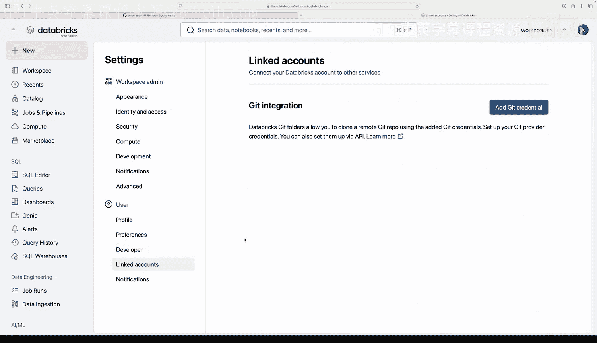

上一节我们介绍了治理基础的概念，本节中我们来看看如何搭建实验环境。

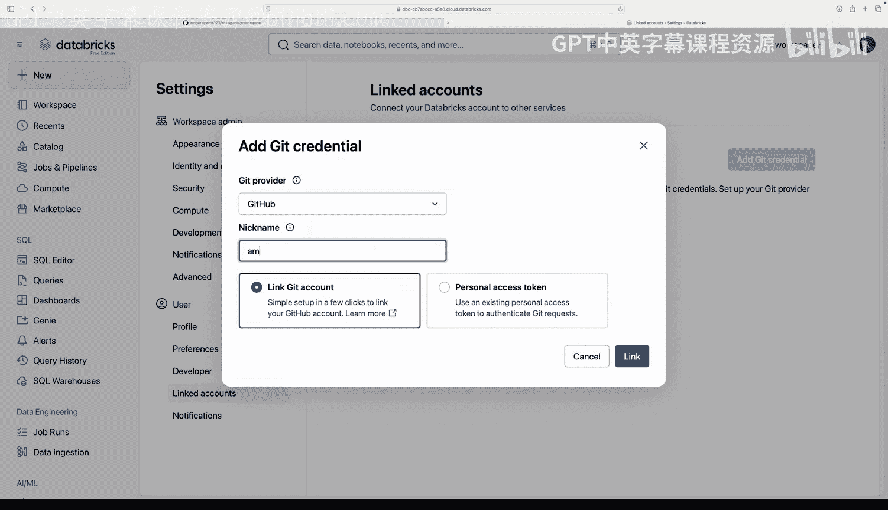

首先，你需要注册一个Databricks免费版账户，并获取本实验所需的代码和数据。实验代码和数据链接位于课程说明中。

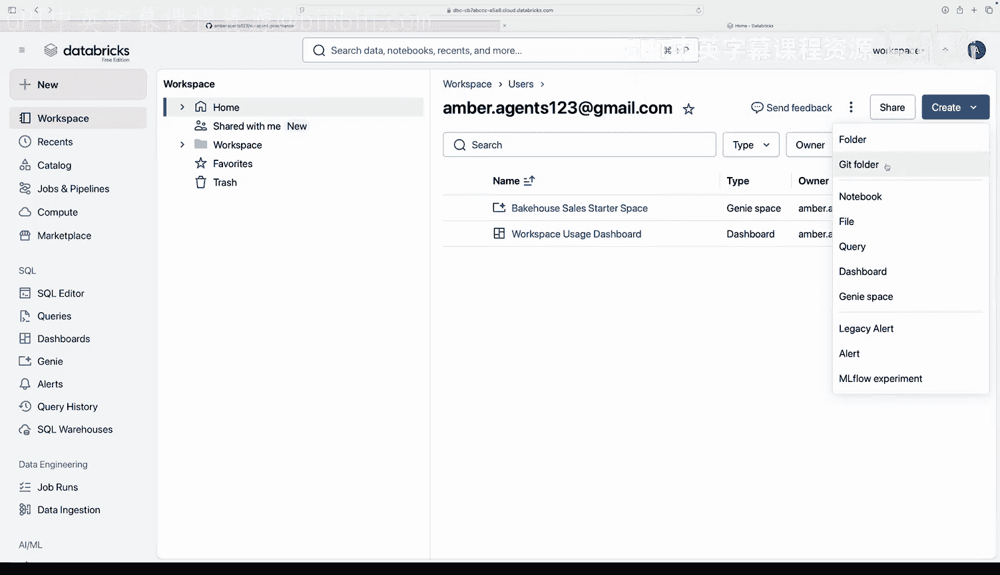

以下是设置开发环境的步骤：

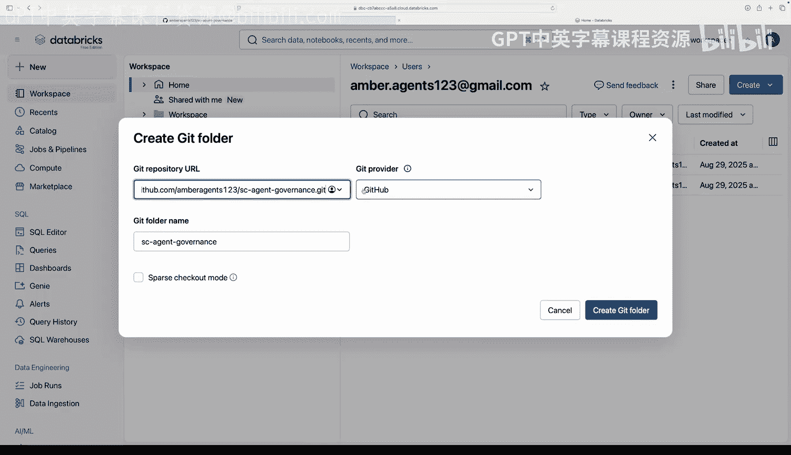

1.  登录Databricks工作区。
2.  进入用户设置中的“开发者”选项卡。
3.  链接你的GitHub账户，授权Databricks访问。
4.  在工作区中，通过粘贴GitHub仓库链接来创建Git文件夹，同步实验代码。

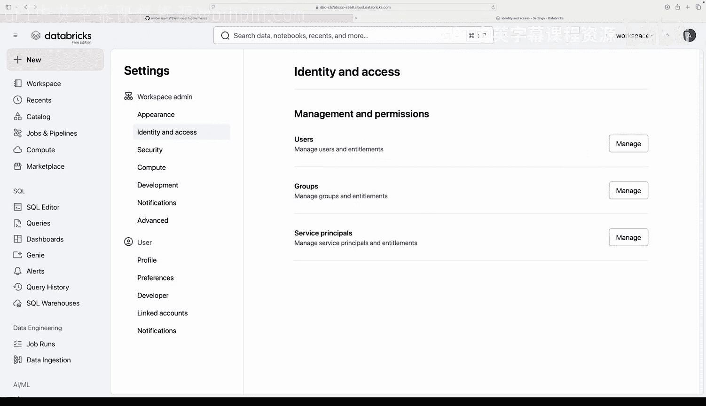

完成环境准备后，我们开始创建治理所需的核心身份与组。

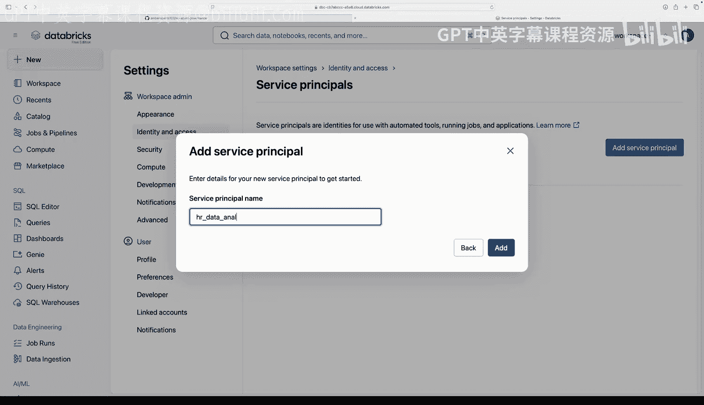

---

## 创建服务主体与开发组 👥

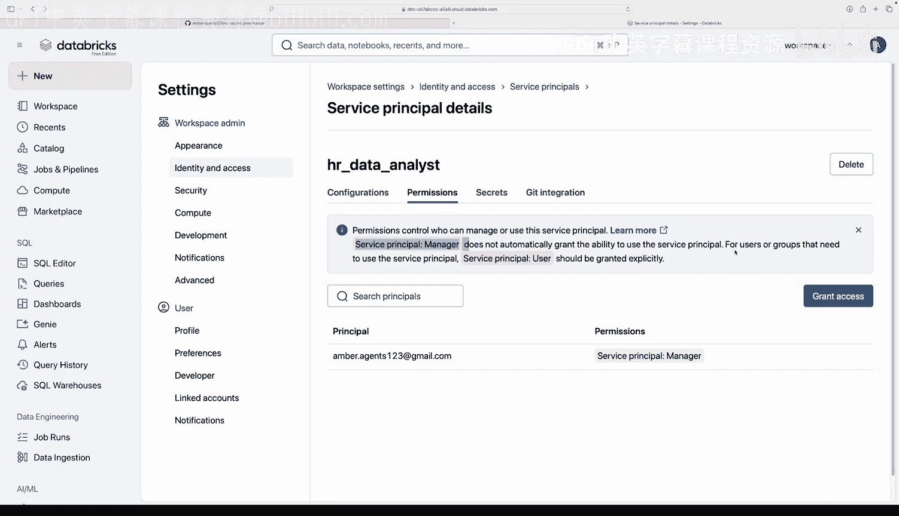

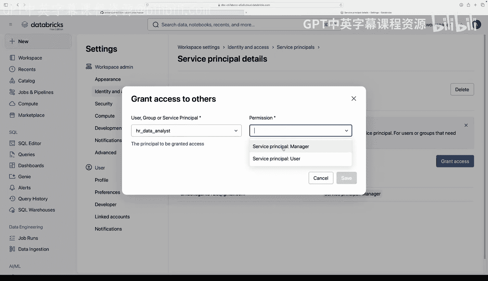

在开始编写代码之前，我们需要建立访问控制的基础：服务主体和用户组。

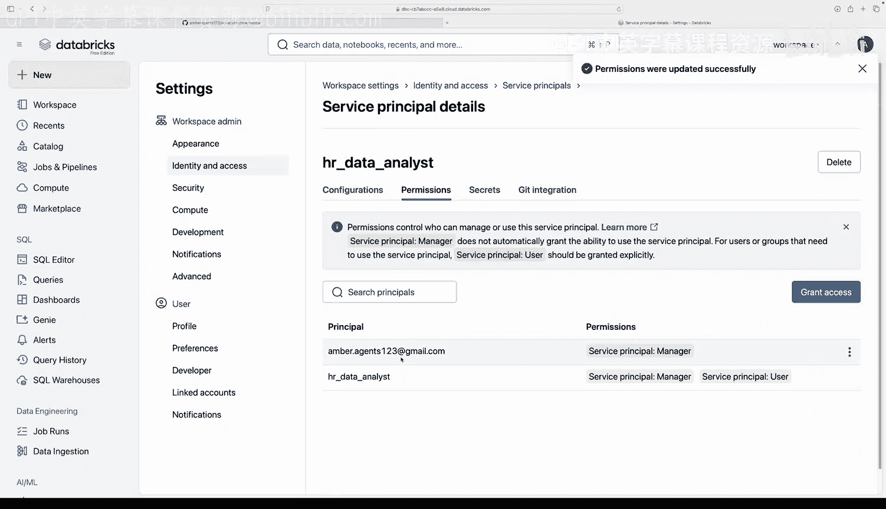

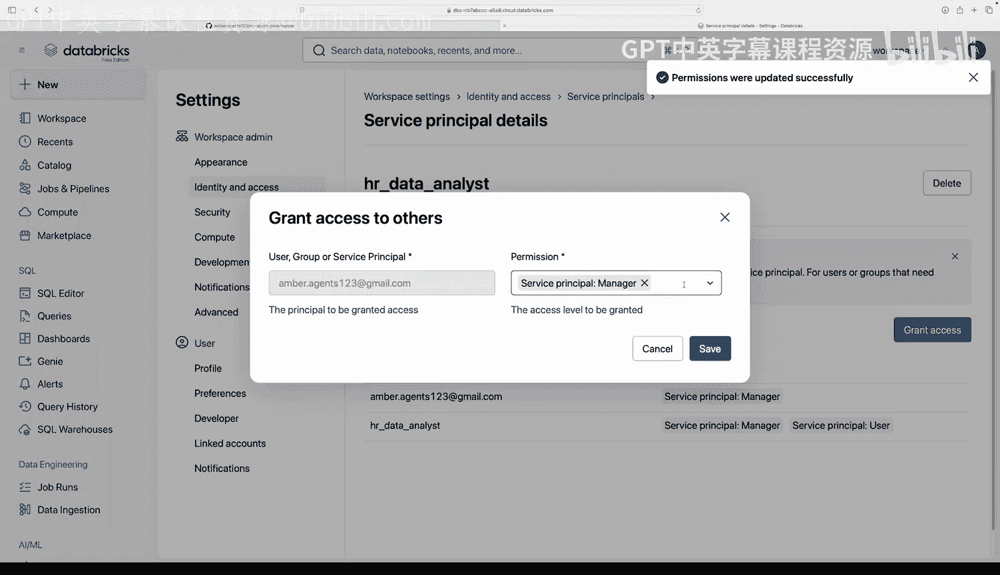

服务主体（Service Principal）是一种非人类身份，代表应用程序或服务（如我们的AI智能体）进行身份验证和授权。我们将创建一个名为“HR数据分析师”的服务主体。

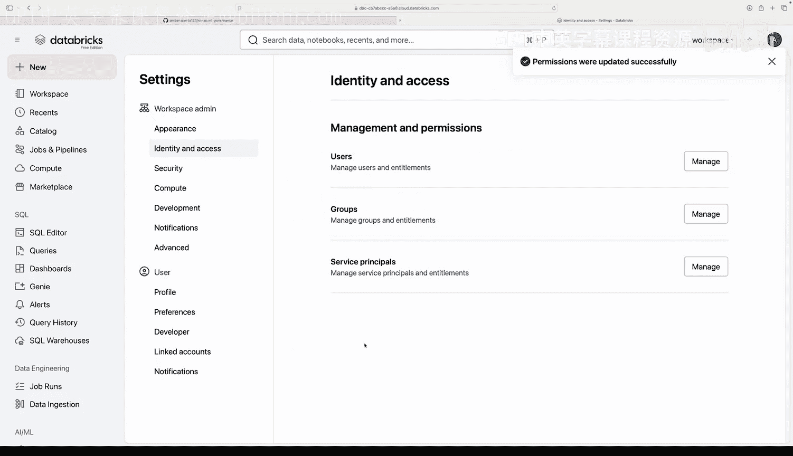

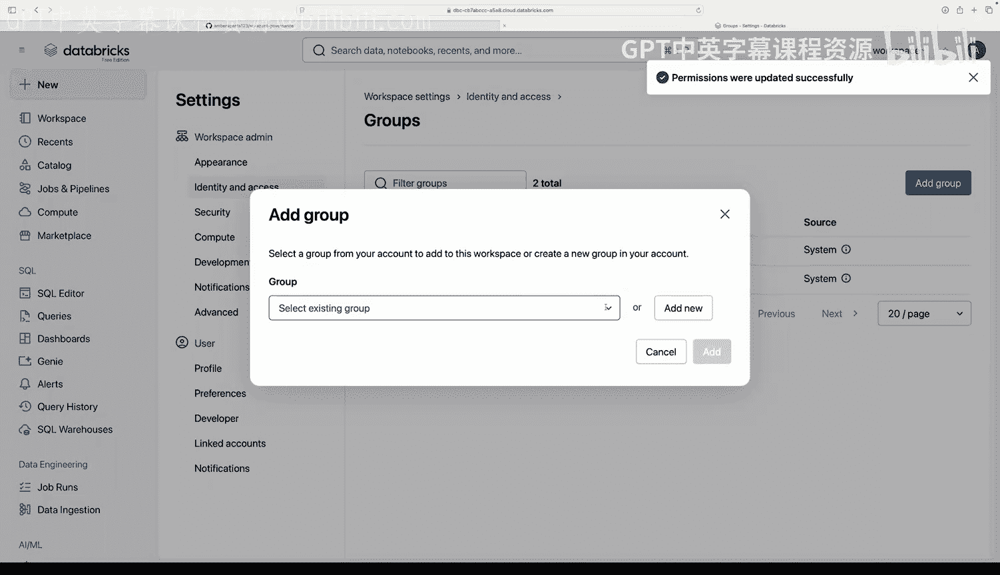

用户组（Group）用于集中管理权限。我们将创建一个名为“devs”的组，所有开发AI智能体的开发人员都将属于此组，以便统一授予权限。

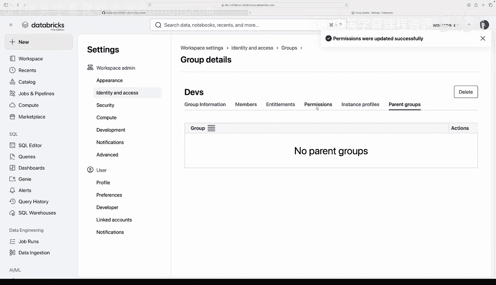

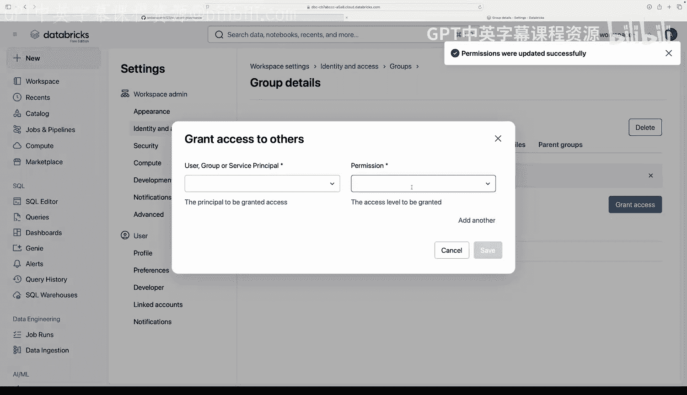

以下是具体操作流程：

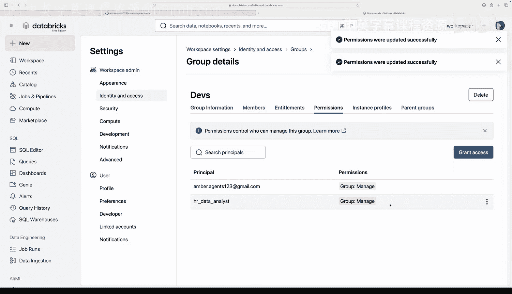

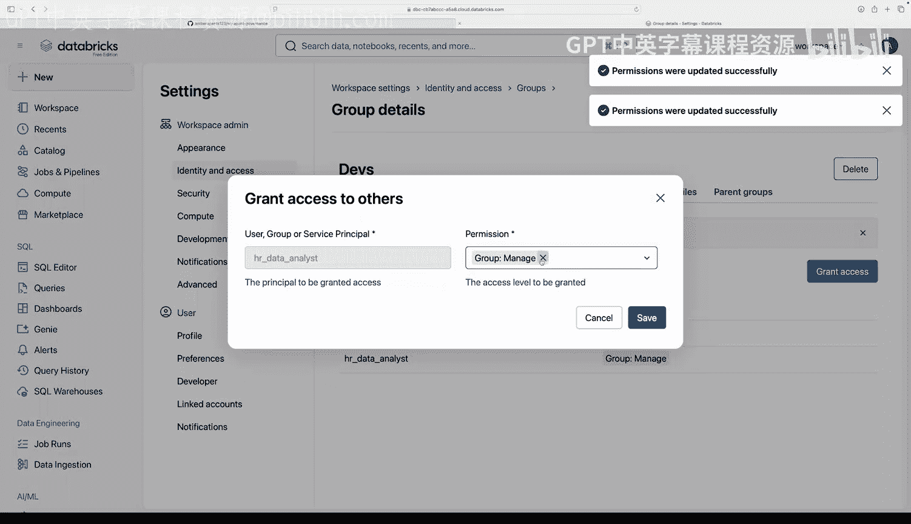

*   进入Databricks管理控制台的“身份与访问”页面。
*   在“服务主体”部分，添加新服务主体，命名为 `HR_data_analyst`。
*   为该服务主体配置权限，确保其能够被“管理”和“使用”。
*   在“组”部分，创建新组，命名为 `devs`。
*   将 `HR_data_analyst` 服务主体作为成员添加到 `devs` 组中，仅赋予“成员”权限，使其能继承组的权限但无法修改组设置。

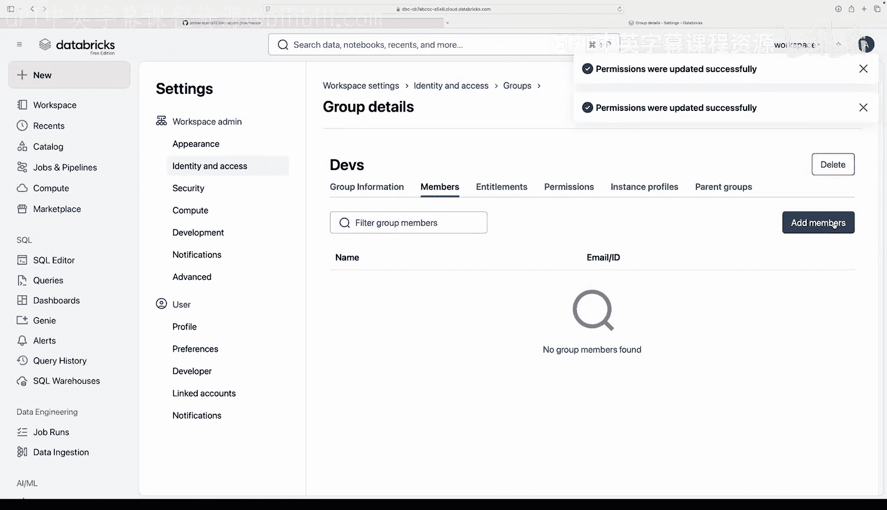

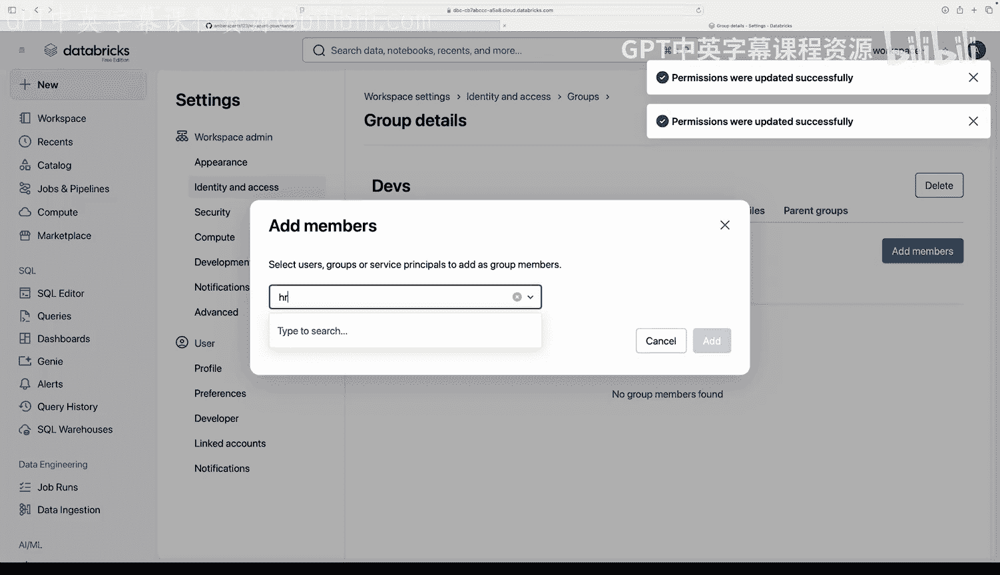

现在，我们已经为AI智能体创建了代表其身份的服务主体，并将其纳入了开发人员组，为后续的权限继承奠定了基础。

---

## 创建数据目录与表 📊

上一节我们建立了身份体系，本节中我们将在Unity Catalog中创建数据目录和表结构。

首先，在笔记本中运行初始化设置单元，定义公司名称（`client_care`）和HR数据库模式（`hr_data`）。

接下来，我们将本地CSV文件中的数据加载到Databricks中。数据包括薪酬、员工记录、HR案例等多个文件。

以下是加载数据的关键代码步骤：

```python
# 对于每个CSV文件，使用pandas读取，然后转换为Spark DataFrame
for table_name, file_name in csv_files.items():
    pandas_df = pd.read_csv(f"data/{file_name}")
    spark_df = spark.createDataFrame(pandas_df)
    # 将DataFrame写入Unity Catalog
    spark_df.write.mode("overwrite").saveAsTable(f"client_care.hr_data.{table_name}")
```

运行完成后，你可以在Unity Catalog界面中查看新创建的目录 `client_care`、模式 `hr_data` 以及其下的所有数据表。

为了了解数据全貌，我们可以执行一个查询，将`employee_records`和`compensation_data`表连接起来查看。结果将显示员工ID、姓名、部门、社会保险号、电话号码、邮箱、入职日期和薪资等字段。这让我们意识到数据中包含大量敏感信息（PII）。

---

## 应用数据分类标签 🏷️

既然我们识别出了数据中的敏感信息，下一步就是通过分类标签来标记数据的敏感级别。

在Unity Catalog中，**表属性（Table Properties）** 是用于分类数据敏感性的元数据标签。它们不会改变数据结构，但可以被治理工具查询，以实施合规策略。

我们定义以下分类体系：
*   **公开（Public）**： 任何人可访问。
*   **内部（Internal）**： 仅限内部员工。
*   **机密（Confidential）**： 受限访问。
*   **严格受限（Restricted）**： 高度敏感信息。

以下是应用标签的SQL示例：
```sql
ALTER TABLE client_care.hr_data.employee_records
SET TBLPROPERTIES ('classification' = 'confidential', 'contains_pii' = 'true');
```

我们对所有表运行类似的语句，为其打上相应的分类和是否包含PII的标签。完成后，在数据表的详情页中即可看到这些元数据标签。

---

## 创建分类感知视图 👁️

为AI智能体设计恰当的访问级别至关重要。我们不希望它看到姓名、社保号等直接标识信息，但它可能需要薪资、部门、绩效等数据进行分析。

**视图（View）** 是实现这一目标的理想工具。它们是虚拟表，基于SQL查询定义，可以屏蔽底层表的敏感列，并提供清晰的数据子集。

我们将创建一个名为 `data_analyst_view` 的视图，专为统计分析设计。

以下是构建该视图的核心逻辑：

*   **匿名化员工ID**： 使用哈希函数处理。
*   **简化入职日期**： 仅保留年份，避免精确日期关联到个人。
*   **包含分析所需字段**： 如部门、基本工资、奖金、股票期权、绩效评级等。
*   **排除法律部门数据**： 出于合规原因。
*   **联接相关表**： 将`compensation_data`和`performance_reviews`表的信息合并。

创建视图后，我们对其进行测试，确认它只返回匿名化、去标识化的数据，且不包含法律部门信息。

---

## 配置组权限 🔐

我们已经创建了`devs`组和`data_analyst_view`视图。现在需要授予`devs`组访问数据和创建AI智能体所需的权限。

在Unity Catalog中，权限分为容器权限和对象权限。我们需要按顺序授予：

1.  **容器权限（前置条件）**：
    *   `USE CATALOG`： 允许使用`client_care`目录。
    *   `USE SCHEMA`： 允许使用`hr_data`模式。
2.  **对象权限（可继承）**：
    *   `SELECT ON VIEW`： 允许查询`data_analyst_view`视图。
    *   `CREATE MODEL`, `CREATE FUNCTION`等： 允许在模式内注册模型和函数（为后续创建AI智能体工具做准备）。

使用`GRANT`语句为`devs`组授予上述权限。授予后，组内所有成员（包括`HR_data_analyst`服务主体）都将继承这些权限。

我们可以通过查询系统表来验证权限是否已正确设置。

---

## 实施列级数据掩码 🎭

你可能会问，既然已经有了安全的视图，为什么还需要数据掩码？因为视图可能被绕过（例如用户获得直接表访问权），而**列掩码（Column Masking）** 在表级别强制执行，任何查询都无法绕过。

我们将为`employee_records`表中的`ssn`（社会保险号）列创建掩码函数。

掩码策略如下：
*   对于普通用户（如`devs`组成员）：显示为`***-**-****`（完全匿名）。
*   对于特权用户（如薪资管理员）：显示为`***-**-1234`（仅显示末四位）。

以下是创建和应用掩码函数的SQL代码：
```sql
-- 创建掩码函数
CREATE OR REPLACE FUNCTION mask_ssn(ssn STRING)
RETURNS STRING
RETURN CONCAT('***-**-', RIGHT(ssn, 4));

-- 将函数应用到表的列上
ALTER TABLE client_care.hr_data.employee_records
ALTER COLUMN ssn SET MASK mask_ssn;
```

应用掩码后，任何查询该表`ssn`列的用户，其返回结果都将经过掩码函数处理，从而保护了原始敏感数据。

---

## 构建安全的智能体工具 🛠️

AI智能体需要通过特定的“工具”（即函数）来与数据交互。我们将创建两个安全的Unity Catalog函数，作为智能体查询数据的唯一接口。

使用**UC函数（Unity Catalog Functions）** 作为工具有以下优势：受统一的权限治理、查询可被审计、且经过性能优化。

我们的工具策略是：创建两个通用分析函数，它们**仅能查询**我们之前构建的`data_analyst_view`视图，从而确保智能体只能接触到匿名化数据。

以下是两个工具函数的概述：

1.  **绩效与留存分析工具**： 函数名 `analyze_performance`。
    *   **用途**： 提供各部门的平均、最低、最高绩效评分，员工数量及平均在职年限。
    *   **代码核心**： `SELECT department, AVG(rating), COUNT(employee_id), AVG(tenure) FROM data_analyst_view GROUP BY department`

2.  **部门与薪酬分析工具**： 函数名 `analyze_operations`。
    *   **用途**： 提供各部门的员工数量、平均薪资、平均奖金、平均总薪酬及股票期权信息。
    *   **代码核心**： `SELECT department, COUNT(*), AVG(base_salary), AVG(bonus) FROM data_analyst_view GROUP BY department`

创建函数后，我们直接调用它们进行测试，确认其返回的是聚合的、非敏感的业务分析数据。

---

## 总结 📝

本节课中，我们一起完成了AI智能体治理基础的构建。我们首先设置了实验环境并创建了服务主体与用户组。接着，在Unity Catalog中创建了数据表并应用了数据分类标签。然后，我们通过创建分类感知视图和配置组权限，设计了精细的数据访问层。为了提供更深层的防护，我们实施了列级数据掩码。最后，我们构建了两个安全的UC函数作为AI智能体的工具，确保其所有数据交互都通过受控的、仅能访问匿名化数据的接口进行。

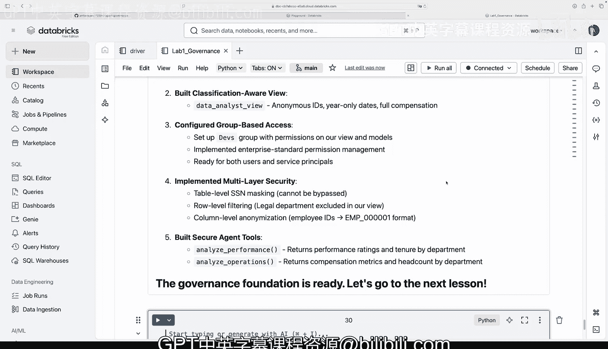

至此，一个坚实的、以数据安全与合规为核心的治理基础已经搭建完成。在接下来的课程中，我们将在此基础上创建和部署AI智能体。